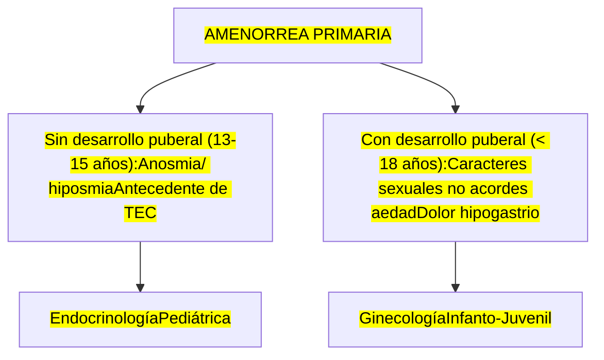
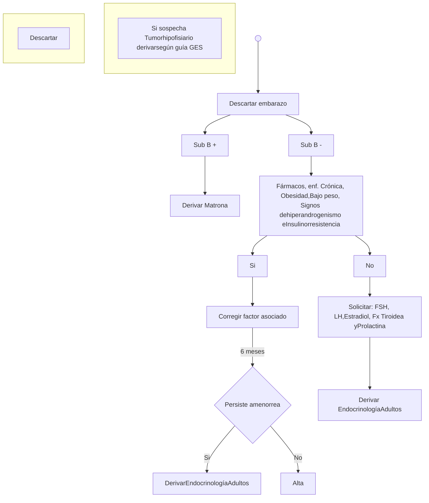

# PROT-AMENORREA-2017

--- Página 1 ---

  

# PROTOCOLO
# RESOLUTIVO EN RED

# AMENORREA

FECHA DE ELABORACION MAYO 2017
FECHA DE REVISION MAYO 2019

--- Página 2 ---

# 1.-Autores.-

1.1.- Dr. Félix Vásquez, Jefe de Unidad de Endocrinología Hospital San Juan de Dios.
1.2.- Dr. Nicolás Crisosto, Profesor Asistente U. Chile.

**Se declara que no hay conflicto de interés en los profesionales que realizaron este protocolo.**

# 2.- Comisión revisora

2.1-Dra Francisca Reyes, Jefa CDT Hospital San Juan de Dios.
2.2- Comisión revisora: Equipo de trabajo COMGES 6 (por resolución).

# 3.-Introducción

Las alteraciones del ciclo menstrual constituyen uno de los principales motivos de consulta en ginecología ( ≈ 37% de las consultas), y su ausencia, con la amenorrea como síntoma principal, es motivo de preocupación por asociarse a pérdida de feminidad o de fertilidad. Cuando hablamos de oligomenorrea, nos referimos a la existencia de intervalos menstruales mayores de los habituales (entre 35 días y 3 meses), mientras que la amenorrea es la falta de menstruación en períodos superiores a los 6 meses. Debemos diferenciar entre amenorrea primaria (con una incidencia del 0,1%): - Ausencia del período a los 14 años con falta de crecimiento o desarrollo de los caracteres sexuales secundarios. - Ausencia del período a los 16 años, con independencia de la presencia de un crecimiento y un desarrollo normal, e incluso con aparición de caracteres sexuales secundarios.
Amenorrea secundaria (con una incidencia del 0,7 %): en una mujer que ha estado menstruando, ausencia de período durante 6 meses, o durante un intervalo equivalente a un total de al menos tres de los intervalos entre los ciclos anteriores 1 . Es preciso individualizar cada caso, y estos criterios no han de ser estrictos a la hora de hacer el estudio de amenorrea. Por ejemplo, no diferiremos la evaluación de una niña que presenta estigmas evidentes del síndrome de Turner hasta llegar a los 14 años, tendremos en cuenta que el hirsutismo y la galactorrea son dos signos que precisan investigación inmediata, aunque la ausencia menstrual sea de corta duración, y por supuesto, siempre consideraremos la posibilidad de un embarazo. Aunque la amenorrea es un síntoma que orienta principalmente a patología ginecológica, en ocasiones puede ser indicativo de patología no ginecológica grave, por lo que en ocasiones podríamos considerar la intervención de otros especialistas (neurólogos).

--- Página 3 ---

# 4.- Mapa de red Resolución 3567

C

MAPA DE DERIVACIÓN DE CONSULTA DE ESPECIALIDAD DESDE APS Y HOSPITAL COMUNITARIO A HOSPITAL DE MAYOR COMPLEJIDAD. DICIEMBRE 2015

**GLOSARIO TÉRMINOS:** **HSJDO:** Hospital San Juan de Dios **HSCL:** Hospital Félix Bulnes **IT:** Instituto Traumatológico **HOSMIL:** Hospital Salvador Allende de Peñaflor **CRS SAG:** CRS Salvador Allende Gossens **HOSTAL:** Hospital de Talagante **HOSPE:** Hospital de Melipilla

| ESPECIALIDAD PediatríaMedicina Interna BroncopulmonarCardiologíaEndocrinologíaGastroenterologíaGenéticaESPECIALIDAD | Grupo Etario <15 años ≥15 años <15 años ≥15 años <15 años ≥15 años <15 años ≥15 años <15 años ≥15 años <15 años ≥15 años Grupo Etario | CRS SAG Filtro Pediatría CRS SAG | CRS SAG CRS SAG CRS SAG HFB CRS SAG HFB Filtro Pediatría CRS SAG Filtro Medicina Interna HFB HFB HFB Filtro Pediatría CRS SAG Filtro Medicina Interna HFB Filtro Pediatría CRS SAG Filtro Medicina Interna HFB Filtro Pediatría SAG | CRS SAG CRS SAG HFB Filtro Pediatría CRS SAG Filtro Medicina Interna HFB HFB HFB Filtro Pediatría CRS SAG Filtro Medicina Interna HFB Filtro Pediatría CRS SAG | HSJDO CRS SAG HFB HFB HFB Filtro Pediatría CRS SAG Filtro Medicina Interna HFB HFB HFB HFB HFB Filtro Pediatría CRS SAG Filtro Medicina Interna HFB Filtro Pediatría CRS SAG | HOSMIL HSJDO HSJDO HSJDO HSJDO HFB HSJDO HSJDO HSJDO HFB HSJDO HSJDO HSJDO Filtro Pediatría HOSMIL | HOSMIL HOSMIL HSJDO HSJDO HSJDO Filtro Pediatría HOSMIL (con ECG) Filtro Medicina Interna HOSMIL Filtro Pediatría HOSMIL Filtro Medicina Interna HOSMIL Filtro Pediatría HOSMIL Filtro Medicina Interna HOSMIL Filtro Pediatría HOSMIL Filtro Medicina Interna HOSMIL Filtro Pediatría HOSMIL | HOSMIL HOSMIL HSJDO HSJDO HSJDO Filtro Pediatría HOSMIL (con ECG) Filtro Medicina Interna HOSMIL Filtro Pediatría HOSMIL Filtro Medicina Interna HOSMIL Filtro Pediatría HOSMIL Filtro Medicina Interna HOSMIL Filtro Pediatría HOSMIL Filtro Medicina Interna HOSMIL Filtro Pediatría HOSMIL | HOSMIL HOSMIL HSJDO HSJDO HSJDO Filtro Pediatría HOSMIL (con ECG) Filtro Medicina Interna HOSMIL Filtro Pediatría HOSMIL Filtro Medicina Interna HOSMIL Filtro Pediatría HOSMIL Filtro Medicina Interna HOSMIL Filtro Pediatría HOSMIL Filtro Medicina Interna HOSMIL Filtro Pediatría HOSMIL | HOSPELA HOSMIL HSJDO HSJDO HSJDO Filtro Pediatría HOSMIL (con ECG) Filtro Medicina Interna HOSMIL Filtro Pediatría HOSMIL Filtro Medicina Interna HOSMIL Filtro Pediatría HOSMIL Filtro Medicina Interna HOSMIL Filtro Pediatría HOSMIL Filtro Medicina Interna HOSMIL Filtro Pediatría HOSPELA | HOSPELA HOSPELA HSJDO HSJDO HSJDO Filtro Pediatría HOSPELA Filtro Medicina Interna HOSPELA Filtro Pediatría HOSPELA Filtro Medicina Interna HOSPELA Filtro Pediatría HOSPELA Filtro Medicina Interna HOSPELA Filtro Pediatría HOSPELA Filtro Medicina Interna HOSPELA Filtro Pediatría HOSPELA | HOSTAL HOSPELA HSJDO HSJDO HSJDO Filtro Pediatría HOSPELA Filtro Medicina Interna HOSPELA Filtro Pediatría HOSPELA Filtro Medicina Interna HOSPELA Filtro Pediatría HOSPELA Filtro Medicina Interna HOSPELA Filtro Pediatría HOSPELA Filtro Medicina Interna HOSPELA Filtro Pediatría HOSTAL | HOSTAL HOSTAL HSJDO HSJDO HSJDO Filtro Pediatría HOSTAL Filtro Medicina Interna HOSTAL Filtro Pediatría HOSTAL Filtro Medicina Interna HOSTAL Filtro Pediatría HOSTAL Filtro Medicina Interna HOSTAL Filtro Pediatría HOSTAL Filtro Medicina Interna HOSTAL Filtro Pediatría HOSTAL | HOSTAL HOSTAL HSJDO HSJDO HSJDO Filtro Pediatría HOSTAL Filtro Medicina Interna HOSTAL Filtro Pediatría HOSTAL Filtro Medicina Interna HOSTAL Filtro Pediatría HOSTAL Filtro Medicina Interna HOSTAL Filtro Pediatría HOSTAL Filtro Medicina Interna HOSTAL Filtro Pediatría HOSTAL | CRS SAG HOSTAL HSJDO HSJDO HSJDO Filtro Pediatría HOSTAL Filtro Medicina Interna HOSTAL Filtro Pediatría HOSTAL Filtro Medicina Interna HOSTAL Filtro Pediatría HOSTAL Filtro Medicina Interna HOSTAL Filtro Pediatría HOSTAL Filtro Medicina Interna HOSTAL Filtro Pediatría CRS SAG | CRS SAG CRS SAG CRS SAG HSJDO CRS SAG HSJDO Filtro Pediatría CRS SAG Filtro Medicina Interna CRS SAG Filtro pediatría CRS SAG Filtro Medicina Interna CRS SAG Filtro pediatría CRS SAG Filtro Medicina Interna CRS SAG Filtro pediatría CRS SAG Filtro Medicina Interna CRS SAG Filtro Pediatría CRS SAG | CRS SAG CRS SAG CRS SAG HSJDO HSJDO HSJDO Filtro pediatría CRS Filtro Medicina Interna HSJDO Filtro pediatría CRS Filtro Medicina Interna HSJDO Filtro pediatría CRS Filtro Medicina Interna HSJDO Filtro pediatría CRS Filtro Medicina Interna HSJDO Filtro Pediatría CRS SAG |
| --------------------------------------------------------------------------------------------------------------------------- | ------------------------------------------------------------------------------------------------------------------------------------------------------------------------------------- | -------------------------------- | ------------------------------------------------------------------------------------------------------------------------------------------------------------------------------------------------------------------------------------------------------------------------------------------- | -------------------------------------------------------------------------------------------------------------------------------------------------------------------------------------- | ---------------------------------------------------------------------------------------------------------------------------------------------------------------------------------------------------------------------------- | -------------------------------------------------------------------------------------------------------------------------------------------------- | --------------------------------------------------------------------------------------------------------------------------------------------------------------------------------------------------------------------------------------------------------------------------------------------------------------------------------------------- | --------------------------------------------------------------------------------------------------------------------------------------------------------------------------------------------------------------------------------------------------------------------------------------------------------------------------------------------- | --------------------------------------------------------------------------------------------------------------------------------------------------------------------------------------------------------------------------------------------------------------------------------------------------------------------------------------------- | ----------------------------------------------------------------------------------------------------------------------------------------------------------------------------------------------------------------------------------------------------------------------------------------------------------------------------------------------- | ---------------------------------------------------------------------------------------------------------------------------------------------------------------------------------------------------------------------------------------------------------------------------------------------------------------------------------------------- | -------------------------------------------------------------------------------------------------------------------------------------------------------------------------------------------------------------------------------------------------------------------------------------------------------------------------------------------- | ----------------------------------------------------------------------------------------------------------------------------------------------------------------------------------------------------------------------------------------------------------------------------------------------------------------------------------- | ----------------------------------------------------------------------------------------------------------------------------------------------------------------------------------------------------------------------------------------------------------------------------------------------------------------------------------- | ------------------------------------------------------------------------------------------------------------------------------------------------------------------------------------------------------------------------------------------------------------------------------------------------------------------------------------- | ---------------------------------------------------------------------------------------------------------------------------------------------------------------------------------------------------------------------------------------------------------------------------------------------------------------------------------------------------------------- | -------------------------------------------------------------------------------------------------------------------------------------------------------------------------------------------------------------------------------------------------------------------------------------------------------------------------------------- |

--- Página 4 ---

| Especialidad               | Grupo Etario    | Col 3                                                              | Col 4                                                              | Col 5                                                              | Col 6                                                              | Col 7                                                              | Col 8                                                              | Col 9                                                              | Col 10                                                             | Col 11                                                             | Col 12                                                             | Col 13                                                             | Col 14                          |
| -------------------------- | --------------- | ------------------------------------------------------------------ | ------------------------------------------------------------------ | ------------------------------------------------------------------ | ------------------------------------------------------------------ | ------------------------------------------------------------------ | ------------------------------------------------------------------ | ------------------------------------------------------------------ | ------------------------------------------------------------------ | ------------------------------------------------------------------ | ------------------------------------------------------------------ | ------------------------------------------------------------------ | ------------------------------- |
| Dermatología               | Sin restricción | HPC                                                                | HPC                                                                | HPC                                                                | HSJD                                                               | Teledermatología Hospital                                          | Teledermatología Hospital                                          | Teledermatología Hospital                                          | Teledermatología Hospital                                          | Teledermatología Hospital                                          | Teledermatología Hospital                                          | Teledermatología Hospital                                          | CRS SAG                         |
|                            |                 |                                                                    |                                                                    |                                                                    |                                                                    |                                                                    |                                                                    |                                                                    |                                                                    |                                                                    |                                                                    | HSJD                                                               |                                 |
| Inf. Transmisión Sexual    | Sin restricción | HPC                                                                | HPC                                                                | HPC                                                                | HSJD                                                               | HSJD                                                               | HSJD                                                               | HSJD                                                               | HSJD                                                               | HSJD                                                               | HSJD                                                               | HSJD                                                               | HSJD                            |
|                            |                 |                                                                    |                                                                    |                                                                    |                                                                    |                                                                    |                                                                    |                                                                    |                                                                    |                                                                    |                                                                    |                                                                    |                                 |
| Geriatría                  | Sin restricción | Filtro Medicina Interna HPC                                        | Filtro Medicina Interna HPC                                        | Filtro Medicina Interna HPC                                        | Filtro Medicina Interna HSJD                                       | Filtro Medicina Interna HOSPITAL                                   | Filtro Medicina Interna HOSPITAL                                   | Filtro Medicina Interna HOSPITAL                                   | Filtro Medicina Interna HOSPITAL                                   | Filtro Medicina Interna HOSPITAL                                   | Filtro Medicina Interna HOSPITAL                                   | Filtro Medicina Interna HOSPITAL                                   | Filtro Medicina Interna CRS SAG |
|                            |                 |                                                                    |                                                                    |                                                                    |                                                                    |                                                                    |                                                                    |                                                                    |                                                                    |                                                                    |                                                                    | Interna HSJD                                                       |                                 |
| Med. Fis. Y Rehabilitación | Sin restricción |                                                                    |                                                                    |                                                                    |                                                                    |                                                                    |                                                                    |                                                                    |                                                                    |                                                                    |                                                                    |                                                                    |                                 |
| Neurología                 | > 15 años       | HPC                                                                | HPC                                                                | HPC                                                                | HSJD                                                               | HSJD                                                               | HSJD                                                               | HSJD                                                               | HSJD                                                               | HSJD                                                               | HSJD                                                               | HSJD                                                               | HSJD                            |
|                            | < 15 años       | HPC                                                                | HPC                                                                | HPC                                                                | HSJD                                                               | HOSPITAL                                                           | HOSPITAL                                                           | HOSPITAL                                                           | HOSPITAL                                                           | HOSPITAL                                                           | HOSPITAL                                                           | HOSPITAL                                                           | CRS SAG                         |
| Oncología                  | > 15 años       |                                                                    |                                                                    |                                                                    |                                                                    |                                                                    |                                                                    |                                                                    |                                                                    |                                                                    |                                                                    |                                                                    |                                 |
| Psiquiatría                | > 15 años       | Derivación a COSAM de patologías definidas para resolución a nivel | Derivación a COSAM de patologías definidas para resolución a nivel | Derivación a COSAM de patologías definidas para resolución a nivel | Derivación a COSAM de patologías definidas para resolución a nivel | Derivación a COSAM de patologías definidas para resolución a nivel | Derivación a COSAM de patologías definidas para resolución a nivel | Derivación a COSAM de patologías definidas para resolución a nivel | Derivación a COSAM de patologías definidas para resolución a nivel | Derivación a COSAM de patologías definidas para resolución a nivel | Derivación a COSAM de patologías definidas para resolución a nivel | Derivación a COSAM de patologías definidas para resolución a nivel | CRS SAG                         |
|                            | < 15 años       |                                                                    |                                                                    |                                                                    | HPC                                                                |                                                                    |                                                                    |                                                                    |                                                                    |                                                                    |                                                                    |                                                                    |                                 |

--- Página 5 ---

**5- Objetivos.**

5.1.- Determinar los criterios de manejo en el nivel primario de atención de los pacientes con diagnóstico de Amenorrea.

5.2.- Establecer criterios de derivación estándar hacia el nivel de especialidad, con el propósito de contribuir a mejorar la pertinencia en la derivación hacia la especialidad de Endocrinología.

**6.-- Ámbito de aplicación**

6.1.- Centros de Salud Familiar
6.2.- Centros de Salud Urbanos y Rurales
6.3.- Hospitales de Alta, Baja y Mediana Complejidad
6.4.- Postas de Salud Rural
6.5.- Servicios de Atención Primaria de Urgencia
6.6.-Unidades de Emergencia Hospitalaria
6.7.- Médicos Especialistas

**7.- Población objetivo**

Pacientes pediátricos menores de 18 años a endocrinología infantil, Adulto en mayores de 18 años, pertenecientes a la red Occidente.

**Contenidos Específicos del Protocolo.**

7.1.- Definición.-

**Amenorrea.-** Ausencia temporal o permanente de la menstruación. Existen causas fisiológicas (p.ej. Embarazo, Lactancia, Menopausia) y no fisiológicas (a las que hace mención este protocolo)

**Clasificación de Amenorrea no fisiológica:**

**Amenorrea Primaria.-**
* Ausencia de menarquia.

**Amenorrea Secundaria.-**
* Cese de menstruación por más de cuatro meses.
* Mujer joven con intervalos de más de 90 días en cada menstruación.
* Menos de 9 ciclos en el año

**7.2 - Tiempo de alta máxima permanencia en atención secundaria**

Desde 6 meses hasta control crónico en el caso de un tumor hipofisiario.

--- Página 6 ---

# 7.3.- Diagnostico.-

## 7.3.1.- Amenorrea primaria sin desarrollo puberal.-

* Ausencia de menarquia en mujer joven de 13-15 años.
* En general las causas pueden ser congénitas ( Sd. Turner, Sd. Kallman) o Adquiridas (p.e Tu hipofisarios, TEC).

## 7.3.2.- Amenorrea primaria con desarrollo puberal.-

* Ausencia de menarquia en mujer joven de < 18 años.
* En general la causa es anatómica (. Himen imperforado)

## 7.3.2.- Amenorrea Secundaria

* Cese de la menstruación de causa no fisiológica
* Las causas pueden ser de origen hipotálamo – hipofisario (p.e. Tumores, TEC), Ováricas (p.e. Quimioterapia, Quirúrgicas, Autoinmunes) o disruptores endocrinos (p.e. Fármacos)

# 7.4.- Diagnóstico diferencial.-

* Causas Fisiológicas como embarazo, lactancia o Menopausia

# 7.5.- Anamnesis.-

## 7.5.1.- En Amenorrea Primaria sin desarrollo puberal.-

* Ausencia de menarquia
* Ausencia de desarrollo mamario
* Ausencia de distribución característica de la grasa
* Indagar por anosmia/hiposmia
* Preguntar antecedente de TEC

## 7.5.2.- En Amenorrea Primaria con desarrollo puberal.-

* Ausencia de menarquia
* Caracteres sexuales secundarios acordes a la edad.
* Presencia de dolor hipogástrico periódico

## 7.5.3.- En Amenorrea Secundaria.-

* Libido disminuida
* Pérdida del vello pubiano
* Disminución de volumen mamario
* Infertilidad
* Osteoporosis
* Síntomas de hipo o hiperfunción tiroidea
* Perdida o ganancia de peso significativa
* Trastorno de conducta alimentaria

--- Página 7 ---

* Antecedente de tratamiento con quimioterapia
* Radioterapia x neoplasias en cabeza o pelvis
* Preguntar antecedente de TEC
* Uso de fármacos (p.e. Neurolépticos, Proquineticos, Antidepresivos)

## 7.6. —Examen físico.-

**En Amenorrea Primaria sin desarrollo puberal.-**
* Proporciones eunucoides (envergadura superior a la talla $\ge$ 5 cm)
* Ausencia de botón mamario
* Genitales infantiles
* Vello genital ralo

**En Amenorrea Primaria con desarrollo puberal.-**
* Antropometría normal
* Caracteres sexuales secundarios acordes a la edad.
* Tanner mamario y púbico adecuado a la edad
* Aumento de volumen hipogástrico (Hematometra)

**En Amenorrea Secundaria.-**
* Antropometría normal
* Caracteres sexuales secundarios presentes o con algo de involución
* Buscar galactorrea
* Déficit de campo visual
* Signos de hipo o hiperfunción tiroidea
* Signos de hipercortisolismo
* Signos de Hiperandrogenismo ( hirsutismo, alopecia, acné )
* Signos de Insulinoresistencia (acantosis, acrocordones).

## 7.7.- Manejo en el nivel primario de atención.-

### 7.7.1.-Medidas generales.-
* Descartar causas fisiológicas (p.e. Embarazo)
* Aporte adecuado de calcio y vitamina D por riesgo de osteoporosis.
* Corrección de factor nutricional (Bajo peso u obesidad)

### 7.7.2.- Exámenes.-
* Si existe sospecha clínica de:
    - Disfunción Tiroidea (TSH, T4L, Anticuerpos TPO)
    - Insulinorresistencia (PTGO, P lipídico).

--- Página 8 ---

### 7.7.3.- Tratamiento farmacológico.-

.- El manejo farmacológico corresponde al especialista.

### 7.8.- Complicaciones.-

* Osteoporosis
* Infertilidad
* Aumento de riesgo cardiovascular
* Trastornos del ánimo

## 8.- Criterios de referencia y contra referencia

### 8.1.- Referencia de atención primaria a Endocrinología

* Todas las amenorreas primarias sin desarrollo puberal deben ser derivadas a endocrinología (pediátrica en menores de 18 años, Adulto en mayores de 18 años)
* Todas las amenorreas primarias con desarrollo puberal deben ser derivadas a ginecología infanto juvenil (su causa es un factor anatómico, no hormonal)
* Las amenorreas secundarias en las que se descartó como causa enfermedad sistémica grave, o al corregir factor nutricional o farmacológico no retoma ciclos menstruales.
* Amenorrea de cualquier causa con clínica de disfunción endocrinológica.
* Amenorrea con antecedente de TEC, uso de quimioterapia y/o radioterapia

### 8.2.- Referencia de Endocrinología a atención primaria

* Pacientes en los que se haya resuelto la etiología de la amenorrea (p.e. disfunción tiroidea, obesidad, bajo peso.)

## 9.- Metodología de evaluación

Será responsable de la evaluación del Dpto. de Calidad y Seguridad del Paciente.

**La evaluación para el año 2017 será:**

-Auditoría de presencia de protocolos en la red

-Auditoría de ficha clínica a través de pauta de cotejo en la red

-Periodicidad

1 vez al año en 2017

1 vez al año en 2018

--- Página 9 ---

**10.-Plan de Difusión**

**Servicio de Salud:**

-Resolución de Dirección del Servicio con protocolos, a toda la red Occidente.

-Subir protocolo a página web de servicio

**Subdirección Médica Atención Ambulatoria:**

Dra. Francisca Reyes y Dra. Arrué: Supervisión de presencia de protocolos en atención secundaria.

**Subdirección APS:**

Dr. Luis Vélez: Supervisión de presencia de protocolos en atención primaria

--- Página 10 ---

<mark>Si sospecha Tumor hipofisiario derivar según guía GES</mark>

## 11- <u>FLUJO DE DERIVACION AMENORREA</u>

--- Página 11 ---

\* Si sospecha Tumor hipofisiario derivar según guía GES

--- Página 12 ---

**<u>12.- BIBLIOGRAFIA.-</u>**

 Williams, Tratado de endocrinología. 13ª edición

 Manual de Endocrinología y Metabolismo. Norman Lavin 4ª edición año 2010

