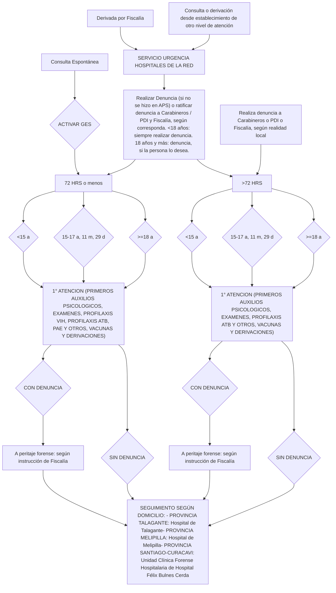

# PROT-ATENCION-DE-VICTIMAS-DE-VIOLENCIA-SEXUAL-2024

--- Página 1 ---

<u>**Departamento de Asesoría Jurídica**</u>
DRA. DGK/CGS
N° 468 /2024

**MAT.: APRUEBA EL PROTOCOLO DE ATENCIÓN A VÍCTIMAS DE VIOLENCIA SEXUAL DEL SERVICIO DE SALUD METROPOLITANO OCCIDENTE.**

**EXENTA N° 1923**

**SANTIAGO, 12 ABR 2024**

**VISTOS:** El Memorándum N°09 de fecha 10 de abril de 2024, del Departamento de Genero, DD.HH y Pueblos Indígenas, de este Servicio de Salud Occidente; el Protocolo de Atención a Víctimas de Violencia Sexual del Servicio de Salud Metropolitano Occidente, elaborado por el Departamento de Genero, DD.HH y Pueblos Indígenas, de este Servicio de Salud Occidente; en uso de las atribuciones que me confieren el DFL. N°1/2005 en virtud del cual se fija el texto refundido, coordinado y sistematizado del D.L. N°2.763/79 y de las leyes N°s 18.933 y 18.469; lo contemplado en el Decreto N°140/04, Reglamento Orgánico de los Servicios de Salud; Reglamento Orgánico de los Servicios de Salud; El Decreto Afecto N°42 del 19 de octubre de 2022 del cual emana mi personería de Directora del Servicio de Salud Metropolitano Occidente, ambos el Ministerio de Salud; y lo dispuesto por las Resoluciones N°7 de 2019, y N°14 de 2022, todas de la Contraloría General de la República, y:

**CONSIDERANDO**

**I. Que,** conforme se dispone en el Artículo 8º, numeral N° II, letra f) del Decreto Supremo N°140/2004, que establece el Reglamento Orgánico de los Servicios de Salud, el Director del Servicio tendrá dentro de sus atribuciones la de "dictar normas de funcionamiento interno para los establecimientos bajo su dependencia, conforme a las leyes y reglamentos vigentes y a las directivas ministeriales que se impartan al respecto".

**II. Que,** en relación a lo anterior, los Compromisos de Gestión son una herramienta de control de gestión que permiten evaluar el desempeño de los Servicios de Salud y su Red de establecimiento en los distintos ámbitos priorizados por la Subsecretaría de Redes Asistenciales.

**III. Que,** el Departamento de Genero, DD.HH y Pueblos Indígenas, de este Servicio de Salud Occidente elaboró un protocolo de Atención a Víctimas de Violencia Sexual del Servicio de Salud Metropolitano Occidente, a fin de fortalecer las coordinaciones entre los diversos establecimientos de salud, a fin de brindar una atención de calidad, centrada en la victima y propendiendo a disminuir la victimización secundaria, velando por garantizar la dignidad de la persona en cada uno de sus puntos de contacto con la Red de Salud Occidente.

**IV. Que,** a raíz de lo anterior, por medio de del Memorándum N°09 de fecha 10 de abril de 2024, el mencionado Departamento,

--- Página 2 ---

solicitó al Jefe de Departamento de Asesoría Jurídica, la elaboración de Resolución Exenta que apruebe el Protocolo antes mencionado.

**V.** Que, según lo preceptuado en considerando anteriores, dicto la siguiente:

# RESOLUCIÓN

**1.** Apruébese el Protocolo de Atención a Víctimas de Violencia Sexual del Servicio de Salud Metropolitano Occidente, cuya texto es la siguiente:

# Protocolo de Atención a Víctimas de Violencia Sexual

## Servicio de Salud Metropolitano Occidente

| Aprobado                                                                                    | Revisado                                                                                 | Elaborado                                                                                  |
| ------------------------------------------------------------------------------------------- | ---------------------------------------------------------------------------------------- | ------------------------------------------------------------------------------------------ |
| Dra. Daniella Greibe Kohn, Directora Servicio de Salud Metropolitano Occidente (SSMOCC) | Q.F. Soledad Del Campo Urzúa, Subdirectora de Gestión Asistencial.                   | Dra. Karen Farías Durán, Departamento de Género, Derechos Humanos y Pueblos Indígenas. |
|                                                                                             | Ps. María José Rivas, Jefa Departamento de Género, Derechos Humanos y Pueblos Indígenas. | Mat. Erika Coloma Oyarce, Departamento Gestión Clínica de las Personas.                |
|                                                                                             |                                                                                          | E.U. Fidel Soto Badilla, Departamento Red de Urgencia y Gestión del Cuidado.           |

--- Página 3 ---

**Colaboradoras/es:**

- Mat. Andrea Acuña Arredondo, Referente Técnica ITS/VIH, Departamento Gestión Clínica Centrada en las Personas, SSMOCC.
- Ps. Verónica Barra Soarzo, Unidad de Ciclo Vital, SSMOCC.
- E.U. René Bugueño Rojas, Departamento de Red de Urgencia y Gestión del Cuidado, SSMOCC.
- E.U. Verónica Castro Alvarado, Departamento de Gestión Clínica Centrado en las Personas, SSMOCC.
- Ing. Paola Escobar González, Jefa, Departamento de Estadística y Gestión de la Información (DEGI) SSMOCC.
- María José Espinoza A., profesional del Departamento de Red de Urgencia, MINSAL.
- E.U. Germaín Farías Cuevas, Departamento de Red de Urgencia y Gestión del Cuidado, SSMOCC.
- E.U. Alonso Fuentes Cabrera, Unidad de Ciclo Vital, SSMOCC.
- E.U. Elizabeth González Videla, Jefa Unidad de Ciclo Vital, SSMOCC.
- E.U. Felipe Moraga Inostroza, Departamento de Red de Urgencia y Gestión del Cuidado, SSMOCC.
- Ps. Daniela Quezada Mansilla, Asesora Departamento Salud Mental, SSMOCC.
- Dra. Mirza Retamal Moraga, Jefa Departamento Gestión de la Demanda, SSMOCC.
- Dr. José Romero Lama. Asesor GES, Departamento Gestión de la Demanda (DGD), SSMOCC.
- E.U. Constanza Silva, Unidad de Ciclo Vital, SSMOCC.
- Ps. Camila Vidal Reveco, Jefatura Técnico Administrativa Departamento de Salud Mental, SSMOCC.

--- Página 4 ---

**Índice:**

1. Introducción Pág. 5.
2. Listado de abreviaturas Pág. 5.
3. Objetivo general Pág. 6.
4. Objetivos específicos Pág. 6.
5. Alcance Pág. 7.
6. Documentos aplicables Pág. 7.
7. Responsables y funciones Pág. 7.
8. Definiciones Pág. 8.
9. Flujograma de Atención a Víctimas de Violencia Sexual Pág. 8.
10. Obligatoriedad de denunciar Pág. 9.
11. Registros clínicos Pág. 10.
12. Registros estadísticos Pág. 10.
13. Atención clínica Pág. 12.
14. Indicador Pág. 17.
15. Anexos Pág. 19.

--- Página 5 ---

# 1.- Introducción

La violencia sexual es definida como una grave vulneración a los derechos humanos, especialmente contra la libertad e indemnidad sexual, considerando además que la mayoría de las víctimas de estos delitos son mujeres, la más de ellas niñas y adolescentes. La violencia sexual es un problema que tiene importantes consecuencias psicológicas, físicas y sociales, constituyéndose en un problema de salud pública.

Existe la necesidad de actualizar permanentemente los contenidos técnicos y flujogramas relativos a hechos de violencia sexual, mejorando especialmente la oportunidad y calidad en una atención integral en atención a las personas que viven y sobreviven a las agresiones sexuales.

Es deber del Servicio de Salud Metropolitano Occidente (SSMOCC) fortalecer las coordinaciones entre los diversos establecimientos de salud en esta materia, integrando la actuación de los equipos clínicos y de gestión, con la finalidad de brindar una atención de calidad, centrada en la víctima y propendiendo a disminuir la victimización secundaria y velando por garantizar la dignidad de la persona en cada uno de sus puntos de contacto con la Red de Salud Occidente.

De acuerdo a lo anterior, a fin de materializar el compromiso de garantizar el acceso oportuno a una atención de salud, con enfoque de derechos humanos, género, interseccionalidad y equidad, es que se diseña este protocolo, considerando procesos de atención que tiene como eje central las necesidades de las víctimas. Con la finalidad que todos los establecimientos de salud puedan elaborar o actualizar los protocolos locales de atención integral de salud en agresiones sexuales.

# 2.- Listado de abreviaturas:

* ACO: Anticonceptivo Oral.
* APS: Atención Primaria de Salud.
* CECOSF: Centro Comunitario de Salud Familiar.
* CESFAM: Centro de Salud Familiar.
* ChCC: Chile Crece Contigo.
* CP: Código Penal.
* CPP: Código Procesal Penal.
* CRS: Centro de Referencia de Salud.
* DAU: Dato de Atención de Urgencia.
* ELEAM: Establecimiento de Larga Estadía para Adultos Mayores.
* GES: Garantías Explícitas en Salud.
* GES 86: Garantía Explícita en Salud en Atención Integral de Salud en Agresión Sexual Aguda.
* IPD: Informe de Proceso Diagnóstico.
* ITS: Infecciones de Transmisión Sexual.
* IVE: Interrupción Voluntaria del Embarazo.

--- Página 6 ---

- MINSAL: Ministerio de Salud.

- NGTAVVS: Norma General Técnica para la Atención de Víctimas de Violencia Sexual.

- NNA: Niñas, Niños y Adolescentes.

- PAIG: Programa de Acompañamiento a la Identidad de Género.

- PAM: Persona Adulta Mayor

- PAP: Primeros Auxilios Psicológicos.

- PDI: Policías de Investigaciones.

- PS: Problema de Salud.

- REM: Resúmenes Estadísticos Mensuales.

- SAPU: Servicio de Atención Primaria de Urgencia.

- SAR: Servicio de Atención Primaria de Urgencia de Alta Resolutividad.

- SAV: Sala de Atención a Víctimas.

- SENAME: Servicio Nacional de Menores.

- SIC: Solicitud de Interconsulta.

- SIGGES: Sistema de Información para la Gestión de Garantías en Salud.

- SML: Servicio Médico Legal.

- SPE: Servicio Nacional de Protección Especializada a la Niñez y Adolescencia.

- SSMOCC: Servicio de Salud Metropolitano Occidente.

- SUR: Servicio de Urgencia Rural.

- UCFH-HFBC: Unidad Clínica Forense Hospitalaria del Hospital Félix Bulnes Cerda.

- UEH: Unidad de Emergencia Hospitalaria.

- VDRL: (*Venereal Disease Research Laboratory*), por su sigla en inglés, es una prueba serológica para realizar tamizaje de sífilis.

- VHB: Virus Hepatitis B.

- VHC: Virus Hepatitis C.

- VIH: Virus de Inmunodeficiencia Humana.

- VVS: Víctimas de Violencia Sexual.

## 3.- Objetivo General

Estandarizar el manejo y derivación de personas que sean víctimas de violencia sexual (VVS), que consulten en los establecimientos de salud del Servicio de Salud Metropolitano Occidente.

## 4.- Objetivos Específicos

a) Determinar flujo de pacientes en los diversos niveles de atención de salud.

b) Estandarizar registros de atención en cualquiera de sus etapas de atención.

--- Página 7 ---

c) Definir la articulación y derivación oportuna de las personas víctimas de agresión sexual.

## 5.- Alcance

Este protocolo esta dirigido a toda atención de salud donde se pueda sospechar y/o pesquisar personas que han sufrido agresiones sexuales, ya sean agudas (72 horas o menos de ocurrida la agresión) o no agudas (más de 72 horas), especialmente los equipos de servicios de urgencias de atención primaria y hospitalaría.

## 6.- Documentos aplicables

* a) Norma General Técnica para la Atención de Víctimas de Violencia Sexual (NGTAVVS), Res. Ex. Nº 1097 de 22.09.2016, MINSAL.
* b) Ley N° 21.057 Regula entrevistas grabadas en video y, otras medidas de resguardo a menores de edad, víctimas de delitos sexuales, del Ministerio de Justicia y Derechos Humanos, publicada el 09.01.2018
* c) Ley N°21.430 Sobre garantías y protección integral de los derechos de la niñez y adolescencia, del Ministerio de Desarrollo Social y Familia, publicada el 15.03.2022
* d) Decreto Nº72 que Aprueba Garantías Explícitas en Salud del Régimen General de Garantías en Salud, MINSAL, publicación 01.10.2022. Última modificación 23.11.2022 según Res. Ex. Nº1589.
* e) Instructivo de Proceso y Registro GES. Versión 1. 86. Atención integral de salud en agresión sexual aguda. Departamento GES, Redes de Alta Complejidad y Líneas Programáticas y Oficina de Gestión de la Información, MINSAL.
* f) Protocolo para la Atención Integral de Salud en Agresión Sexual Aguda, según Res. Ex. N°1434, 26.10.2023, MINSAL.
* g) Ord. N°032 de Dirección SSMOCC de 09.01.2024 que aclara entrega de profilaxis ITS en casos de atención integral de salud en agresión sexual aguda-GES 86.
* h) Ord. C2 N°524 de 20.02.2024, Protocolos y Flujos Atención Integral Agresión Sexual Aguda. MINSAL

## 7.- Responsables y Funciones

**7.1 De la actualización y formulación del protocolo:**
* a. Referente Técnico de Violencia Sexual.
* b. Referente Técnico de Salud Sexual y Reproductiva.
* c. Departamento Red de Urgencia y Gestión del Cuidado.

**7.2 De la supervisión y cumplimiento del protocolo:**
* d. Jefaturas de: UEH, SAR, SAPU y SUR.
* e. Directores de Establecimientos APS.

**7.3 De la monitorización del protocolo:**
* a. Referente Técnico de Violencia Sexual.

## 8.- Definiciones

**Violencia Sexual:** La Organización Mundial de la Salud define la violencia sexual como "todo acto sexual, la tentativa de consumar un acto sexual, los comentarios o insinuaciones sexuales no deseados, o las acciones

--- Página 8 ---

para comercializar o utilizar de cualquier otro modo la sexualidad de una persona mediante coacción por otra persona, independientemente de la relación de ésta con la víctima, en cualquier ámbito, incluidos el hogar y el lugar de trabajo", Jewkes, R., Sen, P., García-Moreno, C. (2002), "Sexual violence". En: E. G. Krug et al. (Eds.) *World report on violence and health*. Ginebra, Suiza: Organización Mundial de la Salud.

**Persona que vive Violencia Sexual Aguda:** persona que recurre o es trasladada para una atención de urgencia porque ha vivido un episodio reciente de violencia (menos de 72 horas) con daños físicos y/o psicológicos que requieren ser atendidos de inmediato o, porque sin presentar mayores daños detectables, necesitan la certificación de la agresión (NGTAVVS, 2016).

**Agresión Sexual Aguda (que cumplen criterio para ingresar a GES 86):** aquel episodio reciente (72 horas o menos desde la ocurrencia) en que la persona tiene contacto directo con genitales de la persona agresora con o sin intercambio de fluidos, pudiendo presentar daños físicos y/o psicológicos y que requiere atención", Decreto N°72 Aprueba Garantías Explícitas en Salud del Régimen General de Garantías en Salud, de 01.10.2022, Subsecretaría de Salud Pública, MINSAL.

**Primeros Auxilios Psicológicos (PAP):** constituye la primera acogida en la esfera psicológica, que abarca técnicas de apoyo humanitario para personas que se encuentran en situación de crisis, que tiene como objetivo recuperar el equilibrio emocional y prevenir el desarrollo de secuelas psicológicas. Requiere asegurar la satisfacción de necesidades básicas de la víctima. Puede ser efectuado por cualquier personal de salud independiente de su profesión. Los PAP tratan los siguientes temas:

* Brindar ayuda y apoyos prácticos, de manera no invasiva.
* Evaluar las necesidades y preocupaciones.
* Ayudar a las personas a atender sus necesidades básicas (por ejemplo, comida y agua, información).
* Escuchar a las personas, pero no presionarlas para que hablen.
* Reconfortar a las personas y ayudarlas a sentirse calmas.
* Ayudar a las personas para acceder a información, servicios y apoyos sociales.
* Proteger a las personas de ulteriores peligros.

**Sala de atención a víctimas (SAV):** Todo establecimiento hospitalario donde se otorgue atención de urgencias, debe contar con una sala de atención a víctimas (sala de acogida) o habilitar cuando este se requiera, espacio donde se recibe y contiene a la víctima, se otorga la primera respuesta, los PAP (primeros auxilios psicológicos), puede ser lugar de espera en caso de traslado hacia un hospital del territorio dónde se realizará su atención integral y peritaje si ha sido indicado por Fiscalía. La SAV es de uso transversal a las UEH de Adulto, Pediatría, Gineco obstetricia e Indiferenciada.

## 9.- Flujograma de Atención a Víctimas de Violencia Sexual (ver Anexo Nº1 y 2)

Las vías de ingreso a la atención en salud, pueden ser: Consulta espontánea, derivadas desde las Policías (Carabineros, Policía de Investigaciones), Fiscalía y consultas derivadas de otro nivel de atención en salud, en este último caso siempre la denuncia la debe realizar el primer equipo de salud que tome conocimiento del hecho (SAPU, SAR, CESFAM, CRS, UEH u otro), según el protocolo interno que tenga cada establecimiento de salud.

Toda persona víctima de una agresión sexual que consulta en cualquier Servicio de Urgencia, ya sea 72 horas o menos y después de las 72 horas, debe ser categorizada al menos ESI2/C2 para ser atendidas antes de los 30 minutos de su categorización (en caso de encontrarse en riesgo vital, prevalece la categorización y manejo según la condición clínica de la víctima). Lo anterior por el alto riesgo o peligro inmediato real o potencial de situaciones apremiantes desde el punto de vista de salud mental, con efecto de secuelas graves y

--- Página 9 ---

permanentes si no reciben atención oportuna, el alto riesgo de suicidio, autoagresión, agitación psicomotora (de visualizar la necesidad de abordaje de alguna patología de salud mental, se debe seguir el flujograma local correspondiente, según el establecimiento donde se encuentre) y el alto riesgo de que las víctimas desestimen el proceso de atención clínica y forense.

En los casos que lleguen a las UEH, se debe realizar la denuncia (si no se hizo en los otros niveles de atención de salud), según el protocolo interno que tenga cada establecimiento de salud.

Si la persona ha sido agredida sexualmente en forma reiterada, considerar el último hecho de violencia, para otorgar las prestaciones clínicas, considerando la temporalidad según GES 86 que garantiza la atención integral dentro de las primeras 72 horas post agresión.

## 10. Obligatoriedad de denunciar:

Solo se requiere la "sospecha" de una agresión sexual para hacer la denuncia, considerando la actual normativa chilena y la edad de la víctima, se debe considerar los siguientes aspectos clínico-legales:

**10.1 Personas menores de 18 años (NNA):** SIEMPRE se debe hacer denuncia (ya que jurídicamente el bien protegido es la indemnidad sexual), mediante contacto policial: Carabineros o PDI. La denuncia siempre se debe realizar ante la Fiscalía y Tribunal de Familia (ambos) siempre. En estos casos es pertinente realizar la respectiva denuncia al Tribunal de Familia, por profesional ad hoc (según protocolo interno que tenga cada establecimiento de salud) en horario hábil, la que se puede realizar al día siguiente de la primera atención, con objeto que se tomen medidas proteccionales necesarias, hacia la víctima si es que Fiscalía no las ha dictado.

Otorgar todas las prestaciones clínicas necesarias según la NGTAVVS (2016) y Protocolo para la Atención Integral de Salud en Agresión Sexual Aguda (2023). En casos de niñas, niños y adolescentes (NNA), no se debe preguntar detalles de la agresión sexual, ya que el relato esta resguardado por la Ley N° 21.057, que otorga medidas de resguardo a menores de edad víctimas de delitos sexuales, lo cual busca prevenir la victimización secundaria que afecta a NNA. Si se pueden realizar preguntas con respecto a la atención clínica, que buscan dilucidar los antecedentes necesarios para otorgar la prestación en salud. También se puede recibir el relato espontáneo del NNA, sin hacer contrapreguntas. Todo detalle de anamnesis, examén físico y contexto general, debe ser registrado en Dato de Atención de Urgencia (DAU); si la develación del caso, ocurre en una atención ambulatoria, todo el registro debe quedar en la ficha clínica de la víctima.

**10.2 Personas mayores de 18 años:** en este caso es la persona VVS, quien evalúa si va a hacer la denuncia del delito sexual o no. De todas maneras, el equipo de salud tiene la obligación, en virtud del Art. 198 del CPP, de levantar las evidencias y guardarlas (según norma vigente de Cadena de Custodia) al menos por un año, en el establecimiento de salud e informarle a la persona que debe guardar las posibles evidencias del delito.

En este caso prima las normas del Código Penal (CP) y Código Procesal Penal (CPP) que protege la libertad sexual, los cuales disponen que se puede investigar en delitos de agresiones sexuales si <u>es la misma víctima quien denuncia</u>, (también se puede iniciar una investigación cuando la denuncia la realiza, en forma inmediata o por oficio, por parte del personal de salud y luego la víctima ratifica la denuncia ante Fiscalía, así dicha institución puede investigar el delito (Art.369 CP). Dado que en algunos casos las víctimas han indicado posteriormente que ellas sí querían denunciar y que estimaban que contándole al equipo de salud es suficiente, se recomienda que, en la atención clínica, se le explique claramente que solo denunciarán si la persona lo manifiesta.

Ahora, si al momento de la atención, el equipo de salud, nota que la víctima no puede libremente hacer por sí misma la denuncia (ej. situación de discapacidad cognitiva, situación de coerción, persona adulta mayor (PAM) en estado de confusión, enajenación mental, otros), la denuncia debe hacerse como si se tratara de un NNA (en la Unidad de Urgencia o en el momento de la develación), justamente para solicitar medidas de protección hacia la víctima.

--- Página 10 ---

Es la víctima quien decide hacer la denuncia o no; en caso que no haga denuncia en forma inmediata y la realice más tarde, se debe contar con las evidencias del delito, que se recolectaron en esa atención de salud y anotar en el DAU o en ficha clínica, la atención realizada, con el mayor detalle posible. En contexto de agresión sexual atendida en una Unidad de Emergencia, se puede utilizar el formulario de atención a víctimas de violencia sexual (ver página 94 de NGTAVvS, 2016), el cual es más completo y sistemático que el DAU, lo cual facilita la recolección de información, estableciendo que no es un peritaje sexológico forense.

El delito de agresión sexual constituye una excepción en las leyes chilenas, ya que queda a la decisión de la persona VVS mayor de 18 años, si desea denunciar o no (Art. 369 CP). Lo que no sucede en otros delitos, donde todo funcionario/a pública se encuentra obligado a denunciar (dentro de las primeras 24 horas), al estar frente a la sospecha de un delito o delito consumado, según el Art. 175 y 176 del CPP.

Toda prestación clínica en casos de agresiones sexuales, ya sea que se aperture un caso GES 86, o no cumpla con los criterios para ello, se debe otorgar en forma independiente de la denuncia realizada ante las Policías o Fiscalía.

Con respecto a la denuncia, se sugiere que cada establecimiento y/o comuna defina el proceder en su propio protocolo, ya que territorialmente la presencia de Policías (Carabineros, PDI) o Fiscalía y los acuerdos a los que puedan llegar para lograr un trabajo coordinado y no revictimizante, es de pertinencia local.

## 11. Registros clínicos:

Toda persona atendida en una Unidad de Emergencia Hospitalaria (UEH) por ser persona VVS, debe retirarse con información escrita en DAU, ya sea que se derive a peritaje forense (según instrucción de Fiscalía), a su domicilio o quede hospitalizada, por lo cual el DAU debe contener, al menos:

* Exámenes realizados.

* Tratamiento médico indicado, se debe recordar que el tratamiento de profilaxis para VIH, se entrega por 30 días, mientras se deriva a seguimiento (según Ord. N°032 de Dirección SSMOCC de 09.01.2024 que aclara entrega de profilaxis ITS en casos de atención integral de salud en agresión sexual aguda- GES 86)

* Derivación a seguimiento biopsicosocial (según la capacidad instalada, se puede recurrir a: duplas psicosociales de Ley IVE, ChCC, PAIG, GES 86 u otras) en Hospital que corresponda, según su domicilio, según las necesidades de la persona VVS.

* Derivación para administración de vacunas profilácticas (VHB, VPH) en Atención Primaria de Salud (APS) o Vacunatorio del Hospital donde se otorgó la primera respuesta, según disponibilidad local. Se debe clarificar cómo se efectuará la entrega de citación a la persona VVS (según respectivo protocolo local), cómo y cuándo se entregan las horas de seguimiento. Es responsabilidad del establecimiento, contactar vía telefónica a la persona VVS, para otorgar citación y no que la persona acuda a solicitarla, ello dado que, según las características de la agresión sexual, no se cuenta con las capacidades y proactividad necesaria para dar continuidad a la atención en salud.

## 12. Registros estadísticos:

Los hitos de la atención a registrar asociados a los casos de VVS y la producción estadística de estos, están asociados a las plataformas de registro de REM y SIGGES (en caso de hacer la notificación GES 86), ver Anexo N°2.

| Agresión Aguda (72 horas o menos de evolución) | Agresión No Aguda (Mayor de 72 horas) |
| ---------------------------------------------- | ------------------------------------- |
| Registros en REM: (ver Anexo N°3)              | Registros en REM: (ver Anexo N°3)     |

--- Página 11 ---

| Sección O: Atenciones en Urgencia por Violencia Sexual.Sección P: Atenciones Médicas por Violencia Sexual con realización o indicación de peritaje. Registros en SIGGES:                                                                                                                                                                                                                                                                                                                                                                                                                                                                                                                                                                                                                                                                                                                                                                                                     | Sección O: Atenciones en Urgencia por Violencia Sexual.Sección P: Atenciones Médicas por Violencia Sexual con realización o indicación de peritaje. No se registra en SIGGES |
| -------------------------------------------------------------------------------------------------------------------------------------------------------------------------------------------------------------------------------------------------------------------------------------------------------------------------------------------------------------------------------------------------------------------------------------------------------------------------------------------------------------------------------------------------------------------------------------------------------------------------------------------------------------------------------------------------------------------------------------------------------------------------------------------------------------------------------------------------------------------------------------------------------------------------------------------------------------------------------- | -------------------------------------------------------------------------------------------------------------------------------------------------------------------------------- |
| 1. *Confirmación Diagnóstica* consignada en DAU. 2. *Garantía de Primera Respuesta*: código de prestación que cumple la garantía es 0101020 "Atención Medica Integral" 3. *Garantía de seguimiento*: el médico/a tratante del UEH debe generar Solicitud de Interconsulta (SIC), según necesidad, la cual debe ser resuelta dentro del plazo de 35 días desde la primera respuesta. Los códigos de prestación que cumplen la garantía son 0101212 Psiquiatría; 0101308 Ginecología y 0101109 Consulta de especialidades. 4. Pacientes que reciben su primera respuesta en el extrasistema: Confirmación Diagnóstica consignada en Hoja Diaria de APS y registro de SIC que traspasa garantía de seguimiento. 5. *Cierre de Caso*: Terminado el seguimiento del paciente se debe ingresar formulario de cierre de caso por causal término de tratamiento garantizado. En el caso de un nuevo evento se debe cerrar el caso abierto y abrir un nuevo caso. |                                                                                                                                                                                  |

**Diagnósticos según clasificación CIE 10: En caso de constituir una agresión sexual aguda de 72 horas o menos de ocurrida.**

*   **Y05: Agresión sexual con fuerza corporal.** Incluye: violación (intento) sodomía (intento)

*   **Z04.4: Examen y observación consecutivos a denuncia de violación y seducción.** Examen de la víctima o del acusado consecutivo a supuesta violación o seducción

Se recomienda usar estos dos diagnósticos CIE-10. Sin embargo, se recuerda que no existe un diagnóstico específico asociado a la canasta GES 86, por lo cual pueden ser otros diagnósticos. En DAU se debe registrar en forma clara si se aperturó un caso GES 86.

**Notificación obligatoria al paciente GES 86:** las prestaciones de la canasta GES 86, correspondientes a atención de primera respuesta, se notifican íntegramente en los UEH. En la Red Occidente se entrega la prestación GES 86 en: Hospital Félix Bulnes Cerda, Hospital San José de Melipilla, Hospital de Talagante, Hospital de Peñaflor y Hospital San Juan de Dios.

El acto administrativo se realiza por médico/a quien recibe a la víctima en los diversos UEH: Adulto, Pediatría, Gineco obstetricia o Indiferenciado. Para realizar la notificación de GES 86 a la víctima, se debe registrar en el DAU, como es una prestación GES que se activa las UEH, no hace falta completar el IPD (informe de proceso diagnóstico), por lo cual se puede efectuar la confirmación diagnóstica en el mismo DAU y, como medida de confidencialidad, se sugiere consignar el diagnóstico "PS 86" o "GES 86".

Si en el Servicio de Urgencia donde se recibe a la persona víctima de agresión sexual, no se otorgará ninguna prestación de primera respuesta de GES 86 (exámenes, profilaxis para ITS, píldora de anticoncepción de

--- Página 12 ---

emergencia -PAE) no se debe aperturar un caso GES 86 y se debe derivar en forma coordinada al equipo que otorgará la primera respuesta.

> En casos de agresiones sexuales agudas de 72 horas o menos de evolución, se debe activar y hacer notificación GES 86 (en las UEH donde efectivamente se otorguen prestaciones de primera respuesta).

<u>¿Qué hacer si una persona víctima de una agresión sexual aguda (72 horas o menos de evolución) rechaza ser incorporada a las garantías del GES 86?</u>

**A) Paciente que rechaza prestador o tratamiento GES:**

* Se debe considerar que es parte del derecho de las personas, el hecho de no aceptar las prestaciones garantizadas por GES 86.
* Se debe otorgar la prestación clínica que incluya primeros auxilios psicológicos, profilaxis de ITS y prevención de embarazo no deseado. Aunque no se haya aperturado un caso GES.
* El profesional médico debe detallar en el DAU: "Paciente rechaza prestación GES 86"
* El DAU debe quedar firmado por paciente y profesional médico, luego debe dejar una copia en el Servicio de Urgencia, para archivo y posterior transcripción en plataforma de registro. Asimismo, el/la paciente debe quedar con copia también.
* Se debe explicar a la persona VVS, lo que implica: "si no acepta acogerse al GES 86 significa que no podrá exigir las garantías de: acceso, oportunidad, protección financiera, calidad y que no podrá acceder a las prestaciones de seguimiento".

**B) Paciente que rechaza GES y no quiere firmar:**

* Profesional médico debe explicar lo que implica (ver punto anterior).
* Se debe registrar en DAU que paciente se niega a firmar y dejar una copia para archivo y registro.

## 13. Atención clínica

En toda atención clínica dirigida a una víctima de agresión sexual, debe estar sustentada en las necesidades de la persona, con enfoque de derechos humanos y entrega de primeros auxilios psicológicos.

Dependiendo del ciclo vital individual de la víctima y si existe o no obligatoriedad de denunciar, es que se ha clasificado la atención en nueve categorías de abordaje, con el objeto de facilitar la comprensión del abordaje clínico:

Tabla N°1. Categorías de abordaje de personas que viven agresiones sexuales.

|                                                   | Agresiones sexuales agudas de 72 horas o menos de evolución | Agresiones sexuales no agudas de más de 72 horas de evolución |
| ------------------------------------------------- | ----------------------------------------------------------- | ------------------------------------------------------------- |
| Persona menor de 15 años                          | 13.1                                                        | 13.5                                                          |
| Persona de 15 años a 17 años 11 meses 29 días | 13.2                                                        | 13.6                                                          |
| Persona de 18 años y más, con denuncia        | 13.3                                                        | 13.7                                                          |
| Persona de 18 años y más,                         | 13.4                                                        | 13.8                                                          |

--- Página 13 ---

| sin denuncia           |   |      |
| ---------------------- | - | ---- |
| Persona Adulta Mayor\* |   | 13.9 |

## 13.1 Agresiones sexuales agudas de 72 horas o menos de evolución. Personas menores de 15 años (NNA):

**SIEMPRE se debe realizar denuncia**, por el primer equipo clínico que tome conocimiento del hecho y esperar instrucciones de Fiscalía, quien pueda dar la indicación de derivar a peritaje forense, en forma inmediata o diferida. Se deben otorgar las prestaciones clínicas que correspondan, <u>siempre se deben otorgar los primeros auxilios psicológicos</u>, aunque se derive de inmediato, colocando énfasis en la no revictimización y seguimiento del caso, el traslado se debe realizar en ambulancia u otro vehículo, en caso que Fiscalía instruya realizar peritaje en SML o UCFH-HFBC.

La primera respuesta será entregada en cada UEH de: Hospital San José de Melipilla, Hospital de Talagante y Hospital Félix Bulnes Cerda y de requerir peritaje forense (previa indicación de Fiscalía) puede ser derivado a SML o UCFH-HFBC (Unidad Clínica Forense Hospitalaria del Hospital Félix Bulnes Cerda), por lo cual se debe coordinar una derivación con diligencia. En caso que el caso de atienda en otro dispositivo de salud, se debe acoger, entregar los PAP y derivar según el mapa de derivación de su territorio.

Todo paciente menor de 15 años, que consulte por agresión sexual aguda, puede ser hospitalizado (si la condición médica o la evaluación de riesgo psicosocial lo amerita o es una indicación de Fiscalía), para lograr una atención integral, especialmente por parte de la dupla psicosocial del Hospital, para acceder a las prestaciones de una manera oportuna y articular las medidas de protección que se requieran.

Al otorgar primera respuesta, SIEMPRE se debe acoger a la víctima a través de las herramientas que brindan los primeros auxilios psicológicos, como lo es la escucha activa, la psicoeducación, la contención emocional y/o trato humanizado, toma de muestras como apoyo clínico (al menos VIH, VDRL, VHB, VHC), profilaxis de ITS (antibióticos), VIH y vacunas si corresponde (VHB y VPH); prevención de embarazo no deseado, registrar datos clínicos de VVS, y otorgar hora de seguimiento con profesional de especialidad médica, según mapa de derivación GES 86 (antes de 35 días desde la atención de la primera respuesta). El tratamiento se entrega por 30 días, mientras se deriva a seguimiento (según Ord. N°032 de Dirección SSMOCC de 09.01.2024 que aclara entrega de profilaxis ITS en casos de atención integral de salud en agresión sexual aguda-GES 86)

El Comité de Protección de la Infancia y Adolescencia (CPIA) del mismo Hospital donde se le otorgó la primera respuesta, debe tomar conocimiento de la situación, para realizar asesoramiento clínico y psicosocial respecto de la conducta a seguir por el equipo clínico responsable del caso, según las necesidades detectadas (ya que puede que exista un acompañamiento previo de algún programa de SPE y/o SENAME y ahí se sigue el flujograma local que corresponda), con la intención de realizar un abordaje integral de la vulneración de derechos que ha acontecido, de manera de otorgar una evaluación social, resguardando el acceso a realizar denuncia a las Policías (en caso de no estar interpuesta ante la Fiscalía), se puede derivar a peritaje forense (en caso que Fiscalía lo determine) y dejar el caso coordinado para realizar el seguimiento correspondiente, abordando: seguimiento de serología ITS, VIH, evaluación de menarquia, control prevención de embarazo, ACO (ofreciendo acceso a métodos como implante transdérmicos, ya que muchas veces las niñas y adolescentes quedan con el temor de volver a vivir una agresión similar).

Según el territorio donde esté inscrita la persona, el seguimiento de los casos lo realizará el equipo de Hospital San José de Melipilla, Hospital de Talagante o la UCFH-HFBC, quienes se podrán coordinar con las duplas psicosociales que determine el Hospital de base y equipos de APS, lo anterior para otorgar continuidad de los cuidados, según corresponda al domicilio del NNA.

--- Página 14 ---

## 13.2 Agresiones sexuales agudas de 72 horas o menos de evolución. Persona de 15 años a 17 años 11 meses 29 días (NNA):

<u>**SIEMPRE se debe hacer denuncia**</u>, y esperar instrucciones de Fiscalía, quien puede dar indicación de derivar a peritaje forense, en forma inmediata o diferida. <u>Siempre se deben otorgar los primeros auxilios psicológicos</u>, aunque se derive de inmediato, colocando énfasis en la no revictimización y seguimiento del caso, el traslado se debe realizar en ambulancia u otro vehículo.

Otorgar primera respuesta: SIEMPRE se debe acoger a la víctima a través de las herramientas que brindan los primeros auxilios psicológicos, como lo es la escucha activa, la psicoeducación, la contención emocional y/o trato humanizado, toma de muestras como apoyo clínico (al menos VIH, VDRL, VHB, VHC), profilaxis de ITS (antibióticos), VIH y Hepatitis B, vacunas si corresponde; prevención de embarazo no deseado, registrar datos clínicos de VVS, y otorgar hora de seguimiento con profesional de especialidad médica, según mapa de derivación GES 86 (antes de 35 días desde la atención de la primera respuesta). El tratamiento se entrega por 30 días, mientras se deriva a seguimiento (según Ord. N°032 de Dirección SSMOCC de 09.01.2024 que aclara entrega de profilaxis ITS en casos de atención integral de salud en agresión sexual aguda-GES 86)

La primera respuesta ante una agresión sexual aguda (garantía de GES 86), cuya víctima tenga 15 años o más podrá ser otorgada por las UEH de los siguientes establecimientos: Hospital San Juan de Dios, Hospital Félix Bulnes Cerda, Hospital San José de Melipilla, Hospital de Talagante y Hospital de Peñaflor.

Al ser NNA, se debe colocar en conocimiento al Comité de Protección de la Infancia y Adolescencia (CPIA) del mismo Hospital donde se le otorgó la primera respuesta, debe tomar conocimiento de la situación, para realizar asesoramiento clínico y psicosocial respecto de la conducta a seguir por el equipo clínico responsable del caso, según las necesidades detectadas.

Seguimiento: con las indicaciones otorgadas en la primera atención (debe describir cómo se gestionará la hora de atención y quien se contactará con la persona; la persona debe ser derivada al Hospital de San José de Melipilla, Hospital de Talagante o a la UCFH del HFBC (ver Flujograma de Atención a Víctimas de Violencia Sexual), para realizar: evaluación de serología, evaluar continuidad de tratamiento, evaluar necesidad de derivación a otras especialidades, según corresponda.

## 13.3 Agresiones sexuales agudas de 72 horas o menos de evolución. Persona de 18 años y más, con denuncia:

Incluye denuncia realizada por el primer equipo clínico que toma conocimiento del caso, ver sección 10.2 del presente protocolo.

Otorgar primera respuesta: SIEMPRE se debe acoger a la víctima a través de las herramientas que brindan los primeros auxilios psicológicos, como lo es la escucha activa, la psicoeducación, la contención emocional y/o trato humanizado, toma de muestras como apoyo clínico (al menos VIH, VDRL, VHB, VHC), profilaxis de ITS (antibióticos), VIH y Hepatitis B, vacunas si corresponde; prevención de embarazo no deseado, entregar hora para seguimiento, según mapa de derivación GES 86 (dentro de 35 días desde la atención de la primera respuesta). El tratamiento se entrega por 30 días, mientras se deriva a seguimiento (según Ord. N°032 de Dirección SSMOCC de 09.01.2024 que aclara entrega de profilaxis ITS en casos de atención integral de salud en agresión sexual aguda-GES 86)

La primera respuesta ante una agresión sexual aguda (garantía de GES 86), cuya víctima tenga 15 años o más podrá ser otorgada por las UEH de los siguientes establecimientos: Hospital San Juan de Dios, Hospital Félix Bulnes Cerda, Hospital San José de Melipilla, Hospital de Talagante y Hospital de Peñaflor.

La persona puede ser derivada a peritaje forense, según instrucción de Fiscalía.

--- Página 15 ---

Seguimiento: con las indicaciones otorgadas en la primera atención (debe describir cómo se gestionará la hora de atención y quien se contactará con la persona; la persona debe ser derivada, según el mapa de derivación, puede ser: Hospital de Hospital San José de Melipilla, Hospital de Talagante y la UCFH-HFBC (ver Flujograma de Atención a Víctimas de Violencia Sexual), para realizar: evaluación de serología, evaluar continuidad de tratamiento, evaluar necesidad de derivación a otras especialidades, según corresponda.

## 13.4 Agresiones sexuales agudas de 72 horas o menos de evolución. Persona de 18 años y más, sin denuncia:

La persona de 18 años y más que no desea realizar la denuncia del delito, se debe ofrecer la posibilidad de levantar las evidencias y guardarlas (según norma vigente de Cadena de Custodia) al menos por un año (Art. 198 de CPP). Ver sección 10.2 del presente protocolo.

Otorgar primera respuesta: SIEMPRE se debe acoger a la víctima a través de las herramientas que brindan los primeros auxilios psicológicos, como lo es la escucha activa, la psicoeducación, la contención emocional y/o trato humanizado, toma de muestras como apoyo clínico (al menos VIH, VDRL, VHB, VHC), profilaxis de ITS (antibióticos), VIH y Hepatitis B, vacunas si corresponde; prevención de embarazo no deseado, entregar hora para seguimiento, según mapa de derivación GES 86. El tratamiento se entrega por 30 días, mientras se deriva a seguimiento (según Ord. N°032 de Dirección SSMOCC de 09.01.2024 que aclara entrega de profilaxis ITS en casos de atención integral de salud en agresión sexual aguda-GES 86)

La primera respuesta ante una agresión sexual aguda (garantía de GES 86), cuya víctima tenga 15 años o más podrá ser otorgada por las UEH de los siguientes establecimientos: Hospital San Juan de Dios, Hospital Félix Bulnes Cerda, Hospital San José de Melipilla, Hospital de Talagante y Hospital de Peñaflor.

Seguimiento: con las indicaciones otorgadas en la primera atención (debe describir cómo se gestionará la hora de atención y quien se contactará con la persona; la persona debe ser derivada, según el mapa de derivación, puede ser: Hospital de Hospital San José de Melipilla, Hospital de Talagante y la UCFH-HFBC (ver Flujograma de Atención a Víctimas de Violencia Sexual), para realizar: evaluación de serología, evaluar continuidad de tratamiento, evaluar necesidad de derivación a otras especialidades, según corresponda.

En casos de agresiones sexuales no agudas de más de 72 horas de evolución, si bien no cumplen con criterios de ingreso a GES 86, de todas maneras, se debe otorgar todas las prestaciones clínicas que requiera, según la NGTAVVS, 2016.

Se debe evaluar caso a caso la pertinencia de derivar a la víctima al Servicio de Emergencia Hospitalaria, cuando corresponda, si hay algún procedimiento clínico que realizar, en caso de no ser necesario, se debe abordar como agresiones sexuales crónicas y actuar según el flujograma de abordaje que tengan en cada establecimiento.

## 13.5 Agresiones sexuales no agudas de más de 72 horas de evolución. Personas menores de 15 años:

SIEMPRE se debe hacer denuncia, seguir instrucciones de Fiscalía, quien puede ordenar realizar pericia forense, para lo cual se debe trasladar a SML o UCFH-HFBC, en forma inmediata o diferida.

Otorgar primera respuesta: SIEMPRE se debe acoger a la víctima a través de las herramientas que brindan los primeros auxilios psicológicos, como lo es la escucha activa, la psicoeducación, la contención emocional y/o trato humanizado, evaluar antecedentes y si hay riesgos de ITS, y derivar caso a dupla psicosocial, según mapa de derivación local.

Si el caso ha sido develado a nivel de APS, se deben seguir los flujogramas de derivación establecidos, lo cual puede incluir, abordar el caso con equipo de salud mental, equipos de sector u otro que establezca el establecimiento de APS.

En caso de llegar el caso a nivel hospitalario, se debe dar aviso al Comité de Protección de la Infancia y Adolescencia (CPIA) del mismo Hospital donde se le otorgó la primera respuesta, debe tomar conocimiento

--- Página 16 ---

de la situación, para realizar asesoramiento clínico y psicosocial respecto de la conducta a seguir por el equipo clínico responsable del caso, según las necesidades detectadas; hacer seguimiento y derivaciones que se requiera, según las consideraciones mencionadas en la sección 13.1

## 13.6 Agresiones sexuales no agudas de más de 72 horas de evolución. Persona de 15 años a 17 años 11 meses 29 días:

SIEMPRE se debe hacer denuncia, seguir instrucciones de Fiscalía, quien puede ordenar realizar pericia forense, para lo cual se debe trasladar a SML o UCFH-HFBC, en forma inmediata o diferida.

Otorgar primera respuesta: SIEMPRE se debe acoger a la víctima a través de las herramientas que brindan los primeros auxilios psicológicos, como lo es la escucha activa, la psicoeducación, la contención emocional y/o trato humanizado, evaluar antecedentes y si hay riesgos de ITS, y derivar caso a dupla psicosocial, según mapa de derivación local.

Si el caso ha sido develado a nivel de APS, se deben seguir los flujogramas de derivación establecidos, lo cual puede incluir, abordar el caso con equipo de salud mental, equipos de sector u otro que establezca el establecimiento de APS.

En caso de llegar el caso a nivel hospitalario, se debe dar aviso al Comité de Protección de Infancia y Adolescencia (CPIA), abordar caso, hacer seguimiento y derivaciones que se requiera, según las consideraciones mencionadas en la sección 13.2

Seguimiento: con las indicaciones otorgadas en la primera atención (debe describir cómo se gestionará la hora de atención y quien se contactará con la persona; que regresa al Hospital que le corresponda según su domicilio, para realizar: evaluación de serología, evaluar continuidad de tratamiento, evaluar necesidad de derivación a otras especialidades, según corresponda.

## 13.7 Agresiones sexuales no agudas de más de 72 horas de evolución. Persona de 18 años y más, con denuncia:

Incluye denuncia realizada por el primer equipo clínico que toma conocimiento del caso, ver sección 10.2 del presente protocolo, al tener denuncia ante Fiscalía, podría instruir peritaje forense.

Otorgar primera respuesta: SIEMPRE se debe acoger a la víctima a través de las herramientas que brindan los primeros auxilios psicológicos, como lo es la escucha activa, la psicoeducación, la contención emocional y/o trato humanizado, evaluar antecedentes y si hay riesgos de ITS, y derivar caso a dupla psicosocial, según mapa de derivación local.

Seguimiento: con las indicaciones otorgadas en la primera atención (debe describir cómo se gestionará la hora de atención y quien se contactará con la persona; quien regresa al Hospital que le corresponda según su domicilio, para realizar: evaluación de serología, evaluar continuidad de tratamiento, evaluar necesidad de derivación a otras especialidades, según corresponda

## 13.8 Agresiones sexuales no agudas de más de 72 horas de evolución. Persona de 18 años y más, sin denuncia:

La persona de 18 años y más que no desea realizar la denuncia del delito, se debe ofrecer la posibilidad de levantar las evidencias y guardarlas (según norma vigente de Cadena de Custodia) al menos por 1 año. Ver sección 10.2 del presente protocolo.

Otorgar primera respuesta: SIEMPRE se debe acoger a la víctima a través de las herramientas que brindan los primeros auxilios psicológicos, como lo es la escucha activa, la psicoeducación, la contención emocional y/o trato humanizado, evaluar antecedentes y si hay riesgos de ITS, y derivar caso a dupla psicosocial, según mapa de derivación local.

--- Página 17 ---

Seguimiento: con las indicaciones otorgadas en la primera atención (debe describir cómo se gestionará la hora de atención y quien se contactará con la persona; quien regresa al Hospital que le corresponda según su domicilio, para realizar: evaluación de serología, evaluar continuidad de tratamiento, evaluar necesidad de derivación a otras especialidades, según corresponda.

## 13.9 Agresiones sexuales en Personas Adultas Mayores:

La atención clínica que se debe otorgar, corresponde a las mismas que una persona de 18 y más años, con la salvedad que, en casos de las personas adultas mayores, pueden existir estereotipos, como que no gozan de una vida sexual, así como su mayor dependencia de los demás, muchas veces viven sin redes de apoyo, lo cual constituyen aspectos a considerar al momento de sospechar o ante la evidencia de agresiones sexuales contra personas adultas mayores.

Estos casos pueden constituirse en un desafío tanto por las complejidades que puedan estar viviendo las personas mayores, como el nivel de articulación de los diversos niveles de atención en salud, al momento de derivar el caso a una UEH, a nivel hospitalario se debe contemplar el contexto psicosocial de las personas y considerar la hospitalización como una medida de resguardo, **SIEMPRE se debe realizar denuncia ante la Fiscalía**, por el primer equipo clínico que tome conocimiento del hecho y esperar instrucciones de Fiscalía, quien pueda dar la indicación de derivar a peritaje forense, en forma inmediata o diferida. <u>Siempre se deben otorgar los primeros auxilios psicológicos</u>, aunque se derive de inmediato, colocando énfasis en la no revictimización y seguimiento del caso.

El equipo de salud que realice el seguimiento del caso, debe hacer la denuncia al Tribunal de Familia y dar aviso a SENAMA (unidad de buen trato), mientras se asegura su cuidado integral. Al momento de contemplar el alta de la persona mayor, se sugiere derivar el caso al equipo de APS, así se coordinará la continuidad de los cuidados.

En APS existe la figura de referente técnico de personas adultas mayores, quien puede colaborar en el seguimiento y puede realizar visita domiciliaria en casos de PAM en riesgo social.

## 14.- Indicador

**Indicador y método de evaluación de cumplimiento:**

### FICHA TÉCNICA DE INDICADOR

| Nombre del Indicador Tasa: N° de personas VVS que ingresan a GES 86 (Registro SIGGES)/ 1000 | Nombre del Indicador Tasa: N° de personas VVS que ingresan a GES 86 (Registro SIGGES)/ 1000 |
| ----------------------------------------------------------------------------------------------- | ----------------------------------------------------------------------------------------------- |
| Descripción                                                                                     | Cantidad de personas VVS atendidas en UEH                                                       |
| Numerador                                                                                       | N° de personas VVS que ingresan a GES 86 (Registro SIGGES)                                      |
| Denominador                                                                                     | Total de personas que consultan por VVS, de 72 horas o menos (REM A08 SECCIÓN O)                |
| Fórmula                                                                                         |                                                                                                 |

--- Página 18 ---

| N° de personas VVS que ingresan a GES 86 (Registro SIGGES)/ Total de personas queconsultan por VVS, de 72 horas o menos (REM A08 SECCIÓN O) | N° de personas VVS que ingresan a GES 86 (Registro SIGGES)/ Total de personas queconsultan por VVS, de 72 horas o menos (REM A08 SECCIÓN O) |
| ------------------------------------------------------------------------------------------------------------------------------------------- | ------------------------------------------------------------------------------------------------------------------------------------------- |
| Umbrales de cumplimiento                                                                                                                | 90 % de las personas VVS atendidas en Red Occidente                                                                                         |
| Periodicidad                                                                                                                                | Trimestral                                                                                                                                  |
| Fuente de datos                                                                                                                             | REM A08 SECCION O, Registro SIGGES                                                                                                          |
| Muestreo                                                                                                                                    | Total de casos VVS registrados en los 5 hospitales que otorgan primera respuesta en GES 86                                              |
| Áreas de aplicación                                                                                                                         | 5 hospitales que otorgan primera respuesta en GES 86                                                                                        |
| Responsables                                                                                                                                | Referente de VVS                                                                                                                            |
| Informe                                                                                                                                     | Referente de VVS                                                                                                                            |

--- Página 19 ---

**15. Anexos: Anexo N°1: Flujograma de Atención a Víctimas de Violencia Sexual**

# Flujograma de Atención de Salud en Víctimas de Violencia Sexual

--- Página 20 ---

| SSMOCCIDENTE PROVINCIA                                                                                                                   | SSMOCCIDENTE COMUNAS | SSMOCCIDENTE SOSPECHA NO GES                                     | 86. ATENCIÓN INTEGRAL DE SALUD EN AGRESIÓN SEXUAL AGUDA CONFIRMACIÓN DIAGNÓSTICA GES (UEH) Y TRATAMIENTO PRIMERA RESPUESTA GES (INMEDIATO, UEH) <15 años | 86. ATENCIÓN INTEGRAL DE SALUD EN AGRESIÓN SEXUAL AGUDA CONFIRMACIÓN DIAGNÓSTICA GES (UEH) Y TRATAMIENTO PRIMERA RESPUESTA GES (INMEDIATO, UEH) 15 años y más | 86. ATENCIÓN INTEGRAL DE SALUD EN AGRESIÓN SEXUAL AGUDA SEGUIMIENTO: CONSULTA MÉDICA EN CENTRO DE ESPECIALIDAD AMBULATORIA (\*) <15 años | 86. ATENCIÓN INTEGRAL DE SALUD EN AGRESIÓN SEXUAL AGUDA SEGUIMIENTO: CONSULTA MÉDICA EN CENTRO DE ESPECIALIDAD AMBULATORIA (\*) 15 años y más |
| -------------------------------------------------------------------------------------------------------------------------------------------- | ------------------------ | -------------------------------------------------------------------- | ---------------------------------------------------------------------------------------------------------------------------------------------------------------- | --------------------------------------------------------------------------------------------------------------------------------------------------------------------- | ------------------------------------------------------------------------------------------------------------------------------------------------ | ----------------------------------------------------------------------------------------------------------------------------------------------------- |
| SANTIAGO                                                                                                                                     | RENCA                    | EN CUALQUIER DISPOSITIVO DE ATENCIÓN PRIMARIA O SECUNDARIA DE LA RED | Unidad Clínica Forense Hospital Félix Bulnes                                                                                                                 | SE CONFIRMA MEDIANTE IPD O DAU EN LA UEH DEL ESTABLECIMIENTO DE ALTA O MEDIANA COMPLEJIDAD EN DONDE LA PERSONA CONSULTE O SEA DERIVADA                                | Unidad Clínica Forense Hospital Félix Bulnes                                                                                                 | Unidad Clínica Forense Hospital Félix Bulnes                                                                                                      |
|                                                                                                                                              | QUINTA NORMAL            |                                                                      |                                                                                                                                                                  |                                                                                                                                                                       |                                                                                                                                                  |                                                                                                                                                       |
|                                                                                                                                              | CERRO NAVIA              |                                                                      |                                                                                                                                                                  |                                                                                                                                                                       |                                                                                                                                                  |                                                                                                                                                       |
|                                                                                                                                              | PUDAHUEL                 |                                                                      |                                                                                                                                                                  |                                                                                                                                                                       |                                                                                                                                                  |                                                                                                                                                       |
|                                                                                                                                              | LO PRADO                 |                                                                      |                                                                                                                                                                  |                                                                                                                                                                       |                                                                                                                                                  |                                                                                                                                                       |
|                                                                                                                                              | QUINTA NORMAL (ANDES)    |                                                                      |                                                                                                                                                                  |                                                                                                                                                                       |                                                                                                                                                  |                                                                                                                                                       |
| MELIPILLA                                                                                                                                    | MELIPILLA                |                                                                      | Hospital de Melipilla                                                                                                                                            |                                                                                                                                                                       | Hospital de Melipilla                                                                                                                            | Hospital de Melipilla                                                                                                                                 |
|                                                                                                                                              | ALHUÉ                    |                                                                      |                                                                                                                                                                  |                                                                                                                                                                       |                                                                                                                                                  |                                                                                                                                                       |
|                                                                                                                                              | SAN PEDRO                |                                                                      |                                                                                                                                                                  |                                                                                                                                                                       |                                                                                                                                                  |                                                                                                                                                       |
|                                                                                                                                              | MARIA PINTO              |                                                                      |                                                                                                                                                                  |                                                                                                                                                                       |                                                                                                                                                  |                                                                                                                                                       |
|                                                                                                                                              | CURACAVI                 | Unidad Clínica Forense Hospital Félix Bulnes                     |                                                                                                                                                                  | Unidad Clínica Forense Hospital Félix Bulnes                                                                                                                      |                                                                                                                                                  | Unidad Clínica Forense Hospital Félix Bulnes                                                                                                      |
| TALAGANTE                                                                                                                                    | TALAGANTE                |                                                                      | Hospital de Talagante                                                                                                                                            |                                                                                                                                                                       | Hospital de Talagante                                                                                                                            | Hospital de Talagante                                                                                                                                 |
|                                                                                                                                              | EL MONTE                 |                                                                      |                                                                                                                                                                  |                                                                                                                                                                       |                                                                                                                                                  |                                                                                                                                                       |
|                                                                                                                                              | I. DE MAIPO              |                                                                      |                                                                                                                                                                  |                                                                                                                                                                       |                                                                                                                                                  |                                                                                                                                                       |
|                                                                                                                                              | PEÑAFLOR                 |                                                                      |                                                                                                                                                                  |                                                                                                                                                                       |                                                                                                                                                  |                                                                                                                                                       |
|                                                                                                                                              | P. HURTADO               |                                                                      |                                                                                                                                                                  |                                                                                                                                                                       |                                                                                                                                                  |                                                                                                                                                       |
| NIVEL SECUNDARIO                                                                                                                             |                          |                                                                      | SEGÚN COMUNA DE ORIGEN                                                                                                                                           |                                                                                                                                                                       | SEGÚN COMUNA DE ORIGEN, DERIVAR A PRESTADOR CORRESPONDIENTE                                                                                      | SEGÚN COMUNA DE ORIGEN, DERIVAR A PRESTADOR CORRESPONDIENTE                                                                                           |
| (\*) En caso de ser necesaria derivación a Infectología (por caso VIH+), se deriva a H. San Juan de Dios, previa coordinación entre equipos. |                          |                                                                      |                                                                                                                                                                  |                                                                                                                                                                       |                                                                                                                                                  |                                                                                                                                                       |

--- Página 21 ---

Anexo N°3: Extracto REM serie A08, versión 1.1 año 2024

# Sección O: Atenciones en urgencia por violencia sexual

## Definiciones conceptuales:

Corresponde a las atenciones en las Unidades de Emergencia por causa de violencia sexual. Las cuales se desagregan en ocurridas:

\* <u>En 72 horas o menos</u>: Agresión sexual ocurrida hace 72 horas o menos. Se debe administrar profilaxis de VIH e ITS y vacuna anti-hepatitis B. Si corresponde, se debe entregar anticoncepción de emergencia.

\* <u>Más de 72 horas</u>: Agresión sexual ocurrida en un tiempo superior a 72 horas. Se puede entregar anticoncepción de emergencia hasta 120 horas post agresión.

## Definiciones operacionales:

Se debe registrar el número de usuarios atendidos por grupos etarios y sexo.

Se debe consignar el número de usuarias que recibieron anticoncepción de emergencia y las que no la recibieron. Además, aquellas víctimas a su vez recibieron profilaxis VIH y/o ITS y hepatitis B.

Exclusivamente en víctimas de 18 o más años, se debe registrar la relación con el victimario y según sexo. Se excluye el dato en el caso de menores de 18 años, dado que la ley 21057, expresa que está prohibido preguntar sobre los hechos ocurridos y antecedentes sobre el agresor.

\* <u>Pareja / Ex Pareja</u>: Quien sea o haya sido cónyuge o conviviente (Ley 20.066), esté o haya estado en una relación afectiva formalizada (ejemplo: un pololeo) o medianamente formalizada (ejemplo: una relación no sea nombrada oficialmente como pareja).

\* <u>Familiar</u>: Quien sea pariente por consanguinidad o por afinidad en toda la línea recta o en la colateral hasta el tercer grado inclusive, del ofensor o de su cónyuge o de su actual conviviente. (Ley 20.066)

\* <u>Conocido</u>: Persona con quien se tiene trato o comunicación, pero no relación afectiva o familiar (sea ésta sanguínea o no).

\* <u>Desconocido</u>: Persona no conocida o extraña que no tenga ningún tipo de relación amistosa, afectiva o familiar (sea ésta sanguínea o no).

## Reglas de consistencia:

**R.1:** La sumatoria de cada uno de los grupos quinquenales según sexo debe ser coincidente con la sumatorias de total y sexo.

**R.2:** La sumatoria de las columnas relacionadas con victimario debe ser concordante con el total y a su vez, éstas con su detalle por hombre y mujer, en el caso de víctimas de 18 años o más.

| SECCIÓN O: ATENCIONES EN URGENCIA POR VIOLENCIA SEXUAL CONCEPTO | SECCIÓN O: ATENCIONES EN URGENCIA POR VIOLENCIA SEXUAL TOTAL Ambos Sexos | SECCIÓN O: ATENCIONES EN URGENCIA POR VIOLENCIA SEXUAL TOTAL Hombres | SECCIÓN O: ATENCIONES EN URGENCIA POR VIOLENCIA SEXUAL TOTAL 0 - 4 años Mujeres | SECCIÓN O: ATENCIONES EN URGENCIA POR VIOLENCIA SEXUAL RANGO ETARIO Y SEXO 0 - 4 años Hombres | SECCIÓN O: ATENCIONES EN URGENCIA POR VIOLENCIA SEXUAL RANGO ETARIO Y SEXO 5 - 9 años Mujeres | SECCIÓN O: ATENCIONES EN URGENCIA POR VIOLENCIA SEXUAL RANGO ETARIO Y SEXO 5 - 9 años Hombres | SECCIÓN O: ATENCIONES EN URGENCIA POR VIOLENCIA SEXUAL RANGO ETARIO Y SEXO 10 - 14 años Mujeres | SECCIÓN O: ATENCIONES EN URGENCIA POR VIOLENCIA SEXUAL RANGO ETARIO Y SEXO 10 - 14 años Hombres | SECCIÓN O: ATENCIONES EN URGENCIA POR VIOLENCIA SEXUAL RANGO ETARIO Y SEXO 15 - 17 años Mujeres | SECCIÓN O: ATENCIONES EN URGENCIA POR VIOLENCIA SEXUAL RANGO ETARIO Y SEXO 15 - 17 años Hombres | SECCIÓN O: ATENCIONES EN URGENCIA POR VIOLENCIA SEXUAL RANGO ETARIO Y SEXO 18 - 24 años Mujeres | SECCIÓN O: ATENCIONES EN URGENCIA POR VIOLENCIA SEXUAL RANGO ETARIO Y SEXO 18 - 24 años Hombres | SECCIÓN O: ATENCIONES EN URGENCIA POR VIOLENCIA SEXUAL RANGO ETARIO Y SEXO 25 - 44 años Mujeres | SECCIÓN O: ATENCIONES EN URGENCIA POR VIOLENCIA SEXUAL RANGO ETARIO Y SEXO 25 - 44 años Hombres | SECCIÓN O: ATENCIONES EN URGENCIA POR VIOLENCIA SEXUAL RANGO ETARIO Y SEXO 45 - 64 años Mujeres | SECCIÓN O: ATENCIONES EN URGENCIA POR VIOLENCIA SEXUAL RANGO ETARIO Y SEXO 45 - 64 años Hombres | SECCIÓN O: ATENCIONES EN URGENCIA POR VIOLENCIA SEXUAL RANGO ETARIO Y SEXO 65 años y más años Mujeres | SECCIÓN O: ATENCIONES EN URGENCIA POR VIOLENCIA SEXUAL RANGO ETARIO Y SEXO 65 años y más años Hombres | SECCIÓN O: ATENCIONES EN URGENCIA POR VIOLENCIA SEXUAL RANGO ETARIO Y SEXO 65 años y más años Mujeres | SECCIÓN O: ATENCIONES EN URGENCIA POR VIOLENCIA SEXUAL RANGO ETARIO Y SEXO |
| ------------------------------------------------------------------- | ---------------------------------------------------------------------------- | ------------------------------------------------------------------------ | ------------------------------------------------------------------------------------------- | --------------------------------------------------------------------------------------------------------- | --------------------------------------------------------------------------------------------------------- | --------------------------------------------------------------------------------------------------------- | ----------------------------------------------------------------------------------------------------------- | ----------------------------------------------------------------------------------------------------------- | ----------------------------------------------------------------------------------------------------------- | ----------------------------------------------------------------------------------------------------------- | ----------------------------------------------------------------------------------------------------------- | ----------------------------------------------------------------------------------------------------------- | ----------------------------------------------------------------------------------------------------------- | ----------------------------------------------------------------------------------------------------------- | ----------------------------------------------------------------------------------------------------------- | ----------------------------------------------------------------------------------------------------------- | ----------------------------------------------------------------------------------------------------------------- | ----------------------------------------------------------------------------------------------------------------- | ----------------------------------------------------------------------------------------------------------------- | ------------------------------------------------------------------------------ |
| Violencia Sexual                                                    | 72 horas o menos                                                             | 0                                                                        | 0                                                                                           | 0                                                                                                         |                                                                                                           |                                                                                                           |                                                                                                             |                                                                                                             |                                                                                                             |                                                                                                             |                                                                                                             |                                                                                                             |                                                                                                             |                                                                                                             |                                                                                                             |                                                                                                             |                                                                                                                   |                                                                                                                   |                                                                                                                   |                                                                                |
|                                                                     | Después de 72 horas                                                          | 0                                                                        | 0                                                                                           | 0                                                                                                         |                                                                                                           |                                                                                                           |                                                                                                             |                                                                                                             |                                                                                                             |                                                                                                             |                                                                                                             |                                                                                                             |                                                                                                             |                                                                                                             |                                                                                                             |                                                                                                             |                                                                                                                   |                                                                                                                   |                                                                                                                   |                                                                                |

| Gestantes | Con entrega de anticoncepción de emergencia | Sin entrega de anticoncepción de emergencia | Con profilaxis VIH | Con profilaxis ITS | Con profilaxis Hepatitis B Pareja/ Ex pareja | VICTIMARIO/A Familiar | VICTIMARIO/A Conocido/a | VICTIMARIO/A Desconocido/a | VICTIMARIO/A Hombre | TOTAL Mujer | TOTAL | Sin lesiones constatables | Diversidad sexual | Pueblos Originarios | Migrantes |
| --------- | ------------------------------------------- | ------------------------------------------- | ------------------ | ------------------ | ------------------------------------------------ | ------------------------- | --------------------------- | ------------------------------ | ----------------------- | --------------- | ----- | ------------------------- | ----------------- | ------------------- | --------- |
|           |                                             |                                             |                    |                    |                                                  |                           |                             |                                |                         |                 |       |                           |                   |                     |           |

--- Página 22 ---

# Sección P: Atenciones médicas por violencia sexual con realización o indicación de peritaje.

## Definiciones conceptuales:

Las atenciones médicas con peritaje realizadas por violencia sexual en las unidades de Emergencia, puede ser realizada por médicos con o sin especialidad, si el fiscal así lo determina. Sin embargo, lo óptimo es que este peritaje sea realizado por médicos peritos en sexología forense, con el objetivo de mejorar la pesquisa sexológica forense, evitando de esta manera la victimización secundaria en personas que sufren delitos sexuales, especialmente en niños, niñas y adolescentes.

Esta sección se desagrega por tipo de atención:

a) **Atención por Médicos Peritos**: Atención ejecutada por médicos que han realizado la formación en peritaje forense y que obligatoriamente deben estar inscritos en "Registro Nacional de Peritos en Sexología Forense". La atención de estos especialistas puede estar dada de dos formas:

b) **Atención otros Médicos**: Atención realizada por médicos con o sin especialidad determinada, que no están inscritos en el "Registro nacional de Peritos en Sexología Forense" y que, a propósito de la indicación del fiscal de turno, debe realizar el peritaje.

a. **En jornada laboral (de turno)**: Se refiere a médicos inscritos en el "Registro Nacional de Peritos en sexología Forenses", que realizan la atención, estando en su jornada de contrato laboral.

c) **De llamada**: Médicos peritos inscritos en el "Registro Nacional de peritos en sexología Forense", que no estando en su jornada laboral en la institución, acuden de llamada a realizar el peritaje

## Definiciones operacionales:

Corresponde a la prestación de Médicos-Peritos Forenses, y/o otros Médicos de las Unidades de Emergencia Hospitalaria, que, por indicación del fiscal, deben realizar peritaje sexológico. Realizan la prestación en su jornada laboral o en modalidad de llamada.

## Regla de consistencia:

R.1: El total de esta sección debe ser menor o igual al total de sección O.

| SECCIÓN P: ATENCIONES MÉDICAS POR VIOLENCIA SEXUAL CON REALIZACIÓN O INDICACIÓN DE PERITAJE TIPO DE ATENCIÓN | SECCIÓN P: ATENCIONES MÉDICAS POR VIOLENCIA SEXUAL CON REALIZACIÓN O INDICACIÓN DE PERITAJE TOTAL | SECCIÓN P: ATENCIONES MÉDICAS POR VIOLENCIA SEXUAL CON REALIZACIÓN O INDICACIÓN DE PERITAJE De Turno | SECCIÓN P: ATENCIONES MÉDICAS POR VIOLENCIA SEXUAL CON REALIZACIÓN O INDICACIÓN DE PERITAJE De Llamada |
| ---------------------------------------------------------------------------------------------------------------- | ----------------------------------------------------------------------------------------------------- | -------------------------------------------------------------------------------------------------------- | ---------------------------------------------------------------------------------------------------------- |
| Atención por Médico Perito                                                                                       | 0                                                                                                     |                                                                                                          |                                                                                                            |
| Atención otros Médicos                                                                                           | 0                                                                                                     |                                                                                                          |                                                                                                            |

2º Publíquese en la página web del Servicio de Salud.

**ANÓTESE Y COMUNÍQUESE**

**DRA. DANIELLA GREIBE KOHN**
**DIRECTORA**
**SERVICIO DE SALUD METROPOLITANO OCCIDENTE**

## DISTRUBICIÓN:

* Dirección SSMOCC
* Subdirectores SSMOCC
* Jefes de Departamento y Unidades SSMOCC

[signature]

**TRANSCRITO FIELMENTE**
**NELLY VARAS FUENTES**
**MINISTRO DE FE**

