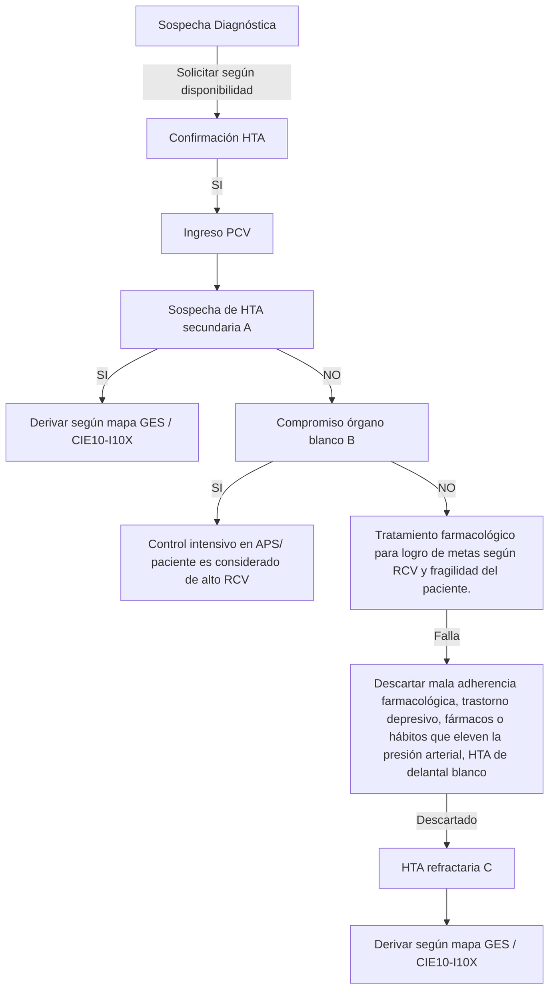
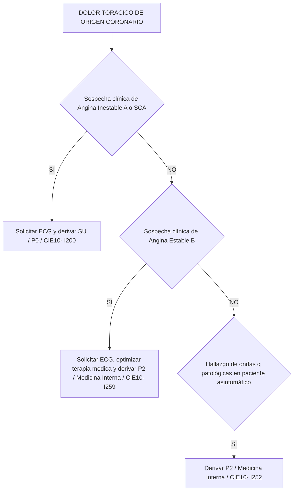
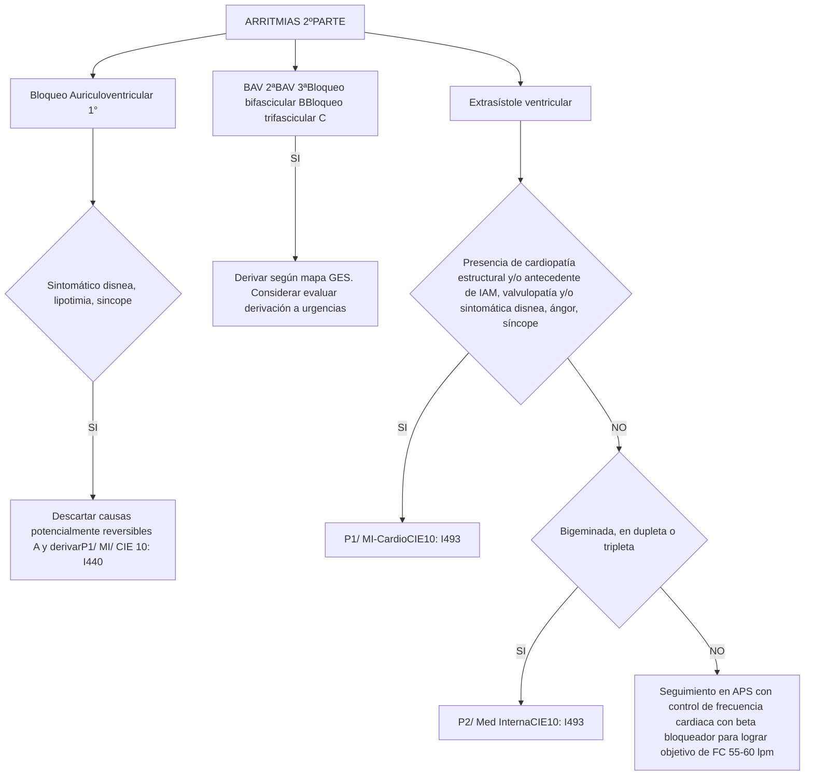

# PROT-CARDIOLOGIA-ADULTO-V.2-2021-2

--- Página 1 ---


# PROTOCOLO CLÍNICO DE DERIVACION Y PRIORIZACION DE LA ATENCION DE SALUD

## ESPECIALIDAD CARDIOLOGIA

## PROCESO DE REFERENCIA Y CONTRA REFERENCIA SERVICIO DE SALUD METROPOLITANO OCCIDENTE

**Versión: 2.0**
**Fecha de Emisión: Abril 2021**
**Resolución exenta N°: 0839**

--- Página 2 ---

# Indice


| Contenido                                                                                                 | Página   |
| --------------------------------------------------------------------------------------------------------- | -------- |
| 1. Grupo de Trabajo                                                                                       | 3-4      |
| 2. Propósito                                                                                              | 5        |
| 3. Objetivos                                                                                              | 5        |
| 4. Alcance                                                                                                | 5        |
| 5. Población objetivo                                                                                     | 5        |
| 6. Definiciones                                                                                           | 6        |
| 7. Criterios de referencia, prioridad de atención y especialidad de destino de derivación                 | 7- 8-9   |
| 8. Flujogramas clinicos                                                                                   |          |
| ▪ Flujograma Nº1: Hipertensión Arterial                                                                   | 10       |
| ▪ Flujograma Nº2: Monitorización de la Presión Arterial en domicilio                                      | 11       |
| ▪ Flujograma Nº3: Insuficiencia Cardiaca                                                                  | 12-13    |
| ▪ Flujograma Nº4: Dolor toracico de origen coronario                                                      | 14-15    |
| ▪ Flujograma Nº5: Arritmias                                                                               | 16-17-18 |
| ▪ Flujograma Nº6: Cardiopatia estructural: paciente con soplo / Sincope                                   | 19       |
| 9. Indicador                                                                                              | 20       |
| 10. Abreviaturas                                                                                          | 20       |
| 11. Referencias Bibliográficas                                                                            | 20       |
| 12. Anexos                                                                                                |          |
| ▪ Anexo Nº1: Consolidado patologias GES relacionadas a especialidad de Cardiologia.<br/>Población adulta. | 21-22    |


--- Página 3 ---

# 1. Grupo de Trabajo

**Documento elaborado por:**


| Nombre                            | Cargo                                                                                                          | Establecimiento                           |
| --------------------------------- | -------------------------------------------------------------------------------------------------------------- | ----------------------------------------- |
| Dr. Ángel Puentes                 | Especialista Cardiología.                                                                                      | Hospital San Juan de Dios                 |
| Dra. Katheryne Saltos Giler       | Especialista Cardiología                                                                                       | Hospital de Talagante                     |
| Dra. Raquel Rivera                | Especialista Medicina Interna                                                                                  | Hospital de Talagante                     |
| Dr. Galo Ortega Wheatley          | Medico contralor                                                                                               | CESFAM Andes                              |
| Dra. Johana Carballo Camero       | Medico contralor                                                                                               | CESFAM Lo Franco                          |
| Dra. Catalina Leiva               | Medico contralor subrogante                                                                                    | CESFAM Lo Franco                          |
| Dr. Marco Gamboa                  | Medico contralor                                                                                               | CESFAM Garin                              |
| Dr. Jesús Marín Pérez             | Medico contralor                                                                                               | CESFAM Steeger                            |
| Dra. Ondina Narváez Morales       | Medico contralor                                                                                               | CESFAM Albertz                            |
| Dra. Shannon Gallargo McLean      | Medico contralor                                                                                               | CESFAM Lo Amor                            |
| Dr. Abrahan Cupare Tovar          | Medico contralor subrogante                                                                                    | CESFAM Lo Amor                            |
| Dra. Laura Guedez Zittarer        | Medico contralor subrogante                                                                                    | CESFAM Cerro Navia                        |
| Dr. Álvaro Vergara                | Medico contralor                                                                                               | CESFAM Renca                              |
| Dra. María Gabriela Antúnez       | Medico contralor                                                                                               | CESFAM Bicentenario                       |
| Dr. Jesús Hernández Guzmán        | Medico contralor                                                                                               | CESFAM Hernan Urzua                       |
| Dr. Cristopher Tapia              | Medico contralor                                                                                               | CESFAM Santa Anita                        |
| Dra. Paz Manosalva Pérez          | Medico contralor                                                                                               | CESFAM Pablo Neruda                       |
| Dra. Estefani Cruz                | Medico contralor subrogante                                                                                    | CESFAM Pablo Neruda                       |
| Dra. Erika Burgos                 | Medico contralor                                                                                               | CESFAM Pudahuel Estrella                  |
| Dr. Reyad Khalil Abdelfattah      | Medico contralor                                                                                               | CESFAM Pudahuel Poniente                  |
| Dr. Gustavo Hernández             | Medico contralor                                                                                               | CESFAM C. Raul Silva Henriquez            |
| Dra. Dianelys Herrada de la Cruz- | Medico contralor                                                                                               | CESFAM Gustavo Molina                     |
| Dr. Fabián Espinoza Cabrera       | Medico contralor                                                                                               | CESFAM Violeta Parra                      |
| Dr. Ignacio Cabello               | Medico contralor subrogante                                                                                    | CESFAM Violeta Parra                      |
| Dra. Melissa Escobar              | Medico contralor comunal                                                                                       | Direccion comunal Pudahuel                |
| Dra. Francisca Meza Pérez         | Medico contralor                                                                                               | Hospital Curacavi                         |
| Dr. Ricardo Malta                 | Medico contralor                                                                                               | CESFAM A. Allende                         |
| Dra. Karla Yañez                  | Medico contralor subrogante                                                                                    | CESFAM A. Allende                         |
| Dra. Isabel Nuñez Villegas        | Medico contralor                                                                                               | CESFAM El Monte                           |
| Dra. Susy Yagual Hidalgo          | Medico contralor                                                                                               | CESFAM Isla de Maipo                      |
| Dr. Manuel Zambrano Carrillo      | Medico contralor subrogante                                                                                    | CESFAM Isla de Maipo                      |
| Dr. Carlos Azcárate Mendoza       | Medico contralor                                                                                               | CESFAM Islita                             |
| Dr. Juan Villalobos               | Medico contralor                                                                                               | CESFAM Peñaflor                           |
| Dr. Vicente Moreira Moreira       | Medico contralor                                                                                               | CESFAM Monckeberg                         |
| Dra. Sigrid Pou Salvi             | Medico contralor                                                                                               | CESFAM Juan Pablo II                      |
| Dra. Diliana Ballestas            | Medico contralor                                                                                               | CESFAM Adriana Madrid de Costabal         |
| Dr. Daniel Hernandez              | Medico contralor                                                                                               | CESFAM Villa Alhué                        |
| Dr. Gastón Pérez                  | Medico contralor                                                                                               | CESFAM Villa Alhué                        |
| Dr. Abel Gonzalez Rojas           | Medico contralor                                                                                               | CESFAM San Pedro                          |
| Dra. Eliana Amunátegui            | Medico contralor                                                                                               | CESFAM E. Elgueta                         |
| Dr. Jaime Opazo                   | Medico contralor                                                                                               | CESFAM Fco. Boris Soler                   |
| Dr. Carlos Cordero López          | Medico contralor                                                                                               | CESFAM San Manuel                         |
| Dr. Alejandro Carreño             | Medico contralor                                                                                               | CESFAM Posta Bollenar                     |
| Dra. María José Maureira          | Medico Internista<br/>Medico Asesor DECOR<br/>Medico referente del Proceso de<br/>Referencia-Contra referencia | Servicio de Salud Metropolitano Occidente |


--- Página 4 ---

**Documento revisado por:**


| Nombre                           | Cargo                                                                                     | Establecimiento                           |
| -------------------------------- | ----------------------------------------------------------------------------------------- | ----------------------------------------- |
| Dr. Rodrigo Riffo Rubio          | Subdirector de Gestión Asistencial                                                        | Servicio de Salud Metropolitano Occidente |
| Dr Carlos Gallardo Cofré         | Jefe Departamento de Coordinación de la Red                                               | Servicio de Salud Metropolitano Occidente |
| QF. Roxana Arias de Pol          | Jefa Departamento de Estadísticas y Gestión de la Información.                            | Servicio de Salud Metropolitano Occidente |
| T.O. María Paz Iturriaga Lisbona | Directora Subdirección de Atención Primaria                                               | Servicio de Salud Metropolitano Occidente |
| Dra. Mirza Retamal Moraga        | Jefa Unidad de Planificación y Control de Gestión de la Subdirección de Atención Primaria | Servicio de Salud Metropolitano Occidente |
| Dr. José Romero Lama             | Medico encargado GES<br/>Departamento de Coordinación de la Red                           | Servicio de Salud Metropolitano Occidente |
| Lya Reyes Carreño                | Jefa CR Ambulatorio                                                                       | Hospital San Juan de Dios                 |
| Dra. Lorena Arrué                | Jefa CR Ambulatorio                                                                       | Hospital Félix Bulnes                     |
| EU. Cecilia Elgueta              | Sub jefe CAE                                                                              | Hospital San José de Melipilla            |
| Odont. Claudio Miranda G.        | Referente Modelo de Referencia y Contra referencia                                        | Hospital de Talagante                     |
| Dra. Alicia Canales              | Subdirección Medica                                                                       | CRS Salvador Allende Gossens              |


**Documento autorizado por:**


| Nombre                         | Cargo                                              | Establecimiento                           |
| ------------------------------ | -------------------------------------------------- | ----------------------------------------- |
| Dr. Francisco Miranda Guerrero | Director                                           | Servicio de Salud Metropolitano Occidente |
| Dr. Rodrigo Riffo Rubio        | Director de la Subdirección de Gestión Asistencial | Servicio de Salud Metropolitano Occidente |


**Coordinadores y Encargados responsable:**


| Nombre                      | Cargo                                                                                                                                            | Establecimiento                           |
| --------------------------- | ------------------------------------------------------------------------------------------------------------------------------------------------ | ----------------------------------------- |
| Dra. Maria Jose Maureira M. | Médico Internista<br/>Médico Asesor Departamento de Coordinación de la Red<br/>Referente Modelo de Referencia y Contra referencia                | Servicio de Salud Metropolitano Occidente |
| Dra. Mirza Retamal Moraga   | Jefa Unidad de Planificación y Control de Gestión de la Subdirección de Atención Primaria<br/>Referente Modelo de Referencia y Contra referencia | Servicio de Salud Metropolitano Occidente |


Este documento es producto de la colaboración de profesionales de todos los Niveles de Atención de Salud de la Red Metropolitana Occidente, contribuyendo de este modo al Modelo de Redes Integradas de Servicios de Salud basadas en la Atención Primaria.

Protocolo revisado y validado en CIRA Septiembre 2020

--- Página 5 ---

**2. Propósito:**

Entregar información suficiente y de calidad para los profesionales de la salud, que permita facilitar la toma de decisiones respecto al abordaje inicial del paciente (no reemplaza el criterio clinico del médico tratante), entregando recomendaciones que permitan realizar un diagnóstico precoz, una derivación oportuna y pertinente hacia un nivel de mayor complejidad de la Red Asistencial Metropolitana Occidente.

3. **Objetivos

a. General:**

Asegurar a los usuarios una atención y cuidado continuo, integrado, y coordinado dentro de la Red Asistencial Occidente, mediante un proceso de referencia y contra-referencia ágil, flexible y eficaz, permitiendo la comunicación y disponibilidad de información estandarizada entre los diferentes niveles de atención, con el fin de gestionar en red las diferentes prestaciones en salud.

**b. Objetivos Específicos:**

- Definir las características y la oportunidad en que un determinado paciente con una patología debe ser evaluado y manejado por el médico no especialista, disminuyendo la variabilidad de la atención, proporcionando un marco común de actuación.
- Establecer un flujograma desde la evaluación clínica, con apoyo de exámenes complementarios y resolución de los pacientes.
- Homologar los códigos CIE-10 a las patologías que por diagnóstico son pertinentes de derivar, aumentando la precisión diagnóstica y con ello su seguimiento y respectiva priorización.
- Entregar criterios estandarizados de referencia y priorización a los equipos de salud de la Red del SSMOCC con el fin de mejorar la pertinencia y oportunidad de atención en el nivel secundario.
- Determinar el conjunto mínimo de datos y exámenes que se deben registrar en la interconsulta y que respaldan el motivo de la derivación al nivel secundario de atención permitiendo con ello mejorar la eficiencia de la primera consulta por el especialista.
- Promover la coordinación entre los niveles administrativos y clínicos de los establecimientos que conforman una red de atención para que intervengan en el proceso de referencia y contra- referencia.

**4. Alcance:** Profesionales del área de la salud pertenecientes a la Red Asistencial Metropolitana Occidente

**5. Población Objetivo:** Población adulta pertenenciente a la Red Asistencial Metropolitana Occidente

<page_number>5</page_number>

--- Página 6 ---

# 6. Definiciones:

*   **Código CIE-10:** “Clasificación Estadística Internacional de Enfermedades y Problemas Relacionados con la Salud”. En este documento se unifican los códigos CIE-10 de los diagnósticos pertinentes de derivar hacia el nivel secundario. Los que se detallan por cada patología en ella contenida.

*   **Referencia:** Es la solicitud de evaluación diagnóstica y/o tratamiento de un paciente derivado de un Establecimiento de salud de menor capacidad resolutiva a otro de mayor capacidad, con la finalidad de asegurar la continuidad de la prestación del servicio.

*   **Definición de Pertinencia:** Se entiende por consulta pertinente aquellas derivaciones nuevas originadas en la atención primaria que cumple con los documentos de referencia que resguardan el nivel de atención bajo el cual el paciente debe resolver su problema de salud, siendo el motivo de derivación factible de solucionar en el nivel de atención al que se deriva.

*   **Definición de No pertinencia:** Corresponde a la identificación de una interconsulta que no cumple con los protocolos clínicos de derivación validados y que resguardan el nivel de atención bajo el cual el paciente debe ser resuelto, siendo el motivo de derivación factible de solucionar en la Atención Primaria de Salud donde el paciente debe ser reevaluado.

*   **Definición de Prioridad:** nivel de preferencia con el cual debe ser resuelto un problema de salud en el establecimiento al cual fue referido. Se establecen categorías de priorización con tiempos de resolución sugeridos:

    ➢ Prioridad 0 (P0): Son aquellas interconsultas por patologías que deben ser derivadas directamente al Servicio de Urgencia con eventual hospitalización de acuerdo con evaluación

    ➢ Prioridad 1 (P1): Alta prioridad cuya patología reviste urgencia relativa, es decir, no puede esperar oferta de cupos, pero a su vez no presenta riesgo vital inmediato que amerite una derivación al Servicio de Urgencia. Esta derivación requiere una coordinación directa entre el nivel primario y el establecimiento de destino. Se sugiere que el tiempo de atención por el especialista sea antes de 30 días.

    ➢ Prioridad 2 (P2): Prioridad normal. Interconsulta ingresa al sistema informático respectivo, a la espera que se le asigne un cupo de atención de acuerdo a la oferta disponible. Se sugiere que el tiempo de atención por el especialista sea antes de 6 meses.

*   **Exámenes Mínimos Básicos de Derivación:** Conjunto de exámenes que deben ir registrados en la Solicitud de Interconsulta (SIC) y que tienen como propósito respaldar el motivo de la derivación y/o contribuir a que la primera consulta por el especialista sea más eficiente, aportando información relevante para la toma de decisiones. Los exámenes descritos en los flujogramas como **“según disponibilidad”** quedan sujetos a la disponibilidad existente en cada centro de salud y/o posibilidad de ser realizado por el paciente. Cuando no se dispone del recurso se sugiere derivar directamente.

--- Página 7 ---

# 7. Criterios de referencia, prioridad de atención y especialidad de destino de derivación.


| Diagnóstico(Código CIE 10)                                                         | Criterios de Derivación                                                                                                                                                                                                                                                                                                                                                                                                                                                                                                                                                  | Exámenes mínimos dederivación                                                                                                                                                                                                                                                                                                                                                     | Especialidaddestino(A)                      | Prioridad                          |
| ---------------------------------------------------------------------------------- | ------------------------------------------------------------------------------------------------------------------------------------------------------------------------------------------------------------------------------------------------------------------------------------------------------------------------------------------------------------------------------------------------------------------------------------------------------------------------------------------------------------------------------------------------------------------------ | --------------------------------------------------------------------------------------------------------------------------------------------------------------------------------------------------------------------------------------------------------------------------------------------------------------------------------------------------------------------------------- | ------------------------------------------- | ---------------------------------- |
| 1. Hipertensión Arterial (I10X, Hipertensión Arterial                              | ▪ Hipertensión refractaria: No se logra la meta de presión arterial con el uso de 3 o más fármacos antihipertensivos en dosis máxima recomendada, de diferentes familias y acciones complemenarias, uno de los cuales es un diurético, o el paciente logra la meta con 4 o más farmacos antihipertensivos<br/>▪ Sospecha de hipertensión arterial secundaria<br/>▪ Enfermedad renal crónica: velocidad de filtración glomerular (VFGe) menor a 30ml/min o proteinuria (albuminuria mayor a 300mg/gr creatinina urinaria)<br/>▪ Hipertensión arterial esencial y embarazo | Creatinina, examen de orina completa, RAC, electrolitos / hemograma, Perfil lipídico, TSH-T4L, calcio (según disponibilidad) / ECG / Ecografía renal (según disponibilidad)<br/>Registro de Autocontrol de PA de 1 semana (previa derivación), y habiendo descartado mala adherencia a tto y uso de medicamentos que eleven la PA. Con controles al dia con equipo cardiovascular | Según mapa GES                              | GES                                |
| 2. Insuficiencia cardiaca congestiva (I500, insuficiencia cardiaca congestiva)     | Sospecha clínica (paciente congestivo con CF IV) y/o sospecha radiológica                                                                                                                                                                                                                                                                                                                                                                                                                                                                                                | ECG<br/>Control de presión arterial                                                                                                                                                                                                                                                                                                                                               | Servicio de Urgencia (B) / Medicina Interna | P0 /<br/><br/>P1                   |
| 3. Insuficiencia cardiaca (I509, insuficiencia cardiaca, no especificada)          | ▪ Disnea CF III a pesar de terapia medica óptima (C)<br/>▪ Test de Marcha (según disponibilidad) < 300 metros<br/>▪ Hospitalizaciones previas por Insuficiencia Cardiaca<br/>▪ Usuario con antecedentes de cardiopatía coronaria (IAM u ECG con ondas q patológicas u ecocardiograma con alteración de contractibilidad o FE <=40%) sin control actual por especialidad y sintomático                                                                                                                                                                                    | Hemograma, electrolitos, creatinina, TSH, T4L.<br/>ECG                                                                                                                                                                                                                                                                                                                            | Medicina Interna                            | P1- P2 según severidad de síntomas |
| 4. Insuficiencia ventricular izquierda (I501, insuficiencia ventricular izquierda) | **Hallazgo de Ecocardiograma con FE reducida (FE <=40%) con o sin dilatación de cavidades en paciente asintomático**                                                                                                                                                                                                                                                                                                                                                                                                                                                     | Informe de imagen compatible                                                                                                                                                                                                                                                                                                                                                      | Med Interna/ Cardiología                    | P1                                 |


\* (A) Considerar Mapa de Derivación vigente

\* (B) En el caso de que usuario no quede hospitalizado y/o no se le designe hora por el establecimiento de urgencia, derivar como P1, indicando en SIC fecha de derivación a Servicio de Urgencia

\* (C) Terapia medica óptima: uso de IECA, betabloqueador y diurético en dosis máximas toleradas para el logro de metas terapéuticas según comorbilidad y fragilidad del paciente.

--- Página 8 ---

| Diagnóstico(Código CIE 10)                                                                               | Criterios de Derivación                                                                              | Exámenes mínimos de derivación                                                     | Especialidad destino(A)  | Prioridad |
| -------------------------------------------------------------------------------------------------------- | ---------------------------------------------------------------------------------------------------- | ---------------------------------------------------------------------------------- | ------------------------ | --------- |
| 5. Síndrome coronario agudo                                                                              | Sospecha clínica y/o electrocardiográfica                                                            | ECG                                                                                | Servicio de urgencia     | P0        |
| 6. Angina Inestable<br/>(I200, angina inestable)                                                         | Clínica compatible (ver flujogramas, más adelante)                                                   | ECG                                                                                | Servicio de urgencia (B) | P0        |
|                                                                                                          |                                                                                                      |                                                                                    | Med Interna/ Cardiología | P1        |
| 7. Angina Estable<br/>(I259, enfermedad isquémica crónica del corazón, no especificada)                  | Clínica compatible (ver flujogramas, más adelante)                                                   | ECG<br/>Perfil lipídico, Registro de PA y Hemoglobina glicosilada (si corresponde) | Medicina Interna         | P2        |
| 8. Infarto Antiguo del Miocardio<br/>(I252, infarto antiguo del miocardio)                               | **Hallazgo** de ECG con ondas q patológicas en usuarios **asintomáticos**                            | ECG<br/>Perfil lipídico, Registro de PA y Hemoglobina glicosilada (si corresponde) | Medicina Interna         | P2        |
| 9. Bloqueo completo de rama izquierda (I447, bloqueo de rama izquierda del haz, sin otra especificación) | **Hallazgo** de ECG con BCRI en paciente **asintomático**                                            | ECG                                                                                | Medicina Interna         | P2        |
| 10. Bloqueo auricular de 1° (I440, Bloqueo auriculoventricular 1°)                                       | Sintomático (disnea, lipotimia, sincope. Síntomas que se presentan generalmente con FC <50 lxm) (C). | ECG, electrolitos.                                                                 | Medicina Interna         | P1        |
| 11. Bloqueo AV 2°<br/>(I441, Bloqueo auriculoventricular de segundo grado)                               | ECG compatible                                                                                       | ECG                                                                                | Según GES (D)            | GES       |
| 12. Bloqueo AV completo (I442, bloqueo auriculoventricular completo)                                     | ECG compatible                                                                                       | ECG                                                                                | Según GES (D)            | GES       |
| 13. Bloqueo Bifascicular: (I452, bloqueo bifascicular)                                                   | ECG compatible                                                                                       | ECG                                                                                | Según GES (D)            | GES       |
| 14. Bloqueo Trifascicular (I453, bloqueo trifascicular)                                                  | ECG compatible                                                                                       | ECG                                                                                | Según GES (D)            | GES       |


<mark>NO DERIVAR: Bloqueo AV 1° o bloqueo completo de rama derecha o extrasístoles auriculares o hemibloqueo izquierdo anterior o posterior AISLADOS ASINTOMATICOS</mark>

(A) Considerar Mapa de derivación vigente

(B) En el caso de que usuario no quede hospitalizado y/o no se le designe hora por el establecimiento de urgencia, derivar como P1, indicando en SIC fecha de derivación a Servicio de Urgencia

(C) Evaluar y descartar causas potencialmente reversibles: farmacológicas (betabloqueadores, calcioantagonista, digoxina, amiodarona), electrolíticas, trastorno de tiroides, insuficiencia renal avanzada (hiperkalemia)

(D) Evaluar derivación a Servicio de Urgencia a toda arritmia asociada a sincope y/o bloqueo de alto grado

--- Página 9 ---

| Diagnóstico(Código CIE 10)                                                                    | Criterios de Derivación                                                                                                                                                                                              | Exámenes mínimos de derivación                                           | Especialidad destino (A)          | Prioridad |
| --------------------------------------------------------------------------------------------- | -------------------------------------------------------------------------------------------------------------------------------------------------------------------------------------------------------------------- | ------------------------------------------------------------------------ | --------------------------------- | --------- |
| 15. Taquicardia Paroxística Supraventricular (I479, taquicardia paroxística, no especificada) | Cuadro clínico compatible **CON ECG** que demuestre la arritmia en los episodios                                                                                                                                     | Descripción de ECG                                                       | Medicina Interna/<br/>Cardiología | P2        |
| 16. Sospecha de arritmias (I499, arritmia cardiaca, no especificada)                          | Palpitaciones recurrentes y que afecten la calidad de vida con **ECG normal** descartado otras causas no cardiogénicas de palpitaciones (causas psiquiátricas, anemia, hipertiroidismo, cocaína, uso de B2 agonista) | Descripción de ECG, hemograma, electrolitos, función renal, TSH-T4 libre | Medicina Interna                  | P2        |
| 17. Fibrilación y aleteo auricular (I48X, fibrilación y aleteo auricular)                     | Sintomático y/o FC >=100 lpm y/o de reciente comienzo                                                                                                                                                                | Descripción de ECG                                                       | Servicio de urgencia (B)          | P0        |
|                                                                                               |                                                                                                                                                                                                                      | Med Interna/<br/>Cardiología                                             | P1                                |           |
|                                                                                               | Crónico y asintomático                                                                                                                                                                                               | Descripción de ECG<br/>Registro de puntuación CHADS2-VASc/<br/>HAS-BLEED | Med Interna/<br/>Cardiología      | P1        |
| 18. Síndrome de pre excitación (I456, síndrome de Pre-excitación)                             | Sintomático o asintomático con ECG compatible<br/><br/>Indicar en APS: Suspensión de actividad física                                                                                                                | ECG compatible                                                           | Med Interna/<br/>Cardiología      | P1        |
| 19. Extrasístole ventricular (I493, despolarización ventricular prematura)                    | Con antecedentes personales de IAM, valvulopatia o presencia de HVI o ecocardiograma alterado o Sintomática (disnea, angor, sincope)                                                                                 | ECG compatible                                                           | Med Interna/<br/>Cardiología      | P1        |
|                                                                                               | SIN cardiopatía estructural y<br/>▪ Bigeminada o<br/>En dupleta o tripleta                                                                                                                                           | ECG compatible                                                           | Med Interna                       | P2        |


\* (A) Considerar mapa de derivación vigente

\* (B) En el caso de que usuario no quede hospitalizado y/o no se le designe hora por el establecimiento de urgencia, derivar como P1

--- Página 10 ---

| Diagnóstico(Código CIE 10)                                                                                                                                                                                                                                                                 | Criterios de Derivación                                                                                                                                                                                                                                                                                                                                               | Exámenesmínimos dederivación                                                                   | Especialidaddestino (A)  | Prioridad |
| ------------------------------------------------------------------------------------------------------------------------------------------------------------------------------------------------------------------------------------------------------------------------------------------ | --------------------------------------------------------------------------------------------------------------------------------------------------------------------------------------------------------------------------------------------------------------------------------------------------------------------------------------------------------------------- | ---------------------------------------------------------------------------------------------- | ------------------------ | --------- |
| 20. Soplo cardíaco<br/>(R011, soplo cardiaco no especificado).                                                                                                                                                                                                                             | ▪ Asintomático                                                                                                                                                                                                                                                                                                                                                        | Descripción de ECG                                                                             | Medicina Interna         | P2        |
| 21. Valvulopatía moderada o severa<br/><br/>▪ I059, enfermedad válvula mitral, no especificada<br/>▪ I359, trastorno de la válvula aortica, no especificada<br/>▪ I079, enfermedad de la válvula tricuspide, no especificada<br/>▪ I089, enfermedad de múltiples válvulas no especificadas | ▪ Sintomático (disnea, síncope, dolor torácico anginoso, hemoptisis, antecedente de ACV, isquemia arterial aguda, cianosis, diferencia de pulsos) o<br/>▪ Antecedentes personales o familiares de muerte súbita o<br/>▪ Alteración estructural:<br/>➢ ECG con HVI<br/>➢ Ecocardiograma (según disponibilidad) que objetive disfunción valvular **moderada o severa.** | Descripción de ECG y/o ecocardiograma: describir fracción de eyección y conclusión del informe | Med Interna/ Cardiología | P1        |
| 22. Síncope y colapso de causa cardiológica<br/>(R55X, sincope y colapso)                                                                                                                                                                                                                  | ▪ ECG alterado (arritmia o HVI)<br/>▪ Síncope de esfuerzo<br/>▪ Antecedentes familiares de muerte súbita<br/>▪ Presencia de soplo patológico (sospecha de CIV, CIA)                                                                                                                                                                                                   | Descripción de ECG.<br/>Glicemia, Hemograma, Creatinina, Electrolitos, TSH-T4                  | Medicina Interna         | P1        |
| 23. Síncope neuromediado<br/>(R42X, mareo y desvanecimiento)                                                                                                                                                                                                                               | ▪ Episodios recurrentes o inesperados que afecten la calidad de vida habiendo descartado causas no cardiovasculares (hipoglicemia, anemia, causas neurológicas, causas psiquiátricas)                                                                                                                                                                                 | Descripción de ECG<br/>Glicemia, Hemograma, Creatinina, Electrolitos, TSH-T4                   | Medicina Interna         | P2        |


(A) Considerar Mapa de derivación vigente

--- Página 11 ---

# 8. Flujogramas Clínicos.
## Flujograma Nº1

# HIPERTENSION ARTERIAL

**Sospecha Diagnóstica**

**Derivar con:**
* Creatinina, examen de orina completa, RAC, electrolitos / hemograma, perfil lipídico, TSH-T4L, calcio (según disponibilidad)/ ECG / Ecografía renal (según disponibilidad)
* Registro de Autocontrol de PA de 1 semana previa, y habiendo descartado mala adherencia a Tto y uso de medicamentos que eleven la PA .

Solicitar según disponibilidad:
* Perfil de PA (CEDAZO)
* Holter de PA (MAPA)
* Monitorización domiciliaria de la presion arterial

**Confirmación HTA**




| Definición de HTA<br/>Categoria | Definición de HTA<br/>PAS mmHg | Definición de HTA | Definición de HTA<br/>PAD mmHg |
| ------------------------------- | ------------------------------ | ----------------- | ------------------------------ |
| 1. CEDAZO                       | >=140                          | y/o               | >=90                           |
| 2. Monitorización domiciliaria  | >=135                          | y/o               | >=85                           |
| 3. MAPA                         |                                |                   |                                |
| 3.1 Promedio dia                | >=135                          | y/o               | >=85                           |
| 3.2 Promedio noche              | >=120                          | y/o               | >=70                           |
| 3.3 Promedio 24 horas           | >=130                          | y/o               | >=80                           |


**(A) Causas de HTA secundaria:** Renal parenquimatosa > Renovascular > Hipo-Hipertiroidismo, Hiperparatiroidismo, Hiperaldosteronismo 1°, Feocromocitoma, Síndrome Cushing, Coartación Aortica, Síndrome Apnea Obstructiva del Sueño, Síndrome Mieloproliferativo.

Sospecha de HTA secundaria:
* Inicio joven de hipertensión de grado 2 o 3 (<40 años), o desarrollo repentino de hipertensión arterial
* PA que empeora rápidamente en pacientes mayores
* Historia de enfermedad renal / del tracto urinario
* Asimetría renal >1,5cm entre ambos riñones (sospecha de HTA renovascular)
* Aumento de creatinina >30% con uso de IECA o ARA II
* Drogas recreativas / abuso de sustancias / terapias concurrentes: AINES, corticosteroides, vasoconstrictor nasal, quimioterapia, yohimbina, regaliz
* Episodios repetidos de sudoración, dolor de cabeza, ansiedad o palpitaciones, que sugieren feocromocitoma.
* Antecedentes de hipokalemia espontánea o provocada por diuréticos, episodios de debilidad muscular y tetania (hiperaldosteronismo)
* Síntomas sugestivos de enfermedad tiroidea o hiperparatiroidismo
* Historia de la apnea del sueño

**(B) Compromiso de órgano blanco:** Hipertrofia ventricular izquierda, Insuficiencia cardiaca, Enfermedad renal crónica, Enfermedad arterial oclusiva, retinopatía hipertensiva, Fibrilación auricular, cardiopatía coronaria, accidente cerebro vascular

**(C) HTA refractaria:** No se logra la meta de presión arterial con el uso de 3 o más fármacos antihipertensivos en dosis máxima recomendada, de diferentes familias y acciones complemenarias, uno de los cuales es un diurético, o el paciente logra la meta con 4 o más farmacos antihipertensivos

--- Página 12 ---

**Flujograma Nº2**

# MONITORIZACION DE PRESION ARTERIAL EN DOMICILIO

**Consideraciones al tomar la Presión Arterial**
* Colocación correcta del manguito
* No debe haber bebido alcohol o cafeína, fumar, hacer ejercicio o comer al menos 30 minutos antes de realizar la medición.
* Descansar al menos durante 5 minutos antes de la toma
* Tomar la presión arterial 30 a 60 minutos antes de tomar sus medicamentos para la presión arterial
* La persona debe estar relajada y sentada cómodamente a una temperatura ambiente agradable.
* Se debe sentar en una silla con las piernas descruzadas y los pies firmes sobre el suelo.
* Sentarse derecho con la espalda recta y de modo que la espalda y el brazo estén bien apoyados.
* El brazo debe estar sobre una mesa y el manguito debe estar colocado en el brazo al mismo nivel que el corazón.

* Tomar la presión arterial durante al menos 3 días y preferiblemente durante 7 días consecutivos, una semana previa al control medico
* Tomar dos medidas (separados por un minuto) por la mañana en el brazo indicado por el doctor.
* Tomar dos medidas por la noche en el mismo brazo que tomo las medidas anteriores
* Siempre tomar la presión arterial en el mismo brazo y en el mismo horario que mediciones previas
* Registrar valores de Presion Arterial

**Interpretación de resultados**
La presión arterial se define como el promedio de todas las mediciones restantes
Hipertension arterial si promedio de PA es >= 135/85

--- Página 13 ---

# Flujograma Nº3

## INSUFICIENCIA CARDIACA


Sospecha de Insuficiencia Cardiaca según criterios de Framingham (A)


Evaluar severidad clínica según síntomas y examen físico


Clínica sugerente de Insuficiencia Cardiaca **Congestiva** — SI → Derivar Servicio de Urgencia / P0 / CIE10: I500


Determinar la etiología (B) y potenciales causas o factores descompensantes corregibles (C)


* Disnea CFIII (D) a pesar de terapia medica óptima
* Test de Marcha (según disponibilidad) < 300 metros
* Hospitalizaciones previas por Insuficiencia Cardíaca
* Usuarios con antecedentes previos de cardiopatía coronaria (IAM, ECG con ondas q patológicas u ecocardiograma con alteración de contractibilidad o FE <=40%) sin control actual por especialidad y sintomático
— SI → Derivar Medicina Interna/ P1-P2/ CIE10: I509


* Optimización de terapia médica de acuerdo a comorbilidades del paciente
* Educar al paciente y/o sus familiares acerca de la enfermedad

## (D) Clasificación Funcional de las IC según NYHA


| Clase funcional | Limitaciones de la actividad física                                                                                  |
| --------------- | -------------------------------------------------------------------------------------------------------------------- |
| I               | Sin limitaciones para la actividad física. Actividad física habitual no causa síntomas                               |
| II              | Limitación leve de la actividad física. Actividad física habitual provoca síntomas de IC, fundamentalmente disnea    |
| III             | Limitación marcada de la actividad física. Actividad física menos a la habitual (esfuerzos menores) provoca síntomas |
| IV              | Incapaz de realizar actividad física sin síntomas o síntomas en reposo                                               |


(B): **Etiología de IC**: Hipertensiva / Coronaria/ Valvulopatías / Arritmias / Cardiopatías congénitas

(C): **Factores descompensantes de IC**: hiper-hipotiroidismo, trastorno electrolíticos, anemia, arritmias, cardiopatía coronaria, infecciones, no adherencia a terapia medica, uso de fármacos contraindicados ( antidepresivos tricíclicos, bloqueadores de canales de calcio (nifedipino, verapamilo, diltiazem), rosiglitazona, anorexigenos, efedrina, pseudoefedrina. Precaución con uso de AINE, corticoides, litio, salbutamol

--- Página 14 ---

** (A) Criterios de Framingham : Diagnostico de Insuficiencia Cardiaca:** 2 criterios mayores o 1 mayor + 2 menores


| Criterios Mayores                                            | Criterios Menores                                            |
| ------------------------------------------------------------ | ------------------------------------------------------------ |
| Disnea paroxística nocturna u ortopnea                       | Disnea de esfuerzo                                           |
| Edema pulmonar agudo clínico o en Radiografía de Tórax       | Tos nocturna                                                 |
| Distensión venosa yugular                                    | Taquicardia >120 lpm                                         |
| Reflujo hepato-yugular                                       | Hepatomegalia                                                |
| Crepitaciones pulmonares (>10 cm desde la base pulmonar)     | Edema maleolar bilateral                                     |
| Galope por R3                                                | Derrame pleural                                              |
| Disminución de peso >4.5 kg en respuesta a tratamiento de IC | Disminución de capacidad vital a 1/3 de la máxima registrada |


**Clasificación de la IC en estadios evolutivos**


| Estadio | Características                                                                 |
| ------- | ------------------------------------------------------------------------------- |
| A       | En riesgo de IC, pero sin enfermedad cardíaca estructural o síntomas de IC      |
| B       | Presenta enfermedad cardíaca estructural, pero sin síntomas o signos de IC      |
| C       | Presenta enfermedad cardíaca estructural, con síntomas previos o actuales de IC |
| D       | IC refractaria a terapias habituales, requiere intervenciones especializadas    |


--- Página 15 ---

# DOLOR TORACICO DE ORIGEN CORONARIO




| Probabilidad de enfermedad coronaria de acuerdo a edad, sexo y síntomas<br/>Edad | Probabilidad de enfermedad coronaria de acuerdo a edad, sexo y síntomas<br/>Dolor toracico no anginoso<br/>Hombre | Probabilidad de enfermedad coronaria de acuerdo a edad, sexo y síntomas<br/>Dolor toracico no anginoso<br/>Mujer | Probabilidad de enfermedad coronaria de acuerdo a edad, sexo y síntomas<br/>Angina Atipica<br/>Hombre | Probabilidad de enfermedad coronaria de acuerdo a edad, sexo y síntomas<br/>Angina Atipica<br/>Mujer | Probabilidad de enfermedad coronaria de acuerdo a edad, sexo y síntomas<br/>Angina Tipica<br/>Hombre | Probabilidad de enfermedad coronaria de acuerdo a edad, sexo y síntomas<br/>Angina Tipica<br/>Mujer |
| -------------------------------------------------------------------------------- | ----------------------------------------------------------------------------------------------------------------- | ---------------------------------------------------------------------------------------------------------------- | ----------------------------------------------------------------------------------------------------- | ---------------------------------------------------------------------------------------------------- | ---------------------------------------------------------------------------------------------------- | --------------------------------------------------------------------------------------------------- |
| Años                                                                             | 5.2%                                                                                                              | 0.8%                                                                                                             | 22                                                                                                    | 4                                                                                                    | 70                                                                                                   | 26                                                                                                  |
| 30-39                                                                            | 14%                                                                                                               | 2.8%                                                                                                             | 46                                                                                                    | 13                                                                                                   | 87                                                                                                   | 55                                                                                                  |
| 40-49                                                                            | 22%                                                                                                               | 8%                                                                                                               | 59                                                                                                    | 32                                                                                                   | 92                                                                                                   | 79                                                                                                  |
| 50-59                                                                            | 28%                                                                                                               | 19%                                                                                                              | 67                                                                                                    | 54                                                                                                   | 94                                                                                                   | 91                                                                                                  |


**Angina Típica:** cumple 3 de los 3 criterios: dolor torácico tipo opresivo, que aparece tras un esfuerzo físico o emociones importantes y que cede al reposo o con uso de nitratos

**Angina Atípica:** cumple con 1 o 2 criterios


| (B) Criterios de Angina Estable          | (B) Criterios de Angina Estable  | (B) Criterios de Angina Estable                                                   | (B) Criterios de Angina Estable  | (B) Criterios de Angina Estable          |
| ---------------------------------------- | -------------------------------- | --------------------------------------------------------------------------------- | -------------------------------- | ---------------------------------------- |
| Dolor se suele localizar en el pecho     | cerca del esternón               | pero puede variar su localización desde el epigastrio                             | hasta la mandíbula o los dientes | entre las escápulas o en los dos brazos  |
| De carácter opresión                     | tensión                          | pesadez                                                                           | constricción                     | quemazón o sensación de estrangulamiento |
| La duración del malestar es breve        | generalmente menor de 10 minutos | un dolor precordial de segundos de duración es poco probable que se deba a angina |                                  |                                          |
| Aparece tras esfuerzo físico o emociones |                                  |                                                                                   |                                  |                                          |
| Y cede con reposo o uso de nitratos      |                                  |                                                                                   |                                  |                                          |


--- Página 16 ---

# CARDIOPATIA CORONARIA


| (A) Criterios de Angina Inestable                                                 | (A) Criterios de Angina Inestable   | (A) Criterios de Angina Inestable | (A) Criterios de Angina Inestable | (A) Criterios de Angina Inestable                                                            |
| --------------------------------------------------------------------------------- | ----------------------------------- | --------------------------------- | --------------------------------- | -------------------------------------------------------------------------------------------- |
| Angina que comienza en reposo. Generalmente de duración prolongada (> 20 minutos) |                                     |                                   |                                   |                                                                                              |
| Angina de reciente comienzo < 2 meses                                             | de al menos clase III de la CCS (3) |                                   |                                   |                                                                                              |
| Angina progresiva: Incremento                                                     | en el ultimo mes                    | del número                        | intensidad                        | duración o disminución del umbral de aparición en un paciente con angina de esfuerzo estable |
| Angina posinfarto: aparece en el primer mes tras un infarto al miocardio.         |                                     |                                   |                                   |                                                                                              |
| Angina de Prinzmetal (vasoespástica).                                             |                                     |                                   |                                   |                                                                                              |

| Clasificación Funcional CCS | Clasificación Funcional CCS                                                                                                                                              |
| --------------------------- | ------------------------------------------------------------------------------------------------------------------------------------------------------------------------ |
| I                           | No limitación de la vida normal. La angina solo aparece ante esfuerzos extenuantes                                                                                       |
| II                          | Limitación ligera de la actividad física. La angina aparece al andar rápido o subir escaleras o cuestas. Puede andar más de 1 ó 2 manzanas o subir un piso de escaleras. |
| III                         | Limitación marcada de la actividad física. La angina aparece al andar 1 ó 2 manzanas o al subir un piso de escaleras.                                                    |
| IV                          | Incapacidad para realizar ninguna actividad sin angina. Ésta puede aparecer en reposo                                                                                    |

| TIMI SCORE: Probabilidad de sufrir un Infarto Agudo al Miocardio            | Puntaje |
| --------------------------------------------------------------------------- | ------- |
| Edad ≥ 65 años                                                              | 1       |
| ≥ 3FRCV : antecedentes familiares de IAM, DM, HTA, tabaquismo, dislipidemia | 1       |
| Consumo de aspirina en los últimos 7 días                                   | 1       |
| Angina severa ≥ 2 episodios en las ultimas 24 horas                         | 1       |
| Enfermedad coronaria conocida (Estenosis >50% )                             | 1       |
| IDST ≥ 0,5mm                                                                | 1       |
| Elevación de marcadores de lesión miocárdica                                | 1       |


\* ≥ 3 puntos = alto riesgo de sufrir un Infarto Agudo al Miocardio

--- Página 17 ---

# Flujograma Nº5: Arritmias

```mermaid
graph TD
    START[ARRITMIAS] --> FA_FLUTTER[Fibrilación Auricular-Flutter Auricular]
    START --> TPSV_SUSPECT[Sospecha deTaquicardiaparoxísticaSupraventricular]
    START --> PREEX_SUSPECT[Sospechaelectrocardiográfica deSíndrome dePreexcitación]

    FA_FLUTTER --> FA_COND1[Sintomático y/o de RVR con FC >=100lpm y/o de reciente comienzo o comienzoindeterminado]
    FA_COND1 -- SI --> P0_SU[P0/ SU]
    FA_COND1 -- NO --> FA_COND2[Con antecedente previo y asintomático]
    FA_COND2 -- SI --> FA_DERIVAR[Descartar causaspotencialmentereversibles (A) y derivarP1-P2 / MI-Cardio/CIE-10: I48X]

    TPSV_SUSPECT --> ECG_TPSV[ECG objetiva TPSV]
    ECG_TPSV -- SI --> TPSV_DERIVAR[P2/ MI-Cardio/CIE-10 I479]
    ECG_TPSV -- NO --> NON_CARDIO[Descartar causas no cardiogénicas depalpitaciones (causas psiquiátricas, anemia,hipertiroidismo, cocaína, uso desalbutamol)]
    NON_CARDIO -- Descartado --> MED_INTERNA[P2 (según gravedad desíntomas) / Med Interna /CIE-10 499]

    PREEX_SUSPECT --> PREEX_DERIVAR[Suspender actividad física y derivarP1 / MI-Cardio / CIE-10 I456]
```


(A) Causas potencialmente reversible de FA: hipertiroidismo, alteración electrolítica, valvulopatías, cardiopatías

--- Página 18 ---

# Escala de CHA₂DS₂-VASc: Valoración del riesgo de Ictus en los enfermos con FA


|    | Factor de riesgo                                                                                                                                                       | Puntos |
| -- | ---------------------------------------------------------------------------------------------------------------------------------------------------------------------- | ------ |
| C  | Insuficiencia cardíaca congestiva: IC clínica o evidencia objetiva de disfunción del VI de moderada<br/>a grave, o miocardiopatia hipertrofica                         | 1      |
| H  | Hipertensión Arterial o en terapia antihipertensiva                                                                                                                    | 1      |
| A  | Edad ≥ 75 años                                                                                                                                                         | 2      |
| D  | Diabetes Mellitus                                                                                                                                                      | 1      |
| S  | Antecedente de ictus o TIA u otro incidente tromboembólico                                                                                                             | 2      |
| V  | Enfermedad vascular: Enfermedad de arteria coronaria angiográficamente significativa, infarto de<br/>miocardio previo, enfermedad arterial periferica, o placa aórtica | 1      |
| A  | Edad 65-74 años                                                                                                                                                        | 1      |
| Sc | Sexo femenino                                                                                                                                                          | 1      |


Se debe considerar la prevención del accidente cerebrovascular en:

* Pacientes con FA con válvulas cardíacas mecánicas protésicas o estenosis mitral moderada-grave
* Todos los pacientes con FA con CHA₂DS₂-VASc > = 1punto en hombre o > = 2 puntos en mujeres.
* Se debe considerar también el riesgo de sangrado valorado por la escala de HAS-BLED al iniciar anticoagulación

# Escala de HAS-BLEED: Valoración del riesgo de sangrado.


|                                                      | Factor de riesgo                                                                                                                                 | Puntos |
| ---------------------------------------------------- | ------------------------------------------------------------------------------------------------------------------------------------------------ | ------ |
| H                                                    | Hipertension incontrolada : PAS >160 mmHg                                                                                                        | 1      |
| A                                                    | Función renal anormal: dialisis, creatinina serica >200mmol/L (>2,2 mg/dl), trasplante                                                           | 1      |
|                                                      | Función hepática anormal: trasplante, cirrosis, bilirrubina> 2 límite superior de lo normal, AST<br/>/ ALT / FA > 3 límite superior de lo normal | 1      |
| S                                                    | Antecedente de Accidente cerebrovascular isquémico o hemorrágico previo                                                                          | 1      |
| B                                                    | Antecedentes de sangrado o predisposición: Hemorragia importante previa o anemia o<br/>trombocitopenia grave                                     | 1      |
| L                                                    | INR lábil: TTR (tiempo en rango terapeutico) <60% en pacientes que reciben AVK                                                                   | 1      |
| E                                                    | Mayor de 65 años o fragilidad extrema                                                                                                            | 1      |
| D                                                    | Drogas o consumo excesivo de alcohol                                                                                                             | 1      |
|                                                      | Uso concomitante de antiplaquetarios o AINE; y / o alcohol en exceso por semana                                                                  | 1      |
| Máximo de puntos                                     |                                                                                                                                                  | 9      |
| Interpretación: ≥ 3 puntos = Alto riesgo de sangrado |                                                                                                                                                  |        |


2020 ESC Guidelines for the diagnosis and management of atrial fibrillation developed in collaboration with the European Association for Cardio-Thoracic Surgery (EACTS). European Heart Journal (2020) 00, 1 126. Sociedad Europea de Cardiologia

--- Página 19 ---

# ARRITMIAS 2ºPARTE



<span style="color: red">**NO DERIVAR: Bloqueo AV 1° o bloqueo completo de rama derecha o extrasístoles auriculares o hemibloqueo izquierdo anterior o posterior AISLADOS ASINTOMATICOS**</span>

(A) Causas potencialmente reversible: Farmacológicas (betabloqueadores, calcioantagonista, digoxina, amiodarona), Electrolíticas, Trastorno de Tiroides, Insuficiencia Renal avanzada (hiperkalemia)
(B) Bloqueo Bifascicular: BCRD + Hemibloqueo anterior o posterior izquierdo
* Hemibloqueo anterior izquierdo: R en DI; S en DII y DIII
* Hemibloqueo posterior izquierdo: S en DI; R en DII y DIII
(C) Bloqueo Trifascicular: Bloqueo bifascicular + BAV 1º o Bloqueo alternante entre BCRD y BCRI
(D) Síntomas o signos de alarma: antecedente de muerte súbita personal o familiar o asociado a síncope, angina, disnea, antecedente de ACV, focalidad neurológica .

--- Página 20 ---

# Flujograma Nº6: Cardiopatia estructural

```mermaid
graph TD
    START[CARDIOPATÍA ESTRUCTURAL] --> P1[Paciente con soplo]
    START --> P2[Síncope]

    P1 --> C1{"▪ Sintomático (disnea, síncope, dolor torácicoanginoso, hemoptisis, antecedente de AVE,isquemia arterial aguda, cianosis, diferencia depulsos) o▪ Antecedentes personal o familiar de muerte súbita o▪ Alteración estructural:➢ ECG con HVI➢ Ecocardiograma con disfunción valvular**moderada o severa**"}
    
    C1 -- SI --> D1[Derivar P1/ MI-Cardio/CIE-10 según sospechadiagnostica]
    C1 -- NO --> D2[Derivar P2/ Med Interna / CIE-10 R011]

    P2 --> C2{ECG alterado: arritmia, HVI, BCRI osincope de esfuerzo o antecedentes familiares demuerte súbita}
    
    C2 -- SI --> D3[Derivar P1/ Med Interna/CIE10- R55X]
    C2 -- NO --> C3{Descartar:• Ortostatismo• Sincope vasovagal• Causas no cardiovasculares: hipoglicemia, epilepsia,psicógeno}
    
    C3 -- Descartado --> C4{Episodios recurrentes o inesperados que afecten lacalidad de vida (sospecha de sincope neuromediado)}
    
    C4 -- SI --> D4[Derivar P2/ Med Interna/CIE10-R42X / conresultado de exámenes]
```

Causas de soplo: valvulopatias, coartación aortica, miocardiopatías (restrictiva, dilatada, hipertrófica)
Causas de sincope cardiogénico : arritmias, valvulopatias, miocardiopatias

Derivar con: electrocardiograma

--- Página 21 ---

# 9. Indicador:

Según protocolo de red “Protocolo de Referencia-Contra referencia”. Servicio de Salud Metropolitano Occidente

# 10. Abreviaturas

* AI: aurícula izquierda
* IAM: infarto agudo al miocardio

* AINES: antiflamatorio no esteroidales
* IC: insuficiencia cardiaca

* AP: atención primaria
* IDST: infra desnivel del segmento ST

* BCRI: bloqueo completo de reama izquierda
* IECA: inhibidores enzima convertidora de la angiotensina

* CF: capacidad funcional
* LSN: límite superior de lo normal

* ECG: electrocardiograma
    - MS: muerte súbita

* Enf: enfermedad
    - Obj: objetivo

* EOC: examen de orina completa
    - PA: presión arterial

* EAO: enfermedad arterial oclusiva
    - PAS: presión arterial sistólica

* EP: enfermedad de Parkinson
    - RCV: riesgo cardiovascular

* FA: fibrilación auricular
    - RVR: respuesta ventricular rápida

* FE: fracción de eyección del ventrículo izquierdo
    - Rx: radiografía

* FC: frecuencia cardiaca
    - TIA: accidente vascular transitorio

* FRCV: Factores de riesgo cardiovascular
    - Tto: tratamiento

* GES: Garantía Explicita de Salud
    - VI: ventrículo izquierdo

* HTA: Hipertensión arterial
    - +- : con o sin

* HVI: hipertrofia ventricular izquierda

# 11. Referencias Bibliográficas:

* Infarto Agudo del Miocardio con supradesnivel del segmento ST. (2010). Guía Clínica AUGE. Ministerio de Salud. Gobierno de Chile
* Hipertensión Arterial Primaria o Esencial en personas de 15 años y mas. (2010). Guía Clínica AUGE. Ministerio de Salud. Gobierno de Chile
* Guidelines for the management of arterial hypertension. (2018). Bryan Williams. European Heart Journal
* Trastornos de Generación del impulso cardíaco y su conducción en personas de 15 años y más, que requieren marcapaso. (2011). Guía Clínica AUGE. Ministerio de Salud. Gobierno de Chile
* Tratamiento quirúrgico lesiones crónicas de las válvulas aórtica, mitral y tricúspide. (2013). Guía Clínica AUGE. Ministerio de Salud. Gobierno de Chile
* Guia Clinica de Insuficiencia Cardiaca. (2105). Sociedad Chilena de Cardiología y Cirugía Cardiovascular. Ministerio de Salud. Gobierno de Chile
* Enfoque de riesgo para la prevención de enfermedades cardiovasculares. (2014). Ministerio de Salud. Gobierno de Chile
* Compendio Medicina Interna Basada en la Evidencia (2015-2016). Editorial medycyna praldyczna
* Síndrome coronario agudo sin elevación del segmento ST . T. Segura de la Cal, S.A. Carbonell San Román y J.L. Zamorano Gómez. Medicine. 2013;11(37):2240-7
* Guidelines for the diagnosis and management of atrial fibrillation developed in collaboration with the European Association for Cardio-Thoracic Surgery (EACTS). (2020). European Heart Journal.
* Flujograma clínico de Derivación y Priorización. Especialidad de Cardiología. V.1. (2018). Resolución Exenta N°2736. Servicio de Salud Metropolitano Occidente.
* Protocolo de Referencia y Contra-referencia (2019). Resolución Exenta Nº1415. Servicio de Salud Metropolitano Occidente.
* Decreto N°22, Santiago 01 de julio de 2019, Aprueba Garantías Explícitas en Salud, del Régimen General de Garantías en Salud. Ministerio de Salud.

--- Página 22 ---

# 12. Anexos

**Anexo Nº1: Consolidado patologias GES relacionadas a especialidad de Cardiologia. Población adulta.**


| Nº de GES | Patología GES                                                          | Criterios de Inclusión (CI) y/o Criterios de Derivación (CD)                                                                                                                                                                                                                                                                                                                                                                                                                                                                                                                    | Estado desde el cual se inicia la Garantía                                                                             | Nivel de atención en que se inicia la GES | Profesional responsable de la notificación de confirmación | Sistema informatico en donde se ingresa IC emitida desde APS y plazo garantizado de atención, si aplicare | Especialidad destino                        | Exámenes Básicos de Derivación/ Observaciones                                                                                                                                                                                                                                                                                                                                   |
| --------- | ---------------------------------------------------------------------- | ------------------------------------------------------------------------------------------------------------------------------------------------------------------------------------------------------------------------------------------------------------------------------------------------------------------------------------------------------------------------------------------------------------------------------------------------------------------------------------------------------------------------------------------------------------------------------- | ---------------------------------------------------------------------------------------------------------------------- | ----------------------------------------- | ---------------------------------------------------------- | --------------------------------------------------------------------------------------------------------- | ------------------------------------------- | ------------------------------------------------------------------------------------------------------------------------------------------------------------------------------------------------------------------------------------------------------------------------------------------------------------------------------------------------------------------------------- |
| 5         | Infarto Agudo Miocardio                                                |                                                                                                                                                                                                                                                                                                                                                                                                                                                                                                                                                                                 | Sospecha                                                                                                               | SU                                        | Médico Especialista                                        | SU                                                                                                        | Urgencia                                    |                                                                                                                                                                                                                                                                                                                                                                                 |
| 21        | Hipertensión Arterial Primaria o esencial en personas de 15 años y más | a) Hipertensión arterial refractaria: No se logra la meta de presión arterial con el uso de 3 o más fármacos antihipertensivos en dosis máxima recomendada, de diferentes familias y acciones complementarias, uno de los cuales es un diurético, o el paciente logra la meta con 4 o más fármacos antihipertensivos.<br/>b) Sospecha de hipertensión secundaria.<br/>c) Enfermedad renal crónica: velocidad de filtración glomerular estimada (VFGe) menor 30 ml/min o proteinuria (albuminuria mayor a 300 mg/g creatinina urinaria).<br/>d) Hipertensión arterial y embarazo | Sospecha para confirmación y tratamiento en APS<br/>Confirmación para derivación al nivel secundario (con caso creado) | APS                                       | Médico APS                                                 | SIGGES (45 días)                                                                                          | Medicina interna / Cardiología / Nefrología | Creatinina, examen de orina completa, RAC, electrolitos / hemograma, perfil lipídico, TSH-T4L, calcio (según disponibilidad)/ ECG / Ecografía renal (según disponibilidad). Registro de Autocontrol de PA de 1 semana (previa de derivación), y habiendo descartado mala adherencia a tto y uso de medicamentos que eleven la PA. Con controles al dia con equipo cardiovascula |


--- Página 23 ---

| NºdeGES | PatologíaGES                                                                                               | Criterios deInclusión (CI) y/oCriterios deDerivación (CD)                                                                                                                                                                                                                                                                                                | Estado desdeel cual se iniciala Garantía | Nivel deatenciónen quese iniciala GES | Profesionalresponsablede lanotificacióndeconfirmación | Sistemainformaticoen donde seingresa ICemitidadesde APS yplazogarantizadode atención,si aplicare | Especialidaddestino     | Exámenes Básicosde Derivación/Observaciones                           |
| ------- | ---------------------------------------------------------------------------------------------------------- | -------------------------------------------------------------------------------------------------------------------------------------------------------------------------------------------------------------------------------------------------------------------------------------------------------------------------------------------------------- | ---------------------------------------- | ------------------------------------- | ----------------------------------------------------- | ------------------------------------------------------------------------------------------------ | ----------------------- | --------------------------------------------------------------------- |
| 25      | Trastorno de generación del impulso y conducción en personas de 15 años y más que requieren marcapaso      | CI: Bloqueo AV 2º( Morbitz I-II)/ BAV 3º / Bloqueo bifascicular y trifascicular / Bradiarritmia 2º a complicación de ablación con radiofrecuencia / Fibrilación y/o aleteo auricular con conducción AV acelerada refractaria/ Sincope por bradiarritmia/ Sd taquicardia-bradicardia / Enfermedad del nodo sinusal / Hipersensibilidad del seno carotideo | Sospecha                                 | APS                                   | Médico Especialista                                   | SIGGES (30 días)                                                                                 | Cardiología (sólo HSJD) | Informe de electrocardiograma y, según disponibilidad, ecocardiograma |
| 74      | Tratamiento quirúrgico de lesiones crónicas de la válvula aórtica en personas de 15 años y más             |                                                                                                                                                                                                                                                                                                                                                          | Confirmación                             | Nivel 2ria - 3ria                     | Médico Especialista                                   | SISLE                                                                                            | Cardiología adultos     | Informe electrocardiograma                                            |
| 79      | Tratamiento quirúrgico de lesiones crónicas de la válvula mitral y tricúspide en personas de 15 años y más |                                                                                                                                                                                                                                                                                                                                                          | Confirmación                             | Nivel 2ria - 3ria                     | Médico Especialista                                   | SISLE                                                                                            | Cardiología adultos     | Informe electrocardiograma                                            |


--- Página 24 ---


