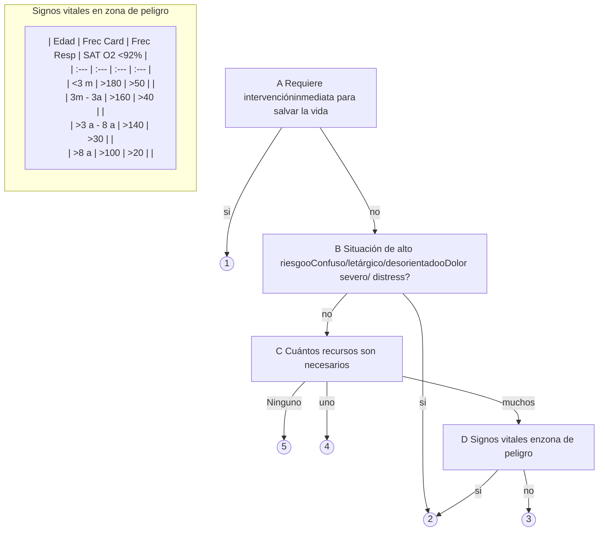
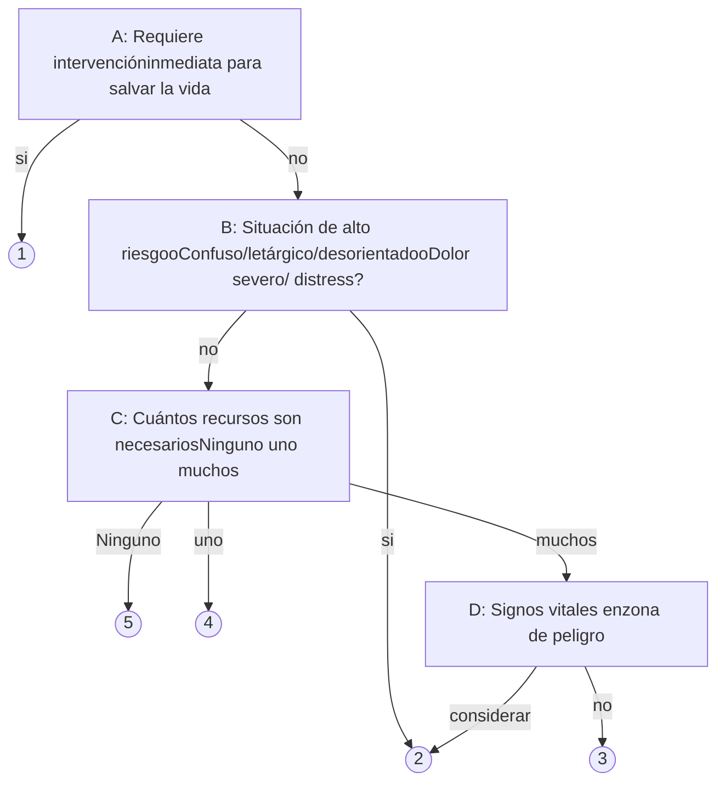

# PROT-CATEGORIZACION-DE-PACIENTES-EN-UNIDADES-DE-EMERGENCIA-2018

--- Página 1 ---

**Departamento de Asesoría Jurídica**
DRA.FNP/ATV/FSVVS
N°16/18

EXENTA N° 0141

SANTIAGO, 29 ENE. 2018

**VISTOS:** Correo electrónico de fecha 24 de enero del año 2018, del Departamento de Red de Urgencia - Gestión de Pacientes del Servicio de Salud Metropolitano Occidente, en el cual solicita al Departamento de Asesoría Jurídica formalizar protocolo Sistema de Categorización de Pacientes en Unidades de Emergencia Hospitalarias y Servicios de Atención Primaria de Alta Resolutividad Adulto - Infantil de esta Dirección de Servicio de Salud; y en uso de las atribuciones que me confiere el DFL. Nº1/2005, en virtud del cual se fija el texto refundido, coordinado y sistematizado del D.L. Nº2.763/79 y otras normas; lo contemplado en el artículo 9 del Decreto Supremo Nº140/04, Reglamento Orgánico de los Servicios de Salud, el Decreto Supremo Nº53 del 24 de marzo de 2015 que nombra al Director del Servicio de Salud Metropolitano Occidente, la Resolución Afecta Nº 6 de fecha 14 de septiembre 2016 por la cual se designa como Subdirectora Médica titular de este Servicio de Salud a la suscrita, el Decreto Exento Nº835 del 27/12/2013 que establece el orden de subrogancia del cargo de Director del Servicio de Salud Metropolitano Occidente, del Ministerio de Salud; y lo dispuesto por la Resolución Nº1600/2008 de la Contraloría General de la República y:

## CONSIDERANDO:

**1.-** Que, existe la necesidad del Servicio de Salud Metropolitano Occidente de Disponer de un sistema de selección de demanda estructurado para las unidades de emergencia (UEH) de los hospitales de Alta, mediana y baja complejidad del país, además de los servicios de atención primaria de Urgencia de Alta Resolutividad (SAR) que permita otorgar una atención de calidad y seguridad a los usuarios del sistema (internos y externos) a fin de clasificar y priorizar a los usuarios consultantes del Servicio de Urgencia en forma oportuna, rápida, confiable y de calidad, disminuyendo el riesgo de deterioro o inminente estado de salud.

**2.-** Que, el Departamento de Red de Urgencia Gestión de Pacientes del Servicio de Salud Metropolitano Occidente, solicita formalizar Protocolo de Sistema de Categorización de Pacientes en Unidades de Emergencia Hospitalarias y Servicios de Atención Primaria de Alta Resolutividad Adulto e Infantil elaborado con fecha 14 de octubre del año 2017 de esta Dirección de Servicio de Salud;

**3.-** Que, a objeto de lo expuesto, se formaliza protocolo señalado en el numeral anterior, a fin de estandarizar los criterios de clasificación con un sistema válido y confiable priorizando la atención médica a los pacientes pertenecientes a la Red del Servicio de Salud Metropolitano Occidente que presenten riesgo vital o alta complejidad ;

**4.-** Que, mediante éste acto administrativo se sanciona el citado Protocolo;

**5.-** Que, contando además con la conformidad de la suscrita, dicto la siguiente:

## RESOLUCIÓN

**1.- APRUÉBESE** Protocolo de Sistema de Categorización de Pacientes en Unidades de Emergencia Hospitalarias y Servicios de Atención Primaria de Alta Resolutividad Adulto e Infantil del Servicio de Salud Metropolitano Occidente, cuyo texto es el siguiente:

--- Página 2 ---

# SISTEMA DE CATEGORIZACIÓN DE PACIENTES EN UNIDADES DE EMERGENCIA HOSPITALARIAS Y SERVICIOS DE ATENCIÓN PRIMARIA DE ALTA RESOLUTIVIDAD

## ADULTO - INFANTIL

### SSMOC.

| Elaborado por:                                                                             | Revisado por:                                               | Aprobado por:                                                                       |
| ------------------------------------------------------------------------------------------ | ----------------------------------------------------------- | ----------------------------------------------------------------------------------- |
| Fidel Soto Badilla Jefe Dpto. Red de Urgencia y gestión de pacientes SSMOC         | Marisol Concha Jefe Dpto. Calidad y seguridad SSMOC | Dr. Vladimir Pizarro Director de Servicio de Salud Metropolitano Occidente. |
|                                                         |                          |                                                  |
| Fecha: / /                                                                                 | Firma:                                                      | Firma:                                                                              |
| María Jesús Valenzuela Coord. Dpto. Red de Urgencias y gestión de pacientes SSMOC. | Fecha: / /                                                  | Fecha: / /                                                                          |
|                                                         | Carmen Luz Nachar                                           |                                                                                     |
| Fecha: 24-01-2018                                                                          | Coord. Dpto. Calidad y seguridad SSMOC                  |                                                                                     |
| Germain Farias Cuevas Coord. Dpto. Red de Urgencias y gestión de pacientes SSMOC.  |                                                             |                                                                                     |
|                                                         | Firma:                                                      |                                                                                     |
| Fecha: 24/01/2018                                                                          | Fecha: / /                                                  |                                                                                     |

# ÍNDICE:

* Pág.
* Introducción: 3
* Objetivo General: 4
    - Objetivos Específicos:
* Alcance 4
* Responsables 4
* Definiciones 5
* Modelo De Categorización ESI: 6
* Procedimiento en UEH y SAR: 7-8-9
* Consideraciones Especiales: 9
* Bibliografía: 10
* Anexos: 11.

# INTRODUCCIÓN:

La estratificación de riesgo o triage cumple un rol clave en el funcionamiento de todo servicio de urgencia, su principal objetivo es clasificar y ordenar o categorizar a los pacientes de acuerdo a la gravedad antes de ser evaluados por un equipo médico.

En la actualidad, tanto en Chile como en el extranjero, las consultas a los servicios de urgencia han aumentado considerablemente y se estima que seguirán subiendo en los próximos años.

--- Página 3 ---

Los sistemas de triage son herramientas que permiten tomar decisiones complejas de manera estructurada, y así funcionar como un sistema de soporte a la decisión clínica ejercida por quien está cumpliendo la función en el selector de demanda del Servicio de Urgencia.

Por este motivo, el Ministerio de Salud Chileno en el mes de Diciembre del año 2015, inicia un plan piloto a nivel nacional con dos modelos de categorización:

a. Manchester Triage System. (M.T.S)
b. Emergency Severity Index (E.S.I)

Estos, fueron trabajados por equipos de urgencias durante el año 2016, y evaluados mediante una encuesta a los ejecutores de ambos modelos:

| 3. Del manejo del Triage:                                                               | MCHST. | ESI. |
| --------------------------------------------------------------------------------------- | ------ | ---- |
| Es objetivo                                                                             | 5,6    | 5,7  |
| Es rápido                                                                               | 5,4    | 6,1  |
| Permite priorizar al paciente en función de la gravedad                                 | 5,6    | 6,0  |
| Evita suposición diagnóstica                                                            | 5,8    | 5,3  |
| Los discriminadores son fáciles de usar                                                 | 5,9    | 5,9  |
| El sistema de categorización proporciona seguridad en la clasificación de los pacientes | 5,3    | 5,5  |
| Total evaluación                                                                        | 5.6    | 5.8  |

La concordancia inter-observador, en la aplicabilidad del modelo, demostró que ESI tiene un nivel de concordancia buena, con un índice de Kappa de 0.68, mientras que Manchester tiene una concordancia débil, con un puntaje de 0.37 en el kappa.

De acuerdo a lo anterior modelo a utilizar en las Unidades de Emergencia Hospitalarias en Chile es ESI.

ESI o Índice de Severidad de Emergencias es un modelo de categorización de cinco niveles de clasificación, basado en un algoritmo de triage fácil de utilizar, el que evalúa la gravedad del paciente al momento de la consulta y los recursos necesarios para su atención.

**OBJETIVO GENERAL:**

Disponer de un sistema de selección de demanda estructurado para las unidades de emergencia (UEH) de los hospitales de Alta, mediana y baja complejidad del país, además de los servicios de atención primaria de Urgencia de Alta resolutividad (SAR) que permita otorgar una atención de calidad y seguridad a los usuarios del sistema (internos y externos) a fin de clasificar y priorizar a los usuarios consultantes del Servicio de Urgencia en forma oportuna, rápida, confiable y de calidad, disminuyendo el riesgo de deterioro o inminente estado de salud.

**OBJETIVOS ESPECÍFICOS:**

* Estandarizar criterios de clasificación de pacientes en UEH con sistema válido y confiable.
* Identificar los pacientes según su gravedad al momento de la consulta en UEH.
* Priorizar atención médica a los pacientes que presenten riesgo vital o alta complejidad.
* Ordenar la demanda asistencial del servicio de urgencia con equidad y rapidez.
* Mejorar la efectividad del sistema de categorización.

--- Página 4 ---

**ALCANCE:**

Este documento aplica para el manejo de todo paciente que sea evaluado en los servicios de atención primarios de urgencia de alta resolutividad (SAR) y unidades de Emergencia Hospitalaria (UEH) pertenecientes al Servicio de Salud Metropolitano Occidente (SSMOC).

**RESPONSABLES:**

**De la actualización y formulación de documento:**

Departamento de Red de urgencia y gestión de pacientes SSMOC.

**De la supervisión del cumplimiento de este protocolo:**

Jefaturas de las Unidades de Emergencias Hospitalarias y Servicios de atención primaria de Alta resolutividad SAR.

**De la Monitorización del protocolo:**

Red de urgencia y gestión de pacientes SSMOC.
Jefatura de las UEH y SAR del SSMOC.

**DEFINICIONES:**

*   **SAR:** Establecimiento de Urgencia de atención primaria de alta resolutividad que dispone de exámenes radiológicos osteopulmonares, exámenes hematológicos y urinarios para dar respuesta a pacientes de mediana/alta complejidad.

*   **Unidad de Emergencia Hospitalaria (UEH):** Es la Unidad donde se concentran las facilidades físicas para la atención de pacientes niños y adultos que presentan urgencias médico quirúrgicas en forma individual, colectivas y atención masiva de pacientes en caso de desastres.

*   **Urgencia:** Condición que amenaza la vida del paciente y debe ser resuelta dentro de 24 horas.

*   **Emergencia:** Condición que amenaza la vida del paciente y debe ser resuelta de forma inmediata.

*   **ESI:** Modelo de categorización norteamericano, validado internacionalmente por su confiabilidad en la clasificación de los pacientes según su gravedad de urgencia/emergencia.

*   **MTS:** Modelo de categorización Ingles, su sigla significa Manchester Triage System. Este corresponde a uno de los modelos que participo en pilotaje nacional de categorización.

*   **Categorización:** Proceso que permite identificar rápidamente los pacientes, mediante un sistema de clasificación estandarizado, priorizado, valido y replicable.

*   **Consulta General:** Toda situación clínica de manifestación espontánea y/o prolongada capaz de generar sólo malestar y contrariedades generales en el paciente. Por la condición clínica asociada, tanto la asistencia médica como la indicación e inicio de tratamiento, debieran ser resueltas en la atención primaria, en forma ambulatoria sin condición de tiempo.

*   **Recurso:** Se entiende como recurso todas aquellas acciones, procedimientos, evaluaciones, exámenes, u otros extraordinarios, que son necesarias hasta disponer del paciente a otro sector (hospitalizado, traslado a otro establecimiento o dado de alta).

--- Página 5 ---

Ejemplo:
* Exámenes de laboratorio.
* Exámenes imagenología
* Interconsultas
* Curaciones complejas
* Administraciones endovenosas de soluciones.
* Otros.

**MODELO DE CATEGORIZACIÓN ESI:**

El ESI es un sistema de triage de cinco niveles que fue desarrollado y perfeccionado por médicos y enfermeros de emergencias en los Estados Unidos.
* Mediante investigaciones se ha demostrado que es confiable y válido.
* Es un sistema de calificación que mide el nivel de gravedad en el triage.
* No es un índice de carga de trabajo para el personal de enfermería de las UEH.

El Índice de Severidad de Emergencias (ESI) es un algoritmo de triage fácil de utilizar que consta de cinco niveles y con el que se caracteriza a los pacientes en los Servicios de Urgencias evaluando la severidad de la enfermedad del paciente y los recursos necesarios.
Este modelo posee 4 puntos de decisión para determinar el nivel de gravedad del paciente:

1. **Punto de decisión A:** Inicialmente, el enfermero de triage evalúa únicamente el nivel de gravedad determinando si se encuentra en una situación de emergencia vital o no. **(ESI 1)**

2. **Punto de decisión B:** Si un paciente **no cumple** con los criterios del primer nivel, el enfermero de triage evalúa al paciente si presenta condiciones de alto riesgo. **(ESI 2)**

3. **En el punto de decisión C:** se determina la cantidad de recursos necesarios previstos para ayudar a determinar un nivel de triage **(niveles 3, 4 y/o 5 del ESI).**

4. **En el punto de decisión D:** se realiza <u>control de signos vitales para evaluar necesidad de incrementar categoría de urgencia.</u>

El objetivo del ESI es que sea utilizado por enfermeros certificados en el modelo. La inclusión de los recursos necesarios en la clasificación de triage es una característica exclusiva del ESI que no tienen otros sistemas de triage. La gravedad se determina según la estabilidad de las funciones vitales y la posibilidad de que se vea amenazada la vida, una extremidad o un órgano. El enfermero de triage calcula los recursos necesarios basándose en su experiencia previa con pacientes que acuden con lesiones o dolencias similares. Los recursos necesarios se definen como la cantidad de acciones, procedimientos, exámenes evaluaciones que se prevé que consuma un paciente para poder tomar una decisión sobre su disposición (alta, ingreso o derivación). Una vez que el enfermero de triage esté familiarizado con el algoritmo, podrá clasificar a los pacientes de forma rápida y precisa en uno de cinco niveles explícitamente definidos y mutuamente exclusivos.

**PROCEDIMIENTO EN UEH Y SAR:**

| Personal Admisionista Actividad | Personal Admisionista Acciones a realizar                                   |
| ----------------------------------- | ------------------------------------------------------------------------------- |
| Motivo de consulta                  | Personal Administrativo del establecimiento registra en DAU motivo de consulta. |

--- Página 6 ---

| **Alertar a personal Clínico.** | Admisionista dará aviso de alerta a enfermero de selector de demanda cuando un paciente/familiar presente un estado de emergencia evidente en ventanilla. |
| ------------------------------- | --------------------------------------------------------------------------------------------------------------------------------------------------------- |

|             |                                                                                                                                                                                                                                                                                                                                                                                                                                                                                                                                                                                                                                                                                                                                                                                                                                                                                                                                                                                                                                                                                                                                                                                                                                                                                                                                                                                                                                                                                   |
| ----------- | --------------------------------------------------------------------------------------------------------------------------------------------------------------------------------------------------------------------------------------------------------------------------------------------------------------------------------------------------------------------------------------------------------------------------------------------------------------------------------------------------------------------------------------------------------------------------------------------------------------------------------------------------------------------------------------------------------------------------------------------------------------------------------------------------------------------------------------------------------------------------------------------------------------------------------------------------------------------------------------------------------------------------------------------------------------------------------------------------------------------------------------------------------------------------------------------------------------------------------------------------------------------------------------------------------------------------------------------------------------------------------------------------------------------------------------------------------------------------------- |
| Categorizar | Presentación personal por profesional de selector. Evalúa motivo de consulta. Se realiza anamnesis próxima y remota de paciente, evaluación de enfermería breve y registro de información en Dato de atención de Urgencia. **Aplicación del algoritmo ESI:** a. Paciente requiere medida de reanimación inmediata: considerado de riesgo vital, pasa directamente a sala de reanimación con médico b. Paciente somnoliento, confuso, letárgico, dolor >7, situación de alto riesgo es asignado al nivel 2 de ESI, sin necesidad de control de signos vitales para asignar categoría (realizar CSV a todo pacientes <3 años) De existir box disponible, este paciente ingresará de inmediato, dando aviso a médico de urgencias estado de pacientes y ubicación. c. Si el paciente no cumple con criterios del nivel uno o dos, se determina cantidad de recursos, asignando el nivel 3 si requiere más de 1 recurso, realizando control de signos vitales, que se encuentre dentro de rangos de seguridad. De lo contrario considerar ESI 2. d. Si ocupa 1 recurso se clasificará ESI 4 e. Si no ocupa recursos se clasificará nivel 5. Pacientes clasificados ESI 3,4 o 5, serán informados por enfermero/a la categorización obtenida, tiempo estimado de espera y deberán volver a sala de espera hasta el llamado del profesional médico. **El profesional médico no podrá modificar la categorización entregada por enfermero.** |

--- Página 7 ---

| Recategorización | Cumplido el tiempo determinado según gravedad al momento de la categorización, el profesional de enfermería deberá llamar nuevamente al paciente para re evaluación de su gravedad y asignar una nueva categoría de gravedad si la situación de urgencia lo amerita, de caso contrario, mantener nivel asignado inicialmente. |
| ---------------- | ----------------------------------------------------------------------------------------------------------------------------------------------------------------------------------------------------------------------------------------------------------------------------------------------------------------------------- |

| Actividad                     | Acciones a realizar:                                                                                                                                                                                                                                                                                                                                                                                                                                                                          |
| ----------------------------- | --------------------------------------------------------------------------------------------------------------------------------------------------------------------------------------------------------------------------------------------------------------------------------------------------------------------------------------------------------------------------------------------------------------------------------------------------------------------------------------------- |
| **Control de signos vitales** | Será el responsable de realizar la medición de signos vitales a todo aquel paciente que utilizara más de un recurso. Realizando medición de : \* Frecuencia cardiaca. \* Frecuencia respiratoria. \* Presión arterial \* Saturometría de oxigeno \* Temperatura. Alertará al enfermero del selector en presencia de signos vitales que estén fuera del rango de normalidad.  Realizará medición de signos vitales a todos los pacientes menores de tres años. |

<u>**CONSIDERACIONES ESPECIALES:**</u>

* Se priorizara la atención en las situaciones, sin desmedro de los pacientes que presenten mayor gravedad.
    - Personas adulto mayor (>65 años)
    - Usuarios escoltados por funcionarios de policía.
    - Victimas bajo sospecha de abuso sexual y/o violencia intrafamiliar.
    - Usuarios menores de 28 días de nacidos.

<u>**BIBLIOGRAFÍA:**</u>

* Sitio Web oficial de Emergency Severity Index, visitado el 08-10-2017.
<u>http://www.windrosemedia.com/portal/esi/course_screen.php?id=7</u>

* Red de Urgencia MINSAL 2015.
web.minsal.cl/sites/default/files/files/3_%20Red%20de%20Urgencia%202015.

--- Página 8 ---

# <u>ANEXOS:</u>

## <u>ALGORITMO ESI.</u>

**ANÓTESE Y COMUNÍQUESE.**

**<u>DISTRIBUCIÓN:</u>**
* Dirección SSMOCC
* Subdirección Médica.
* Distribución digital a los Establecimientos de la Red
* Red de Urgencia - Gestión de Pacientes.
* Depto. Calidad y Seguridad del Paciente
* DAP
* Depto. Finanzas.
* <mark>Depto. de Asesoría Jurídica.</mark>
* Of. de Partes.

--- Página 9 ---

# SISTEMA DE CATEGORIZACIÓN DE PACIENTES EN UNIDADES DE EMERGENCIA HOSPITALARIAS Y SERVICIOS DE ATENCIÓN PRIMARIA DE ALTA RESOLUTIVIDAD

## ADULTO – INFANTIL

## SSMOC.

| Elaborado por:                                                                                                                                                               | Revisado por:                                                                                                                               | Aprobado por:                                                                                                                                                  |
| ---------------------------------------------------------------------------------------------------------------------------------------------------------------------------- | ------------------------------------------------------------------------------------------------------------------------------------------- | -------------------------------------------------------------------------------------------------------------------------------------------------------------- |
| Fidel Soto Badilla Jefe Dpto. Red de Urgencia y gestión de pacientes SSMOC  Firma: \[signature] Fecha: / /                | Marisol Concha Jefe Dpto. Calidad y seguridad SSMOC  Firma: \[signature] Fecha: / /      | Dr. Vladimir Pizarro Director de Servicio de Salud Metropolitano Occidente.  Firma: \[signature] Fecha: / / |
| María Jesús Valenzuela Coord. Dpto. Red de Urgencias y gestión de pacientes SSMOC.  Firma: \[signature] Fecha: 24-01-2018 | Carmen Luz Kachar Coord. Dpto. Calidad y seguridad SSMOC  Firma: \[signature] Fecha: / / |                                                                                                                                                                |
| Germain Farias Cuevas Coord. Dpto. Red de Urgencias y gestión de pacientes SSMOC.  Firma: \[signature] Fecha: 24/01/2018  |                                                                                                                                             |                                                                                                                                                                |

OCTUBRE 2017

--- Página 10 ---

# ÍNDICE: Pag.

* Introducción: 3
* Objetivo General: 4
    * Objetivos Específicos:
* Alcance 4
* Responsables 4
* Definiciones 5
* Modelo De Categorización ESI: 6
* Procedimiento en UEH y SAR: 7-8 - 9
* Consideraciones Especiales: 9
* Bibliografía: 10
* Anexos: 11.

--- Página 11 ---

# INTRODUCCIÓN:

La estratificación de riesgo o triage cumple un rol clave en el funcionamiento de todo servicio de urgencia, su principal objetivo es clasificar y ordenar o categorizar a los pacientes de acuerdo a la gravedad antes de ser evaluados por un equipo médico.

En la actualidad, tanto en Chile como en el extranjero, las consultas a los servicios de urgencia han aumentado considerablemente y se estima que seguirán subiendo en los próximos años.

Los sistemas de triage son herramientas que permiten tomar decisiones complejas de manera estructurada, y así funcionar como un sistema de soporte a la decisión clínica ejercida por quien está cumpliendo la función en el selector de demanda del Servicio de Urgencia.

Por este motivo, el Ministerio de Salud Chileno en el mes de Diciembre del año 2015, inicia un plan piloto a nivel nacional con dos modelos de categorización:

a. Manchester Triage System. (M.T.S)

b. Emergency Severity Index (E.S.I)

Estos, fueron trabajados por equipos de urgencias durante el año 2016, y evaluados mediante una encuesta a los ejecutores de ambos modelos:

| 3. Del manejo del Triage                                                                | 3. Del manejo del Triage MCHST. | 3. Del manejo del Triage ESI. |
| --------------------------------------------------------------------------------------- | ----------------------------------- | --------------------------------- |
| Es objetivo                                                                             | 5,6                                 | 5,7                               |
| Es rápido                                                                               | 5,4                                 | 6,1                               |
| Permite priorizar al paciente en función de la gravedad                                 | 5,6                                 | 6,0                               |
| Evita suposición diagnóstica                                                            | 5,8                                 | 5,3                               |
| Los discriminadores son fáciles de usar                                                 | 5,9                                 | 5,9                               |
| El sistema de categorización proporciona seguridad en la clasificación de los pacientes | 5,3                                 | 5,5                               |
| Total evaluación                                                                        | 5.6                                 | 5.8                               |

La concordancia inter-observador, en la aplicabilidad del modelo, demostró que ESI tiene un nivel de concordancia buena, con un índice de Kappa de 0.68, mientras que Manchester tiene una concordancia débil, con un puntaje de 0.37 en el kappa.

De acuerdo a lo anterior modelo a utilizar en las Unidades de Emergencia Hospitalarias en Chile es ESI.

ESI o Índice de Severidad de Emergencias es un modelo de categorización de cinco niveles de clasificación, basado en un algoritmo de triage fácil de utilizar, el que evalúa la gravedad del paciente al momento de la consulta y los recursos necesarios para su atención.

--- Página 12 ---

|  | PROTOCOLO DE CATEGORIZACIÓN: ÍNDICE DE SEVERIDAD DE EMERGENCIAS (ESI) SERVICIO DE SALUD METROPOLITANO OCCIDENTE | FECHA DE ELABORACIÓN: 14-10-2017  Versión 1.0 Próxima revisión: 14-10-2021 | Código: 4 |
| --------------------------------------------------- | ------------------------------------------------------------------------------------------------------------------- | ---------------------------------------------------------------------------------------------- | --------- |

**OBJETIVO GENERAL:**

Disponer de un sistema de selección de demanda estructurado para las unidades de emergencia (UEH) de los hospitales de Alta, mediana y baja complejidad del país, además de los servicios de atención primaria de Urgencia de Alta resolutividad (SAR) que permita otorgar una atención de calidad y seguridad a los usuarios del sistema (internos y externos) a fin de clasificar y priorizar a los usuarios consultantes del Servicio de Urgencia en forma oportuna, rápida, confiable y de calidad, disminuyendo el riesgo de deterioro o inminente estado de salud.

**OBJETIVOS ESPECÍFICOS:**

* Estandarizar criterios de clasificación de pacientes en UEH con sistema válido y confiable.
* Identificar los pacientes según su gravedad al momento de la consulta en UEH.
* Priorizar atención médica a los pacientes que presenten riesgo vital o alta complejidad.
* Ordenar la demanda asistencial del servicio de urgencia con equidad y rapidez.
* Mejorar la efectividad del sistema de categorización.

**ALCANCE:**

Este documento aplica para el manejo de todo paciente que sea evaluado en los servicios de atención primarios de urgencia de alta resolutividad (SAR) y unidades de Emergencia Hospitalaria (UEH) pertenecientes al Servicio de Salud Metropolitano Occidente (SSMOC).

**RESPONSABLES:**

**De la actualización y formulación de documento:**

Departamento de Red de urgencia y gestión de pacientes SSMOC.

**De la supervisión del cumplimiento de este protocolo:**

Jefaturas de las Unidades de Emergencias Hospitalarias y Servicios de atención primaria de Alta resolutividad SAR.

**De la Monitorización del protocolo:**

Red de urgencia y gestión de pacientes SSMOC.

Jefatura de las UEH y SAR del SSMOC.

--- Página 13 ---

## DEFINICIONES:

* **SAR:** Establecimiento de Urgencia de atención primaria de alta resolutividad que dispone de exámenes radiológicos osteopulmonares, exámenes hematológicos y urinarios para dar respuesta a pacientes de mediana/alta complejidad.

* **Unidad de Emergencia Hospitalaria (UEH):** Es la Unidad donde se concentran las facilidades físicas para la atención de pacientes niños y adultos que presentan urgencias médico quirúrgicas en forma individual, colectivas y atención masiva de pacientes en caso de desastres.

* **Urgencia:** Condición que amenaza la vida del paciente y debe ser resuelta dentro de 24 horas.

* **Emergencia:** Condición que amenaza la vida del paciente y debe ser resuelta de forma inmediata.

* **ESI:** Modelo de categorización norteamericano, validado internacionalmente por su confiabilidad en la clasificación de los pacientes según su gravedad de urgencia/emergencia.

* **MTS:** Modelo de categorización Ingles, su sigla significa Manchester Triage System. Este corresponde a uno de los modelos que participo en pilotaje nacional de categorización.

* **Categorización:** Proceso que permite identificar rápidamente los pacientes, mediante un sistema de clasificación estandarizado, priorizado, valido y replicable.

* **Consulta General:** Toda situación clínica de manifestación espontánea y/o prolongada capaz de generar sólo malestar y contrariedades generales en el paciente. Por la condición clínica asociada, tanto la asistencia médica como la indicación e inicio de tratamiento, debieran ser resueltas en la atención primaria, en forma ambulatoria sin condición de tiempo.

* **Recurso:** Se entiende como recurso todas aquellas acciones, procedimientos, evaluaciones, exámenes, u otros extraordinarios, que son necesarias hasta disponer del paciente a otro sector (hospitalizado, traslado a otro establecimiento o dado de alta).

Ejemplo:

* Exámenes de laboratorio.
* Exámenes imagenología
* Interconsultas
* Curaciones complejas
* Administraciones endovenosas de soluciones.
* Otros.

--- Página 14 ---

<page_header>
FECHA DE ELABORACION: 14-10-2017
Versión 1.0
Próxima revisión: 14-10-2021
</page_header>

# MODELO DE CATEGORIZACIÓN ESI:

El ESI es un sistema de triage de cinco niveles que fue desarrollado y perfeccionado por médicos y enfermeros de emergencias en los Estados Unidos.

* Mediante investigaciones se ha demostrado que es confiable y válido.
* Es un sistema de calificación que mide el nivel de gravedad en el triage.
* No es un índice de carga de trabajo para el personal de enfermería de las UEH.

El Índice de Severidad de Emergencias (ESI) es un algoritmo de triage fácil de utilizar que consta de cinco niveles y con el que se caracteriza a los pacientes en los Servicios de Urgencias evaluando la severidad de la enfermedad del paciente y los recursos necesarios. Este modelo posee 4 puntos de decisión para determinar el nivel de gravedad del paciente:

1. **Punto de decisión A:** Inicialmente, el enfermero de triage evalúa únicamente el nivel de gravedad determinando si se encuentra en una situación de emergencia vital o no. **(ESI 1)**

2. **Punto de decisión B:** Si un paciente **no cumple** con los criterios del primer nivel, el enfermero de triage evalúa al paciente si presenta condiciones de alto riesgo. **(ESI 2)**

3. **En el punto de decisión C:** se determina la cantidad de recursos necesarios previstos para ayudar a determinar un nivel de triage **(niveles 3, 4 y/o 5 del ESI).**

4. **En el punto de decisión D:** se realiza <u>control de signos vitales para evaluar necesidad de incrementar categoría de urgencia.</u>

El objetivo del ESI es que sea utilizado por enfermeros certificados en el modelo. La inclusión de los recursos necesarios en la clasificación de triage es una característica exclusiva del ESI que no tienen otros sistemas de triage. La gravedad se determina según la estabilidad de las funciones vitales y la posibilidad de que se vea amenazada la vida, una extremidad o un órgano. El enfermero de triage calcula los recursos necesarios basándose en su experiencia previa con pacientes que acuden con lesiones o dolencias similares. Los recursos necesarios se definen como la cantidad de acciones, procedimientos, exámenes evaluaciones que se prevé que consuma un paciente para poder tomar una decisión sobre su disposición (alta, ingreso o derivación). Una vez que el enfermero de triage esté familiarizado con el algoritmo, podrá clasificar a los pacientes de forma rápida y precisa en uno de cinco niveles explícitamente definidos y mutuamente exclusivos.

--- Página 15 ---

# PROTOCOLO DE CATEGORIZACIÓN: ÍNDICE DE SEVERIDAD DE EMERGENCIAS (ESI)
# SERVICIO DE SALUD METROPOLITANO OCCIDENTE

## <u>PROCEDIMIENTO EN UEH Y SAR:</u>

| Personal Admisionista Actividad | Personal Admisionista Acciones a realizar                                                                                                             |
| ----------------------------------- | --------------------------------------------------------------------------------------------------------------------------------------------------------- |
| Motivo de consulta                  | Personal Administrativo del establecimiento registra en DAU motivo de consulta.                                                                           |
| Alertar a personal Clínico.         | Admisionista dará aviso de alerta a enfermero de selector de demanda cuando un paciente/familiar presente un estado de emergencia evidente en ventanilla. |

| Personal Clínico Profesional Enfermero/a Actividad | Personal Clínico Profesional Enfermero/a Acciones a realizar                                                                                                                                                                                                                                                                                                                                                                                                                                                                                                                                                                                                                                                                                                                                                                                                                                                                                                                                                                                                                                                                                                            |
| ------------------------------------------------------ | --------------------------------------------------------------------------------------------------------------------------------------------------------------------------------------------------------------------------------------------------------------------------------------------------------------------------------------------------------------------------------------------------------------------------------------------------------------------------------------------------------------------------------------------------------------------------------------------------------------------------------------------------------------------------------------------------------------------------------------------------------------------------------------------------------------------------------------------------------------------------------------------------------------------------------------------------------------------------------------------------------------------------------------------------------------------------------------------------------------------------------------------------------------------------- |
| Categorizar                                            | Presentación personal por profesional de selector. Evalúa motivo de consulta. Se realiza anamnesis próxima y remota de paciente, evaluación de enfermería breve y registro de información en Dato de atención de Urgencia. **Aplicación del algoritmo ESI:** a. Paciente requiere medida de reanimación inmediata: considerado de riesgo vital, pasa directamente a sala de reanimación con médico b. Paciente somnoliento, confuso, letárgico, dolor >7, situación de alto riesgo es asignado al nivel 2 de ESI, sin necesidad de control de signos vitales para asignar categoría (realizar CSV a todo pacientes <3 años) De existir box disponible, este paciente ingresará de inmediato, dando aviso a médico de urgencias estado de pacientes y ubicación. c. Si el paciente no cumple con criterios del nivel uno o dos, se determina cantidad de recursos, asignando el nivel 3 si requiere más de 1 recurso, realizando control de signos vitales, que se encuentre dentro de rangos de seguridad. De lo contrario considerar ESI 2. d. Si ocupa 1 recurso se clasificará ESI 4 e. Si no ocupa recursos se clasificará nivel 5. |

--- Página 16 ---

# PROTOCOLO DE CATEGORIZACIÓN: ÍNDICE DE SEVERIDAD DE EMERGENCIAS (ESI)
## SERVICIO DE SALUD METROPOLITANO OCCIDENTE

FECHA DE ELABORACIÓN: 14-10-2017
Versión 1.0
Próxima revisión: 14-10-2021

|                      | Pacientes clasificados ESI 3,4 o 5, serán informados por enfermero/a la categorización obtenida, tiempo estimado de espera y deberán volver a sala de espera hasta el llamado del profesional médico. **El profesional médico no podrá modificar la categorización entregada por enfermero.**                                                                                                                                                                               |
| -------------------- | ------------------------------------------------------------------------------------------------------------------------------------------------------------------------------------------------------------------------------------------------------------------------------------------------------------------------------------------------------------------------------------------------------------------------------------------------------------------------------- |
| **Recategorización** | Cumplido el tiempo determinado según gravedad al momento de la categorización, el profesional de enfermería deberá llamar nuevamente al paciente para re evaluación de su gravedad y asignar una nueva categoría de gravedad si la situación de urgencia lo amerita, de caso contrario, mantener nivel asignado inicialmente. ESI 2: tiempo de espera 30 min. ESI 3: tiempo de espera 90 min. ESI 4: tiempo de espera 120 min. ESI 5: tiempo de espera 180 min. |

# Personal Clínico: Técnico en Enfermería

| Actividad                     | Acciones a realizar:                                                                                                                                                                                                                                                                                                                                                                                                                                                                         |
| ----------------------------- | -------------------------------------------------------------------------------------------------------------------------------------------------------------------------------------------------------------------------------------------------------------------------------------------------------------------------------------------------------------------------------------------------------------------------------------------------------------------------------------------- |
| **Control de signos vitales** | Será el responsable de realizar la medición de signos vitales a todo aquel paciente que utilizara más de un recurso. Realizando medición de : \* Frecuencia cardiaca. \* Frecuencia respiratoria. \* Presión arterial \* Saturometría de oxigeno \* Temperatura. Alertará al enfermero del selector en presencia de signos vitales que estén fuera del rango de normalidad. Realizará medición de signos vitales a todos los pacientes menores de tres años. |

--- Página 17 ---

# PROTOCÓLO DE CATEGORIZACIÓN: ÍNDICE DE SEVERIDAD DE EMERGENCIAS (ESI)
# SERVICIO DE SALUD METROPOLITANO OCCIDENTE

FECHA DE ELABORACIÓN: ~~14-10-2017~~

Versión: 1.0
Próxima revisión:
14-10-2021

## <u>CONSIDERACIONES ESPECIALES:</u>

* Se priorizara la atención en las situaciones, sin desmedro de los pacientes que presenten mayor gravedad.
    - Personas adulto mayor (>65 años)
    - Usuarios escoltados por funcionarios de policía.
    - Victimas bajo sospecha de abuso sexual y/o violencia intrafamiliar.
    - Usuarios menores de 28 días de nacidos.

--- Página 18 ---

# PROTOCOLO DE CATEGORIZACIÓN: ÍNDICE DE SEVERIDAD DE EMERGENCIAS (ESI)
SERVICIO DE SALUD METROPOLITANO OCCIDENTE

FECHA DE ELABORACIÓN: 14-10-2017
Versión: 1.0
Próxima revisión: 14-10-2021

# <u>BIBLIOGRAFÍA:</u>

* Sitio Web oficial de Emergency Severity Index, visitado el 08-10-2017.

<u>http://www.windrosemedia.com/portal/esi/course_screen.php?id=7</u>

\* Red de Urgencia MINSAL 2015.

web.minsal.cl/sites/default/files/files/3_%20Red%20de%20Urgencia%202015.doc

--- Página 19 ---

# ANEXOS:

## ALGORITMO ESI.

### Signos vitales en zona de peligro

| Edad      | Frec Card | Frec Resp | SAT O2 <92% |
| --------- | --------- | --------- | ----------- |
| <3 m      | >180      | >50       |             |
| 3m - 3a   | >160      | >40       |             |
| 3 a - 8 a | >140      | >30       |             |
| 8 a       | >100      | >20       |             |

