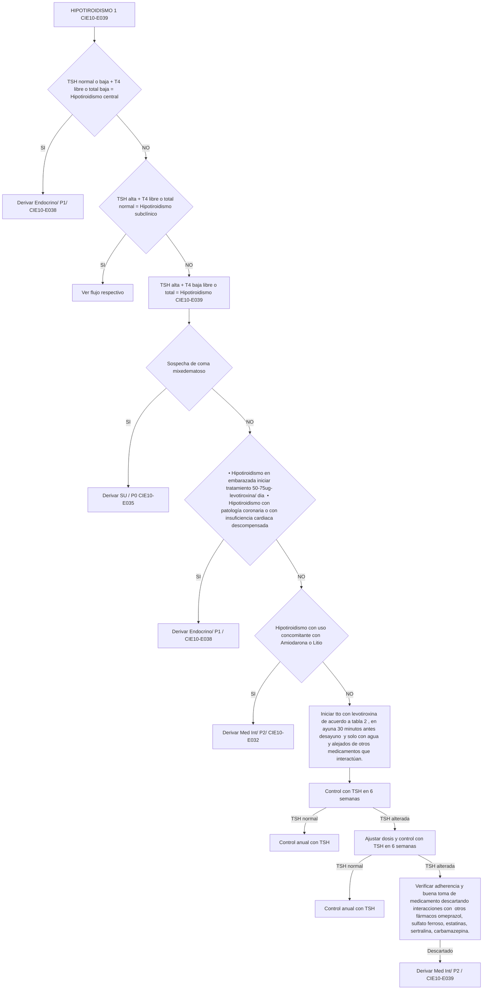
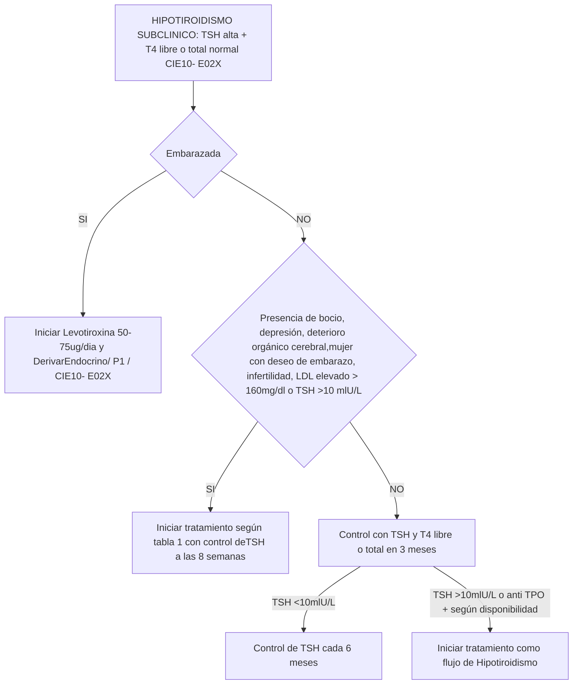
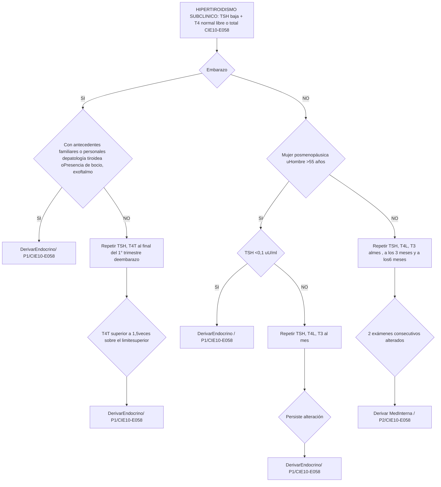
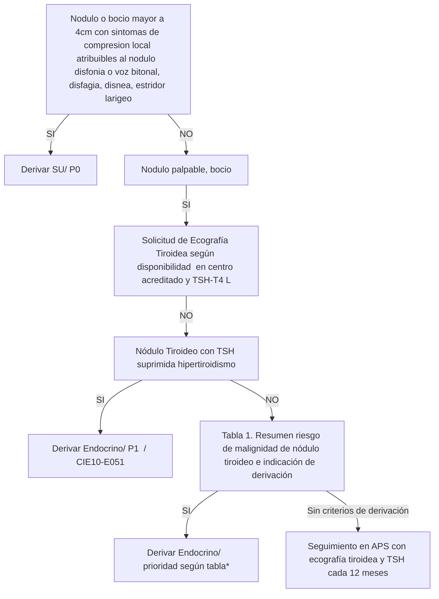

# PROT-ENDOCRINO-ADULTO-V.2-2019-2

--- Página 1 ---

# PROTOCOLOS CLÍNICOS DE DERIVACIÓN Y PRIORIZACIÓN.

## DE LA RED DELSERVICIO DE SALUD METROPOLITANO OCCIDENTE

### POBLACION ADULTA

### ESPECIALIDAD: ENDOCRINOLOGÍA

**Versión: 2.0**
**Resolución Exenta N°: 2568**
**Fecha de Emisión: Noviembre 2019**

--- Página 2 ---

## Objetivo General:

Los flujogramas clínicos tienen como objetivo ser una fuente de información para los profesionales de la salud, orientado a facilitar la toma de decisiones respecto al abordaje inicial del paciente, entregando recomendaciones que permitan realizar un diagnóstico precoz, una derivación pertinente y oportuna hacia el nivel secundario de atención (no reemplaza el criterio clínico del médico tratante), mejorando con ello la continuidad asistencial de los usuarios pertenecientes a la red asistencial del Servicio de Salud Metropolitano Occidente.

## Objetivos Específicos:

- Definir las características y la oportunidad en que un determinado paciente con una patología debe ser evaluado y manejado por el médico no especialista, disminuyendo la variabilidad de la atención, proporcionando un marco común de actuación.
- Establecer un flujograma desde la evaluación clínica, con apoyo de exámenes complementarios y resolución de los pacientes.
- Homologar los códigos CIE-10 a las patologías que por diagnóstico son pertinentes de derivar, aumentando la precisión diagnóstica y con ello su seguimiento y respectiva priorización.
- Entregar criterios estandarizados de referencia y priorización a los equipos de salud de la red del SSMOcc con el fin de mejorar la pertinencia y oportunidad de atención en el nivel secundario de la red asistencial.
- Determinar el conjunto mínimo de datos y exámenes que se deben registrar en la interconsulta y que respaldan el motivo de la derivación al nivel secundario de atención.

Este documento es producto de la colaboración de profesionales de todos los Niveles de Atención de Salud de la Red Metropolitana Occidente, contribuyendo de este modo al Modelo de Redes Integradas de Servicios de Salud basadas en la Atención Primaria.

**Alcance:** Profesionales del área de la salud pertenecientes a la Red Asistencial Metropolitano Occidente

<page_number>2</page_number>

--- Página 3 ---

## DEFINICIONES

**Código CIE-10:** “Clasificación Estadística Internacional de Enfermedades y Problemas Relacionados con la Salud”. En este documento se unifican los códigos CIE-10 de los diagnósticos pertinentes de derivar hacia el nivel secundario. Los que se detallan por cada patología en ella contenida.

**Definición de Pertinencia** : Se entiende por consulta pertinente aquellas derivaciones nuevas originadas en la atención primaria que cumple con los documentos de referencia que resguardan el nivel de atención bajo el cual el paciente debe resolver su problema de salud, siendo el motivo de derivación factible de solucionar en el nivel de atención al que se deriva.

**Definición de No pertinencia** : Corresponde a la identificación de una interconsulta que no cumple con los protocolos clínicos de derivación validados y que resguardan el nivel de atención bajo el cual el paciente debe ser resuelto, siendo el motivo de derivación factible de solucionar en la Atención Primaria de Salud donde el paciente debe ser reevaluado.

**Definición de Prioridad:** nivel de preferencia con el cual debe ser resuelto un problema de salud en el establecimiento al cual fue referido. Se establece categorías de priorización con tiempos de resolución sugeridos.

- Prioridad 0 (P0): son aquellas interconsultas por patologías que deben ser derivadas directamente al servicio de urgencia con eventual hospitalización de acuerdo a evaluación
- Prioridad 1 (P1): alta prioridad cuya patología reviste urgencia relativa, es decir, no puede esperar oferta de cupos, pero a su vez no presenta riesgo vital inmediato que amerite una derivación al servicio de urgencia. Esta derivación requiere una coordinación directa entre el nivel primario y el establecimiento de destino. Se sugiere que el tiempo de atención por el especialista sea antes de 30 días.
- Prioridad 2 (P2): prioridad normal. Interconsulta ingresa al sistema informático respectivo, a la espera que se le asigne un cupo de atención de acuerdo a la oferta disponible. Se sugiere que el tiempo de atención por el especialista sea antes de 6 meses.

Los exámenes descritos en los flujogramas como “según disponibilidad” quedan sujetos a la disponibilidad existente en cada centro de salud y/o posibilidad de ser realizado por el paciente. Cuando no se dispone del recurso se sugiere derivar directamente.

3

--- Página 4 ---

ELABORADO POR:

| NOMBRE                                | CARGO                         | ESTABLECIMIENTO                  |
| ------------------------------------- | ----------------------------- | -------------------------------- |
| Dr. Félix Vásquez                     | Especialista Endocrino        | Hospital San Juan de Dios        |
| Dra. Paola Hernández                  | Especialista Endocrino        | Hospital San Juan de Dios        |
| Dra. Carolina Guzmán                  | Especialista Endocrino        | Hospital San Juan de Dios        |
| Dra. Erika Diaz                       | Especialista Endocrino        | Hospital San Juan de Dios        |
| Dr. Marcelo Mardones                  | Especialista Endocrino        | Hospital San Juan de Dios        |
| Dra. Carolina Llana                   | Especialista Medicina Interna | Hospital Melipilla               |
| Dra. Raquel Rivera                    | Especialista Medicina Interna | Hospital Talagante               |
| EU. Daniela Andrade                   | Enfermera Supervisora CAAE    | Hospital Félix Bulnes            |
| Dra. Alicia Canales                   | Subdirección Medica           | CRS Salvador Allende             |
| Dr. Javier Deneken                    | Médico Gestor Medicina        | CRS Salvador Allende             |
| Valery Palma                          | Jefe SOME                     | CESFAM Adriana Madrid            |
| Dra. Valentina Pooley M.              | Médico Contralor              | CESFAM Adriana Madrid            |
| Dr. Reyad Khalil El Nagar             | Médico Contralor              | Consultorio Pudahuel Poniente    |
| Dra. Anita Sanhueza V.                | Médico Contralor              | Consultorio Sta Anita            |
| Dr. Oscar Rosales B.                  | Médico Contralor              | CESFAM Yazigi                    |
| Dra. Paz Manosalva Pérez              | Médico Contralor              | CESFAM Pablo Neruda              |
| Dra. Francisca Meza                   | Médico Contralor              | Hospital de Curacaví             |
| Dr. Galo Ortega                       | Médico Contralor              | CESFAM Andes                     |
| Dr. Daniel Hernández Cáceres          | Médico Contralor              | Centro General rural Villa Alhué |
| Catalina Aguayo                       | Jefe SOME                     | Centro General rural Villa Alhué |
| Dr. Ulbio Raúl Castro Limones         | Médico Contralor              | CESFAM Boris Soler               |
| Dr. Carlos Cordero                    | Médico Contralor              | CESFAM San Manuel                |
| Dra. Eliana Amunategui B.             | Médico Contralor              | CESFAM Dr. Elgueta               |
| Claudia Monsalve                      | Jefe SOME                     | CESFAM Dr. Elgueta               |
| Dr. Alejandro Carreño                 | Médico Contralor              | CESFAM Dr. Elgueta               |
| Dra. Nasly Guacaneme                  | Médico Contralor              | Posta Bollenar                   |
| Dr. Marco Gamboa A.                   | Médico Contralor              | CESFAM Garin                     |
| Dra. Maureen Wachtendorff Salinas | Médico Contralor              | CESFAM Garin                     |
| Dr. Cristian Balladares               | Médico Contralor              | CESFAM Lo Franco                 |

--- Página 5 ---

ELABORADO POR:

| NOMBRE                        | CARGO                                                                                                 | ESTABLECIMIENTO                            |
| ----------------------------- | ----------------------------------------------------------------------------------------------------- | ------------------------------------------ |
| Dra. Ondina Narváez           | Médico Contralor                                                                                      | CESFAM Albertz                             |
| Dr. Pablo Chacana M.          | Médico Contralor                                                                                      | CESFAM Lo Amor                             |
| Dra. Sandra Ballesteros J.    | Médico Contralor                                                                                      | CESFAM Cerro Navia 4                       |
| Dr. Andres Garrido G.         | Médico Contralor                                                                                      | CESFAM Steeger                             |
| Dr. Álvaro Vergara F.         | Médico Contralor                                                                                      | Consultorio Renca                          |
| Dra. Maria Gabriela Antúnez R | Médico Contralor                                                                                      | Consultorio Bicentenario                   |
| Dra. Lucia Larraín Soler      | Médico Contralor                                                                                      | Consultorio Dr. Hernán Urzúa Merino    |
| Ana Rojas Quezada             | Digitadora                                                                                            | Consultorio Dr. Hernán Urzúa Merino    |
| Dr. Felipe Rice J             | Médico Contralor                                                                                      | CESFAM El Monte                            |
| Dra. Susy Yagual Hidalgo      | Médico Contralor                                                                                      | CESFAM Isla de Maipo                       |
| Dra. Sigrid Pou Salvi         | Médico Contralor                                                                                      | CESFAM Juan Pablo II                       |
| Dr. Juan Villalobos           | Médico Contralor                                                                                      | CESFAM Peñaflor                            |
| Dr. Vicente Moreira M.        | Médico Contralor                                                                                      | CESFAM Monkeberg                           |
| Dr. Ricardo Malta Melo        | Médico Contralor                                                                                      | CESFAM Dr. Alberto Allende Jones       |
| Yesi Negrete                  | Jefe SOME                                                                                             | Consultorio Pudahuel Poniente              |
| Sandra Contreras              | Administrativa                                                                                        | Posta Pahuilmo                             |
| Dra. Mirza Retamal            | Médico Referente Modelo Referencia y Contrareferencia. Subdirección APS                           | Servicio Salud Metropolitano Occidente |
| QF. Loreto González           | QF. Referente Modelo Referencia y Contrareferencia. Subdirección APS                              | Servicio Salud Metropolitano Occidente |
| Dra. Maria Jose Maureira      | Médico Referente Modelo Referencia y Contrareferencia. Departamento de Coordinación de la Red | Servicio Salud Metropolitano Occidente |

--- Página 6 ---

REVISADO POR:

| NOMBRE                            | CARGO                                                                                             | ESTABLECIMIENTO                                   |
| --------------------------------- | ------------------------------------------------------------------------------------------------- | ------------------------------------------------- |
| Dr Carlos Gallardo                | Jefe Departamento de Coordinación de la Red                                                       | Servicio de Salud Metropolitano Occidente |
| QF. Roxana Arias.                 | Jefe Departamento de Estadísticas y Gestión de la Información. SSMOCC                         | Servicio de Salud Metropolitano Occidente     |
| T.O. María Paz Iturriaga Lisbona. | Directora Subdirección de Atención Primaria SSMOCC                                            | Servicio de Salud Metropolitano Occidente     |
| Lya Reyes                         | Subdirectora Atención Ambulatoria. Referente Modelo de Referencia y Contra referencia         | Hospital San Juan de Dios                         |
| Dra. Lorena Arrue                 | Referente Modelo de Referencia y Contra referencia                                                | Hospital Félix Bulnes                             |
| EU. Daniela Andrade               | Enfermera Supervisora Atención Ambulatoria Referente Modelo de Referencia y Contra referencia | Hospital Félix Bulnes                             |
| Cecilia Elgueta                   | Sub jefe CAE Referente Modelo de Referencia y Contra referencia                               | Hospital San José de Melipilla                    |
| Odont. Claudio Miranda            | Referente Modelo de Referencia y Contra referencia                                                | Hospital de Talagante                             |
| Dra Alicia Canales                | Subdirectora Médica                                                                               | CRS Dr. Salvador Allende                          |

AUTORIZADO POR:

| NOMBRE                | CARGO                                              | ESTABLECIMIENTO                               |
| --------------------- | -------------------------------------------------- | --------------------------------------------- |
| Dr. Rodrigo Riffo     | Director de la Subdirección de gestión Asistencial | Servicio de Salud Metropolitano Occidente |
| Dr. Francisco Miranda | Director                                           | Servicio Salud Metropolitano Occidente    |

COORDINADOR Y ENCARGADO RESPONSABLE:

| NOMBRE                            | CARGO                                                                                                | ESTABLECIMIENTO                            |
| --------------------------------- | ---------------------------------------------------------------------------------------------------- | ------------------------------------------ |
| Dra. Maria Jose Maureira Maureira | Asesor Departamento de Coordinación de la Red Referente Modelo de Referencia y Contra referencia | Servicio Salud Metropolitano Occidente |

**Validado en el Consejo Integrador de la Red Asistencial (CIRA) del SSMOcc realizado el 22 de Agosto 2019**

--- Página 7 ---

## UNIDAD DIAGNOSTICA

1. HIPOTIROIDISMO

2. HIPOTIROIDISMO SUBCLINICO

3. HIPERTIROIDISMO (TIROTOXICOSIS)

4. HIPERTIROIDISMO SUBCLINICO

5. NODULO TIROIDEO

7

--- Página 8 ---

# TABLA CONSOLIDADA. ESPECIALIDAD ENDOCRINO

| Nº | Diagnóstico de Derivación (Código CIE-10)                                                                                                               | Criterios Derivación                                                                                                                               | Especialidad Destino (considerar mapa de derivación respetivo) | Prioridad |
| -- | ------------------------------------------------------------------------------------------------------------------------------------------------------- | -------------------------------------------------------------------------------------------------------------------------------------------------- | -------------------------------------------------------------- | --------- |
| 1  | Hipotiroidismo (E038, otros hipotiroidismos especificados)                                                                                              | Hipotiroidismo en embarazada Sospecha de origen central Hipotiroidismo no compensado con patología coronaria o con insuficiencia cardiaca. | Endocrino                                                      | P1        |
| 2  | Hipotiroidismo secundario a resección de la glándula tiroides por antecedente de Cáncer de Tiroides (E890, hipotiroidismo consecutivo a procedimientos) | Antecedente clínico de haberse operado de cáncer de tiroides en un periodo mayor de 6 meses                                                        | Endocrino                                                      | P2        |
| 3  | Hipotiroidismo (E032, hipotiroidismo debido a medicamentos y a otras sustancias exógenas)                                                               | Hipotiroidismo con uso concomitante con Amiodarona o Litio de reciente comienzo                                                                    | Med Interna                                                    | P2        |
| 4  | Hipotiroidismo (E039, hipotiroidismo no especificado)                                                                                                   | Mantención de TSH elevado en 2 controles pese a terapia adecuada (uso correcto del medicamento y adherencia)                                       | Med Interna                                                    | P2        |
| 5  | Hipotiroidismo subclínico (E02X, hipotiroidismo subclínico por deficiencia de yodo)                                                                     | Embarazada                                                                                                                                         | Endocrino                                                      | P1        |
| 6  | Coma mixedematoso (E035, coma mixematoso)                                                                                                               | Sospecha fundada                                                                                                                                   | Servicio Urgencia                                              | P0        |
| 7  | Crisis o tormenta tirotoxica (E055, crisis o tormenta tirotoxica)                                                                                       | Sospecha fundada                                                                                                                                   | Servicio Urgencia                                              | P0        |
| 8  | Tiroiditis aguda (E060, tiroiditis aguda)                                                                                                               | Sospecha fundada                                                                                                                                   | Servicio Urgencia                                              | P0        |
| 9  | Tiroiditis subaguda (E061, tiroiditis subaguda)                                                                                                         | Con persistencia clínica a los 30 días desde los síntomas                                                                                          | Medicina Interna                                               | P1        |
| 10 | Hipertiroidismo (E059, tirotoxicosis no especificada)                                                                                                   | Sospecha fundada                                                                                                                                   | Endocrino                                                      | P1        |
| 11 | Hipertiroidismo subclínico (E058, otras tirotoxicosis)                                                                                                  | Embarazo o Mujer posmenopáusica u hombre >55 años                                                                                              | Endocrino                                                      | P1        |
|    |                                                                                                                                                         | Otras edades con persistencia de dos exámenes consecutivos alterados                                                                               | Medicina Interna                                               | P2        |

Prioridad 0: Derivación al Servicio de Urgencia

Prioridad 1: Evaluación por Nivel Secundario, se sugiere antes de 30 días. Coordinación directa entre profesional contralor APS y establecimiento de destino.

Prioridad 2: Evaluación por Nivel Secundario, se sugiere antes de 6 meses.

--- Página 9 ---

# TABLA CONSOLIDADA ESPECIALIDAD ENDOCRINO

| Nº | Diagnóstico de Derivación (Código CIE-10)                                                                       | Criterios Derivación                                                                       | Especialidad Destino(considerar mapa de derivación respetivo) | Prioridad           |
| -- | --------------------------------------------------------------------------------------------------------------- | ------------------------------------------------------------------------------------------ | ------------------------------------------------------------- | ------------------- |
| 12 | Tumor maligno de la glándula tiroides (C73X, tumor maligno de la glándula tiroides)                             | Con biopsia positiva o con antecedente previo de cáncer de tiroides en los últimos 6 meses | Endocrino                                                     | P1                  |
| 13 | Nódulo Tiroideo (E041, nódulo tiroideo solitario no toxico)                                                     | Según flujo y tabla respectiva                                                             | Endocrino                                                     | P1 o P2 según tabla |
| 14 | Tumor de Glándula Suprarrenal (D441, tumor de comportamiento incierto o desconocido de la glándula suprarrenal) | Con síndromes clínicos asociados (HTA refractaria, síndrome de Cushing)                    | Endocrino                                                     | P1                  |
|    |                                                                                                                 | Asintomático, incidentaloma                                                                | Endocrino                                                     | P2                  |

**Prioridad 0**: Derivación al Servicio de Urgencia

**Prioridad 1**: Evaluación por Nivel Secundario, se sugiere antes de 30 días. Coordinación directa entre profesional contralor APS y establecimiento de destino.

**Prioridad 2**: Evaluación por Nivel Secundario, se sugiere antes de 6 meses.

--- Página 10 ---

# HIPOTIROIDISMO (1) (CIE10-E039)

(1) **Screning de Hipotiroidismo**: Bocio, depresión, deterioro organico cerebral, mujer con deseo de embarazo, infertilidad / LDL elevado (mayor a 160-190mg/dl), macrocitosis, hiponatremia, HTA diastólica o refractaria

## (2) INDICACION DE TRATAMIENTO

| Rango TSH            | < 75 años      | >= 75 años  |
| -------------------- | -------------- | ----------- |
| <10 uU/ml            | 25-50 ug       | 25-50ug/dia |
| 10-20uU/ml           | 50-100 ug      |             |
| 20 uU/ml             | 1-1,6ug/kg/dia |             |
| Objetivo terapeutico | 1-3 uU1/ml     | 3-6uU1/ml   |

**Derivar con registro de exámenes TSH, T4, tratamiento indicado y correcta adherencia a tratamiento farmacológico**

<page_footer>
SERVICIO SALUD OCCIDENTE
</page_footer>

--- Página 11 ---

# HIPOTIROIDISMO SUBCLINICO: TSH alta + T4 (libre o total) normal (CIE10- E02X)

## (1) INDICACION DE TRATAMIENTO

| Rango TSH            | < 75 años      | >=75 años   |
| -------------------- | -------------- | ----------- |
| <10 uU/ml            | 25-50 ug       | 25-50ug/dia |
| 10-20uU/ml           | 50-100 ug      |             |
| 20 uU/ml             | 1-1,6ug/kg/dia |             |
| Objetivo terapeutico | 1-3 uU1/ml     | 3-6uU1/ml   |

**Derivar con registro de exámenes TSH, T4, tratamiento indicado y correcta adherencia a tratamiento farmacológico**

--- Página 12 ---

# HIPERTIROIDISMO (CIE10-E059)

TSH baja + T4 (libre o total) normal = Hipertiroidismo subclínico $\rightarrow$  Ver Flujo respectivo

NO

TSH baja + T4 (libre o total) alta = Hipertiroidismo (CIE10-E059)

SI

**Embarazo**  SI $\rightarrow$  Derivar Endocrino P1/ CIE10-E059

NO

**Sospecha de Tiroiditis AGUDA (causa bacteriana):** dolor a la palpación tiroidea con signos inflamatorios, fiebre, compromiso estado general, síntomas de hipertiroidismo  SI $\rightarrow$  Derivar SU/ PO/ CIE10-E060

NO

**Sospecha de Tiroiditis sub aguda (causa viral):**
Dolor a la palpación tiroidea +- fiebre, síntomas de hipertiroidismo
Hemograma: leucocitosis, VHS elevada.

SI $\rightarrow$  AINES por 7 días + Propanolol (descartar contraindicación)

$\downarrow$ Control a los 7 días

**Persiste clínica**  SI $\rightarrow$  Derivar Med Int/ P1/CIE10-E061

NO

$\downarrow$ Controlar TSH-T4L en 30 días desde el control anterior, en el cual se esperaría encontrar un hipotiroidismo, en caso de este ultimo NO iniciar levotiroxina

NO

$\downarrow$ Controlar TSH-T4L cada 3meses.

Si no hay normalización de TSH al cabo de 1 año y persiste hipotiroidismo con TSH >10 uU/ml = tratar como hipotiroidismo/ TSH entre 5-10uU/ml = ver flujo de hipotiroidismo subclínico

**Sospecha de Hipertiroidismo (Enf Graves/ Bocio Multinodular toxico/Nódulo toxico)**  SI $\rightarrow$ * **Indicar Propanolol** si no hay CI
* Suspender ejercicio
* Si es mujer en edad fértil recomendar ACO

$\rightarrow$  Derivar Endocrino/ P1/

**Derivar con registro de exámenes TSH, T4, hemograma, GOT, GPT, FA, GGT**

--- Página 13 ---

# HIPERTIROIDISMO SUBCLINICO: TSH baja + T4 normal (libre o total) (CIE10-E058)

<mark>Derivar con registro de exámenes TSH, T4, hemograma, GOT, GPT, GGT, FA.</mark>

--- Página 14 ---

# NODULO TIROIDEO (E041)

**Derivar con registro de exámenes TSH, T4, ecografía de tiroides y tratamiento indicado.**

--- Página 15 ---

**Tabla 1. Resumen riesgo de malignidad de nódulo tiroideo e indicación de PAAF**

| Riesgo demalignidad                                            | Características ecográficas                                                                                                                                                                                                                                                                                   | Conducta                                            | Prioridaddeatención |
| -------------------------------------------------------------- | ------------------------------------------------------------------------------------------------------------------------------------------------------------------------------------------------------------------------------------------------------------------------------------------------------------- | --------------------------------------------------- | ------------------- |
| Cualquier nódulo con presencia de:                             | Adenopatías, extensión extratiroidea, compromiso traqueal, compromiso del nervio laríngeo recurrente                                                                                                                                                                                                          | **Derivar:** Independiente del tamaño           | P1                  |
| Alta sospecha o TIRADS 4b/4c/5 (70-90% de riesgo de malignidad | Nódulo sólido hipoecogénico (o el componente solido hiperecogénico de un nódulo mixto) con una o más de las siguientes características: márgenes irregulares, microcalcificaciones, más alto que ancho, calcificaciones periféricas no continuas con permeación de tejidos blandos entre las calcificaciones. | **Derivar:** Nódulo >=5mm                       | P2                  |
| Sospecha intermedia TIRADS 4/4a (10-20% de malignidad)         | Nódulo solido hiperecogénico con márgenes bien definidos sin microcalcificaciones, extensión extratiroidea o más alto que ancho                                                                                                                                                                               | **Derivar:** Nódulo >=1 cm                      | P2                  |
| Baja sospecha o TIRADS 3 (5-10% malignidad)                    | Nódulo solido isoecogénico o hiperecogénico o parcialmente quístico con áreas sólidas ( sin microcalcificaciones, ni margen irregular, más alto que ancho o extensión extratiroidea)                                                                                                                          | **Derivar:** Nódulo >= 1,5cm                    | P2                  |
| Muy baja sospecha o TIRADS 2 (<3% de riesgo de malignidad)     | Espongiformes (aspecto de múltiples microquistes que ocupan >50% del volumen nodular) o parcialmente quístico                                                                                                                                                                                                 | **Derivar:** Nódulo >= 2 cm                     | P2                  |
| Benigno o TIRADS 2 (<1% de riesgo de malignidad):              | Nódulo quístico puro (sin componente sólido)                                                                                                                                                                                                                                                                  | Control APS con ecografía de tiroides cada 12 meses |                     |

--- Página 16 ---

**DOCUMENTOS DE REFERENCIA:**

*   Unidad de Endocrinología Hospital San Juan de Dios (2017). Protocolo resolutivo en red Hipertiroidismo.
*   Guía Clínica AUGE (2013). Hipotiroidismo en personas de 15 años y más
*   Eugenio Ateaga, René Boudrand (2013). Manual de Endocrinología clínica.
*   Medicina Interna Basada en la Evidencia (2015-2016).
*   Guías Medicine (2012). Protocolos de práctica asistencial.
*   Estudio y manejo de nódulos tiroideos por médicos no especialistas. Consenso SOCHED . Rev Med Chile (2017)
*   Flujogramas Clínicos de Derivación y Priorización al Nivel Secundario de Atención. Especialidad Endocrino V.1 (2018). Resolución exenta N° 2735. Servicio de Salud Metropolitano Occidente.

**ABREVIATURAS**

*   ACO: anticonceptivos orales
*   CIE10: Código CIE-10
*   CI: contraindicación
*   Enf: enfermedad
*   FR : factor de riesgo
*   MI: Medicina Interna
*   Tto: tratamiento
*   T4T : hormona T4 total
*   +-: con o sin

--- Página 17 ---

EXENTA Nº 2568

SANTIAGO, 27 NOV. 2019

**VISTOS:** El Memorándum DECOR Nº130 de fecha 12 de Septiembre del año 2019 del Departamento de Coordinación de Red Asistencial en virtud del cual se solicita al Departamento de Asesoría Jurídica la elaboración de acto administrativo que actualice los Flujogramas Clínicos de Derivación y Priorización al Nivel Secundario de Atención en la Especialidad de Endocrinología; la Resolución Exenta Nº2735 con fecha 5 de octubre de 2018, mediante la cual se aprobaron dichos Flujogramas Clínicos; y en uso de las atribuciones que me confieren el DFL Nº1/2005 en virtud del cual se fija el texto refundido, coordinado y sistematizado del D.L. Nº2.763/79 y de las leyes Nos 18.933 y 18.469; lo contemplado en el Decreto Nº140/04, Reglamento Orgánico de los Servicios de Salud, y en el Decreto Supremo Nº56 de fecha 12 de julio de 2018 del cual emana mi personería de Director, ambos del Ministerio de Salud, y lo dispuesto en las Resoluciones Nº7 y Nº8 ambos del 2019 de la Contraloría General de la República, y

**CONSIDERANDO:**

1.- Que, existe la necesidad del Servicio de Salud Metropolitano Occidente de estandarizar y formalizar todos los procedimientos internos, mediante la dictación del respectivo acto administrativo que lo apruebe;

2.- Que, es indispensable para el Servicio de Salud Metropolitano Occidente potenciar diversas herramientas de apoyo de los Manuales y Flujogramas Clínicos, a fin de mejorar la calidad, oportunidad y continuidad Asistencial en la atención de los Usuarios pertenecientes a la Red de Salud Metropolitana Occidente;

3.- Que, en dicho contexto, esta Dirección de Servicio dictó la Resolución Exenta Nº2735 con fecha 5 de octubre de 2018, mediante la cual se aprobaron los Flujogramas Clínicos de Derivación y Priorización al Nivel Secundario de Atención en la Especialidad de Endocrinología;

4.- Que, mediante el Memorándum Nº130 del año 2019, el Departamento de Coordinación de Red Asistencial de esta Dirección de Servicio, solicita al Departamento de Asesoría Jurídica actualizar el instrumento jurídico que formaliza dichos Flujogramas Clínicos;

5.- Que, mediante este acto administrativo se sanciona el citado flujograma señalado en el numeral anterior, por lo que en virtud de lo expuesto, dicto la siguiente:

**RESOLUCIÓN**

**1.- ACTUALÍCENSE** los Flujogramas Clínicos de Derivación y Priorización al Nivel Secundario de Atención en Especialidad de Endocrinología del Servicio de Salud Metropolitano Occidente, cuyo texto íntegro es el siguiente:

