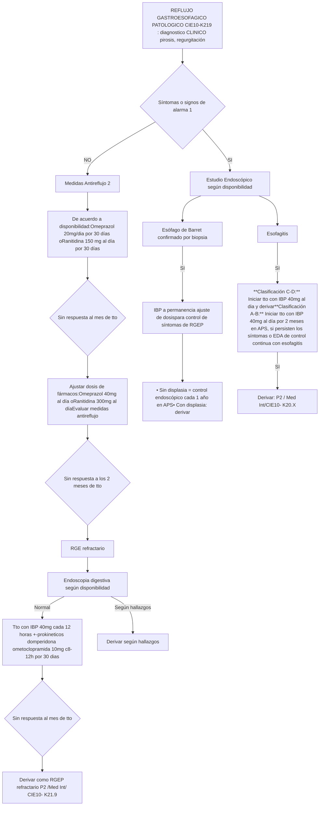
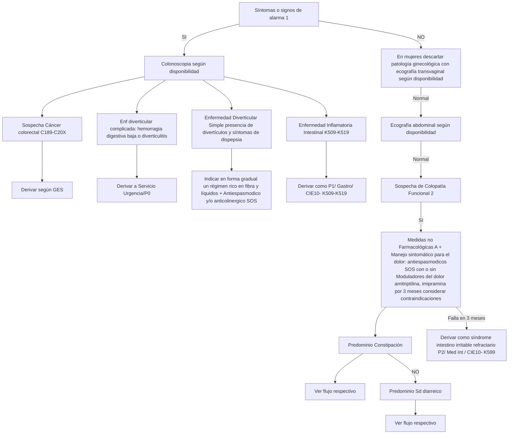
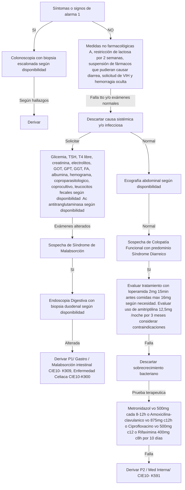
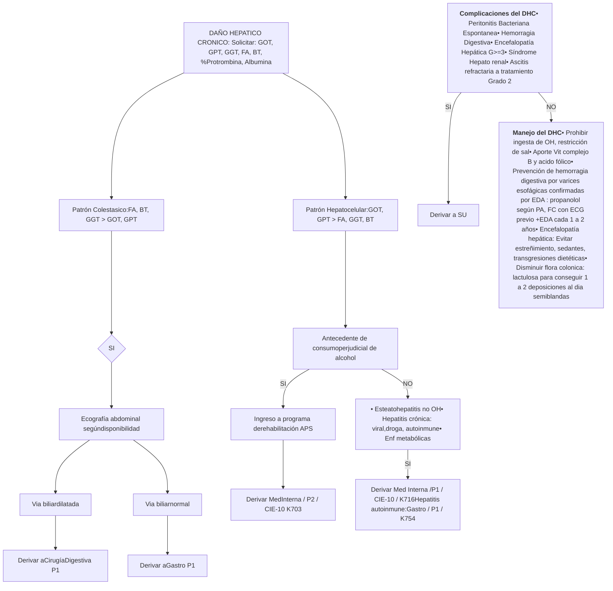
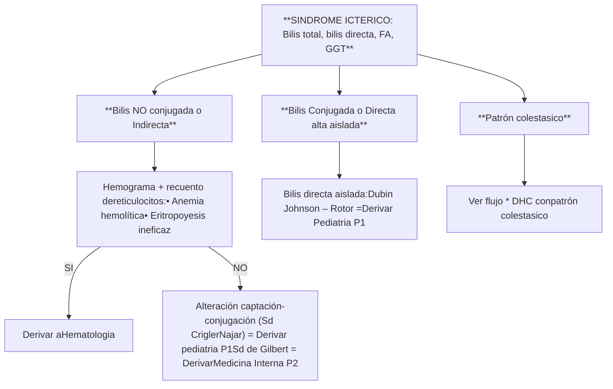

# PROT-GASTRO-ADULTO-V.2-2019-1

--- Página 1 ---

# PROTOCOLOS CLÍNICOS DE DERIVACIÓN Y PRIORIZACIÓN.

## DE LA RED DELSERVICIO DE SALUD METROPOLITANO OCCIDENTE

### POBLACION ADULTA

### ESPECIALIDAD: GASTROENTEROLOGIA

**Versión: 2.0**
**Resolución Exenta N°: 2569**
**Fecha de Emisión: Noviembre 2019**

--- Página 2 ---

**Objetivo General:**

Los flujogramas clínicos tienen como objetivo ser una fuente de información para los profesionales de la salud, orientado a facilitar la toma de decisiones respecto al abordaje inicial del paciente, entregando recomendaciones que permitan realizar un diagnóstico precoz, una derivación pertinente y oportuna hacia el nivel secundario de atención (no reemplaza el criterio clínico del médico tratante), mejorando con ello la continuidad asistencial de los usuarios pertenecientes a la red asistencial del Servicio de Salud Metropolitano Occidente.

**Objetivos Específicos:**

* Definir las características y la oportunidad en que un determinado paciente con una patología debe ser evaluado y manejado por el médico no especialista, disminuyendo la variabilidad de la atención, proporcionando un marco común de actuación.
* Establecer un flujograma desde la evaluación clínica, con apoyo de exámenes complementarios y resolución de los pacientes.
* Homologar los códigos CIE-10 a las patologías que por diagnóstico son pertinentes de derivar, aumentando la precisión diagnóstica y con ello su seguimiento y respectiva priorización.
* Entregar criterios estandarizados de referencia y priorización a los equipos de salud de la red del SSMOcc con el fin de mejorar la pertinencia y oportunidad de atención en el nivel secundario de la red asistencial.
* Determinar el conjunto mínimo de datos y exámenes que se deben registrar en la interconsulta y que respaldan el motivo de la derivación al nivel secundario de atención.

Este documento es producto de la colaboración de profesionales de todos los Niveles de Atención de Salud de la Red Metropolitana Occidente, contribuyendo de este modo al Modelo de Redes Integradas de Servicios de Salud basadas en la Atención Primaria.

**Alcance:** Profesionales del área de la salud pertenecientes a la Red Asistencial Metropolitano Occidente

--- Página 3 ---

## DEFINICIONES

**Código CIE-10:** “Clasificación Estadística Internacional de Enfermedades y Problemas Relacionados con la Salud”. En este documento se unifican los códigos CIE-10 de los diagnósticos pertinentes de derivar hacia el nivel secundario. Los que se detallan por cada patología en ella contenida.

**Definición de Pertinencia** : Se entiende por consulta pertinente aquellas derivaciones nuevas originadas en la atención primaria que cumple con los documentos de referencia que resguardan el nivel de atención bajo el cual el paciente debe resolver su problema de salud, siendo el motivo de derivación factible de solucionar en el nivel de atención al que se deriva.

**Definición de No pertinencia** : Corresponde a la identificación de una interconsulta que no cumple con los protocolos clínicos de derivación validados y que resguardan el nivel de atención bajo el cual el paciente debe ser resuelto, siendo el motivo de derivación factible de solucionar en la Atención Primaria de Salud donde el paciente debe ser reevaluado.

**Definición de Prioridad:** nivel de preferencia con el cual debe ser resuelto un problema de salud en el establecimiento al cual fue referido. Se establece categorías de priorización con tiempos de resolución sugeridos.

- Prioridad 0 (P0): son aquellas interconsultas por patologías que deben ser derivadas directamente al servicio de urgencia con eventual hospitalización de acuerdo a evaluación
- Prioridad 1 (P1): alta prioridad cuya patología reviste urgencia relativa, es decir, no puede esperar oferta de cupos, pero a su vez no presenta riesgo vital inmediato que amerite una derivación al servicio de urgencia. Esta derivación requiere una coordinación directa entre el nivel primario y el establecimiento de destino. Se sugiere que el tiempo de atención por el especialista sea antes de 30 días.
- Prioridad 2 (P2): prioridad normal. Interconsulta ingresa al sistema informático respectivo, a la espera que se le asigne un cupo de atención de acuerdo a la oferta disponible. Se sugiere que el tiempo de atención por el especialista sea antes de 6 meses.

Los exámenes descritos en los flujogramas como “según disponibilidad” quedan sujetos a la disponibilidad existente en cada centro de salud y/o posibilidad de ser realizado por el paciente. Cuando no se dispone del recurso se sugiere derivar directamente.

<page_number>3</page_number>

--- Página 4 ---

**ELABORADO POR:**


| NOMBRE                      | CARGO                                       | ESTABLECIMIENTO                           |
| --------------------------- | ------------------------------------------- | ----------------------------------------- |
| Dra Lia Catalan             | Medico Especialista Gastroentelorogia       | Hospital San Juan de Dios                 |
| Dr. Manuel Carreiro         | Medico Internista                           | Hospital Felix Bulnes                     |
| Dr Fernando Podesta         | Médico Especialista Gastroenterología       | Hospital Felix Bulnes                     |
| Dra. Carolina Llana         | Medico Internista                           | Hospital San José de Melipilla            |
| Dra. Juanita Hernandez      | Médico Internista                           | Hospital San José de Melipilla            |
| Dra Marta Quiroz            | Médico Internista                           | Hospital San Juan de Dios                 |
| Dr. Patricio Andrade        | Médico Internista                           | Hospital de Peñaflor                      |
| Dra. Raquel Rivera          | Médico Internista                           | Hospital de Talagante                     |
| Dra. Camila García          | Médico Interconsultor Atención<br/>Primaria | Hospital de Curacavi                      |
| Dra. Paula Valencia         | Médico Interconsultor Atención<br/>Primaria | CESFAM Cardenal Raúl Silva<br/>Henriquez. |
| Dra. Susy Yagual            | Médico Contralor                            | CESFAM Isla de Maipo                      |
| Dr. Vicente Moreira         | Médico Contralor                            | CESFAM Monkeberg                          |
| Dr. Alejandro Carreño       | Médico Contralor                            | CESFAM Elgueta                            |
| Dra. Eliana Amunategui      | Médico Contralor                            | CESFAM Elgueta                            |
| Dra. Yerma Aguilar Figueroa | Médico Contralor                            | CESFAM Violeta Parra                      |
| Yennyffer Pino              | Encargada SOME                              | CESFAM Violeta Parra                      |
| Dr. Oscar Rosales           | Médico Contralor                            | Yazigi                                    |


--- Página 5 ---

**ELABORADO POR:**


| NOMBRE                    | CARGO                                                                                                                                     | ESTABLECIMIENTO                        |
| ------------------------- | ----------------------------------------------------------------------------------------------------------------------------------------- | -------------------------------------- |
| Dr. Raul Castro           | Médico Contralor                                                                                                                          | CESFAM Boris Soler                     |
| Dra. Janeth Rodriguez     | Médico Contralor                                                                                                                          | CESFAM Boris Soler                     |
| Dra. Valentina Pooley     | Médico Contralor                                                                                                                          | CESFAM Maria Pinto                     |
| Dr. Carlos Azcarate       | Médico Contralor                                                                                                                          | CESFAM Islita                          |
| Dra. Maureen Wachtendorff | Médico Contralor                                                                                                                          | CESFAM Garin                           |
| Dr. Marco Gamboa          | Médico Contralor                                                                                                                          | CESFAM Garin                           |
| Dr. Pablo Chacana         | Médico Contralor                                                                                                                          | CESFAM Lo Amor                         |
| Dra. Sandra Ballesteros   | Médico Contralor                                                                                                                          | CESFAM Cerro navia                     |
| Dra. Ondina Narvaez       | Médico Contralor                                                                                                                          | CESFAM Albertz                         |
| Dr. Cristhian Balladares  | Médico Contralor                                                                                                                          | CESFAM Lo Franco                       |
| Dr. Andres Garrido        | Médico Contralor                                                                                                                          | CESFAM Steegers                        |
| Dra. Lucia Larrain        | Médico Contralor                                                                                                                          | CESFAM Dr. Hernán Urzúa Merino         |
| Ana Rojas                 | Digitadora                                                                                                                                | CESFAM Dr. Hernán Urzúa Merino         |
| Dr. Jose Romero           | Médico encargado GES Departamento<br/>de Coordinación de la Red                                                                           | Servicio Salud Metropolitano Occidente |
| Dra. Mirza Retamal        | Asesor Subdirección de Atencion<br/>Primaria.<br/>Referente Modelo de Referencia y<br/>Contra referencia                                  | Servicio Salud Metropolitano Occidente |
| QF. Loreto Gonzalez       | Asesor Subdirección de Atencion<br/>Primaria.<br/>Referente Modelo de Referencia y<br/>Contra referencia                                  | Servicio Salud Metropolitano Occidente |
| Dra. Maria Jose Maureira  | Médico Internista<br/>Médico Asesor Departamento de<br/>Coordinación de la Red<br/>Referente Modelo de Referencia y<br/>Contra referencia | Servicio Salud Metropolitano Occidente |


--- Página 6 ---

REVISADO POR:


| NOMBRE                            | CARGO                                                                 | ESTABLECIMIENTO                           |
| --------------------------------- | --------------------------------------------------------------------- | ----------------------------------------- |
| Dr Carlos Gallardo                | Jefe Departamento de Coordinación de la Red                           | Servicio de Salud Metropolitano Occidente |
| QF. Roxana Arias.                 | Jefe Departamento de Estadísticas y Gestión de la Información. SSMOCC | Servicio de Salud Metropolitano Occidente |
| T.O. María Paz Iturriaga Lisbona. | Directora Subdirección de Atención Primaria SSMOCC                    | Servicio de Salud Metropolitano Occidente |
| Lya Reyes                         | Jefa CR ambulatorio HSJD                                              | Hospital San Juan de Dios                 |
| Dra. Lorena Arrue                 | Referente Modelo de Referencia y Contra referencia                    | Hospital Felix Bulnes                     |
| EU. Daniela Andrade               | Enfermera Supervisora Atención ambulatoria                            | Hospital Felix Bulnes                     |
| Cecilia Elgueta                   | Sub jefe CAE                                                          | Hospital San José de Melipilla            |
| Odont. Claudio Miranda            | Referente Modelo de Referencia y Contra referencia                    | Hospital de Talagante                     |


AUTORIZADO POR:


| NOMBRE                | CARGO                                              | ESTABLECIMIENTO                           |
| --------------------- | -------------------------------------------------- | ----------------------------------------- |
| Dr. Rodrigo Riffo     | Director de la Subdirección de gestión Asistencial | Servicio de Salud Metropolitano Occidente |
| Dr. Francisco Miranda | Director                                           | Servicio Salud Metropolitano Occidente    |


COORDINADOR Y ENCARGADO RESPONSABLE


| NOMBRE                            | CARGO                                                                                                                             | ESTABLECIMIENTO                        |
| --------------------------------- | --------------------------------------------------------------------------------------------------------------------------------- | -------------------------------------- |
| Dra. Maria Jose Maureira Maureira | Médico Internista<br/>Médico Asesor Departamento de Coordinación de la Red<br/>Referente Modelo de Referencia y Contra referencia | Servicio Salud Metropolitano Occidente |


Validado en el Consejo Integrador de la Red Asistencial (CIRA) del SSMOcc realizado el 22 de Agosto 2019

--- Página 7 ---

# UNIDAD DIAGNOSTICA

1. DISGAFIA
2. REFLUJO GASTROESOFAGICO
3. DOLOR ABDOMINAL SUPERIOR
4. SINDROME ULCEROSO
5. DOLOR ABDOMINAL INFERIOR
6. SINDROME DIARREICO CRONICO
7. CONSTIPACION CRONICA
8. DAÑO HEPATICO CRONICO
9. SINDROME ICTERICO

--- Página 8 ---

# TABLA CONSOLIDADA ESPECIALIDAD GASTROENTEROLOGIA


| Nº | Diagnóstico de Derivación (Código CIE-10)                                                                                             | Criterios Derivación                                                                                                                      | Especialidad Destino(considerar mapa dederivación vigente) | Prioridad |
| -- | ------------------------------------------------------------------------------------------------------------------------------------- | ----------------------------------------------------------------------------------------------------------------------------------------- | ---------------------------------------------------------- | --------- |
| 1  | Disfagia motora severa ( K224,<br/>disquinesia del esófago)                                                                           | Con disfagia severa (alteración<br/>nutricional, cuadros respiratorios<br/>por aspiración)                                                | Gastroenterología                                          | P1        |
| 2  | Disfagia motora no complicada<br/>(K228, otras enfermedades<br/>especificadas del esófago)                                            | Sospecha fundada                                                                                                                          | Med Interna                                                | P2        |
| 3  | Enfermedad por Reflujo<br/>Gastroesofágico (K219, enfermedad<br/>de reflujo gastroesofágico sin<br/>esofagitis)                       | Refractario a tratamiento no<br/>farmacológico y farmacológico<br/>durante 4 meses                                                        | Med Interna                                                | P2        |
| 4  | Esofagitis (K20-X, esofagitis)                                                                                                        | Objetivada por Endoscopia<br/>Digestiva Alta refractaria a<br/>tratamiento con IBP en 2 meses<br/>y/o grado C o D                         | Med Interna                                                | P2        |
| 5  | Ulcera Péptica con Hemorragia (K274,<br/>ulcera péptica, de sitio no<br/>especificado, crónica o no<br/>especificada, con hemorragia) | Hemorragia activa Forrest I a IIB                                                                                                         | Servicio de Urgencia                                       | P0        |
| 6  | Ulcera Péptica sin hemorragia (K279,<br/>ulcera péptica de sitio no especificado<br/>sin hemorragia ni perforación)                   | En lugares atípicos ( 2°-3°<br/>porción duodeno) o múltiples o<br/>refractaria a tto médico de<br/>primera línea                          | Gastroenterología                                          | P1        |
| 7  | Helicobacter pylori (B980,<br/>Helicobacter pylori como causa de<br/>enfermedades clasificadas en otros<br/>capítulos)                | Refractario a tratamiento de<br/>1°línea                                                                                                  | Med Interna                                                | GES       |
| 8  | Hemorragia digestiva de sitio no<br/>precisado con hemodinamia estable<br/>(K922, hemorragia gastrointestinal, no<br/>especificada)   | Anemia microcitica con<br/>endoscopia normal, hemorragia<br/>oculta negativa y tacto rectal<br/>normal sin causa evidente de<br/>sangrado | Gastroenterología                                          | P1        |
| 9  | Pancreatitis Crónica (K861, otras<br/>pancreatitis crónica)                                                                           | Sospecha fundada con ecografia<br/>abdominal compatible                                                                                   | Gastroenterología                                          | P1        |
| 10 | Dispepsia (K30X, dispepsia )                                                                                                          | Refractaria a tratamiento no<br/>farmacológico y farmacológico<br/>en 6 meses                                                             | Med Interna                                                | P2        |


Prioridad 0: Derivación al servicio de Urgencia
Prioridad 1: Evaluación por nivel secundario, se sugiere antes de 30 días. Coordinacion directa entre contralor APS y establecimiento de destino.
Prioridad 2: Evaluación por nivel secundario, se sugiere antes de 6 meses.

--- Página 9 ---

| Nº | Diagnóstico de Derivación (Código CIE-10)                                                                             | Criterios Derivación                                                                                                                              | Especialidad Destino (considerar mapa de derivación respetivo) | Prioridad |
| -- | --------------------------------------------------------------------------------------------------------------------- | ------------------------------------------------------------------------------------------------------------------------------------------------- | -------------------------------------------------------------- | --------- |
| 11 | Enfermedad de Crohn (K509, enfermedad de Crhon, no especificada)                                                      | Sospecha fundada y/o antecedentes personales de patología                                                                                         | Gastroenterología                                              | P1        |
| 12 | Colitis Ulcerosa (K519, colitis ulcerativa sin otra especificación)                                                   | Sospecha fundada y/o antecedentes personales de patología                                                                                         | Gastroenterología                                              | P1        |
| 13 | Malabsorción Intestinal (K909, malabsorción intestinal, no especificada)                                              | Sospecha fundada y/o antecedentes personales de patología                                                                                         | Gastroenterología                                              | P1        |
| 14 | Enfermedad celiaca ( K900, enfermedad celiaca)                                                                        | Sospecha fundada y/o antecedentes personales de patología                                                                                         | Gastroenterología                                              | P1        |
| 15 | Síndrome Colon Irritable (K599, Trastorno funcional intestinal, no especificado)                                      | Refractario a tratamiento no farmacológico y farmacológico en 3 meses                                                                             | Med Interna                                                    | P2        |
| 16 | Diarrea crónica (K59, colitis de etiologia indeterminada)                                                             | Refractaria a tratamiento no farmacológico y farmacológico en 4 meses                                                                             | Med Interna                                                    | P2        |
| 17 | Daño Hepático Crónico con patrón colestasico (K710, enfermedad toxica del hígado, con colestasis).                    | Patrón colestasico con via biliar normal no dilatada y/o antecedente personal de cirrosis biliar primaria o colangitis esclerosante no controlada | Gastroenterologia                                              | P1        |
| 18 | Aumento de transaminasas (K716, enfermedad toxica del hígado con hepatitis no clasificada en otra parte)              | Elevación de transaminasas ( 3 veces sobre el nivel superior normal) , sin criterios de derivación a servicio de urgencia                         | Medicina Interna                                               | P1        |
| 19 | Hepatitis Autoinmune (K754, hepatitis autoinmune)                                                                     | Antecedente personal de hepatitis autoinmune no controlada                                                                                        | Gastroenterologia                                              | P1        |
| 20 | Daño Hepático Crónico por alcohol (K703, Cirrosis hepática alcohólica)                                                | Paciente con antecedente de consumo perjudicial de alcohol en CONTROL en programa de alcohol o drogas u otro similar en APS o COSAM               | Medicina Interna                                               | P2        |
| 21 | Ictericia (R17X, ictericia no especificada)                                                                           | De probable etiología hepática con ecografía abdominal con via biliar no dilatada                                                                 | Medicina Interna                                               | P2        |
| 22 | Tumor hepático (D376, tumor de comportamiento incierto o desconocido de hígado, de vesícula biliar y conducto biliar) | Tumor SOLIDO objetivado por imágenes                                                                                                              | Gastroenterologia                                              | P1        |


Prioridad 0: Derivación al servicio de Urgencia
Prioridad 1: Evaluación por nivel secundario, se sugiere antes de 30 días. Coordinacion directa entre contralor APS y establecimiento de destino.
Prioridad 2: Evaluación por nivel secundario, se sugiere antes de 6 meses.

--- Página 10 ---

# DISFAGIA (CIE10- R13X): dificultad para tragar

**Con síntomas o signos de alarma (1)**

* SI:
        * Endoscopia Digestiva Alta (según disponibilidad)

* NO:
        * **Sospecha de causa neurológica**: disfagia principalmente para líquidos, regurgitación nasofaringea, tos con deglución, secuelas de AVE, diplopía, disfonía, disartria, debilidad ocular o de esqueleto axial = Derivar a neurología según sospecha

* NO:
        * **Sospecha de xerostomia**
        * SI:
                * Evaluar Sd Sjogren o 2° a farmacos: AINE, alendronato (esofagitis), neuroléptico, antidepresivos, anticolinérgicos (buscapina, trimembutino)

* NO:
        * **Sospecha causa extrínseca**: bocio tiroideo significativo, tumores mediastinicos, crecimiento de aurícula izquierda
        * SI:
                * Solicitar Rx de Tórax PA, Ecografía de tiroides según disponibilidad
                * Segun hallazgos:
                        * Derivar

* NO:
        * Tratar como RGEP atípico con IBP 20mg al día por 2 meses
        * Falla:
                * Solicitud de Endoscopia Digestiva alta (según disponibilidad)
                * Normal:
                        * **Sospecha de causa motora (disfagia ilógica)**: acalasia, espasmo esofágico difuso
                        * SI:
                                * Con disfagia severa (alteración nutricional o cuadros respiratorios aspirativos)
                                * SI:
                                        * Derivar como P1/ Gatro/ CIE10- K224
                                * NO:
                                        * Derivar como P2 / Med Int / CIE10- K228

**(\*1) Síntomas o signos de alarma**: disfagia crónica en >40 años, disfagia lógica, odinofagia asociada a RGEP, RGEP de mas de 10 años de evolución, dolor abdominal nocturno o de tipo ulceroso, baja de peso, vómitos recurrentes o alimentarios, anemia microcitica, antecedente familiar de cáncer de esófago o gástrico

**Disfagia lógica**: disfagia progresiva primero para sólidos y luego para líquidos con o sin síntomas de alarma /causas: obstructivas
**Disfagia ilógica**: disfagia intermitente, tanto para sólidos como para líquidos/ causas: diabetes, neurológicas, motoras (espasmo esofágico, acalasia), mesenquimopatias

### SERVICIO SALUD OCCIDENTE

Derivar con: descripción de tto indicado, exámenes realizados (informe de EDA)

--- Página 11 ---

# REFLUJO GASTROESOFAGICO PATOLOGICO (CIE10-K219) : diagnostico CLINICO ( pirosis, regurgitación)



** (1) Síntomas y signos de alarma: **

\* RGEP en >40 años, RGEP por mas de 10 años, disfagia progresiva logica, odinofagia **persistente**, baja de peso, vómito recurrente o alimentario, dolor abdominal nocturno, hematemesis, melena, rectorragia, anemia microcitica, cambio de habito intestinal, antecedente familiar cancer esofagico o gastrico

** (2) Medidas antireflujo: ** Levantar la cabecera de la cama (se sugiere cama inclinada con nivel de cabecera 15 cm por sobre el de las piernas), **bajar de peso**, comer a mas tardar 2-3 horas antes de acostarse, evitar OH, tabaco, menta, condimentos, grasas y comidas copiosas, evitar compresión mecánica del abdomen, realizar ejercicio de respiración abdominal, evitar fármacos como nitratos, antagonista calcio, antagonista alfadrenérgicos, agonistas beta, antagonistas colinérgicos.

SERVICIO SALUD OCCIDENTE

<mark>Derivar con: descripción de tto indicado, exámenes realizados (informe de EDA), evaluación nutricional para lograr normopeso</mark>

--- Página 12 ---

# DOLOR ABDOMINAL SUPERIOR CRONICO >4 SEMANAS (CIE10-R101)

* **Síntomas o signos de alarma (1) o sospecha clínica de síndrome ulceroso**
    * **SI** → **Estudio Endoscópico (según disponibilidad)**
        * En >= 40 años = GES
        * En <40 años = P1
        * Cx Digestiva Alta si tiene biopsia compatible
        * A Gastro sin bx disponible / CIE10- C169
    * **NO**
                * **Sospecha de Dispepsia (dolor epigástrico + distensión posprandial + saciedad precoz)**
            * **SI**
                                * **Medidas no farmacológicas (A) (B) y tratamiento empírico con omeprazol 20 mg al día x 2 meses**
                    * **Sin respuesta a tto**
                                                * **Pesquisa y erradicación de HP (según disponibilidad)**
                            * **Sin respuesta a tto**
                                                                * **Estudio Endoscópico (según disponibilidad)**
                                    * **Normal**
                                                                                * **Ecografia Abdominal (según disponibilidad)**
                                            * **Alterada**
                                                                                                * Calculo de vesícula biliar o de conducto biliar o pólipo >=1cm → Entre 35-49 años derivar GES/Cx digestiva Alta. Fuera de rango etario: P1 (sintomático o consulta reciente a SU) / P2 (asintomático, hallazgo ecográfico)
                                                                                                * Patología tumoral → Ver Flujo respectivo
                                                                                                * Pancreatitis crónica → Derivar P1 / Gastro/ CIE10-K861
                                            * **Normal**
                                                                                                * **Reforzar medidas no farmacológicas, evaluar trastorno del animo asociado. Evaluar ensayo terapéutico con moduladores de dolor por 3 meses: amitriptilina 12,5mg/noche (máx. 25mg) o trazodona 25mg/noche (máx. 75mg) (considerar contraindicaciones de estos medicamentos)**
                                                    * **Responde** → Mantener terapia por 6 meses y evaluar suspensión.
                                                    * **Sin respuesta**
                                                                                                                * **Sin respuesta "Dispepsia refractaria"** → Derivar P2 / Med Int CIE10-K30X
                                                                                                * **Considere en pacientes diabéticos la sospecha de gastroparesia (vómitos alimentarios posprandiales tardíos), evalué prueba terapéutica con metoclopramida 5-10mg 30 min antes de las comidas principales y 10mg en la noche por 1mes (descartar contraindicaciones)**

**Hallazgos en Estudio Endoscópico / Ecografía:**
* Sospecha de cáncer gástrico
* Metaplasia Intestinal (CIE10- K297) o Gastritis Atrófica (CIE10-K294) → Control endoscopico anual APS
* Ulcera péptica con sangrado activo (Forrest I-IIB) → Derivar P0/SU / CIE10-K274
* Ulcera péptica en lugares atípicos (2°-3° porción duodeno) o múltiples o refractaria a tto medico → Derivar P1 / Gastro/ CIE10- K279
    * **NO** → Ver flujo Síndrome Ulceroso
* HP no erradicado con tto ATB 1ª línea → Derivar GES / Med Int CIE10- B980

\* (1) **Síntomas y signos de alarma:** >40 años, antecedente familiar de cancer gástrico o cancer de colon, dolor nocturno, disfagia progresiva logica, odinofagia persistente, baja de peso, vómito recurrente o alimentario, hematemesis, melena, rectorragia, anemia microcitica, cambio de habito intestinal, sindrome colestasico

SERVICIO SALUD OCCIDENTE

Derivar con: descripción de tto indicado y exámenes realizados (informe de EDA, informe de ecografía abdominal) según corresponda

--- Página 13 ---

# SINDROME ULCEROSO

```mermaid
graph TD
    SU[SINDROME ULCEROSO] --> UG_Arrow[ ]
    SU --> UD_Arrow[ ]
    
    UG_Arrow --> UG[Ulcera Gástrica]
    UD_Arrow --> UD[Ulcera Duodenal]
    
    UG --> UG_Box[Evitar AINES, aspirina, tabaco, alcoholDieta livianaErradicar HP si test de ureasa positivo: claritromicina 500mg c12h + amoxicilina 1gr cada 12h (alergia amoxicilina, metronidazol 500mg cada 12horas) por 14 diasIBP 20mg cada 12h hasta control de endoscopia]
    
    UD --> UD_Box[Evitar AINES, aspirina, tabaco, alcoholDieta livianaErradicar HP si test de ureasa positivo: claritromicina 500mg c12h + amoxicilina 1gr cada 12h (alergia amoxicilina, metronidazol 500mg cada 12horas) por 14 diasIBP 20 mg c12h por 14 días si HP positivoIBP 20 mg c12h por 8 sem si HP negativo]
    
    UG_Box --> UG_Endo[Endoscopia Digestiva a los 3 meses del diagnostico con test de ureasa y biopsia]
    UD_Box --> UD_Test[Comprobar erradicación de HP con prueba de antígenos en deposiciones (según disponibilidad) o en su defecto nueva endoscopia con test de ureasa]
    
    UG_Endo --> Refractario[Helicobacter positivo refractario a tto de primera línea]
    UD_Test --> Refractario
    
    Refractario --> Derivar1[Derivar GES / Med Int / CIE10-B980]
    Refractario --> UlceraNoCicatrizada[Ulcera gástrica no cicatrizadaUlcera péptica refractariaUlcera péptica en lugares atípicos ( 2°-3° porción duodeno) o múltiples]
    
    UlceraNoCicatrizada --> Derivar2[Derivar P1 / Gastro/ CIE10-K279]

    style SU fill:#E1D5E7,stroke:#000
    style UG fill:#FFF,stroke:#000
    style UD fill:#FFF,stroke:#000
    style UG_Box fill:#FFF,stroke:#000,text-align:left
    style UD_Box fill:#FFF,stroke:#000,text-align:left
    style UG_Endo fill:#FFF,stroke:#000
    style UD_Test fill:#FFF,stroke:#000
    style Refractario fill:#FFF,stroke:#000
    style UlceraNoCicatrizada fill:#FFF,stroke:#000,text-align:left
    style Derivar1 fill:#FFF,stroke:#000
    style Derivar2 fill:#FFF,stroke:#000
```


**Ulcera Gástrica**
**Ulcera Duodenal**


* Evitar AINES, aspirina, tabaco, alcohol
* Dieta liviana
* Erradicar HP si test de ureasa positivo: claritromicina 500mg c12h + amoxicilina 1gr cada 12h (alergia amoxicilina, metronidazol 500mg cada 12horas) por 14 dias
* IBP 20mg cada 12h hasta control de endoscopia

* Evitar AINES, aspirina, tabaco, alcohol
* Dieta liviana
* Erradicar HP si test de ureasa positivo: claritromicina 500mg c12h + amoxicilina 1gr cada 12h (alergia amoxicilina, metronidazol 500mg cada 12horas) por 14 dias
* IBP 20 mg c12h por 14 días si HP positivo
* IBP 20 mg c12h por 8 sem si HP negativo


Endoscopia Digestiva a los 3 meses del diagnostico con test de ureasa y biopsia

Comprobar erradicación de HP con prueba de antígenos en deposiciones (según disponibilidad) o en su defecto nueva endoscopia con test de ureasa

Helicobacter positivo refractario a tto de primera línea

Derivar GES / Med Int / CIE10- B980

Ulcera gástrica no cicatrizada
Ulcera péptica refractaria
Ulcera péptica en lugares atípicos ( 2°-3° porción duodeno) o múltiples

Derivar P1 / Gastro/ CIE10-K279

--- Página 14 ---

# Trastornos Digestivos Funcionales

## (A) Medidas No farmacológicas Generales
* Aumentar la ingesta de líquidos
* Aumentar Actividad fisica.

## (B) Distención postprandial
* Evite los alimentos grasos como la carne roja, mantequilla, alimentos fritos, queso ( alimentos que retardan el vaciamiento gástrico)
* Exclusión de alimentos productores de gas: frijol, cebolla, apio, zanahorias, papas, plátanos, ciruela pasas, repollo, coliflor por 2 meses y luego reintroducción gradual.
* Comer comidas pequeñas y frecuentes . En lugar de 3 comidas grandes, comer 6 comidas pequeñas
* Evite los AINES o aspirina
* Comer regularmente y sin prisa (ingerir comidas en al menos 30 minutos de duracion)
* Suspender tabaco y no masticar chicles

## (C ) Constipación
* Fibra alimentaria (recomendable 20-35gr/dia) : salvado de trigo (3-4 cucharas =15-20 gr), cereales (8dag =5gr), frutas (3manzanas o 2 naranjas = 5gr, peras, cerezas, pasas, nueces)
* Intentos regulares de defecación sin prisa al menos dos veces al dia generalmente 30min después de las comidas y después del desayuno

SERVICIO SALUD OCCIDENTE

--- Página 15 ---

# DOLOR ABDOMINAL INFERIOR CRONICO (CIE10- R10.3)



\* (1) **Síntomas y signos de alarma:** antecedente familiar de cancer de colon, dolor nocturno, tacto rectal alterado (presencia de tumor palpable o melena), cambio de habito intestinal, test de hemorragia oculta positiva, baja de peso, vómito recurrente o alimentario, hematemesis, melena, rectorragia, anemia microcitica

\* (2) **Colopatía Funcional\*:** Dolor o molestia abdominal recurrente (hipogastrio y cuadrante inferior izquierdo) durante al menos 3 días por mes en los últimos 3 meses + >=2 de 3 criterios: Mejora con la defecación, asociado con un cambio en la frecuencia de las deposiciones, asociado con cambio en la consistencia de las deposiciones

<mark>Derivar con: descripción de tto indicado y exámenes realizados (informe de EDA, informe de ecografía abdominal, resultado de hemorragia oculta, hemograma, tacto rectal)</mark>

SERVICIO SALUD OCCIDENTE

--- Página 16 ---

# SINDROME DIARREICO CRONICO: duración > 4 semanas continuo o intermitente



**(1) Síntomas y signos de alarma:** Antecedente familiar de cáncer o pólipos colorrectales / fiebre / diarrea nocturna / deposiciones con sangre, mucosidad o restos alimentarios, hemorragia oculta positivo, tacto rectal con palpación de tumoración

**(2) Síndrome Malabsorción:** Baja de peso con apetito conservado, esteatorrea (deposiciones abundantes, pastosas, espumosas, mal olientes), edema, anemia, sintomas neurologicos, tetania, xeroftalmia, diatesis hemorragicas

<mark>Derivar con: descripción de tto indicado y exámenes realizados (informe de EDA o colonoscopia, ecografía abdominal), TSH-T4 libre, creatinina, GOT, GPT, GGT, FA, VIH, hemograma, leucocitos fecales, coproparasitologico, hemorragia oculta</mark>

SERVICIO SALUD OCCIDENTE

--- Página 17 ---

# CONSTIPACIÓN CRONICA (1) (CIE10-K590)


> **Síntomas de alarma:**
> \> 50 años y comienzo reciente,
> Antecedentes familiar de cáncer de colon o enfermedad inflamatoria intestinal
> Baja de peso objetivada, hematoquezia, anemia, fiebre, dolor abdominal nocturno, tacto rectal alterado (tumoración palpable), hemorragia oculta positivo

SI → Colonoscopia (según disponibilidad)

 NO

> Cambio de estilo de vida saludable (A) (C) + aumento de la fibra en la dieta hasta 20-30gr/dia de manera progresiva por 2 meses, evaluar suspensión de fármacos que pudiesen contribuir a la constipación (antihistaminico, antiespasmodico, anidepresivo triciclicos, antipsicoticos, suplementos hierro, bloq de calcio, tramal, morfina)

 Falla en 2 meses

> Solicitar: Hemograma, calcio (según disponibilidad), TSH, T4 libre, función renal
> Descartar: Depresión / Anorexia nerviosa
> \+
> Indicar laxantes formadores de bolo (2) \*Ver tabla laxantes

 Falla a los 30 días de tto

> Indicar laxantes osmoticos (2) Ver tabla laxantes

 Falla a los 30 días de tto

> Derivar como constipación refractaria / P1/ Gastro/ CIE10- K59.0

(1) Constipación: Debe cumplir 2 de 6 criterios en los últimos 3 meses: esfuerzo defecatorio - sensación de evacuación incompleta- sensacion de obstrucción anorectal- heces duras- maniobras manuales para facilitar la expulsión, todas estas en mas de 25% de las defecaciones, <3 evacuaciones por semana. Con inicio de los síntomas al menos 6 meses antes y las heces blandas rara vez están presentes sin el uso de laxantes y no hay criterios suficientes para síndrome de intestino irritable

Derivar con: resultado de exámenes / cambio de habito de vida saludable con aumento de ingesta de fibra

SERVICIO SALUD OCCIDENTE

--- Página 18 ---

# Trastornos Digestivos Funcionales

## (A) Medidas No farmacológicas Generales
* Aumentar la ingesta de líquidos
* Aumentar Actividad fisica.

## (B) Distención postprandial
* Evite los alimentos grasos como la carne roja, mantequilla, alimentos fritos, queso ( alimentos que retardan el vaciamiento gástrico)
* Exclusión de alimentos productores de gas: frijol, cebolla, apio, zanahorias, papas, plátanos, ciruela pasas, repollo, coliflor por 2 meses y luego reintroducción gradual.
* Comer comidas pequeñas y frecuentes . En lugar de 3 comidas grandes, comer 6 comidas pequeñas
* Evite los AINES o aspirina
* Comer regularmente y sin prisa (ingerir comidas en al menos 30 minutos de duracion)
* Suspender tabaco y no masticar chicles

## (C ) Constipación
* Fibra alimentaria (recomendable 20-35gr/dia) : salvado de trigo (3-4 cucharas =15-20 gr), cereales (8dag =5gr), frutas (3manzanas o 2 naranjas = 5gr, peras, cerezas, pasas, nueces)
* Intentos regulares de defecación sin prisa al menos dos veces al dia generalmente 30min después de las comidas y después del desayuno

--- Página 19 ---

# (2) Laxantes de 1° línea de tratamiento farmacológico


|                                                                                                                                                                                                                                                                           | Farmaco                                                                      | Dosis                       | Comentarios/RAM/Contraindicaciones                                                                                                      |
| ------------------------------------------------------------------------------------------------------------------------------------------------------------------------------------------------------------------------------------------------------------------------- | ---------------------------------------------------------------------------- | --------------------------- | --------------------------------------------------------------------------------------------------------------------------------------- |
| **FORMADORES DE BOLO**<br/>**Mecanismo:** aumenta el volumen de heces provocando distensión del colon y promueve la propulsión de las heces.<br/><br/>**Contraindicación:** no utilizar en la defecación disenergica ni megacolon                                         | Psyllium (metamucil)                                                         | 10gr/dia (1/2 o cda al dia) | Flatulencia, meteorismo, ataques de asma, anafilaxia                                                                                    |
|                                                                                                                                                                                                                                                                           | Meticelulosa (citrucel); calcio policarbofilo, dextrina de trigo (benafiber) |                             |                                                                                                                                         |
| **OSMOTICOS Mecanismo:** Provocan secreción de agua intestinal aumentando la frecuencia de las heces<br/><br/>**RAM:** el uso excesivo de estos agentes pueden causar alteraciones electrolíticas y sobrecarga de volumen en pacientes con insuficiencia renal y cardiaca | Polietilenglicol (PEG) vo                                                    | 17gr/dia . Max 34gr/dia     | Uso de preferencia en adultos mayores (mejor tolerancia) que el resto de los laxantes osmóticos                                         |
|                                                                                                                                                                                                                                                                           | Lactulosa vo                                                                 | 15-45 ml/dia                | RAM: Meteorismo, flatulencia . Requiere 24-48 horas para lograr su efecto                                                               |
|                                                                                                                                                                                                                                                                           | Sorbitol vo                                                                  |                             | RAM: Meteorismo, flatulencia .                                                                                                          |
|                                                                                                                                                                                                                                                                           | Macrogoles vo                                                                | 8-25gr/dia                  | RAM: Vómitos, dolor abdominal tipo colico                                                                                               |
|                                                                                                                                                                                                                                                                           | Glicerol supositorio                                                         | 3gr                         | Indicado en la impactación o defecación disenergica                                                                                     |
|                                                                                                                                                                                                                                                                           | Fosfato enema rectal                                                         | 120-150ml                   | RAM: Hiperfosfatemia, hipocalcemia, alteraciones del potasio, acidosis metabólica. Contraindicado en adulto mayor e insuficiencia renal |


# Laxantes de 2° línea de tratamiento farmacológico


|                                                                                                                                                                                                                | Fármaco                                 | Dosis        | Comentarios/RAM/Contraindicaciones                                                                                                                                                                                                                                                               |
| -------------------------------------------------------------------------------------------------------------------------------------------------------------------------------------------------------------- | --------------------------------------- | ------------ | ------------------------------------------------------------------------------------------------------------------------------------------------------------------------------------------------------------------------------------------------------------------------------------------------ |
| **ESTIMULANTES Mecanismo:** afectan el transporte de electrolitos a través de la mucosa intestinal y mejoran el transporte y la motilidad del colon<br/>**Contraindicaciones:** Evitar en el adulto mayor      | Bisacodilo (comp o sup)                 | 5-10mg       | RAM: Dolor abdominal tipo cólico, dependencia a consecuencia de su uso prolongado.<br/>RAM uso crónico: hipokalemia, enteropatía perdedora de proteínas y sobrecarga de sal.<br/>En supositorio pueden usarse en adultos mayores con defecación disinérgica para ayudar con la evacuación rectal |
| **AGONISTAS RECEPTOR 5HT**<br/>Indicado en adultos mayores con estreñimiento refractario a laxantes osmóticos                                                                                                  | Prucaloprica vo                         | 2mg /dia     |                                                                                                                                                                                                                                                                                                  |
| **SECRETAGOGOS DE COLON**<br/>**Mecanismo:** Activa los canales de cloruro secretando cloruro y agua en la luz intestinal<br/>Indicado en pacientes mayores con estreñimiento refractario a otros tratamientos | Lubiprostona                            | 8ug cada 12h |                                                                                                                                                                                                                                                                                                  |
|                                                                                                                                                                                                                | Linaglotida                             | 290 ug/dia   |                                                                                                                                                                                                                                                                                                  |
| **ANTAGONISTAS OPIOIDES**<br/>Indicado en el estreñimiento inducido por narcóticos e íleo paralítico                                                                                                           | Alvimopan / Naloxegol / Metilnaltrexona |              | SERVICIO SALUD OCCIDENTE                                                                                                                                                                                                                                                                         |


--- Página 20 ---

# DAÑO HEPATICO CRONICO: Solicitar: GOT, GPT, GGT, FA, BT, %Protrombina, Albumina



**Complicaciones del DHC**
* Peritonitis Bacteriana Espontanea
* Hemorragia Digestiva
* Encefalopatía Hepática G>=3
* Síndrome Hepato renal
* Ascitis refractaria a tratamiento Grado 2

NO

**Manejo del DHC**
* Prohibir ingesta de OH, restricción de sal
* Aporte Vit complejo B y acido fólico
* Prevención de hemorragia digestiva por varices esofágicas confirmadas por EDA : propanolol según PA, FC con ECG previo + EDA cada 1 a 2 años
* Encefalopatía hepática: Evitar estreñimiento, sedantes, transgresiones dietéticas
* Disminuir flora colonica: lactulosa para conseguir 1 a 2 deposiciones al dia semiblandas

<mark>Derivar con: resultado de exámenes función hepática, clasificación Child Pugh , resultado de ecografía abdominal</mark>

SERVICIO SALUD OCCIDENTE

--- Página 21 ---

## Escala de Child Pugh del DHC


| PUNTOS            | 1        | 2                               | 3              |
| ----------------- | -------- | ------------------------------- | -------------- |
| Encefalopatía     | 0        | I,II                            | III,IV         |
| Bilirrubina(mg%)  | 1-2      | 2-3                             | >3             |
| Albumina (gr%)    | >3,5     | 2,8-3,5                         | <2,8           |
| T.Protrombina (%) | >50%     | 30-40%                          | <30%           |
| Ascitis           | - 0 leve | Moderado o manejable on fármaco | Difícil manejo |


A: 5-6 puntos
B: 7-9 puntos
C: 10-15 puntos

## Grado de Encefalopatía Hepática


|           | Estado Mental                                                            | Flapping o asterixis |
| --------- | ------------------------------------------------------------------------ | -------------------- |
| Grado I   | Euforia-depresión, bradipsiquia, trast lenguaje, inversión sueño-vigilia | Discreto             |
| Grado II  | Somnolencia, comportamiento inadecuado                                   | Evidente             |
| Grado III | Lenguaje incoherente                                                     | Presente             |
| Grado IV  | Como profundo                                                            | Ausente              |

| Bebida        | Graduación | 25gr/OH/dia | 40gr/OH/dia | 80gr/OH/dia |
| ------------- | ---------- | ----------- | ----------- | ----------- |
| Cerveza       | 5%         | 500 ml      | 750 ml      | 1500 ml     |
| Vino          | 12%        | 208 ml      | 312 ml      | 624 ml      |
| Whisky, coñac | 40%        | 62 ml       | 93 ml       | 186 ml      |


**Consumo Significativo de OH:**

Hombre consumir mas de 210 gr /semana o 25gr al dia equivalente a

* Semana: 4 litros de cerveza, 2 Litros de vino , 0,5 L de licores

* Diario : 500ml cerveza, 208 ml vino

Mujer consumir mas de 140gr / semana

SERVICIO SALUD OCCIDENTE

--- Página 22 ---



SERVICIO SALUD OCCIDENTE

--- Página 23 ---

# DOCUMENTOS DE REFERENCIA:

* Guía Clínica AUGE (2014). Colecistectomía Preventiva en adultos de 35 a 49 años
* Guía Clínica AUGE (2014). Cáncer Gástrico
* Guía Clínica AUGE (2013). Cáncer Colorectal en personas de 15 años y más
* Guía Clínica AUGE (2013). Tratamiento de erradicación de Helicobacter pylori en el paciente con úlcera péptica
* Dr. Juan Carlos Weitz y col (2008). Diagnostico y Tratamiento de las Enfermedades Digestivas. Sociedad Chilena de Gastroenterología.
* Medicina Interna Basada en la Evidencia 2019/20 (2019). Rodolfo Armas Merino, Piotr Gajewski y cols.
* Guias Medicine (2012). Protocolos de práctica asistencial.
* Flujogramas Clinicos de Derivación y Priorización al Nivel Secundario de Atención. Especialidad Gastroenterologia V.1 (2018). Resolución Excenta 2734. SSMOcc

## ABREVIATURAS

* **Cx**: Cirugia
* **Cda**: cuchara
* **CI**: contraindicacion
* **Dg**: diagnostico
* **EDA**: Endoscopia Digestiva Alta
* **Enf**: enfermedad
* **GES**: garantia explicita en salud
* **HP**: Helicobacter Pylori
* **OH**: alcohol
* **IBP**: inhibidores de bomba de protones
* **Max**: máximo
* **MI**: medicina interna
* **RGEP**: reflujo gastroesofagico patologico
* **Sd**: sindrome
* **Tto**: Tratamiento
* **+-**: con o sin

--- Página 24 ---


EXENTA N° 2569

SANTIAGO, 27 NOV. 2019

**VISTOS:** El Memorándum DECOR N°131 de fecha 10 de Septiembre del año 2019 del Departamento de Coordinación de Red Asistencial en virtud del cual se solicita al Departamento de Asesoría Jurídica la elaboración de acto administrativo que actualice los Flujogramas Clínicos de Derivación y Priorización al Nivel Secundario de Atención en la Especialidad de Gastroenterología; la Resolución Exenta N°2734 con fecha 5 de octubre de 2018, mediante la cual se aprobaron dichos Flujogramas Clínicos; en uso de las atribuciones que me confieren el DFL N°1/2005 en virtud del cual se fija el texto refundido, coordinado y sistematizado del D.L. N°2.763/79 y de las leyes Nos 18.933 y 18.469; lo contemplado en el Decreto N°140/04, Reglamento Orgánico de los Servicios de Salud, y en el Decreto Supremo N°56 de fecha 12 de julio de 2018 del cual emana mi personería de Director, ambos del Ministerio de Salud, y lo dispuesto en las Resoluciones N°7 y N°8 ambos del 2019 de la Contraloría General de la República, y:

**CONSIDERANDO:**

**1.-** Que, existe la necesidad del Servicio de Salud Metropolitano Occidente de estandarizar y formalizar todos los procedimientos internos, mediante la dictación del respectivo acto administrativo que lo apruebe;

**2.-** Que, es indispensable para el Servicio de Salud Metropolitano Occidente potenciar diversas herramientas de apoyo de los Manuales y Flujogramas Clínicos, a fin de mejorar la calidad, oportunidad y continuidad Asistencial en la atención de los Usuarios pertenecientes a la Red de Salud Metropolitana Occidente;

**3.-** Que, en dicho contexto, esta Dirección de Servicio dictó la Resolución Exenta N°2734 con fecha 5 de octubre de 2018, mediante la cual se aprobaron los Flujogramas Clínicos de Derivación y Priorización al Nivel Secundario de Atención en la Especialidad de Gastroenterología;

**4.-** Que, mediante el Memorándum N°131 del año 2019, el Departamento de Coordinación de Red Asistencial de esta Dirección de Servicio, solicita al Departamento de Asesoría Jurídica actualizar el instrumento jurídico que formaliza dichos Flujogramas Clínicos;

**5.-** Que, mediante este acto administrativo se sanciona el citado flujograma señalado en el numeral anterior, por lo que en virtud de lo expuesto, dicto la siguiente:

**RESOLUCIÓN**

**1.- ACTUALÍCENSE** los Flujogramas Clínicos de Derivación y Priorización al Nivel Secundario de Atención en Especialidad de Gastroenterología del Servicio de Salud Metropolitano Occidente, cuyo texto íntegro es el siguiente:

