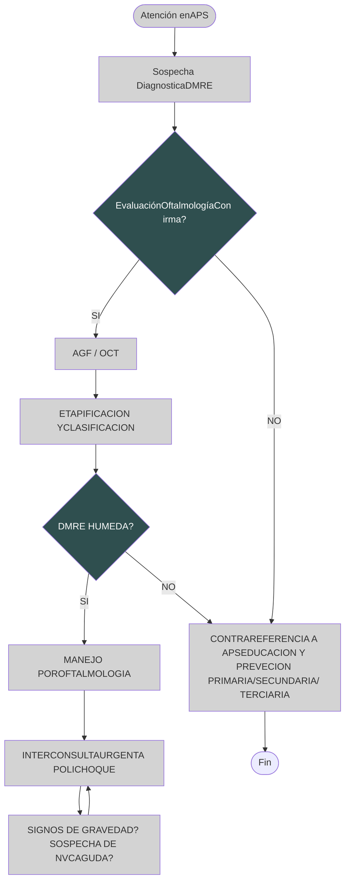
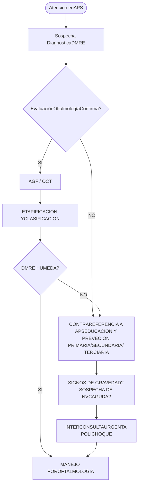

# PROT-GENERACION-DE-LA-MACULA-DEL-OJO-2018

--- Página 1 ---

**Departamento de Asesoría Jurídica**

EXENTA N° 2655

SANTIAGO, 28 SET. 2018

**VISTOS:** Memorándum N°35 de 20 de agosto de 2018 respectivamente, del Departamento de Calidad y Seguridad del Paciente, solicitando al Departamento de Asesoría Jurídica la aprobación de Protocolos Clínicos resolutivos que acompaña; Memorándum N°152 de 10 de septiembre de 2018, del Departamento de Asesoría Jurídica a través del cual se solicita al Departamento de Calidad y Seguridad del Paciente complementación de la información acompañada; Memorándum N°40 de 25 de septiembre de 2018, a través del cual el Departamento de Calidad y Seguridad del Paciente complementa su solicitud con la información requerida; y en uso de las atribuciones que me confiere el DFL. N°1/2005, en virtud del cual se fija el Texto Refundido, Coordinado y Sistematizado del D.L. N°2.763/79 y otras normas; lo contemplado en el Decreto Supremo N°140/04, Reglamento Orgánico de los Servicios de Salud y el Decreto Afecto N°56 de fecha 12 de julio de 2018, que nombra al suscrito en el cargo de Director de este Servicio de Salud Metropolitano Occidente, ambos del Ministerio de Salud; lo dispuesto por la Resolución N°1600/2008 de la Contraloría General de la República, y,

### CONSIDERANDO:

**I.** Que, con el fin de materializar los compromisos adquiridos por la Red Pública de Salud para el aumento de Altas de Consultas de la Especialidad (COMGES 6), se han constituido grupos de trabajo de profesionales clínicos y de gestión de la Red Occidente de Salud, de las áreas respectivas, con la finalidad de realizar una revisión bibliográfica nacional e internacional y a partir de la experiencia han sistematizado los antecedentes más relevantes a ser considerados al momento de enfrentarse con situaciones clínicas determinadas;

**II.** Que, del trabajo anteriormente descrito, se han podido determinar protocolos clínicos que permitirán a los profesionales contar con un apoyo al manejo clínico de los problemas prevalentes a los que se ven enfrentados los especialistas de la Red, favoreciendo la estandarización de los procesos dentro de los establecimientos de salud;

**III.** Que dentro de las condiciones clínicas analizadas se encuentra el Glaucoma, por cuanto se ha recopilado y sistematizado la mejor evidencia disponible sobre estudio y manejo de este cuadro generándose el "Protocolo Resolutivo de Degeneración de Macula y del Polo Posterior del Ojo";

**IV.** La conformidad del suscrito, se dicta la siguiente:

### RESOLUCIÓN

1. **APRUÉBASE** el "Protocolo Resolutivo de Degeneración de Mácula y del Polo Posterior del Ojo", elaborado por los profesionales del Hospital San Juan de Dios y Revisado por el Equipo de Trabajo COMGES 6, cuyo texto es el siguiente:

--- Página 2 ---

|            | Elaborado por:                                                                              | Revisado por:                                                                                                                                         | Aprobado por:                                           |
| ---------- | ------------------------------------------------------------------------------------------- | ----------------------------------------------------------------------------------------------------------------------------------------------------- | ------------------------------------------------------- |
| **Nombre** | Dr. Edgardo Sánchez. Dr. Tomás Rojas Dr. Felipe Morera                              | Dra Francisca Reyes Sra. Lya Reyes Dra Marisol Concha Sra. Carmen Luz Nachar                                                              | Dr. Darwin Letelier                                     |
| **Cargo**  | Jefe de Servicio de Oftalmología HSJD Jefe Dpto.Retina HSJD Médico Dpto. Retina | Subdirectora Médica Atención Ambulatoria Jefa SOME Jefe de Dpto. de calidad y seguridad del paciente Miembros comité COMGES 6 | Sub Director médico Servicio de Salud Occidente |
| **Firma**  |                                                                                             |                                                                                                                                                       |                                                         |

## 1.-Autores.-

1.1.- Dr. Edgardo Sanchez, Jefe de Servicio de Oftalmología Hospital San Juan de Dios

1.2.- Dr. Tomás Rojas, Médico Dpto. Retina, Oftalmología Hospital San Juan de Dios

1.3.- Dr. Felipe Morera, Médico Dpto. Retina, Oftalmología, Hospital San Juan de Dios

Se declara que no hay conflicto de interés en los profesionales que realizaron este protocolo.

--- Página 3 ---

## 2.- Comisión revisora

2.1-Dra Francisca Reyes, Jefa CDT Hospital San Juan de Dios

2.2- Comisión revisora: Equipo de trabajo COMGES 6 (por resolución)

## 3.- Introducción

Los Protocolos resolutivos de la especialidad de Oftalmología, forman parte de la implementación de procesos resolutivos que tienen como finalidad aumentar la oferta de consulta en la especialidad, definiendo patologías especificas con alta frecuencia de derivación y fácil resolución, generando un aumento en las altas de estas especialidades y una mejora en la referencia y contra referencia.

Para su ejecución, se han constituido equipos de trabajo integrados por profesionales de los ámbitos clínicos y de gestión, los cuales a través de una revisión bibliográfica de documentos nacionales e internacionales, y a partir de la experiencia clínica han sistematizado los antecedentes más relevantes a ser considerados al momento de enfrentarse con las situaciones clínicas descritas.

La experiencia internacional muestra que el desarrollo de guías y protocolos apoya el manejo clínico de los problemas prevalentes a los que se ven enfrentados los especialistas, favoreciendo la estandarización de los procesos dentro de las instituciones de salud. Con ellos se contribuye a disminuir la variabilidad en la práctica clínica uniformando criterios de manejo y de derivación a especialistas, cuando la condición clínica lo amerite, consensuando los criterios clínicos y los requerimientos de apoyo diagnóstico y terapéutico necesarios para la resolución del problema de salud.

La patología Oftalmológica, es una causa muy frecuente de consulta en el nivel primario de atención. A pesar de la existencia de UAPO en determinadas comunas, el nivel primario habitualmente se ve enfrentado a tomar decisiones sobre el manejo clínico de estos pacientes, a partir del conocimiento adquirido en el pregrado y la experiencia clínica adquirida en la práctica profesional

La degeneración macular relacionada con la edad (DMRE) es un problema en la retina. Se produce cuando una parte de la retina llamada mácula se daña. La DMRE le hace perder la visión central. No puede ver los detalles finos, ni de cerca ni de lejos. Sin embargo, la visión periférica (lateral) funciona normalmente. Por ejemplo, imagínese que está mirando un reloj con manecillas. Si tiene DMRE, quizá pueda ver los números del reloj pero no las manecillas.

Tiene mayores probabilidades de sufrir DMRE, si:

* consume una dieta alta en grasas saturadas (que se encuentran en alimentos como la carne, la mantequilla y el queso)
* tiene sobrepeso
* fuma cigarrillos
* tiene más de 50 años
* tiene antecedentes familiares de DMRE
* es caucásico (blanco)

--- Página 4 ---

# 4.-MAPA DE DERIVACIÓN DE CONSULTA DE ESPECIALIDAD DESDE APS Y HOSPITAL COMUNITARIO A HOSPITAL DE MAYOR COMPLEJIDAD. JUNIO 2016

| ESPECIALIDADGrupo Etario | Med. Fca. YRehabilitación | Oftalmología                                                                                                                       | Traumatología <15 años <15 años | Traumatología >15 años >15 años |
| ------------------------ | ------------------------- | ---------------------------------------------------------------------------------------------------------------------------------- | --------------------------------------- | --------------------------------------- |
| CERRO NAVIA              | SIN OFERTA EN LA RED  | Filtro por UAPO según cartera de Servicios, resto de la derivación a HSJDD. Desde UAPO se deriva directo a HSJDD   | HFBC                                    | CRS SAG                                 |
| QUINTA NORMAL            | SIN OFERTA EN LA RED  | Filtro por UAPO según cartera de Servicios, resto de la derivación a HSJDD. Desde UAPO se deriva directo a HSJDD   | HFBC                                    | IT                                      |
| RENCA                    | SIN OFERTA EN LA RED  | HSJDD                                                                                                                              | HFBC                                    | IT                                      |
| CURACAVI                 | SIN OFERTA EN LA RED  | HSJDD                                                                                                                              | HFBC                                    | IT                                      |
| ALHUE                    | SIN OFERTA EN LA RED  | Filtro por UAPO según cartera de Servicios, resto de la derivación a HOSMEL. Desde UAPO se deriva directo a HOSMEL | HFBC                                    | HOSMEL                                  |
| MARIA PINTO              | SIN OFERTA EN LA RED  | Filtro por UAPO según cartera de Servicios, resto de la derivación a HOSMEL. Desde UAPO se deriva directo a HOSMEL | HFBC                                    | HOSMEL                                  |
| MELIPILLA                | SIN OFERTA EN LA RED  | Filtro por UAPO según cartera de Servicios, resto de la derivación a HOSMEL. Desde UAPO se deriva directo a HOSMEL | HFBC                                    | HOSMEL                                  |
| SAN PEDRO                | SIN OFERTA EN LA RED  | Filtro por UAPO según cartera de Servicios, resto de la derivación a HOSMEL. Desde UAPO se deriva directo a HOSMEL | HFBC                                    | HOSMEL                                  |
| PADRE HURTADO            | SIN OFERTA EN LA RED  | HOSPEÑA                                                                                                                            | HFBC                                    | HOSTAL                                  |
| PEÑAFLOR                 | SIN OFERTA EN LA RED  | HOSPEÑA                                                                                                                            | HFBC                                    | HOSTAL                                  |

--- Página 5 ---

| TALAGANTE     | SIN OFERTA EN LA RED | Filtro por UAPO según cartera de Servicios, resto de la derivación a HSJDD. Desde UAPO se deriva directo a HSJDD | HFBC    | HOSTAL  |
| ------------- | -------------------- | ---------------------------------------------------------------------------------------------------------------- | ------- | ------- |
| EL MONTE      | SIN OFERTA EN LA RED | HSJDD                                                                                                            | HFBC    | HOSTAL  |
| ISLA DE MAIPO | SIN OFERTA EN LA RED | HSJDD                                                                                                            | HFBC    | HOSTAL  |
| PUDAHUEL      | SIN OFERTA EN LA RED | Filtro por UAPO según cartera de Servicios, resto de la derivación a CRS. Desde UAPO se deriva directo a HSJDD   | CRS SAG | CRS SAG |
| LO PRADO      | SIN OFERTA EN LA RED | Filtro por UAPO según cartera de Servicios, resto de la derivación a HSJDD. Desde UAPO se deriva directo a HSJDD | CRS SAG | CRS SAG |

## Glosario:

* **HSJDD**: Hospital San Juan de Dios
* **HFBC**: Hospital Félix Bulnes
* **IT**: Instituto Traumatológico
* **HOSPEÑA**: Hospital de Peñaflor
* **CRS SAG**: CRS Salvador Allende Gossens
* **HOSTAL**: Hospital de Talagante
* **HOSMEL**: Hospital de Melipilla

## 5.- Objetivos.-

5.1.- Determinar los criterios de manejo en el nivel primario de atención de pacientes Portadores de la patología oftalmológica Degeneración de mácula y polo posterior.

5.2.- Establecer criterios de derivación estándar hacia la especialidad de Oftalmología, como una forma de contribuir a la pertinencia de la derivación

## 6.- Alcance.-

6.1.- Centros de Salud Familiar
6.2.- Centros de Salud Urbanos y Rurales
6.3.- Hospitales de Baja y Mediana Complejidad
6.4.- Hospitales de Mayor complejidad
6.4.- Postas de Salud Rural
6.5.- Servicios de Atención Primaria de Urgencia

## 7.- Responsables de la ejecución.-

7.1.- Médicos de Atención Primaria Municipal
7.2.- Médicos de SAPUs
7.3.- Médicos de Unidades de Emergencia hospitalaria
7.3.- Médicos en Etapa de Destinación y Formación
7.4.- Médicos de nivel especialidad
7.5.- Comités de Gestión de Oferta y Demanda de nivel primario y secundario

## 8.- Distribución.-

8.1.- Box de Atención Médica de APS y Especialidad
8.2.- Box de Atención Médica de SAPUs
8.3.- Oficina de Comités de Gestión

--- Página 6 ---

# 9.- Responsabilidad del encargado:

9.1.- Implementación del protocolo
9.2.- Difusión
9.3.- Evaluaciones periódicas
9.4.- Proposición de medidas correctivas en caso de necesidad, etc.

# 10.- Población objetivo

-Usuarios mayores de 15 años pertenecientes a la red Occidente con diagnostico o sospecha de patología

# 10.1 - Tiempo de alta máxima permanencia en atención secundaria

Tiempo 4 meses y según evolución e indicación médica.

# Contenidos Específicos del Protocolo.-

10.2.- Definición : La Degeneración Macular Relacionada a la Edad (DMRE) es una enfermedad de curso crónico, que compromete la mácula, caracterizada por la presencia de drusas, alteraciones del Epitelio Pigmentario Retinal, atrofia del Epitelio Pigmentario Retinal (EPR) y Coriocapilaris, y en algunos casos neo vascularización sub o intraretinal, hemorragias y atrofia Macular secundario a cicatrización del polo posterior.

10.3.- Etiología.- La etiología no ha sido totalmente aclarada al día de hoy, sin embargo el desarrollo de la patología involucra una asociación entre una predisposición genética y otros factores de riesgo. Dentro del ámbito genético, mutaciones asociadas a genes involucrados en la vía metabólica bioquímica del EPR han sido identificados, incluyendo vías de transporte de lípidos y su metabolismo (ej. APOE), moduladores de matriz extracelular (ej. COL8A1, COL10A1, TIMP3), clearence del all-trans retinaldehido de fotoreceptores (ej. ABCA4) y angiogénicos (ej. VEGFA). Los dos genes con mayor asociación y susceptibilidad para desarrollar DMRE a la fecha reconocidos son el CFH, que codifica para el factor complemento H, y el ARMS2, cuyo producto proteico no ha sido aclarado a la fecha. En formas homocigotas, estas mutaciones aumentan el riesgo 7.4 veces v/s población general, en heterocigotos 4.6. El factor de riesgo más importante para el desarrollo de la patología es la edad, además del tabaquismo y los antecedentes familiares.

10.4.- Epidemiología.- La DMRE es la primera causa de ceguera legal en los países desarrollados en población mayor a 50 años. En EEUU, se estima que aproximadamente 15 millones de personas (85- 90% del total de afectados por DMRE) tiene la forma "seca" de la enfermedad, y 1.7 millones tendrían la forma "húmeda". Cada año se estima la incidencia de 200.000 nuevos casos de Neo vascularización macular secundario a DMRE en Norteamérica. El factor de riesgo mas importante para el desarrollo de la patología es la edad (10% a los 65 años, >25% sobre los 75 años), además del tabaquismo, sexo femenino, Hipertensión Arterial, enfermedad Cardiovascular, Hipermetropía e historia familiar.

# 10.5 .-Clasificación clínica.-

| Variable  | Tipo         | Síntomas                                                                                                                                     | Signos                                                                                                                 |
| --------- | ------------ | -------------------------------------------------------------------------------------------------------------------------------------------- | ---------------------------------------------------------------------------------------------------------------------- |
| DMRE seca | Drusas duras | Asintomática Disminución variable de la Agudeza Visual (AV) Disminución de la Sensibilidad al contraste Mala adaptación nocturna | Segmento Anterior sin alteraciones Drusas duras al fondo de ojo en región macular Desprendimiento de EPR (DEP) |

--- Página 7 ---

| DMRE húmeda | Drusas blandas              | Asintomática Disminución variable de la Agudeza Visual (AV) Disminución de la Sensibilidad al contraste Mala adaptación nocturna | Drusas blandas al fondo de ojo Desprendimiento de EPR (DEP)                                                                                                                                              |
| ----------- | --------------------------- | -------------------------------------------------------------------------------------------------------------------------------------------- | ------------------------------------------------------------------------------------------------------------------------------------------------------------------------------------------------------------ |
|             | Neo vascularización Macular | Disminución brusca de la AV Metamorfopsias Entopsias Fotopsias Alteración del Campo Visual (Escotoma Central)                | Presencia de Liquido Sub retinal o intraretinal Presencia de hemorragia sub retinal o intraretinal Anillo pigmentario circundante a hemorragia Elevación irregular de EPR o PED Desgarro EPR |
|             | Atrofia Macular             | Mala visión crónica Escotoma central                                                                                                     | Cicatrización disciforme de polo posterior                                                                                                                                                                   |

## 10.6.- Diagnóstico diferencial.-

* Corioretinopatia Central Serosa
* Maculopatia Viteliforme hereditaria o adquirida (ej. Enfermedad de Best)
* Toxicidad Macular inducida por fármacos (ej. Hidroxicloroquina)
* Retinopatía Diabética (exudados maculares en contexto Edema Macular Diabético)
* Maculopatia Miopica y Membrana Neo vascular Miopica

## 10.7.- Síntomas.-
Dependiendo de la etapa de la enfermedad, esta puede ir desde ser Asintomática, a la disminución lenta o brusca de la AV (en caso de una Neo vascularización Coroidea), disminución de la sensibilidad al contraste, mala adaptación nocturna, metamorfopsias, entopsias, fotopsias y la alteración del campo visual con presencia de escotoma central.

## 10.8.- Manejo médico

* Educación y seguimiento: ojos con drusas blandas y cambios pigmentarios del EPR tiene alto riesgo de presentar Neo vascularización Coroidea. Se debe realizar educación en relación a síntomas agudos y la necesidad de consultar a Especialista Oftalmología (Derivación precoz).

En caso de disminución brusca de la AV, tanto de lejos como para visión cercana, fotopsias o metamorfopsias, la derivación a evaluación por Oftalmología debe ser precoz.

* Rejilla de Amsler: enseñar a paciente autocuidado diario, con evaluación individual de cada ojo con la visualización de la Rejilla de Amsler en su domicilio. Ante la presencia de cambios visuales (metamorfopsias, visión borrosa) se debe educar en consulta precoz para su derivación a Oftalmología.

* Micronutrientes: Estudio AREDS 1 y 2 concluyen el beneficio de suplementar diariamente a pacientes con antecedente de DMRE en un ojo en etapa húmeda, con el objetivo de disminuir la evolución del ojo contralateral a formas graves de enfermedad en etapa leve a moderada (drusas secas o blandas). El suplemento considera la toma en una formula diaria de Vitamina C 500mg, Vitamina E 400UI, Luteína 10mg, Zeaxantina 2mg, Zinc 80mg.

* Estilos de vida saludable: Suspender el Tabaquismo, Reducción de Obesidad y control de Hipertensión Arterial con disminución de Riesgo Cardiovascular.

## 10.9.- Manejo quirúrgico.-

* Terapia Antiangiogenica. Administración Intravitrea de antiangiogenicos (Bevacizumab, Ranibizumab, Aflibercept). Manejo por Oftalmología, actualmente el Gold Standard en el manejo de la DMRE en etapa Humedad (presencia de Neo vascularización Coroidea)
* Laser: actualmente en desuso
* Terapia Fotodinámica: actualmente en desuso
* Cirugía Vitreretinal: en casos excepcionales, bajo directa indicación y supervisión de subespecialista en Retina y cirugía Vitreoretinal.

## 10.10.- Esquema de tratamiento en establecimientos de menor complejidad.-

--- Página 8 ---

* Prevención primaria: educación a la población en factores de riesgo modificables
* Pesquisa en pacientes sospechosos: pacientes >50 años con factores de riesgo asociado
* Derivación precoz ante signos de alarma
* Derivación a UAPO para rehabilitación visual en pacientes secuelados con baja visión (etapas atróficas cicatrízales)

## 11..- Criterios de referencia y contra referencia

## 11.1.- Referencia de atención primaria a Oftalmología

* Paciente con sospecha de DMRE para evaluación por Oftalmología
* Paciente con diagnostico DMRE y síntomas de gravedad (disminución brusca de AV, metamorfopsias, fotopsias, escotoma central reciente): DERIVACION URGENTE

## 11.2.- Referencia de Oftalmología a atención primaria

* Paciente con diagnostico DMRE etapa seca sin signos de gravedad, control ambulatorio con educación patología y Rejilla de Amsler

## 12.- Metodología de evaluación

Será responsable de la evaluación del Dpto. de Calidad y Seguridad del Paciente.

Se establecen los criterios de auditoria con el fin de mostrar evidencia de Implementación de los 4 protocolos resolutivos 2018

Se evidenciará esta implementación a través de una auditoría de fichas clínica en los establecimientos de la Red, esta auditoría será responsabilidad del Servicio de Salud, del Dpto. de calidad y seguridad del paciente.

**Procedimiento:**

- Seleccionar los pacientes atendidos a nivel secundario con diagnóstico de las patologías protocolizadas, de éstos se seleccionará una muestra representativa (según estadística)
- Se solicitará en APS (Dr. Vélez), los pacientes atendidos por las patologías a nivel primario y las interconsultas realizadas.
- Realizar revisión de: Ficha nivel Primario e Interconsulta a través de plataforma Rayen y Ficha de Nivel secundario a través ficha física de papel de acuerdo a pauta.
- Se buscará en la ficha clínica de papel o electrónica la presencia o no, de 3 elementos relevantes del protocolo para cada nivel de atención:

### CRITERIOS DE EVALUACIÓN

**NIVEL PRIMARIO (APS)**

1.-Antecedentes clínicos. (SI-NO)
2.-Criterios de referencias establecidos en el protocolo.
3.-Hipótesis diagnostica (SI-NO)

**INTERCONSULTA**

1.- Presencia de antecedentes personales. (SI-NO)
2.- Hipótesis diagnóstica. (SI-NO)
3.- Criterios de derivación.

**NIVEL SECUNDARIO**

1.-Evaluación clínica. (SI- NO)
2.-Existe confirmación diagnóstica. (SI-NO)
3.-Existe plan o indicaciones terapéuticas. (SI-NO)

--- Página 9 ---

# INDICADORES

## INDICADOR1

| NOMBRE                                                                               | FORMULA                                                                                    | FUENTE                | PERIO DICID AD | RESPONSABLE                               |
| ------------------------------------------------------------------------------------ | ------------------------------------------------------------------------------------------ | --------------------- | -------------- | ----------------------------------------- |
| tiempo promedio desde ingreso lista de espera hasta alta, de patología protocolizada | suma de los días desde el ingreso hasta el alta /N° de altas de la patología protocolizada | sigte - ficha clínica | 1 vez al año   | Dpto. de calidad y seguridad del paciente |

## INDICADOR 2

| NOMBRE                                                                                                                                                                 | FORMULA                                                                                                                                                                                                                                                              | FUENTE                                                                  | PERIO DICID AD | RESPONSABLE                               |
| ---------------------------------------------------------------------------------------------------------------------------------------------------------------------- | -------------------------------------------------------------------------------------------------------------------------------------------------------------------------------------------------------------------------------------------------------------------- | ----------------------------------------------------------------------- | -------------- | ----------------------------------------- |
| Pacientes auditados con diagnóstico de patología protocolizada que contengan al menos la presencia de 3 elementos relevantes del protocolo para cada nivel de atención | N° pacientes revisados con diagnóstico de degeneración de la macula que contengan al menos la presencia de 3 elementos relevantes del protocolo para cada nivel de atención/ total de pacientes revisados en el periodo con diagnóstico de degeneración de la mácula | Revisión de registros Rayen .interconsulta ,ficha clínica en hospitales | 1 vez al año   | Dpto. de calidad y seguridad del paciente |

**La evaluación para el año 2018 será:**

\*Auditoría de ficha clínica en el cuarto trimestre del 2018.

# 13.-Plan de Difusión

**Responsabilidades:**

**Servicio de Salud:**

* -Ordinario de Dirección del Servicio con protocolos, a toda la red Occidente.
* -Subir protocolos a página web de servicio

**Subdirección Médica Atención Ambulatoria:**

Dra. Francisca Reyes y Dra. Arrué: Supervisión de presencia de protocolos en atención secundaria.

**Subdirección APS:**

Dr. Luis Vélez: Supervisión de presencia de protocolos en atención primaria

--- Página 10 ---

# 14.- FLUJOGRAMA DE DERIVACION DMRE.-

# 15.- Bibliografía.-

\* Age-Related Eye Disease Study 2 Research Group. Lutein + zeaxanthin and omega-3 fatty acids for agerelated macular degeneration: the Age-Related Eye Disease Study 2 (AREDS2) randomized clinical trial. JAMA. 2013; 309(19):2005-2015. Eye

\* Ferris FL, Davis MD, Clemons TE, et al; Age-Related Eye Disease Study (AREDS) Research Group. A simplified severityscale for age-related macular degeneration: AREDS report no. 18. Arch Ophthalmol. 2005;123(11):1570-1574

\* Rofagha S, Bhisitkul RB, Boyer DS, Sadda SR, Zhang K; SEVEN-UP Study Group. Seven-year outcomes in ranibizumab-treated patients in ANCHOR, MARINA, and HORIZON: a multicenter cohort study (SEVEN-UP). Ophthalmology. 2013;120(11):2292-229

\* CATT Research Group, Martin DF, Maguire MG, et al. Ranibizumab and bevacizumab for neovascular age-related macular degeneration. N

--- Página 11 ---

* CATT Research Group, Martin DF, Maguire MG, et al. Ranibizumab and bevacizumab for treatment of neovascular age-related macular degeneration: two-year results. Ophthalmology. 2012;119(7):1388-139
* Brown DM, Kaiser PK, Michels M, et al; ANCHOR Study Group. Ranibizumab versus verteporfin for neovascular age-related macular degeneration. N Engl J Med. 2006; 355(14):1432-1444.
* Heier JS, Brown DM, Chong V, et al. Intravitreal aflibercept (VEGF trap-eye) in wet age-related macular degeneration. Ophthalmology. 2012;119(12):2537-2548
* Chui Ming Gemmy Cheung, Jennifer J. Arnold, Frank G. Holz, Kyu Hyung Park, Timothy Y.Y. Lai, Michael Larsen, Paul Mitchell, Kyoko Ohno-Matsui, Shih-Jen Chen, Sebastian Wolf, Tien Yin Wong, Myopic Choroidal Neovascularization, Ophthalmology, 2017, ISSN 0161-6420.

**2. PUBLÍQUESE** el contenido de la presente Resolución en el Portal www.mercadopublico.cl a fin de cumplir con los requerimientos de la Ley de Compras y Contrataciones Públicas.

**ANÓTESE Y COMUNÍQUESE.**

[signature]
**DR. FRANCISCO MIRANDA GUERRERO**
**DIRECTOR**
**SERVICIO DE SALUD METROPOLITANO OCCIDENTE**

**<u>DISTRIBUCIÓN:</u>**

* Departamento de Calidad y Seguridad del Paciente.
* <mark>Asesoría Jurídica.</mark>
* Oficina de Partes.

**TRANSCRITO FIELMENTE**
**XIMENA VARAS CONTRERAS**
**MINISTRO DEL FE**

--- Página 12 ---

| N° PAGINAS 15 | Servicio de SaludOccidente | FECHA REVISIONJunio de 2021 | FECHAELABORACIONJunio 2018 N° VERSIÓN1 |
| ------------- | -------------------------- | --------------------------- | ------------------------------------------ |

# Protocolo resolutivo de Degeneración de la mácula y del polo posterior del ojo

--- Página 13 ---

|        | Elaborado por:                                                                               | Revisado por:                                                                                                                                             | FECHA REVISIONJunio de 2021 Aprobado por:           | N° PAGINAS 19 N° VERSIÓN1 Aprobado por: | Servicio de SaludOccidente N° VERSIÓN1 Aprobado por: | N° VERSIÓN1 Aprobado por: | FECHAELABORACIONJunio 2018 N° VERSIÓN1 Aprobado por: |
| ------ | -------------------------------------------------------------------------------------------- | --------------------------------------------------------------------------------------------------------------------------------------------------------- | ------------------------------------------------------- | ----------------------------------------------- | ------------------------------------------------------------ | ----------------------------- | ------------------------------------------------------------ |
| Nombre | Dr. Edgardo Sánchez. Dr. Tomás Rojas Dr. Felipe Morera                               | Dra Francisca Reyes Sra. Lya Reyes Dra Marisol Concha Sra. Carmen Luz Nachar                                                                  | Dr. Darwin Letelier                                     |                                                 |                                                              |                               |                                                              |
| Cargo  | Jefe de Servicio de Oftalmología HSJD Jefe Dpto. Retina HSJD Médico Dpto. Retina | Subdirectora Médica Atención Ambulatoria Jefa SOME Jefe de Dpto. de calidad y seguridad del paciente Miembros comité COMGES 6 | Sub Director médico Servicio de Salud Occidente |                                                 |                                                              |                               |                                                              |
| Firma  | \[signature: Dr. Sanchez] \[signature: Dr. Rojas] \[signature: Dr. Morera]           | \[signature]                                                                                                                                              | \[signature]                                            |                                                 |                                                              |                               |                                                              |

# 1.-Autores.-

1.1.- Dr. Edgardo Sanchez, Jefe de Servicio de Oftalmología Hospital San Juan de Dios

1.2.- Dr. Tomás Rojas, Médico Dpto. Retina, Oftalmología Hospital San Juan de Dios

1.3.- Dr. Felipe Morera, Médico Dpto. Retina, Oftalmología, Hospital San Juan de Dios

Se declara que no hay conflicto de interés en los profesionales que realizaron este protocolo.

# 2.- Comisión revisora

--- Página 14 ---

|   | N° PAGINAS 15 | Servicio de SaludOccidente | FECHA REVISIONJunio de 2021 | FECHAELABORACIONJunio 2018 N° VERSIÓN1 |
| - | ------------- | -------------------------- | --------------------------- | ------------------------------------------ |

## 1.-Autores.-

1.1.- Dr. Edgardo Sanchez, Jefe de Servicio de Oftalmología Hospital San Juan de Dios

1.2.-Dr. Tomás Rojas, Médico Dpto. Retina, Oftalmología Hospital San Juan de Dios

1.3.- Dr. Felipe Morera, Médico Dpto. Retina, Oftalmología, Hospital San Juan de Dios

**Se declara que no hay conflicto de interés en los profesionales que realizaron este protocolo.**

## 2.- Comisión revisora

2.1-Dra Francisca Reyes, Jefa CDT Hospital San Juan de Dios

2.2- Comisión revisora: Equipo de trabajo COMGES 6 (por resolución)

## 3.- Introducción

Los Protocolos resolutivos de la especialidad de Oftalmología, forman parte de la implementación de procesos resolutivos que tienen como finalidad aumentar la oferta de consulta en la especialidad, definiendo patologías especificas con alta frecuencia de derivación y fácil resolución, generando un aumento en las altas de estas especialidades y una mejora en la referencia y contra referencia.

Para su ejecución, se han constituido equipos de trabajo integrados por profesionales de los ámbitos clínicos y de gestión, los cuales a través de una revisión bibliográfica de documentos nacionales e internacionales, y a partir de la experiencia clínica han sistematizado los antecedentes más relevantes a ser considerados al momento de enfrentarse con las situaciones clínicas descritas.

La experiencia internacional muestra que el desarrollo de guías y protocolos apoya el manejo clínico de los problemas prevalentes a los que se ven enfrentados los especialistas, favoreciendo la estandarización de los procesos dentro de las instituciones de salud. Con ellos se contribuye a disminuir la variabilidad en la práctica clínica uniformando criterios de manejo y de derivación a especialistas, cuando la condición clínica lo amerite, consensuando los criterios clínicos y los requerimientos de apoyo diagnóstico y terapéutico necesarios para la resolución del problema de salud.

La patología Oftalmológica, es una causa muy frecuente de consulta en el nivel primario de atención. A pesar de la existencia de UAPO en determinadas comunas, el nivel primario habitualmente se ve enfrentado a tomar decisiones sobre el manejo clínico de estos pacientes, a partir del conocimiento adquirido en el pregrado y la experiencia clínica adquirida en la práctica profesional.

--- Página 15 ---

|   | N° PAGINAS 15 | Servicio de SaludOccidente | FECHAELABORACIONJunio 2018 FECHA REVISIONJunio de 2021 | FECHAELABORACIONJunio 2018 N° VERSIÓN1 |
| - | ------------- | -------------------------- | ---------------------------------------------------------- | ------------------------------------------ |

La degeneración macular relacionada con la edad (DMRE) es un problema en la <u>retina</u>. Se produce cuando una parte de la retina llamada <u>mácula</u> se daña. La DMRE le hace perder la visión central. No puede ver los detalles finos, ni de cerca ni de lejos. Sin embargo, la visión periférica (lateral) funciona normalmente. Por ejemplo, imagínese que está mirando un reloj con manecillas. Si tiene DMRE, quizá pueda ver los números del reloj pero no las manecillas.

Tiene mayores probabilidades de sufrir DMRE, si:

* consume una dieta alta en grasas saturadas (que se encuentran en alimentos como la carne, la mantequilla y el queso)
* tiene sobrepeso
* <u>fuma cigarrillos</u>
* tiene más de 50 años
* tiene antecedentes familiares de DMRE
* es caucásico (blanco)

--- Página 16 ---

|   | N° PAGINAS 15 | Servicio de SaludOccidente | FECHAELABORACIONJunio 2018 FECHA REVISIONJunio de 2021 | FECHAELABORACIONJunio 2018 N° VERSIÓN1 |
| - | ------------- | -------------------------- | ---------------------------------------------------------- | ------------------------------------------ |

# 4.-MAPA DE DERIVACIÓN DE CONSULTA DE ESPECIALIDAD DESDE APS Y HOSPITAL COMUNITARIO A HOSPITAL DE MAYOR COMPLEJIDAD. JUNIO 2016

| ESPECIALIDAD Grupo Etario | Med. Fca. YRehabilitación | Oftalmología                                                                                                       | Traumatología <15 años | Traumatología >15 años |
| ----------------------------- | ------------------------- | ------------------------------------------------------------------------------------------------------------------ | -------------------------- | -------------------------- |
| CERRO NAVIA                   | SIN OFERTA EN LA RED      | Filtro por UAPO según cartera de Servicios, resto de la derivación a HSJDD. Desde UAPO se deriva directo a HSJDD   | HFBC                       | CRS SAG                    |
| QUINTA NORMAL                 | SIN OFERTA EN LA RED      | Filtro por UAPO según cartera de Servicios, resto de la derivación a HSJDD. Desde UAPO se deriva directo a HSJDD   | HFBC                       | IT                         |
| RENCA                         | SIN OFERTA EN LA RED      | HSJDD                                                                                                              | HFBC                       | IT                         |
| CURACAVI                      | SIN OFERTA EN LA RED      | HSJDD                                                                                                              | HFBC                       | IT                         |
| ALHUE                         | SIN OFERTA EN LA RED      | Filtro por UAPO según cartera de Servicios, resto de la derivación a HOSMEL. Desde UAPO se deriva directo a HOSMEL | HFBC                       | HOSMEL                     |
| MARIA PINTO                   | SIN OFERTA EN LA RED      | Filtro por UAPO según cartera de Servicios, resto de la derivación a HOSMEL. Desde UAPO se deriva directo a HOSMEL | HFBC                       | HOSMEL                     |
| MELIPILLA                     | SIN OFERTA EN LA RED      | Filtro por UAPO según cartera de Servicios, resto de la derivación a HOSMEL. Desde UAPO se deriva directo a HOSMEL | HFBC                       | HOSMEL                     |

--- Página 17 ---

| N° PAGINAS 15 | Servicio de Salud Occidente | FECHA REVISION Junio de 2021 | FECHA ELABORACION Junio 2018 N° VERSIÓN 1 |
| ------------- | --------------------------- | ---------------------------- | --------------------------------------------- |

| SAN PEDRO     | SIN OFERTA EN LA RED | Filtro por UAPO según cartera de Servicios, resto de la derivación a HOSMEL. Desde UAPO se deriva directo a HOSMEL | HFBC    | HOSMEL  |
| ------------- | -------------------- | ------------------------------------------------------------------------------------------------------------------ | ------- | ------- |
| PADRE HURTADO | SIN OFERTA EN LA RED | HOSPEÑA                                                                                                            | HFBC    | HOSTAL  |
| PEÑAFLOR      | SIN OFERTA EN LA RED | HOSPEÑA                                                                                                            | HFBC    | HOSTAL  |
| TALAGANTE     | SIN OFERTA EN LA RED | Filtro por UAPO según cartera de Servicios, resto de la derivación a HSJDD. Desde UAPO se deriva directo a HSJDD   | HFBC    | HOSTAL  |
| EL MONTE      | SIN OFERTA EN LA RED | HSJDD                                                                                                              | HFBC    | HOSTAL  |
| ISLA DE MAIPO | SIN OFERTA EN LA RED | HSJDD                                                                                                              | HFBC    | HOSTAL  |
| PUDAHUEL      | SIN OFERTA EN LA RED | Filtro por UAPO según cartera de Servicios, resto de la derivación a CRS. Desde UAPO se deriva directo a HSJDD     | CRS SAG | CRS SAG |
| LO PRADO      | SIN OFERTA EN LA RED | Filtro por UAPO según cartera de Servicios, resto de la derivación a HSJDD. Desde UAPO se deriva directo a HSJDD   | CRS SAG | CRS SAG |

**Glosario:**

* **HSJDD:** Hospital San Juan de Dios
* **HFBC:** Hospital Félix Bulnes
* **IT:** Instituto Traumatológico
* **HOSPEÑA:** Hospital de Peñaflor
* **CRS SAG:** CRS Salvador Allende Gossens
* **HOSTAL:** Hospital de Talagante
* **HOSMEL:** Hospital de Melipilla

--- Página 18 ---

|   | N° PAGINAS 15 | Servicio de SaludOccidente | FECHAELABORACIONJunio 2018 FECHA REVISIONJunio de 2021 | FECHAELABORACIONJunio 2018 N° VERSIÓN1 |
| - | ------------- | -------------------------- | ---------------------------------------------------------- | ------------------------------------------ |

# 5.- Objetivos.-

5.1.- Determinar los criterios de manejo en el nivel primario de atención de pacientes Portadores de la patología oftalmológica Degeneración de mácula y polo posterior

5.2.- Establecer criterios de derivación estándar hacia la especialidad de Oftalmología como una forma de contribuir a la pertinencia de la derivación

# 6.- Alcance.-

6.1.- Centros de Salud Familiar

6.2.- Centros de Salud Urbanos y Rurales

6.3.- Hospitales de Baja y Mediana Complejidad

6.4.- Hospitales de Mayor complejidad

6.4.- Postas de Salud Rural

6.5.- Servicios de Atención Primaria de Urgencia

# 7.- Responsables de la ejecución.-

7.1.- Médicos de Atención Primaria Municipal

7.2.- Médicos de SAPUs

7.3.- Médicos de Unidades de Emergencia hospitalaria

7.3.- Médicos en Etapa de Destinación y Formación

7.4.- Médicos de nivel especialidad

7.5.- Comités de Gestión de Oferta y Demanda de nivel primario y secundario

# 8.- Distribución.-

8.1.- Box de Atención Médica de APS y Especialidad

8.2.- Box de Atención Médica de SAPUs

8.3.- Oficina de Comités de Gestión

# 9.- Responsabilidad del encargado:

9.1.- Implementación del protocolo

9.2.- Difusión

9.3.- Evaluaciones periódicas

9.4.- Proposición de medidas correctivas en caso de necesidad, etc.

# 10.- Población objetivo

-Usuarios mayores de 15 años pertenecientes a la red Occidente con diagnostico o sospecha de patología

## 10.1 - Tiempo de alta máxima permanencia en atención secundaria

Tiempo 4 meses y según evolución e indicación médica.

--- Página 19 ---

|   | N° PAGINAS 15 | Servicio de SaludOccidente | FECHAELABORACIONJunio 2018 FECHA REVISIONJunio de 2021 | FECHAELABORACIONJunio 2018 N° VERSIÓN1 |
| - | ------------- | -------------------------- | ---------------------------------------------------------- | ------------------------------------------ |

# <u>Contenidos Específicos del Protocolo.-</u>

**10.2.- Definición :** La Degeneración Macular Relacionada a la Edad (DMRE) es una enfermedad de curso crónico, que compromete la mácula, caracterizada por la presencia de drusas, alteraciones del Epitelio Pigmentario Retinal, atrofia del Epitelio Pigmentario Retinal (EPR) y Coriocapilaris, y en algunos casos neo vascularización sub o intraretinal, hemorragias y atrofia Macular secundario a cicatrización del polo posterior.

**10.3.- Etiología.-** La etiología no ha sido totalmente aclarada al día de hoy, sin embargo el desarrollo de la patología involucra una asociación entre una predisposición genética y otros factores de riesgo. Dentro del ámbito genético, mutaciones asociadas a genes involucrados en la vía metabólica bioquímica del EPR han sido identificados, incluyendo vías de transporte de lípidos y su metabolismo (ej. APOE), moduladores de matriz extracelular (ej. COL8A1, COL10A1, TIMP3), clearence del all-trans retinaldehido de fotoreceptores (ej. ABCA4) y angiogénicos (ej. VEGFA). Los dos genes con mayor asociación y susceptibilidad para desarrollar DMRE a la fecha reconocidos son el CFH, que codifica para el factor complemento H, y el ARMS2, cuyo producto proteico no ha sido aclarado a la fecha. En formas homocigotas, estas mutaciones aumentan el riesgo 7.4 veces v/s población general, en heterocigotos 4.6. El factor de riesgo más importante para el desarrollo de la patología es la edad, además del tabaquismo y los antecedentes familiares.

**10.4.- Epidemiología.-** La DMRE es la primera causa de ceguera legal en los países desarrollados en población mayor a 50 años. En EEUU, se estima que aproximadamente 15 millones de personas (85- 90% del total de afectados por DMRE) tiene la forma "seca" de la enfermedad, y 1.7 millones tendrían la forma "húmeda". Cada año se estima la incidencia de 200.000 nuevos casos de Neo vascularización macular secundario a DMRE en Norteamérica. El factor de riesgo mas importante para el desarrollo de la patología es la edad (10% a los 65 años, >25% sobre los 75 años), además del tabaquismo, sexo femenino, Hipertensión Arterial, enfermedad Cardiovascular, Hipermetropía e historia familiar.

--- Página 20 ---

| N° PAGINAS 15 | Servicio de SaludOccidente | FECHA REVISIONJunio de 2021 | FECHAELABORACIONJunio 2018 N° VERSIÓN1 |
| ------------- | -------------------------- | --------------------------- | ------------------------------------------ |

## 10.5 .-Clasificación clínica.-

| Variable        | Tipo                                 | Síntomas                                                                                                                                                 | Signos                                                                                                                                                                                                                   |
| --------------- | ------------------------------------ | -------------------------------------------------------------------------------------------------------------------------------------------------------- | ------------------------------------------------------------------------------------------------------------------------------------------------------------------------------------------------------------------------ |
| DMRE seca   | Drusas duras                         | Asintomática Disminución variable de la Agudeza Visual (AV) Disminución de la Sensibilidad al contraste Mala adaptación nocturna | Segmento Anterior sin alteraciones Drusas duras al fondo de ojo en región macular Desprendimiento de EPR (DEP)                                                                                               |
|                 | Drusas blandas                   | Asintomática Disminución variable de la Agudeza Visual (AV) Disminución de la Sensibilidad al contraste Mala adaptación nocturna | Drusas blandas al fondo de ojo Desprendimiento de EPR (DEP)                                                                                                                                                          |
| DMRE húmeda | Neo vascularizació n Macular | Disminución brusca de la AV Metamorfopsias Entopsias Fotopsias Alteración del Campo Visual (Escotoma Central                 | Presencia de Liquido Sub retinal o intraretinal Presencia de hemorragia sub retinal o intraretinal Anillo pigmentario circundante a hemorragia Elevación irregular de EPR o PED Desgarro EPR |
|                 | Atrofia Macular                      | Mala visión crónica Escotoma central                                                                                                                 | Cicatrización disciforme de polo posterior                                                                                                                                                                           |

## 10.6.- Diagnóstico diferencial.-

* Corioretinopatia Central Serosa
* Maculopatia Viteliforme hereditaria o adquirida (ej. Enfermedad de Best)
* Toxicidad Macular inducida por fármacos (ej. Hidroxicloroquina)
* Retinopatía Diabética (exudados maculares en contexto Edema Macular Diabético)
* Maculopatia Miopica y Membrana Neo vascular Miopica

**10.7.- Síntomas.-** Dependiendo de la etapa de la enfermedad, esta puede ir desde ser Asintomática, a la disminución lenta o brusca de la AV (en caso de una Neo vascularización Coroidea), disminución de la sensibilidad al contraste, mala adaptación nocturna, metamorfopsias, entopsias, fotopsias y la alteración del campo visual con presencia de escotoma central.

## 10.8.- Manejo médico

* Educación y seguimiento: ojos con drusas blandas y cambios pigmentarios del EPR tiene alto riesgo de presentar Neo vascularización Coroidea. Se debe realizar educación en relación a síntomas agudos y la necesidad de consultar a Especialista Oftalmología (Derivación precoz).

--- Página 21 ---

|   | N° PAGINAS 15 | Servicio de Salud Occidente FECHA REVISIONJunio de 2021 | Servicio de Salud Occidente FECHA ELABORACION Junio 2018N° VERSIÓN 1 |
| - | ------------- | ----------------------------------------------------------- | ------------------------------------------------------------------------ |

En caso de disminución brusca de la AV, tanto de lejos como para visión cercana, fotopsias o metamorfopsias, la derivación a evaluación por Oftalmología debe ser precoz.

* Rejilla de Amsler: enseñar a paciente autocuidado diario, con evaluación individual de cada ojo con la visualización de la Rejilla de Amsler en su domicilio. Ante la presencia de cambios visuales (metamorfopsias, visión borrosa) se debe educar en consulta precoz para su derivación a Oftalmología.

* Micronutrientes: Estudio AREDS 1 y 2 concluyen el beneficio de suplementar diariamente a pacientes con antecedente de DMRE en un ojo en etapa húmeda, con el objetivo de disminuir la evolución del ojo contralateral a formas graves de enfermedad en etapa leve a moderada (drusas secas o blandas). El suplemento considera la toma en una formula diaria de Vitamina C 500mg, Vitamina E 400UI, Luteína 10mg, Zeaxantina 2mg, Zinc 80mg.

* Estilos de vida saludable: Suspender el Tabaquismo, Reducción de Obesidad y control de Hipertensión Arterial con disminución de Riesgo Cardiovascular.

10.9.- Manejo quirúrgico.-

* Terapia Antiangiogenica. Administración Intravitrea de antiangiogenicos (Bevacizumab, Ranibizumab, Aflibercept). Manejo por Oftalmología, actualmente el Gold Standard en el manejo de la DMRE en etapa Humedad (presencia de Neo vascularización Coroidea)

* Laser: actualmente en desuso

* Terapia Fotodinámica: actualmente en desuso

* Cirugía Vitreretinal: en casos excepcionales, bajo directa indicación y supervisión de subespecialista en Retina y cirugía Vitreoretinal

10.10.- Esquema de tratamiento en establecimientos de menor complejidad.-

* Prevención primaria: educación a la población en factores de riesgo modificables

* Pesquisa en pacientes sospechosos: pacientes >50 años con factores de riesgo asociado

* Derivación precoz ante signos de alarma

* Derivación a UAPO para rehabilitación visual en pacientes secuelados con baja visión (etapas atróficas cicatrízales)

11..- Criterios de referencia y contra referencia

11.1.- Referencia de atención primaria a Oftalmología

* Paciente con sospecha de DMRE para evaluación por Oftalmología

* Paciente con diagnostico DMRE y síntomas de gravedad (disminución brusca de AV, metamorfopsias, fotopsias, escotoma central reciente): DERIVACION URGENTE

11.2.- Referencia de Oftalmología a atención primaria

* Paciente con diagnostico DMRE etapa seca sin signos de gravedad, control ambulatorio con educación patología y Rejilla de Amsler

--- Página 22 ---

| N° PAGINAS 15 | Servicio de SaludOccidente | FECHA REVISIONJunio de 2021 | FECHAELABORACIONJunio 2018 N° VERSIÓN1 |
| ------------- | -------------------------- | --------------------------- | ------------------------------------------ |

# 12.- Metodología de evaluación

Será responsable de la evaluación del Dpto. de Calidad y Seguridad del Paciente.

Se establecen los criterios de auditoria con el fin de mostrar evidencia de Implementación de los 4 protocolos resolutivos 2018

Se evidenciará esta implementación a través de una auditoría de fichas clínica en los establecimientos de la Red, esta auditoría será responsabilidad del Servicio de Salud, del Dpto. de calidad y seguridad del paciente.

**Procedimiento:**

* Seleccionar los pacientes atendidos a nivel secundario con diagnóstico de las patologías protocolizadas, de éstos se seleccionará una muestra representativa (según estadística)

* Se solicitará en APS (Dr. Vélez), los pacientes atendidos por las patologías a nivel primario y las interconsultas realizadas.

* Realizar revisión de: Ficha nivel Primario e Interconsulta a través de plataforma Rayen y Ficha de Nivel secundario a través ficha física de papel de acuerdo a pauta.

* Se buscará en la ficha clínica de papel o electrónica la presencia o no ,de 3 elementos relevantes del protocolo para cada nivel de atención:

## CRITERIOS DE EVALUACIÓN

### NIVEL PRIMARIO (APS)

1.-Antecedentes clínicos. (SI-NO)

2.-Criterios de referencias establecidos en el protocolo.

3.-Hipótesis diagnostica (SI-NO)

### INTERCONSULTA

1.- Presencia de antecedentes personales. (SI-NO)

2.- Hipótesis diagnóstica. (SI-NO)

3.- Criterios de derivación.

### NIVEL SECUNDARIO

1.-Evaluación clínica. (SI- NO)

2.-Existe confirmación diagnóstica. (SI-NO)

3.-Existe plan o indicaciones terapéuticas. (SI-NO)

--- Página 23 ---

| N° PAGINAS 15 | Servicio de SaludOccidente | FECHAELABORACIONJunio 2018 FECHA REVISIONJunio de 2021 | FECHAELABORACIONJunio 2018 N° VERSIÓN1 |
| ------------- | -------------------------- | ---------------------------------------------------------- | ------------------------------------------ |

# INDICADORES

## INDICADOR1

| NOMBRE                                                                                               | FORMULA                                                                                                | FUENTE                        | PERIODICIDAD     | RESPONSABLE                               |
| ---------------------------------------------------------------------------------------------------- | ------------------------------------------------------------------------------------------------------ | ----------------------------- | ---------------- | ----------------------------------------- |
| tiempo promedio desde ingreso lista de espera hasta alta, de patología protocolizada | suma de los días desde el ingreso hasta el alta /N° de altas de la patología protocolizada | sigte - ficha clínica | 1 vez al año | Dpto. de calidad y seguridad del paciente |

## INDICADOR 2

| NOMBRE                                                                                                                                                                                                     | FORMULA                                                                                                                                                                                                                                                                                                              | FUENTE                                                                                               | PERIODICIDAD     | RESPONSABLE                               |
| ---------------------------------------------------------------------------------------------------------------------------------------------------------------------------------------------------------- | -------------------------------------------------------------------------------------------------------------------------------------------------------------------------------------------------------------------------------------------------------------------------------------------------------------------- | ---------------------------------------------------------------------------------------------------- | ---------------- | ----------------------------------------- |
| Pacientes auditados con diagnóstico de patología protocolizada que contengan al menos la presencia de 3 elementos relevantes del protocolo para cada nivel de atención | N° pacientes revisados con diagnóstico de degeneración de la macula que contengan al menos la presencia de 3 elementos relevantes del protocolo para cada nivel de atención/ total de pacientes revisados en el periodo con diagnóstico de degeneración de la mácula | Revisión de registros Rayen .intercons ulta ,ficha clínica en hospitales | 1 vez al año | Dpto. de calidad y seguridad del paciente |

--- Página 24 ---

| N° PAGINAS 15 | Servicio de Salud Occidente | FECHA REVISION Junio de 2021 | FECHA ELABORACION Junio 2018 N° VERSIÓN 1 |
| ------------- | --------------------------- | ---------------------------- | --------------------------------------------- |

La evaluación para el año 2018 será:

-Auditoría de ficha clínica en el cuarto trimestre del 2018.

## 13.-Plan de Difusión

**Responsabilidades:**

**Servicio de Salud:**

* -Ordinario de Dirección del Servicio con protocolos, a toda la red Occidente.
* -Subir protocolos a página web de servicio

**Subdirección Médica Atención Ambulatoria:**

Dra. Francisca Reyes y Dra. Arrué: Supervisión de presencia de protocolos en atención secundaria.

**Subdirección APS:**

Dr. Luis Vélez: Supervisión de presencia de protocolos en atención primaria

--- Página 25 ---

|   | N° PAGINAS 15 | Servicio de SaludOccidente | FECHA REVISIONJunio de 2021 | FECHAELABORACIONJunio 2018 N° VERSIÓN1 |
| - | ------------- | -------------------------- | --------------------------- | ------------------------------------------ |

# 14.- FLUJOGRAMA DE DERIVACION DMRE.-

--- Página 26 ---

| N° PAGINAS 15 | Servicio de SaludOccidente | FECHA REVISIONJunio de 2021 | FECHAELABORACIONJunio 2018 N° VERSIÓN1 |
| ------------- | -------------------------- | --------------------------- | ------------------------------------------ |

## 15.- Bibliografía.-

* Age-Related Eye Disease Study 2 Research Group. Lutein + zeaxanthin and omega-3 fatty acids for agerelated macular degeneration: the Age-Related Eye DiseaseStudy 2 (AREDS2) randomized clinical trial. JAMA. 2013; 309(19):2005-2015.

* Ferris FL, Davis MD, Clemons TE, et al; Age-Related Eye Disease Study (AREDS) Research Group. A simplified severityscale for age-related macular degeneration: AREDS report no. 18. Arch Ophthalmol. 2005;123(11):1570-1574

* Rofagha S, Bhisitkul RB, Boyer DS, Sadda SR, Zhang K; SEVEN-UP Study Group. Seven-yearoutcomes in ranibizumab-treated patients in ANCHOR, MARINA, and HORIZON: a multicenter cohort study (SEVEN-UP). Ophthalmology. 2013;120(11):2292-229

* CATT Research Group, Martin DF, Maguire MG, et al. Ranibizumab and bevacizumab for neovascularage-related macular degeneration. N Engl J Med. 2011; 364(20):1897-1908.

* CATT Research Group, Martin DF, Maguire MG, et al. Ranibizumab and bevacizumab for treatment of neovascular age-related macular degeneration: two-year results. Ophthalmology. 2012;119(7):1388-139

* Brown DM, Kaiser PK, Michels M, et al; ANCHOR Study Group. Ranibizumab versus verteporfin for neovascularage-related macular degeneration. N Engl Med. 2006; 355(14):1432-1444.

* Heier JS, Brown DM, Chong V, et al. Intravitreal aflibercept (VEGF trap-eye) in wet age-related macular degeneration. Ophthalmology. 2012;119(12):2537-2548

* Chui Ming Gemmy Cheung, Jennifer J. Arnold, Frank G. Holz, Kyu Hyung Park, Timothy Y.Y. Lai, Michael Larsen, Paul Mitchell, Kyoko Ohno-Matsui, Shih-Jen Chen, Sebastian Wolf, Tien Yin Wong, Myopic Choroidal Neovascularization, Ophthalmology, 2017, ISSN 0161-6420.

