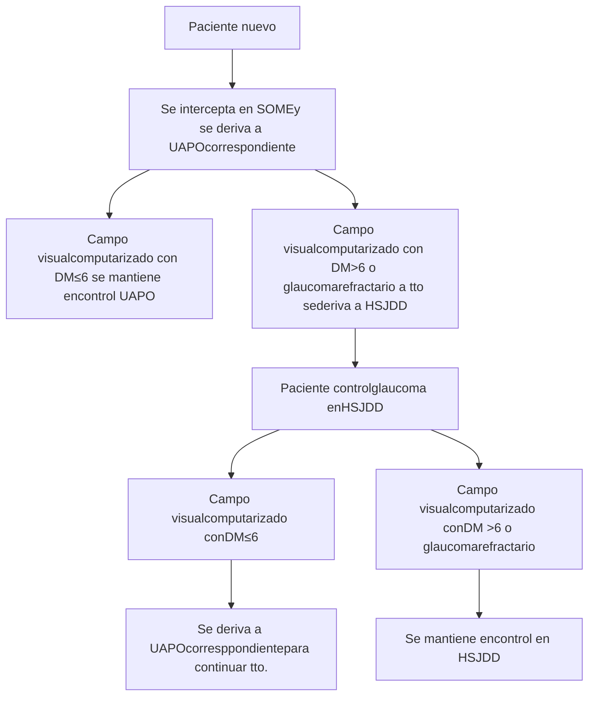
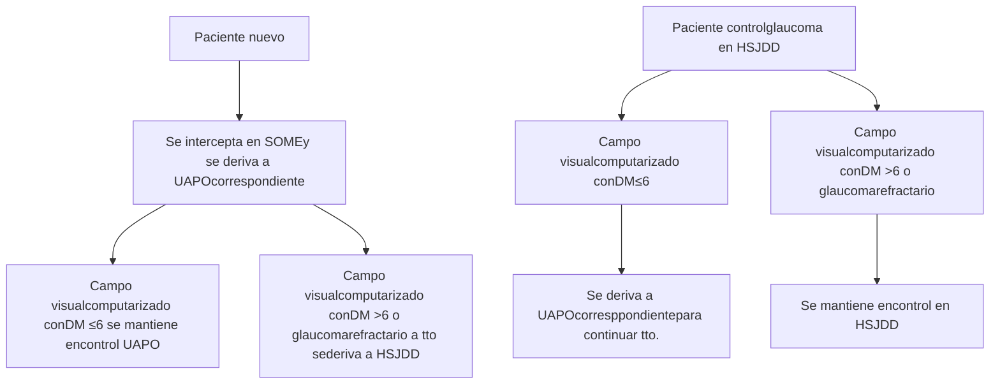

# PROT-GLAUCOMA-2018

--- Página 1 ---

<u>**Departamento de Asesoría Jurídica**</u>

DR. FMG/JTN/MCE/NGD
N° 931/18

**EXENTA N° 2654**

SANTIAGO, 2 8 SET. 2018

**VISTOS:** Memorándum N°35 de 20 de agosto de 2018 respectivamente, del Departamento de Calidad y Seguridad del Paciente, solicitando al Departamento de Asesoría Jurídica la aprobación de Protocolos Clínicos resolutivos que acompaña; Memorándum N°152 de 10 de septiembre de 2018, del Departamento de Asesoría Jurídica a través del cual se solicita al Departamento de Calidad y Seguridad del Paciente complementación de la información acompañada; Memorándum N°40 de 25 de septiembre de 2018, a través del cual el Departamento de Calidad y Seguridad del Paciente complementa su solicitud con la información requerida; y en uso de las atribuciones que me confiere el DFL. N°1/2005, en virtud del cual se fija el Texto Refundido, Coordinado y Sistematizado del D.L. N°2.763/79 y otras normas; lo contemplado en el Decreto Supremo N°140/04, Reglamento Orgánico de los Servicios de Salud y el Decreto Afecto N°56 de fecha 12 de julio de 2018, que nombra al suscrito en el cargo de Director de este Servicio de Salud Metropolitano Occidente, ambos del Ministerio de Salud; lo dispuesto por la Resolución N°1600/2008 de la Contraloría General de la República, y,

**CONSIDERANDO:**

**I.** Que, con el fin de materializar los compromisos adquiridos por la Red Pública de Salud para el aumento de Altas de Consultas de la Especialidad (COMGES 6), se han constituido grupos de trabajo de profesionales clínicos y de gestión de la Red Occidente de Salud, de las áreas respectivas, con la finalidad de realizar una revisión bibliográfica nacional e internacional y a partir de la experiencia han sistematizado los antecedentes más relevantes a ser considerados al momento de enfrentarse con situaciones clínicas determinadas;

**II.** Que, del trabajo anteriormente descrito, se han podido determinar protocolos clínicos que permitirán a los profesionales contar con un apoyo al manejo clínico de los problemas prevalentes a los que se ven enfrentados los especialistas de la Red, favoreciendo la estandarización de los procesos dentro de los establecimientos de salud;

**III.** Que dentro de las condiciones clínicas analizadas se encuentra el Glaucoma, por cuanto se ha recopilado y sistematizado la mejor evidencia disponible sobre estudio y manejo de este cuadro generándose el "Protocolo Resolutivo de Glaucoma";

**IV.** La conformidad del suscrito, se dicta la siguiente:

**RESOLUCIÓN**

1. **APRUÉBASE** el "Protocolo Resolutivo de Glaucoma", elaborado por los profesionales del Hospital San Juan de Dios y Revisado por el Equipo de Trabajo COMGES 6, cuyo texto es el siguiente:

--- Página 2 ---

|        | Elaborado por:                                                                                                            | Revisado por:                                                                                                                                         | Aprobado por:                                           |
| ------ | ------------------------------------------------------------------------------------------------------------------------- | ----------------------------------------------------------------------------------------------------------------------------------------------------- | ------------------------------------------------------- |
| Nombre | Dr. Edgardo Sánchez. Dr. Alan Wenger Dr. Álvaro Lara Dra. Ingrid Sánchez                                      | Dra Francisca Reyes Sra. Lya Reyes Dra Marisol Concha Sra. Carmen Luz Nachar                                                              | Dr. Darwin Letelier                                     |
| Cargo  | Jefe de Servicio de Oftalmología HSJD Jefe Dpto.Glaucoma HSJD Médico Dpto. Glaucoma Médico Dpto. Glaucoma | Subdirectora Médica Atención Ambulatoria Jefa SOME Jefe de Dpto. de calidad y seguridad del paciente Miembros comité COMGES 6 | Sub Director médico Servicio de Salud Occidente |
| Firma  |                                                                                                                           |                                                                                                                                                       |                                                         |

--- Página 3 ---

**1.-Autores.-**

1.1.- Dr. Edgardo Sánchez, Jefe de Servicio de Oftalmología Hospital San Juan de Dios

1.2.- Dr. Alan Wenger Jefe Dpto. Glaucoma, Oftalmología, Hospital San Juan de Dios

1.3.- Dr. Álvaro Lara, Médico Dpto. Glaucoma, Oftalmología, Hospital San Juan de Dios

1.4.- Dra. Ingrid Sánchez, Médico Dpto. Glaucoma, Oftalmología, Hospital San Juan de Dios

Se declara que no hay conflicto de interés en los profesionales que realizaron este protocolo.

**2.- Comisión revisora**

2.1-Dra Francisca Reyes, Jefa CDT Hospital San Juan de Dios

2.2- Comisión revisora: Equipo de trabajo COMGEs 6 (por resolución)

**3.- Introducción**

Los Protocolos resolutivos de la especialidad de Oftalmología, forman parte de la implementación de procesos resolutivos que tienen como finalidad aumentar la oferta de consulta en la especialidad, definiendo patologías especificas con alta frecuencia de derivación y fácil resolución, generando un aumento en las altas de estas especialidades y una mejora en la referencia y contrarreferencia.

Para su ejecución, se han constituido equipos de trabajo integrados por profesionales de los ámbitos clínicos y de gestión, los cuales a través de una revisión bibliográfica de documentos nacionales e internacionales, y a partir de la experiencia clínica han sistematizado los antecedentes más relevantes a ser considerados al momento de enfrentarse con las situaciones clínicas descritas.

La experiencia internacional muestra que el desarrollo de guías y protocolos apoya el manejo clínico de los problemas prevalentes a los que se ven enfrentados los especialistas, favoreciendo la estandarización de los procesos dentro de las instituciones de salud. Con ellos se contribuye a disminuir la variabilidad en la práctica clínica uniformando criterios de manejo y de derivación a especialistas, cuando la condición clínica lo amerite, consensuando los criterios clínicos y los requerimientos de apoyo diagnóstico y terapéutico necesarios para la resolución del problema de salud.

La patología Oftalmológica, es una causa muy frecuente de consulta en el nivel primario de atención. A pesar de la existencia de UAPO en determinadas comunas, el nivel primario habitualmente se ve enfrentado a tomar decisiones sobre el manejo clínico de estos pacientes, a partir del conocimiento adquirido en el pregrado y la experiencia clínica adquirida en la práctica profesional.

**MAPA DE DERIVACIÓN DE CONSULTA DE ESPECIALIDAD DESDE APS Y HOSPITAL COMUNITARIO A HOSPITAL DE MAYOR COMPLEJIDAD. JUNIO 2016**

| ESPECIALIDAD Grupo Etario | Med. Fca. YRehabilitación | Oftalmología                                                                                                                     | Traumatología <15 años | Traumatología >15 años |
| ----------------------------- | ------------------------- | -------------------------------------------------------------------------------------------------------------------------------- | -------------------------- | -------------------------- |
| CERRO NAVIA                   | SIN OFERTA EN LA RED  | Filtro por UAPO según cartera de Servicios, resto de la derivación a HSJDD. Desde UAPO se deriva directo a HSJDD | HFBC                       | CRS SAG                    |
| QUINTA NORMAL                 | SIN OFERTA EN LA RED  | Filtro por UAPO según cartera de Servicios, resto de la derivación a HSJDD. Desde UAPO se deriva directo a HSJDD | HFBC                       | IT                         |

--- Página 4 ---

| RENCA         | SIN OFERTA EN LA RED | HSJDD                                                                                                                  | HFBC    | IT      |
| ------------- | -------------------- | ---------------------------------------------------------------------------------------------------------------------- | ------- | ------- |
| CURACAVI      | SIN OFERTA EN LA RED | HSJDD                                                                                                                  | HFBC    | IT      |
| ALHUE         | SIN OFERTA EN LA RED | Filtro por UAPO según cartera de Servicios, resto de la derivación a HOSMEL. Desde UAPO se deriva directo a HOSMEL | HFBC    | HOSMEL  |
| MARIA PINTO   | SIN OFERTA EN LA RED | Filtro por UAPO según cartera de Servicios, resto de la derivación a HOSMEL. Desde UAPO se deriva directo a HOSMEL | HFBC    | HOSMEL  |
| MELIPILLA     | SIN OFERTA EN LA RED | Filtro por UAPO según cartera de Servicios, resto de la derivación a HOSMEL. Desde UAPO se deriva directo a HOSMEL | HFBC    | HOSMEL  |
| SAN PEDRO     | SIN OFERTA EN LA RED | Filtro por UAPO según cartera de Servicios, resto de la derivación a HOSMEL. Desde UAPO se deriva directo a HOSMEL | HFBC    | HOSMEL  |
| PADRE HURTADO | SIN OFERTA EN LA RED | HOSPEÑA                                                                                                                | HFBC    | HOSTAL  |
| PEÑAFLOR      | SIN OFERTA EN LA RED | HOSPEÑA                                                                                                                | HFBC    | HOSTAL  |
| TALAGANTE     | SIN OFERTA EN LA RED | Filtro por UAPO según cartera de Servicios, resto de la derivación a HSJDD. Desde UAPO se deriva directo a HSJDD       | HFBC    | HOSTAL  |
| EL MONTE      | SIN OFERTA EN LA RED | HSJDD                                                                                                                  | HFBC    | HOSTAL  |
| ISLA DE MAIPO | SIN OFERTA EN LA RED | HSJDD                                                                                                                  | HFBC    | HOSTAL  |
| PUDAHUEL      | SIN OFERTA EN LA RED | Filtro por UAPO según cartera de Servicios, resto de la derivación a CRS. Desde UAPO se deriva directo a HSJDD         | CRS SAG | CRS SAG |
| LO PRADO      | SIN OFERTA EN LA RED | Filtro por UAPO según cartera de Servicios, resto de la derivación a HSJDD. Desde UAPO se deriva directo a HSJDD       | CRS SAG | CRS SAG |

Glosario:

--- Página 5 ---

HSJDD: Hospital San Juan de Dios
HFBC: Hospital Félix Bulnes
IT: Instituto Traumatológico
HOSPEÑA: Hospital de Peñaflor
CRS SAG: CRS Salvador Allende Gossens
HOSTAL: Hospital de Talagante
HOSMEL: Hospital de Melipilla

## 4.- Objetivos.-

4.1.- Determinar los criterios de manejo en el nivel primario de atención de pacientes Portadores de la patología oftalmológica Glaucoma.

4.2.- Establecer criterios de derivación estándar hacia la especialidad de Oftalmología, Como una forma de contribuir a la pertinencia de la derivación.

## 5.- Alcance.(ámbito de aplicación)

5.1.- Centros de Salud Familiar
5.2.- Centros de Salud Urbanos y Rurales
5.3.- Hospitales de Baja y Mediana Complejidad
5.4.- Hospitales de Mayor complejidad
5.4.- Postas de Salud Rural
5.5.- Servicios de Atención Primaria de Urgencia

## 6.- Responsables de la ejecución.-

6.1.- Médicos de Atención Primaria Municipal
6.2.- Médicos de SAPUs
6.3.- Médicos de Unidades de Emergencia hospitalaria
6.4.- Médicos en Etapa de Destinación y Formación
6.5.- Médicos de nivel especialidad
6.6.- Comités de Gestión de Oferta y Demanda de nivel primario y secundario

## 7.- Distribución.-

7.1.- Box de Atención Médica de APS y Especialidad
7.2.- Box de Atención Médica de SAPUs
7.3.- Oficina de Comités de Gestión

## 8.- Responsabilidad del encargado:

8.1.- Implementación del protocolo
8.2.- Difusión
8.3.- Evaluaciones periódicas
8.4.- Proposición de medidas correctivas en caso de necesidad, etc.

## 9.- <u>Contenidos Específicos del Protocolo.-</u>

### 9.1.- Definición :
El glaucoma es un conjunto de procesos que tiene en común una neuropatía óptica adquirida, caracterizada por una excavación de la papila óptica y un adelgazamiento del borde neurorretiniano. Está provocada generalmente por un aumento de la presión intraocular. Cuando la pérdida de tejido del nervio óptico es significativa, se

--- Página 6 ---

desarrolla una disminución del campo visual que puede dar lugar a una ceguera total si la pérdida de fibras es completa..

## 9.2.- Etiología:

El glaucoma se produce por una obstrucción en el sistema de drenaje del humor acuoso, y se clasifica como glaucoma de ángulo abierto o de ángulo cerrado. Además, puede subdividirse según su etiología en primario o secundario.

## 9.3.- Epidemiología:

El glaucoma es una enfermedad crónica, evolutiva y muy grave, ya que su curso natural es la ceguera. De hecho, es la principal causa de ceguera irreversible en el mundo, pues se estima que 66,8 millones de personas tienen glaucoma de los que 6,7 millones presentan ceguera bilateral por esta causa.

## 9.4..- Diagnóstico diferencial:

Existen múltiples diagnósticos diferenciales, siendo los más frecuentes:

-Hipertensión Ocular
-Neuropatía ópticas Isquémica.
-Neuritis óptica.
-Tumores intracraneales.
-Alteraciones Hemodinámicas: Hipotensión arterial nocturna, obstrucción del flujo carotideo.

## 9.5.- Síntomas:

El glaucoma es una patología que suele ser asintomática hasta fases avanzadas, siendo los primeros síntomas las alteraciones del campo visual y agudeza visual.

Algunos glaucomas de ángulo cerrado y/o secundario pueden debutar con dolor por aumentos importantes de la presión intraocular.

## 9.6.- Manejo médico:

El manejo medico se realiza mediante medicación antihipertensiva tópica y sistémica. En el primer grupo están: inhibidores de la anhidrasa carbónica, betas bloqueadores, alfa adrenérgicos y prostaglandinas. En el segundo grupo está la acetazolamida y el manitol.

## 9.7-.- Manejo Laser:

Existen tratamientos laser para disminuir la presión intraocular y para evitar complicaciones. Dentro de estos están: Iridotomía Yag laser, Trabeculoplastía Selectiva Laser.

## 9.8.- Manejo quirúrgico:

Existen múltiples procedimientos quirúrgicos para el glaucoma. Los más frecuentes son: Trabeculectomía + Mitomicina C, Válvula de Ahmed, Ciclodiodo.

## 9.9.- Esquema de tratamiento en establecimientos de menor complejidad:

Serán tratados solo con medicación tópica.

## 8.0.-Criterios de Referencia de atención primaria a Oftalmología:

Pacientes con campos visuales computarizados con DM mayor a 6 dB serán derivados para manejo en Departamento de Glaucoma HSJDD.

Pacientes con Glaucomas secundarios o refractarios a tratamiento serán derivados para manejo en Departamento de Glaucoma HSJDD.

## 8.1.-Criterios de Referencia de Oftalmología a atención primaria:

Pacientes con campo visual computarizado con DM menor o igual a 6 dB serán manejados en centro de menor complejidad.

## 8.2.- Población objetivo

-Usuarios mayores de 15 años pertenecientes a la red Occidente y que presente sospecha o diagnóstico de glaucoma

--- Página 7 ---

## 8.3 - Tiempo de alta máxima permanencia en atención secundaria

Tiempo 4 meses y según evolución e indicación médica

## 10.- Metodología de evaluación

Será responsable de la evaluación del Dpto. de Calidad y Seguridad del Paciente.

Se establecen los criterios de auditoria con el fin de mostrar evidencia de Implementación de los 4 protocolos resolutivos 2018

Se evidenciará esta implementación a través de una auditoría de fichas clínica en los establecimientos de la Red, esta auditoría será responsabilidad del Servicio de Salud, del Dpto. de calidad y seguridad del paciente.

**Procedimiento:**

* Seleccionar los pacientes atendidos a nivel secundario con diagnóstico de las patologías protocolizadas, de éstos se seleccionará una muestra representativa (según estadística)

* Se solicitará en APS (Dr. Velez), los pacientes atendidos por las patologías a nivel primario y las interconsultas realizadas.

* Realizar revisión de: Ficha nivel Primario e Interconsulta a través de plataforma Rayen y Ficha de Nivel secundario a través ficha física de papel de acuerdo a pauta.

* Se buscará en la ficha clínica de papel o electrónica la presencia o no, de 3 elementos relevantes del protocolo para cada nivel de atención:

### CRITERIOS DE EVALUACIÓN

**NIVEL PRIMARIO (APS)**

1.- Antecedentes clínicos. (SI-NO)

2.- Criterios de referencias establecidos en el protocolo.

3.- Hipótesis diagnostica (SI-NO)

**INTERCONSULTA**

1.- Presencia de antecedentes personales. (SI-NO)

2.- Hipótesis diagnóstica. (SI-NO)

3.- Criterios de derivación.

**NIVEL SECUNDARIO**

1.- Evaluación clínica. (SI- NO)

2.- Existe confirmación diagnóstica. (SI-NO)

3.- Existe plan o indicaciones terapéuticas. (SI-NO)

## INDICADORES

INDICADOR 1

| NOMBRE                                                                               | FORMULA                                                                                     | FUENTE                | PERIODICIDAD | RESPONSABLE                               |
| ------------------------------------------------------------------------------------ | ------------------------------------------------------------------------------------------- | --------------------- | ------------ | ----------------------------------------- |
| tiempo promedio desde ingreso lista de espera hasta alta, de patología protocolizada | suma de los días desde el ingreso hasta el alta / N° de altas de la patología protocolizada | sigte - ficha clínica | 1 vez al año | Dpto. de calidad y seguridad del paciente |

INDICADOR 2

| NOMBRE | FORMULA | FUENTE | PERIODICIDAD | RESPONSABLE |
| ------ | ------- | ------ | ------------ | ----------- |
|        |         |        |              |             |

--- Página 8 ---

| Pacientes auditados con diagnóstico de patología protocolizada que contengan al menos la presencia de 3 elementos relevantes del protocolo para cada nivel de atención | N° pacientes revisados con diagnóstico de Glaucoma que contengan al menos la presencia de 3 elementos relevantes del protocolo para cada nivel de atención/ total de pacientes revisados en el periodo con diagnóstico de glaucoma | Revisión de registros Rayen .interconsulta ,ficha clínica en hospitales | 1 vez al año | Dpto. de calidad y seguridad del paciente |
| ---------------------------------------------------------------------------------------------------------------------------------------------------------------------- | ---------------------------------------------------------------------------------------------------------------------------------------------------------------------------------------------------------------------------------- | ----------------------------------------------------------------------- | ------------ | ----------------------------------------- |

**La evaluación para el año 2018 será:**

-Auditoría de ficha clínica en el cuarto trimestre del 2018.

**INDICADORES**

**10.-Plan de Difusión**

**Responsabilidades :**

**Servicio de Salud:**

* Ordinario de Dirección del Servicio con protocolos, a toda la red Occidente.
* Subir protocolos a página web de servicio

**Subdirección Médica Atención Ambulatoria:**

Dra. Francisca Reyes y Dra. Arrué: Supervisión de presencia de protocolos en atención secundaria

**Subdirección APS:**

Dr. Luis Vélez: Supervisión de presencia de protocolos en atención primaria

--- Página 9 ---

# 11.- <u>FLUJOGRAMA DE DERIVACION GLAUCOMA</u>

## 12.- Bibliografía.

-Quigley HA, Broman AT. The number of people with glaucoma worldwide in 2010 and 2020. Br J Ophthalmol. 2006;90:262-7.

-Glaucoma. 2da Edicion. Tarek M Saarawy, Mark B Sherwood, Roger A Hitchings, Jonathan G Crowston. 2015.

-Shields' Textbook of Glaucoma, 6ta edición. 2010.

-Kanski's Clinical Ophthalmology: A Systematic Approach, 8va edicion. 2015.

-www.who.int

--- Página 10 ---

2. **PUBLÍQUESE** el contenido de la presente Resolución en el Portal <u>www.mercadopublico.cl</u> a fin de cumplir con los requerimientos de la Ley de Compras y Contrataciones Públicas.

**ANÓTESE Y COMUNÍQUESE.**

**DR. FRANCISCO MIRANDA GUERRERO**
**DIRECTOR**
**SERVICIO DE SALUD METROPOLITANO OCCIDENTE**

**<u>DISTRIBUCIÓN:</u>**
* Departamento de Calidad y Seguridad del Paciente
* <mark>Asesoría Jurídica.</mark>
* Oficina de Partes.

**TRANSCRITO FIELMENTE**
XIMENA VARAS CONTRERAS
MINISTRO DEL FE

--- Página 11 ---

|   | N° PAGINAS 14 | Servicio de SaludOccidente | FECHA REVISIONJunio de 2021 | FECHAELABORACIONJunio 2018 N° VERSIÓN1 |
| - | ------------- | -------------------------- | --------------------------- | ------------------------------------------ |

# Protocolo resolutivo de
# GLAUCOMA

--- Página 12 ---

|   | N° PAGINAS 14 | Servicio de SaludOccidente | FECHA REVISIONJunio de 2021 | FECHAELABORACIONJunio 2018 N° VERSIÓN1 |
| - | ------------- | -------------------------- | --------------------------- | ------------------------------------------ |

|        | Elaborado por:                                                                                                            | Revisado por:                                                                                                                                             | Aprobado por:                                           |
| ------ | ------------------------------------------------------------------------------------------------------------------------- | --------------------------------------------------------------------------------------------------------------------------------------------------------- | ------------------------------------------------------- |
| Nombre | Dr. Edgardo Sánchez. Dr. Alan Wenger Dr. Álvaro Lara Dra. Ingrid Sánchez                                      | Dra Francisca Reyes Sra. Lya Reyes Dra Marisol Concha Sra. Carmen Luz Nachar                                                                  | Dr. Darwin Letelier                                     |
| Cargo  | Jefe de Servicio de Oftalmología HSJD Jefe Dpto.Glaucoma HSJD Médico Dpto. Glaucoma Médico Dpto. Glaucoma | Subdirectora Médica Atención Ambulatoria Jefa SOME Jefe de Dpto. de calidad y seguridad del paciente Miembros comité COMGES 6 | Sub Director médico Servicio de Salud Occidente |
| Firma  | \[signature]                                                                                                              | \[signature]                                                                                                                                              | \[signature]                                            |

--- Página 13 ---

|   | N° PAGINAS 14 | Servicio de Salud Occidente FECHA REVISIONJunio de 2021 | Servicio de Salud Occidente N° VERSIÓN1 | FECHA ELABORACIONJunio 2018 N° VERSIÓN1 |
| - | ------------- | ----------------------------------------------------------- | ------------------------------------------- | ------------------------------------------- |

## 1.-Autores.-

1.1.- Dr. Edgardo Sánchez, Jefe de Servicio de Oftalmología Hospital San Juan de Dios

1.2.- Dr. Alan Wenger Jefe Dpto. Glaucoma, Oftalmología, Hospital San Juan de Dios

1.3.- Dr. Álvaro Lara, Médico Dpto. Glaucoma, Oftalmología, Hospital San Juan de Dios

1.4.- Dra. Ingrid Sánchez, Médico Dpto. Glaucoma, Oftalmología, Hospital San Juan de Dios.

**Se declara que no hay conflicto de interés en los profesionales que realizaron este protocolo.**

## 2.- Comisión revisora

2.1-Dra Francisca Reyes, Jefa CDT Hospital San Juan de Dios

2.2- Comisión revisora: Equipo de trabajo COMGES 6 (por resolución)

## 3.- Introducción

Los Protocolos resolutivos de la especialidad de Oftalmología, forman parte de la implementación de procesos resolutivos que tienen como finalidad aumentar la oferta de consulta en la especialidad, definiendo patologías especificas con alta frecuencia de derivación y fácil resolución, generando un aumento en las altas de estas especialidades y una mejora en la referencia y contrarreferencia.

Para su ejecución, se han constituido equipos de trabajo integrados por profesionales de los ámbitos clínicos y de gestión, los cuales a través de una revisión bibliográfica de documentos nacionales e internacionales, y a partir de la experiencia clínica han sistematizado los antecedentes más relevantes a ser considerados al momento de enfrentarse con las situaciones clínicas descritas.

La experiencia internacional muestra que el desarrollo de guías y protocolos apoya el manejo clínico de los problemas prevalentes a los que se ven enfrentados los especialistas, favoreciendo la estandarización de los procesos dentro de las instituciones de salud. Con ellos se contribuye a disminuir la variabilidad en la práctica clínica uniformando criterios de manejo y de derivación a especialistas, cuando la condición clínica lo amerite, consensuando los criterios clínicos y los requerimientos de apoyo diagnóstico y terapéutico necesarios para la resolución del problema de salud.

La patología Oftalmológica, es una causa muy frecuente de consulta en el nivel primario de atención. A pesar de la existencia de UAPO en determinadas comunas, el nivel primario habitualmente se ve enfrentado a tomar decisiones sobre el manejo clínico de estos pacientes, a partir del conocimiento adquirido en el pregrado y la experiencia clínica adquirida en la práctica profesional.

--- Página 14 ---

| N° PAGINAS 14 | Servicio de Salud Occidente | FECHA REVISION Junio de 2021 | FECHA ELABORACION Junio 2018 N° VERSIÓN 1 |
| ------------- | --------------------------- | ---------------------------- | --------------------------------------------- |

# MAPA DE DERIVACIÓN DE CONSULTA DE ESPECIALIDAD DESDE APS Y HOSPITAL COMUNITARIO A HOSPITAL DE MAYOR COMPLEJIDAD. JUNIO 2016

| ESPECIALIDAD Grupo Etario | Med. Fca. Y Rehabilitación | Oftalmología                                                                                                       | Traumatología <15 años | Traumatología >15 años |
| ----------------------------- | -------------------------- | ------------------------------------------------------------------------------------------------------------------ | -------------------------- | -------------------------- |
| CERRO NAVIA                   | SIN OFERTA EN LA RED       | Filtro por UAPO según cartera de Servicios, resto de la derivación a HSJDD. Desde UAPO se deriva directo a HSJDD   | HFBC                       | CRS SAG                    |
| QUINTA NORMAL                 | SIN OFERTA EN LA RED       | Filtro por UAPO según cartera de Servicios, resto de la derivación a HSJDD. Desde UAPO se deriva directo a HSJDD   | HFBC                       | IT                         |
| RENCA                         | SIN OFERTA EN LA RED       | HSJDD                                                                                                              | HFBC                       | IT                         |
| CURACAVI                      | SIN OFERTA EN LA RED       | HSJDD                                                                                                              | HFBC                       | IT                         |
| ALHUE                         | SIN OFERTA EN LA RED       | Filtro por UAPO según cartera de Servicios, resto de la derivación a HOSMEL. Desde UAPO se deriva directo a HOSMEL | HFBC                       | HOSMEL                     |
| MARIA PINTO                   | SIN OFERTA EN LA RED       | Filtro por UAPO según cartera de Servicios, resto de la derivación a HOSMEL. Desde UAPO se deriva directo a HOSMEL | HFBC                       | HOSMEL                     |
| MELIPILLA                     | SIN OFERTA EN LA RED       | Filtro por UAPO según cartera de Servicios, resto de la derivación a HOSMEL. Desde UAPO se deriva directo a HOSMEL | HFBC                       | HOSMEL                     |

--- Página 15 ---

| N° PAGINAS 14 | Servicio de Salud Occidente | FECHA ELABORACIONJunio 2018 FECHA REVISIONJunio de 2021 | FECHA ELABORACIONJunio 2018 N° VERSIÓN1 |
| ------------- | --------------------------- | ----------------------------------------------------------- | ------------------------------------------- |

| SAN PEDRO     | SIN OFERTA EN LA RED | Filtro por UAPO según cartera de Servicios, resto de la derivación a HOSMEL. Desde UAPO se deriva directo a HOSMEL | HFBC    | HOSMEL  |
| ------------- | -------------------- | ------------------------------------------------------------------------------------------------------------------ | ------- | ------- |
| PADRE HURTADO | SIN OFERTA EN LA RED | HOSPEÑA                                                                                                            | HFBC    | HOSTAL  |
| PEÑAFLOR      | SIN OFERTA EN LA RED | HOSPEÑA                                                                                                            | HFBC    | HOSTAL  |
| TALAGANTE     | SIN OFERTA EN LA RED | Filtro por UAPO según cartera de Servicios, resto de la derivación a HSJDD. Desde UAPO se deriva directo a HSJDD   | HFBC    | HOSTAL  |
| EL MONTE      | SIN OFERTA EN LA RED | HSJDD                                                                                                              | HFBC    | HOSTAL  |
| ISLA DE MAIPO | SIN OFERTA EN LA RED | HSJDD                                                                                                              | HFBC    | HOSTAL  |
| PUDAHUEL      | SIN OFERTA EN LA RED | Filtro por UAPO según cartera de Servicios, resto de la derivación a CRS. Desde UAPO se deriva directo a HSJDD     | CRS SAG | CRS SAG |
| LO PRADO      | SIN OFERTA EN LA RED | Filtro por UAPO según cartera de Servicios, resto de la derivación a HSJDD. Desde UAPO se deriva directo a HSJDD   | CRS SAG | CRS SAG |

<u>**Glosario:**</u>

**HSJDD**: Hospital San Juan de Dios
**HFBC**: Hospital Félix Bulnes
**IT**: Instituto Traumatológico
**HOSPEÑA**: Hospital de Peñaflor
**CRS SAG**: CRS Salvador Allende Gossens
**HOSTAL**: Hospital de Talagante
**HOSMEL**: Hospital de Melipilla

--- Página 16 ---

|   | N° PAGINAS 14 FECHA REVISIONJunio de 2021 | Servicio de SaludOccidente | N° VERSIÓN1 | FECHA ELABORACIONJunio 2018 N° VERSIÓN1 |
| - | --------------------------------------------- | -------------------------- | ----------- | ------------------------------------------- |

## 4.- Objetivos.-

4.1.- Determinar los criterios de manejo en el nivel primario de atención de pacientes Portadores de la patología oftalmológica Glaucoma.

4.2.- Establecer criterios de derivación estándar hacia la especialidad de Oftalmología, Como una forma de contribuir a la pertinencia de la derivación.

## 5.- Alcance.(ámbito de aplicación)

5.1.- Centros de Salud Familiar
5.2.- Centros de Salud Urbanos y Rurales
5.3.- Hospitales de Baja y Mediana Complejidad
5.4.- Hospitales de Mayor complejidad
5.4.- Postas de Salud Rural
5.5.- Servicios de Atención Primaria de Urgencia

## 6.- Responsables de la ejecución.-

6.1.- Médicos de Atención Primaria Municipal
6.2.- Médicos de SAPUs
6.3.- Médicos de Unidades de Emergencia hospitalaria
6.4.- Médicos en Etapa de Destinación y Formación
6.5.- Médicos de nivel especialidad
6.6.- Comités de Gestión de Oferta y Demanda de nivel primario y secundario

## 7.- Distribución.-

7.1.- Box de Atención Médica de APS y Especialidad
7.2.- Box de Atención Médica de SAPUs
7.3.- Oficina de Comités de Gestión

## 8.- Responsabilidad del encargado:

8.1.- Implementación del protocolo
8.2.- Difusión
8.3.- Evaluaciones periódicas
8.4.- Proposición de medidas correctivas en caso de necesidad, etc.

--- Página 17 ---

|   | N° PAGINAS 14 Servicio de SaludOccidente | FECHA REVISIONJunio de 2021 | FECHA ELABORACIONJunio 2018 N° VERSIÓN1 |
| - | -------------------------------------------- | --------------------------- | ------------------------------------------- |

## 9.- <u>Contenidos Específicos del Protocolo.-</u>

### 9.1.- Definición :

El glaucoma es un conjunto de procesos que tiene en común una neuropatía óptica adquirida, caracterizada por una excavación de la papila óptica y un adelgazamiento del borde neurorretiniano. Está provocada generalmente por un aumento de la presión intraocular. Cuando la pérdida de tejido del nervio óptico es significativa, se desarrolla una disminución del campo visual que puede dar lugar a una ceguera total si la pérdida de fibras es completa..

### 9.2.- Etiología:

El glaucoma se produce por una obstrucción en el sistema de drenaje del humor acuoso, y se clasifica como glaucoma de ángulo abierto o de ángulo cerrado. Además, puede subdividirse según su etiología en primario o secundario.

### 9.3.- Epidemiología:

El glaucoma es una enfermedad crónica, evolutiva y muy grave, ya que su curso natural es la ceguera. De hecho, es la principal causa de ceguera irreversible en el mundo, pues se estima que 66,8 millones de personas tienen glaucoma de los que 6,7 millones presentan ceguera bilateral por esta causa.

### 9.4..- Diagnóstico diferencial:

Existen múltiples diagnósticos diferenciales, siendo los más frecuentes:
-Hipertensión Ocular
-Neuropatía ópticas Isquémica
-Neuritis óptica.
-Tumores intracraneales.
-Alteraciones Hemodinámicas: Hipotensión arterial nocturna, obstrucción del flujo carotideo.

### 9.5.- Síntomas:

El glaucoma es una patología que suele ser asintomática hasta fases avanzadas, siendo los primeros síntomas las alteraciones del campo visual y agudeza visual. Algunos glaucomas de ángulo cerrado y/o secundario pueden debutar con dolor por aumentos importantes de la presión intraocular.

### 9.6.- Manejo médico:

El manejo medico se realiza mediante medicación antihipertensiva tópica y sistémica. En el primer grupo están: inhibidores de la anhidrasa carbónica, betas bloqueadores, alfa adrenérgicos y prostaglandinas. En el segundo grupo está la acetazolamida y el manitol.

### 9.7.-.- Manejo Laser:

Existen tratamientos laser para disminuir la presión intraocular y para evitar complicaciones. Dentro de estos están: Iridotomía Yag laser, Trabeculoplastía Selectiva Laser.

--- Página 18 ---

|   | N° PAGINAS 14 | Servicio de SaludOccidente | FECHAELABORACIONJunio 2018 FECHA REVISIONJunio de 2021 | FECHAELABORACIONJunio 2018 N° VERSIÓN1 |
| - | ------------- | -------------------------- | ---------------------------------------------------------- | ------------------------------------------ |

**9.8.- Manejo quirúrgico:**

Existen múltiples procedimientos quirúrgicos para el glaucoma. Los más frecuentes son:

Trabeculectomía + Mitomicina C, Válvula de Ahmed, Ciclodiodo.

**9.9.- Esquema de tratamiento en establecimientos de menor complejidad:**

Serán tratados solo con medicación tópica.

**8.0.-Criterios de Referencia de atención primaria a Oftalmología:**

Pacientes con campos visuales computarizados con DM mayor a 6 dB serán derivados para manejo en Departamento de Glaucoma HSJDD.

Pacientes con Glaucomas secundarios o refractarios a tratamiento serán derivados para manejo en Departamento de Glaucoma HSJDD.

**8.1.-Criterios de Referencia de Oftalmología a atención primaria:**

Pacientes con campo visual computarizado con DM menor o igual a 6 dB serán manejados en centro de menor complejidad.

**8.2.- Población objetivo**

- Usuarios mayores de 15 años pertenecientes a la red Occidente y que presente sospecha o diagnóstico de glaucoma

**8.3 - Tiempo de alta máxima permanencia en atención secundaria**

Tiempo 4 meses y según evolución e indicación médica

**10.- Metodología de evaluación**

Será responsable de la evaluación del Dpto. de Calidad y Seguridad del Paciente

Se establecen los criterios de auditoria con el fin de mostrar evidencia de Implementación de los 4 protocolos resolutivos 2018

Se evidenciará esta implementación a través de una auditoría de fichas clínica en los establecimientos de la Red, esta auditoría será responsabilidad del Servicio de Salud, del Dpto. de calidad y seguridad del paciente.

**Procedimiento:**

* Seleccionar los pacientes atendidos a nivel secundario con diagnóstico de las patologías protocolizadas, de éstos se seleccionará una muestra representativa (según estadística)

* Se solicitará en APS (Dr. Velez), los pacientes atendidos por las patologías a nivel primario y las interconsultas realizadas.

* Realizar revisión de: Ficha nivel Primario e Interconsulta a través de plataforma Rayen y Ficha de Nivel secundario a través ficha física de papel de acuerdo a pauta

* Se buscará en la ficha clínica de papel o electrónica la presencia o no ,de 3 elementos relevantes del protocolo para cada nivel de atención:

--- Página 19 ---

|   | N° PAGINAS 14 | Servicio de SaludOccidente | FECHAELABORACIONJunio 2018 FECHA REVISIONJunio de 2021 | N° VERSIÓN1 |
| - | ------------- | -------------------------- | ---------------------------------------------------------- | ----------- |

# CRITERIOS DE EVALUACIÓN

## NIVEL PRIMARIO (APS)

1.-Antecedentes clínicos. (SI-NO)

2.-Criterios de referencias establecidos en el protocolo.

3.-Hipótesis diagnostica (SI-NO)

## INTERCONSULTA

1.- Presencia de antecedentes personales. (SI-NO)

2.- Hipótesis diagnóstica. (SI-NO)

3.- Criterios de derivación.

## NIVEL SECUNDARIO

1.-Evaluación clínica. (SI- NO)

2.-Existe confirmación diagnóstica. (SI-NO)

3.-Existe plan o indicaciones terapéuticas. (SI-NO)

## INDICADORES

### INDICADOR 1

| NOMBRE                                                                               | FORMULA                                                                                    | FUENTE                | PERIODICIDAD | RESPONSABLE                               |
| ------------------------------------------------------------------------------------ | ------------------------------------------------------------------------------------------ | --------------------- | ------------ | ----------------------------------------- |
| tiempo promedio desde ingreso lista de espera hasta alta, de patología protocolizada | suma de los días desde el ingreso hasta el alta /N° de altas de la patología protocolizada | sigte - ficha clínica | 1 vez al año | Dpto. de calidad y seguridad del paciente |

### INDICADOR 2

| NOMBRE                                                                                                                                                                 | FORMULA                                                                                                                                                                                                                            | FUENTE                                                                  | PERIODICIDAD | RESPONSABLE                               |
| ---------------------------------------------------------------------------------------------------------------------------------------------------------------------- | ---------------------------------------------------------------------------------------------------------------------------------------------------------------------------------------------------------------------------------- | ----------------------------------------------------------------------- | ------------ | ----------------------------------------- |
| Pacientes auditados con diagnóstico de patología protocolizada que contengan al menos la presencia de 3 elementos relevantes del protocolo para cada nivel de atención | N° pacientes revisados con diagnóstico de Glaucoma que contengan al menos la presencia de 3 elementos relevantes del protocolo para cada nivel de atención/ total de pacientes revisados en el periodo con diagnóstico de glaucoma | Revisión de registros Rayen .interconsulta ,ficha clínica en hospitales | 1 vez al año | Dpto. de calidad y seguridad del paciente |

--- Página 20 ---

|   | N° PAGINAS 14 | Servicio de SaludOccidente | FECHAELABORACIONJunio 2018 FECHA REVISIONJunio de 2021 | FECHAELABORACIONJunio 2018 N° VERSIÓN1 |
| - | ------------- | -------------------------- | ---------------------------------------------------------- | ------------------------------------------ |

La evaluación para el año 2018 será:

-Auditoría de ficha clínica en el cuarto trimestre del 2018.

INDICADORES

10.-Plan de Difusión

Responsabilidades :

Servicio de Salud:

* Ordinario de Dirección del Servicio con protocolos, a toda la red Occidente.
* Subir protocolos a página web de servicio

Subdirección Médica Atención Ambulatoria:

Dra. Francisca Reyes y Dra. Arrué: Supervisión de presencia de protocolos en atención secundaria.

Subdirección APS:

Dr. Luis Vélez: Supervisión de presencia de protocolos en atención primaria

--- Página 21 ---

|   | N° PAGINAS 14 | Servicio de SaludOccidente | FECHAELABORACIONJunio 2018 FECHA REVISIONJunio de 2021 | FECHAELABORACIONJunio 2018 N° VERSIÓN1 |
| - | ------------- | -------------------------- | ---------------------------------------------------------- | ------------------------------------------ |

# 11.- <u>FLUJOGRAMA DE DERIVACION GLAUCOMA</u>

--- Página 22 ---

|   | N ° PAGINAS 14 | Servicio de SaludOccidente | FECHA REVISIONJunio de 2021 | FECHAELABORACIONJunio 2018 N° VERSIÓN1 |
| - | -------------- | -------------------------- | --------------------------- | ------------------------------------------ |

# 12.- Bibliografía.

-Quigley HA, Broman AT. The number of people with glaucoma worldwide in 2010 and 2020. Br J Ophthalmol. 2006;90:262-7.

-Glaucoma. 2da Edicion. Tarek M Saarawy, Mark B Sherwood, Roger A Hitchings, Jonathan G Crowston. 2015.

-Shields' Textbook of Glaucoma, 6ta edición. 2010.

-Kanski's Clinical Ophthalmology: A Systematic Approach, 8va edicion. 2015.

-www.who.int

