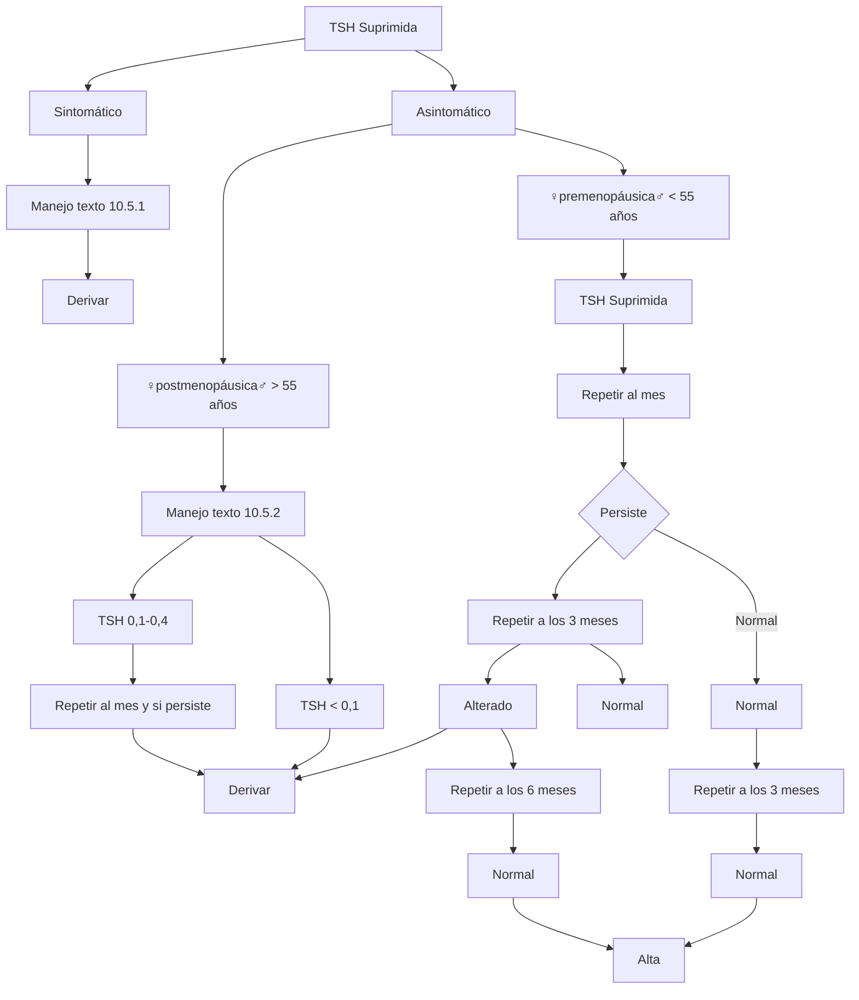
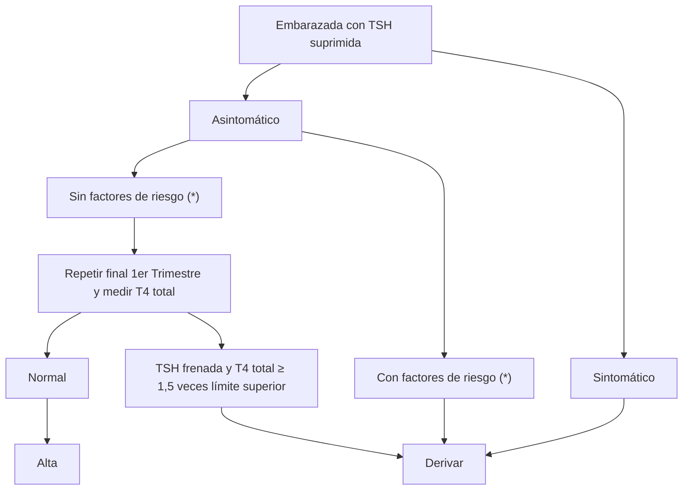

# PROT-HIPERTIROIDISMO-2017

--- Página 1 ---

  

# PROTOCOLO RESOLUTIVO EN RED

# HIPERTIROIDISMO

Fecha de elaboración: JUNIO 2017
Próxima revisión : JUNIO 2019

--- Página 2 ---

# 1. Autores

1. Dra. Erika Díaz, Endocrinóloga, Hospital San Juan de Dios
2. Dra. Paola Hernández, Endocrinóloga, Hospital San Juan de Dios
3. Dr. Félix Vásquez, Jefe de Endocrinología Hospital San Juan de Dios

**Se declara que no hay conflicto de interés en los profesionales que realizaron este protocolo.**

# 2.- Comisión revisora

2.1-Dra Francisca Reyes, Jefa CDT Hospital San Juan de Dios
2.2- Comisión revisora: Equipo de trabajo COMGES 6 (por resolución)

# 3. - Introducción

Cada 25 de mayo se conmemora el Día Mundial de la Tiroides para llamar la atención de la comunidad respecto de enfermedades muy comunes que deterioran la calidad de vida y cuyo diagnóstico y tratamiento son muy importantes.
La tiroides es una glándula con forma de mariposa, situada en la parte anterior y superior de la laringe. Controla el crecimiento de los tejidos, la respiración y el gasto energético, así como el funcionamiento del corazón, los músculos, la piel e influye en las hormonas sexuales. En Chile, de acuerdo con la última Encuesta Nacional de Salud se estima que hay más de tres millones de chilenos con la enfermedad tiroidea.

Las mujeres son especialmente vulnerables, una de cada cinco puede tener la enfermedad sin saberlo y derivar en infertilidad, pérdidas de embarazos, partos prematuros y menor desarrollo neurológico fetal si no se trata adecuadamente".
Existen tratamientos eficaces para el reemplazo de hormona tiroidea o para reducir sus niveles, lo que permite a los pacientes controlar su enfermedad y llevar vidas normales. Para ello se recomienda hacer un examen de sangre midiendo hormona tiroidea a toda persona que tiene riesgo de tener alteración de sus niveles de esta hormona.

--- Página 3 ---

# 4. - Mapa de red

Según resolución 3567

3567

MAPA DE DERIVACIÓN DE CONSULTA DE ESPECIALIDAD DESDE APS Y HOSPITAL COMUNITARIO A HOSPITAL DE MAYOR COMPLEJIDAD. DICIEMBRE 2015


| GLOSARIO TÉRMINOS:<br/>ESPECIALIDAD | HSJD: Hospital San Juan de Dios<br/>Grupo Etario | HFB: Hospital Félix Bulnes<br/>HSJD | IT: Instituto Traumatológico<br/>HFB | HOSP. PEÑAFLOR: Hospital de Peñaflor<br/>IT | CRS SAG, CIS SAG<br/>HOSP. PEÑAFLOR | HOSP. SALVADOR ALLENDE: Hospital Salvador Allende<br/>CRS SAG | HOSP. TALAGANTE: Hospital de Talagante<br/>CIS SAG | HOSP. MELIPILLA: Hospital de Melipilla<br/>HOSP. SALVADOR ALLENDE | HOSP. TALAGANTE                       | HOSP. MELIPILLA                      | CRS SAG                              | CIS SAG                         | CRS SAG                      |
| ----------------------------------- | ------------------------------------------------ | ----------------------------------- | ------------------------------------ | ------------------------------------------- | ----------------------------------- | ------------------------------------------------------------- | -------------------------------------------------- | ----------------------------------------------------------------- | ------------------------------------- | ------------------------------------ | ------------------------------------ | ------------------------------- | ---------------------------- |
| Pediatría                           | <15 años                                         | CRS SAG                             | CRS SAG                              | CRS SAG                                     | HOSMIL                              | HOSMIL                                                        | HOSMIL                                             | HOSPEÑA                                                           | HOSPEÑA                               | HOSTAL                               | HOSTAL                               | CRS SAG                         | CIS SAG                      |
|                                     | >15 años                                         | HNSC                                | HNSC                                 | HNSC                                        | HSJD                                | HSJD                                                          | HSJD                                               | HSJD                                                              | HSJD                                  | HSJD                                 | HSJD                                 | CRS SAG                         | CIS SAG                      |
| Medicina Interna                    | <15 años                                         | HNSC                                | HNSC                                 | HNSC                                        | HSJD                                | HSJD                                                          | HSJD                                               | HSJD                                                              | HSJD                                  | HSJD                                 | HSJD                                 | CRS SAG                         | CIS SAG                      |
|                                     | >15 años                                         | HNSC                                | HNSC                                 | HNSC                                        | HSJD                                | HSJD                                                          | HSJD                                               | HSJD                                                              | HSJD                                  | HSJD                                 | HSJD                                 | CRS SAG                         | CIS SAG                      |
| Broncopulmonar                      | <15 años                                         | Filtro Pediatría CRS SAG            | Filtro Pediatría CRS SAG             | Filtro Medicina Interna                     | Filtro Pediatría (con HOSMIL)       | Filtro Pediatría (con HOSMIL)                                 | Filtro Pediatría (con HOSMIL)                      | Filtro Pediatría (con HOSPEÑA)                                    | Filtro Pediatría (con HOSPEÑA)        | Filtro Pediatría (con HOSTAL)        | Filtro Pediatría (con HOSTAL)        | Filtro pediatría CRS SAG        | Filtro pediatría CRS SAG     |
|                                     | >15 años                                         | Filtro Medicina Interna HFB         | Filtro Medicina Interna HFB          | Filtro Medicina Interna                     | Filtro Medicina Interna (con HSJD)  | Filtro Medicina Interna (con HSJD)                            | Filtro Medicina Interna (con HSJD)                 | Filtro Medicina Interna (con HOSPEÑA)                             | Filtro Medicina Interna (con HOSPEÑA) | Filtro Medicina Interna (con HOSTAL) | Filtro Medicina Interna (con HOSTAL) | Filtro Medicina Interna CRS SAG | Filtro Medicina Interna HSJD |
| Cardiología                         | <15 años                                         | Filtro Pediatría CRS SAG            | Filtro Pediatría CRS SAG             | HNSC                                        | Filtro Pediatría HOSMIL             | Filtro Pediatría HOSMIL                                       | Filtro Pediatría HOSMIL                            | Filtro Pediatría HOSPEÑA                                          | Filtro Pediatría HOSPEÑA              | Filtro Pediatría HOSTAL              | Filtro Pediatría HOSTAL              | Filtro pediatría CRS SAG        | Filtro pediatría CRS SAG     |
|                                     | >15 años                                         | HNSC                                | HNSC                                 | HNSC                                        | HSJD                                | HSJD                                                          | HSJD                                               | HSJD                                                              | HSJD                                  | HSJD                                 | HSJD                                 | CRS SAG                         | CIS SAG                      |
| Endocrinología                      | <15 años                                         | HNSC                                | HNSC                                 | HNSC                                        | HSJD                                | HSJD                                                          | HSJD                                               | HSJD                                                              | HSJD                                  | HSJD                                 | HSJD                                 | CRS SAG                         | CIS SAG                      |
|                                     | >15 años                                         | HNSC                                | HNSC                                 | HNSC                                        | HSJD                                | HSJD                                                          | HSJD                                               | HSJD                                                              | HSJD                                  | HSJD                                 | HSJD                                 | CRS SAG                         | CIS SAG                      |
| Gastroenterología                   | <15 años                                         | Filtro Pediatría CRS SAG            | HNSC                                 | HNSC                                        | Filtro Pediatría HOSMIL             | Filtro Pediatría HOSMIL                                       | Filtro Pediatría HOSMIL                            | Filtro Pediatría HOSPEÑA                                          | Filtro Pediatría HOSPEÑA              | Filtro Pediatría HOSTAL              | Filtro Pediatría HOSTAL              | Filtro pediatría CRS SAG        | Filtro pediatría CRS SAG     |
|                                     | >15 años                                         | Filtro Medicina Interna HFB         | HNSC                                 | HNSC                                        | Filtro Medicina Interna HOSMIL      | Filtro Medicina Interna HOSMIL                                | Filtro Medicina Interna HOSMIL                     | Filtro Medicina Interna HOSPEÑA                                   | Filtro Medicina Interna HOSPEÑA       | Filtro Medicina Interna HOSTAL       | Filtro Medicina Interna HOSTAL       | Filtro Medicina Interna CRS SAG | Filtro Medicina Interna HSJD |
| Geriatría                           | <15 años                                         | Filtro Pediatría CRS SAG            | Filtro Pediatría CRS SAG             | Filtro Pediatría CRS SAG                    | Filtro Pediatría HOSMIL             | Filtro Pediatría HOSMIL                                       | Filtro Pediatría HOSMIL                            | Filtro Pediatría HOSPEÑA                                          | Filtro Pediatría HOSPEÑA              | Filtro Pediatría HOSTAL              | Filtro Pediatría HOSTAL              | Filtro pediatría CRS SAG        | Filtro pediatría CRS SAG     |
|                                     | >15 años                                         | Filtro Medicina Interna HFB         | Filtro Medicina Interna HFB          | Filtro Medicina Interna HFB                 | Filtro Medicina Interna HOSMIL      | Filtro Medicina Interna HOSMIL                                | Filtro Medicina Interna HOSMIL                     | Filtro Medicina Interna HOSPEÑA                                   | Filtro Medicina Interna HOSPEÑA       | Filtro Medicina Interna HOSTAL       | Filtro Medicina Interna HOSTAL       | Filtro Medicina Interna CRS SAG | Filtro Medicina Interna HSJD |


--- Página 4 ---

| Dermatología<br/>Inf. Transmisión Sexual<br/>Geriatría<br/>Med. Paliativa / Reumatología<br/>Neurología | Sin restricción de edad <15 años<br/>>15 años                                 | HFC<br/>HFC<br/>Filtro Medicina Interna HFC HSJD<br/>HFC                      | HFC<br/>HFC<br/>Filtro Medicina Interna HFC HSJD<br/>HFC                      | HFC<br/>HFC<br/>Filtro Medicina Interna HFC HSJD<br/>HFC | HSJD<br/>HSJD<br/>Filtro Medicina Interna HSJD HSJD<br/>HSJD | Teledermatología HOSPBA<br/>HSJD<br/>Filtro Medicina Interna HOSPBA HSJD<br/>HOSMIL | Teledermatología HOSPBA<br/>HSJD<br/>Filtro Medicina Interna HOSPBA HSJD<br/>HOSMIL | Teledermatología HOSPBA<br/>HSJD<br/>Filtro Medicina Interna HOSPBA HSJD<br/>HOSMIL | Teledermatología HOSPBA<br/>HSJD<br/>Filtro Medicina Interna HOSPBA HSJD<br/>HOSMIL | Teledermatología HOSPBA<br/>HSJD<br/>Filtro Medicina Interna HOSPBA HSJD<br/>HOSTAL | Teledermatología HOSPBA<br/>HOSTAL<br/>Filtro Medicina Interna HOSTAL HSJD<br/>HOSTAL | Teledermatología HOSPBA<br/>HOSTAL<br/>Filtro Medicina Interna HOSTAL HSJD<br/>HOSTAL | Teledermatología HOSPBA<br/>HOSTAL<br/>Filtro Medicina Interna HOSTAL HSJD<br/>CRS SAG | HSJD<br/>HSJD<br/>Filtro Medicina Interna HSJD HSJD<br/>CRS SAG | CRS SAG<br/>HSJD<br/>Filtro Medicina Interna CRS SAG HSJD | CRS SAG Interna HSJD HSJD |
| ------------------------------------------------------------------------------------------------------- | ----------------------------------------------------------------------------- | ----------------------------------------------------------------------------- | ----------------------------------------------------------------------------- | -------------------------------------------------------- | ------------------------------------------------------------ | ----------------------------------------------------------------------------------- | ----------------------------------------------------------------------------------- | ----------------------------------------------------------------------------------- | ----------------------------------------------------------------------------------- | ----------------------------------------------------------------------------------- | ------------------------------------------------------------------------------------- | ------------------------------------------------------------------------------------- | -------------------------------------------------------------------------------------- | --------------------------------------------------------------- | --------------------------------------------------------- | ------------------------- |
| Oncología                                                                                               | >15 años                                                                      |                                                                               |                                                                               |                                                          |                                                              |                                                                                     |                                                                                     |                                                                                     |                                                                                     |                                                                                     |                                                                                       |                                                                                       |                                                                                        |                                                                 |                                                           |                           |
| Psiquiatría                                                                                             | <15 años                                                                      | Derivación a COSAM de patologías definidas para resolución a nivel secundario | Derivación a COSAM de patologías definidas para resolución a nivel secundario | CRS SAG                                                  | HFC                                                          | HFC                                                                                 | HFC                                                                                 | HFC                                                                                 | HFC                                                                                 | HFC                                                                                 | HFC                                                                                   | HFC                                                                                   | HFC                                                                                    | HFC                                                             | HFC                                                       | HFC                       |
|                                                                                                         | >15 años                                                                      | Derivación a COSAM de patologías definidas para resolución a nivel secundario | Derivación a COSAM de patologías definidas para resolución a nivel secundario | HFC                                                      | HFC                                                          | HFC                                                                                 | HFC                                                                                 | HFC                                                                                 | HFC                                                                                 | HFC                                                                                 | HFC                                                                                   | HFC                                                                                   | HFC                                                                                    | HFC                                                             | HFC                                                       | HFC                       |
|                                                                                                         | Derivación a COSAM de patologías definidas para resolución a nivel secundario | Derivación a COSAM de patologías definidas para resolución a nivel secundario | HFC                                                                           |                                                          |                                                              |                                                                                     |                                                                                     |                                                                                     |                                                                                     |                                                                                     |                                                                                       |                                                                                       |                                                                                        |                                                                 |                                                           |                           |
|                                                                                                         | Derivación a COSAM de patologías definidas para resolución a nivel secundario | Derivación a COSAM de patologías definidas para resolución a nivel secundario |                                                                               |                                                          |                                                              |                                                                                     |                                                                                     |                                                                                     |                                                                                     |                                                                                     |                                                                                       |                                                                                       |                                                                                        |                                                                 |                                                           |                           |


--- Página 5 ---

# 5.-Objetivos
1. Diagnóstico y manejo inicial del hipertiroidismo.
2. Derivación oportuna de pacientes con hipertiroidismo para instauración de tratamiento precoz con el objetivo de disminuir riesgo de complicaciones cardiovasculares y óseas.

# 6.-Ambito de aplicación
1. Centro de Salud Familiar
2. Centro de Salud Urbano y Rurales
3. Hospitales de Baja, Mediana y Alta complejidad que no cuenten con endocrinólogo
4. Postas de Salud Rural
5. Servicio de Salud de Atención Primaria de Urgencia
6. Unidades de Emergencia Hospitalaria
7. Médicos Especialistas

# 7.-Población objetivo:
Usuarios mayores de 15 años pertenecientes a la red Occidente.

# 8.-Contenidos Específicos del protocolo
1. Definición

- 1. Tirotoxicosis: Aumento de los niveles plasmáticos de hormonas tiroideas
- 1. Hipertiroidismo Clínico: Hiperfunción de la glándula tiroides asociado a síntomas característicos.
- 2. Hipertiroidismo Subclínico: Presencia de niveles disminuidos de tirotropina (TSH) asociados a concentración de tetrayodotironina (T4) y triyodotironina (T3) dentro de rangos normales, frecuentemente asintomático, pero con mayor riesgo cardiovascular y óseo en pacientes de mayor edad.

# 9.-Factores de riesgo
1. Procedencia de áreas con déficit de yodo (no Chile)
2. Antecedentes familiares de disfunción tiroidea
3. Antecedentes personales de disfunción tiroidea
4. Uso de fármacos (amiodarona, litio, contraste yodado, preparados magistrales)

# 10.-Etiología
1. Enfermedad de Basedow Graves
2. Bocio Multinodular tóxico
3. Adenoma Tóxico
4. Tiroiditis subaguda
5. Tiroiditis post parto
6. Tiroiditis silente
7. Tiroiditis aguda
8. Fármacos
9. Hipertiroidismo gestacional transitorio
10. Tirotropinoma
11. Exógena

# 11.-Cuadro clínico
1. Síntomas
- 1. Clásicos: Intolerancia al calor, diaforesis, temblor, palpitaciones, nerviosismo, irritabilidad, alteraciones neuropsiquiatras, insomnio, diarrea, baja de peso, polifagia, debilidad muscular, alteraciones menstruales. En algunas ocasiones se asocia a síntomas ocula-

--- Página 6 ---

res (dolor ocular, ojo rojo, edema palpebral, protrusión ocular, disminución agudeza visual)
2. Apático: En paciente adulto mayor se puede presentar sólo con baja de peso o fibrilación auricular de reciente comienzo.
3. Infeccioso: Dolor y aumento de volumen de glándula tiroides asociado a fiebre
2. Examen físico:
1. Tirotoxicosis:
1. Piel: fina, caliente y sudorosa
2. Fanéreos: pelo fino, alopecia, acropaquia, onicolisis
3. Ojos: mirada brillante, retracción palpebral, Von graefe
4. Cardiovascular: taquicardia, arritmia, aumento de la presión diferencial, soplo sistólico hiperdinámico, signos de insuficiencia cardiaca
5. Neurológico: Hiperreflexia, miopatía proximal, parálisis periódica hipokalémica
6. Cuello: aumento de volumen difuso o nodular de glándula tiroides (bocio)
2. Enfermedad de Graves:
1. Facie tirotóxica (adelgazada, relieve óseo marcado y exoftalmo)
2. Ojos: exoftalmo, edema palpebral y de carúncula, eritema conjuntival, quemosis, limitación de movimientos oculares (uní o bilateral).
3. Cuello: Bocio difuso con frémito y soplo
4. Piel: Mixedema pre-tibial (edema duro sin fóvea de extremidades inferiores)
3. Tiroiditis subaguda: fiebre, bocio sensible, adenopatías cervicales
3. Exámenes
1. Laboratorio:
1. TSH
2. T4 Libre (no es imprescindible si hay clínica 10.1.1)
3. Hemograma con VHS
4. Pruebas hepáticas ante la necesidad de inicio de fármacos anti tiroideos.
4. Diagnóstico: TSH suprimida con T4 total ó T4L normal o elevada con o sin síntomas de tirotoxicosis.

# 12.-Manejo en nivel primario, referencia.

1. Paciente sintomático con TSH frenada y T4L alta o no medida
1. Descartar uso de levotiroxina y preparados magistrales. Suspender de no mediar indicación médica o ajustar dosis si corresponde a un hipotiroidismo sobre tratado. De lo contrario, proceder al siguiente punto.
2. Iniciar bloqueo si no hay contraindicación (ejemplo: frecuencia cardiaca baja y/o antecedente de asma)
3. Suspender ejercicio
4. Si es mujer en edad fértil iniciar método anticonceptivo más seguro y reforzar que no es recomendable un embarazo por ahora.
5. Derivar a la brevedad, especificando diagnóstico de hipertiroidismo para dar prioridad de atención y entregar al paciente exámenes iniciales los que debe traer al momento de la evaluación por especialista.
2. Paciente asintomático en mujer postmenopáusica o varón mayor de 55 años con TSH frenada.
1. Descartar uso de levotiroxina y preparados magistrales. Suspender de no mediar indicación médica o ajustar dosis si corresponde a un hipotiroidismo sobre tratado. De lo contrario, proceder al siguiente punto.
2. Si TSH
1. 0,1-0,4 repetir al mes e idealmente además tomar T4L y T3. Si persiste alterada derivar con diagnóstico de Hipertiroidismo subclínico en adulto mayor.
2. < 0,1 derivar con diagnóstico de Hipertiroidismo subclínico en adulto mayor. Idealmente repetir junto con medición de T4L y T3.
3. Paciente asintomático y joven

--- Página 7 ---

1. Repetir al mes, a los 3 meses, 6 meses de persistir en dos exámenes consecutivos alterados, derivar. Si en 2 exámenes se normalizó TSH, alta.

4. Embarazada
    1. Sintomática con TSH frenada y T4L alta o no medida
        1. Derivación urgente apenas se diagnostique embarazo, destacando en interconsulta ambos diagnósticos.
    2. Asintomática con TSH frenada
        1. Con antecedentes familiares o personas de patología tiroides, bocio o signos oculares de oftalmopatía tiroidea derivar inmediatamente a especialidad
        2. S/ antecedentes familiares y/o personales de patología tiroidea, sin bocio, sin signos oculares de oftalmopatía tiroidea repetir al término del primer trimestre del embarazo e idealmente medir T4 total, si está sobre 1,5 veces el límite superior y TSH persiste suprimida derivar. Si se normaliza al final del primer trimestre no repetir y alta.

5. Tirotoxicosis en contexto de cuadro infeccioso reciente

1. Con clínica sugerente de tiroiditis subaguda (10.2.3)
    1. Se confirma diagnóstico con hemograma que muestra leucocitosis, VHS y PCR elevada.
    2. Inicio de beta bloqueo y anti-inflamatorio y mantener este último por al menos una semana.
    3. Controlar TSH y T4L a los 2 meses. En este momento el perfil es de hipotiroidismo lo que asegura el diagnóstico. No iniciar levotiroxina. Controlar cada tres meses y si no hay normalización al año inicio de levotiroxina según guía GES de hipotiroidismo.
    4. Si persiste al mes con clínica importante derivar.

**13.- Tiempo de alta máxima permanencia en atención secundaria**

De 6 a 24 meses.

**14.- Metodología de evaluación**

Será responsable de la evaluación del Dpto. de Calidad y Seguridad del Paciente.

La evaluación para el año 2017 será:

-Auditoría de presencia de protocolos en la red

-Auditoría de ficha clínica a través de pauta de cotejo en la red

-Periodicidad

1 vez al año en 2017

1 vez al año en 2018

--- Página 8 ---

# 15.-Plan de Difusión

**Servicio de Salud:**

-Resolución de Dirección del Servicio con protocolos, a toda la red Occidente.

-Subir protocolo a página web de servicio

**Subdirección Médica Atención Ambulatoria:**

Dra. Francisca Reyes y Dra. Arrué: Supervisión de presencia de protocolos en atención secundaria.

**Subdirección APS:**

Dr. Luis Vélez: Supervisión de presencia de protocolos en atención primaria

# 16. - Flujograma



--- Página 9 ---



(\*)
* Antecedentes familiares o personales de patología tiroidea
* Bocio
* Tiroiditis crónica
* Signos de oftalmopatía tiroidea

--- Página 10 ---

```mermaid
graph TD
    A[Tiroiditis subaguda] --> B[TSH suprimida +cuadro Infecciosoreciente]
    B --> C[Sintomático(*)]
    C --> D[HemogramaVHSPCR]
    D --> E[Inicio βbloqueo yAINE]
    E -- Al mes --> F[Asintomático]
    E -- Al mes --> G[Sintomático]
    F -- TSH T4L 2 meses --> H[Hipotiroideo]
    H --> I[Control c/ 3 meseshasta el año]
    I -- Normal --> J[Alta]
    I -- TSH > 10 --> K[Tratar según guíaGES]
    G --> L[Derivar]
    K --> L
```

(\*)
* Dolor cervical anterior
* Fiebre
* Síntomas tirotoxicosis

**15.-Bibliografía:**

1. Alexander, Pearce et al, Thyroid. March 2017, 27(3):315-389

2. Ross, Burch, et al, Thyroid. Oct 2016, 26 (10): 1343-1421

