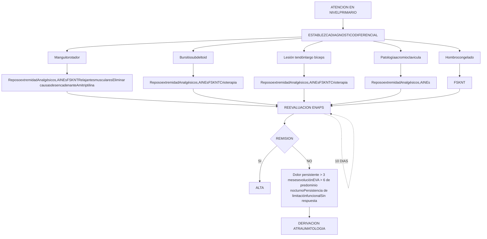
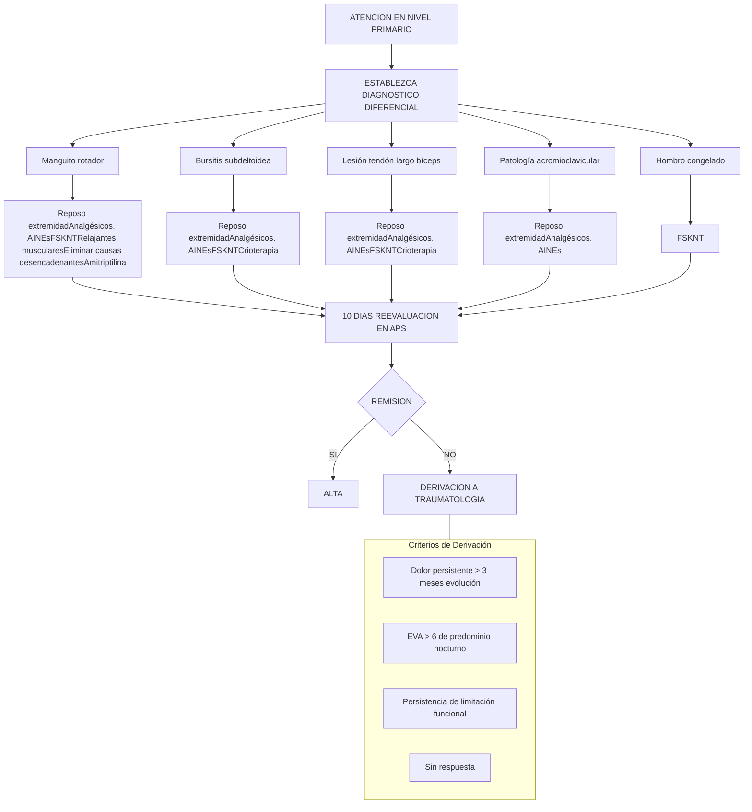

# PROT-HOMBRO-DOLOROSO-2018

--- Página 1 ---

**<u>Departamento de Asesoría Jurídica</u>**

DR. FMG/JN/MB/NGD
Nº 930/18

**EXENTA Nº 2653**
SANTIAGO, 2 8 SET. 2018

**VISTOS:** Memorándum Nº35 de 20 de agosto de 2018 respectivamente, del Departamento de Calidad y Seguridad del Paciente, solicitando al Departamento de Asesoría Jurídica la aprobación de Protocolos Clínicos resolutivos que acompaña; Memorándum Nº152 de 10 de septiembre de 2018, del Departamento de Asesoría Jurídica a través del cual se solicita al Departamento de Calidad y Seguridad del Paciente complementación de la información acompañada; Memorándum Nº40 de 25 de septiembre de 2018, a través del cual el Departamento de Calidad y Seguridad del Paciente complementa su solicitud con la información requerida; y en uso de las atribuciones que me confiere el DFL. Nº1/2005, en virtud del cual se fija el Texto Refundido, Coordinado y Sistematizado del D.L. Nº2.763/79 y otras normas; lo contemplado en el Decreto Supremo Nº140/04, Reglamento Orgánico de los Servicios de Salud y el Decreto Afecto Nº56 de fecha 12 de julio de 2018, que nombra al suscrito en el cargo de Director de este Servicio de Salud Metropolitano Occidente, ambos del Ministerio de Salud; lo dispuesto por la Resolución Nº1600/2008 de la Contraloría General de la República, y,

**CONSIDERANDO:**

**I.** Que, con el fin de materializar los compromisos adquiridos por la Red Pública de Salud para el aumento de Altas de Consultas de la Especialidad (COMGES 6), se han constituido grupos de trabajo de profesionales clínicos y de gestión de la Red Occidente de Salud, de las áreas respectivas, con la finalidad de realizar una revisión bibliográfica nacional e internacional y a partir de la experiencia han sistematizado los antecedentes más relevantes a ser considerados al momento de enfrentarse con situaciones clínicas determinadas;

**II.** Que, del trabajo anteriormente descrito, se han podido determinar protocolos clínicos que permitirán a los profesionales contar con un apoyo al manejo clínico de los problemas prevalentes a los que se ven enfrentados los especialistas de la Red, favoreciendo la estandarización de los procesos dentro de los establecimientos de salud;

**III.** Que dentro de las condiciones clínicas analizadas se encuentra el Hombro Doloroso, por cuanto se han recopilado y sistematizado la mejor evidencia disponible sobre estudio y manejo de este cuadro generándose el "Protocolo Resolutivo Hombro Doloroso";

**IV.** La conformidad del suscrito, se dicta la siguiente:

**RESOLUCIÓN**

**1. APRUÉBASE** el "Protocolo Resolutivo de Hombro Doloroso", elaborado por los profesionales del Hospital Félix Bulnes y Revisado por el Equipo de Trabajo COMGES 6, cuyo texto es el siguiente:

--- Página 2 ---

|        | Elaborado por:                                                                                                                                | Revisado por:                                                                                                                                                      | Aprobado por:                                       |
| ------ | --------------------------------------------------------------------------------------------------------------------------------------------- | ------------------------------------------------------------------------------------------------------------------------------------------------------------------ | --------------------------------------------------- |
| Nombre | Dr. Héctor Valenzuela Dr. Andrés Castro Sr. Jorge Gonzalez                                                                            | Dra. Lorena Arrue T.M Angélica Alarcón Dra. Marisol Concha Carmen Luz Nachar                                                                           | Dr. Darwin Letelier                                 |
| Cargo  | Jefe Traumatología Infantil Hospital Clínico Dr. Félix Bulnes Cerda Traumatólogo Kinesiólogo Hospital Clínico Dr. Félix Bulnes Cerda. | Jefa de CAE HFBC Departamento de Planificación y Control de Gestión Dpto. de calidad y seguridad del paciente SS Occidente Integrantes COMITÉ COMGES 6 | Sub Director médico Servicio de Salud Occidente |
| Firma  |                                                                                                                                               |                                                                                                                                                                    |                                                     |

--- Página 3 ---

# Protocolo Hombro doloroso

## 1.-Autores.-

1.1.- Dr. Héctor Valenzuela Traumatología Infantil Hospital Clínico Dr. Félix Bulnes Cerda.

1.2.- Dr. Andrés Castro Traumatología Infantil Hospital Clínico Dr. Félix Bulnes Cerda.

1.3.- Sr. Jorge Gonzalez Kinesiología Hospital Clínico Dr. Félix Bulnes

Se declara que no hay conflicto de interés en los profesionales que realizaron este protocolo.

## 2.- Comisión revisora

2.1-Dra. Lorena Arrue, Jefa CAE HFBC

2.2- Comisión revisora: Equipo de trabajo COMGES 6 (por resolución)

## 3.- Introducción

Los Protocolos resolutivos de Traumatología forman parte de la implementación de procesos resolutivos que tienen como finalidad aumentar la oferta de consulta en la especialidad, definiendo patologías especificas con alta frecuencia de derivación y fácil resolución, generando un aumento en las altas de estas especialidades y una mejora en la referencia y contra referencia.

Para su ejecución, se han constituido equipos de trabajo integrados por profesionales de los ámbitos clínicos y de gestión, los cuales, a través de una revisión bibliográfica de documentos nacionales e internacionales, y a partir de la experiencia clínica han sistematizado los antecedentes más relevantes a ser considerados al momento de enfrentarse con las situaciones clínicas descritas.

La experiencia internacional muestra que el desarrollo de guías y protocolos apoya el manejo clínico de los problemas prevalentes a los que se ven enfrentados los especialistas, favoreciendo la estandarización de los procesos dentro de las instituciones de salud. Con ellos se contribuye a disminuir la variabilidad en la práctica clínica uniformando criterios de manejo y de derivación a especialistas, cuando la condición clínica lo amerite, consensuando los criterios clínicos y los requerimientos de apoyo diagnóstico y terapéutico necesarios para la resolución del problema de salud.

Las enfermedades traumatológicas como el Hombro Doloroso se caracterizan por afectar a personas en edad laboral y adultos mayores. Son frecuente motivo de consulta y generan incapacidad laboral y menoscabo en la calidad de vida del paciente. Su etiología es variada y con frecuencia multifactorial, pero destacan las bursitis, tendinosis y pinzamientos. Puede ser de curso agudo o crónico y este último requiere un estudio imagenológico y tratamiento kinésico con frecuencia.

--- Página 4 ---

# MAPA DE DERIVACIÓN DE CONSULTA DE ESPECIALIDAD DESDE APS Y HOSPITAL COMUNITARIO A HOSPITAL DE MAYOR COMPLEJIDAD. JUNIO 2016

| ESPECIALIDAD Grupo Etario | Med. Fca. YRehabilitación | Oftalmología                                                                                                                       | Traumatología <15 años | Traumatología >15 años |
| ----------------------------- | ------------------------- | ---------------------------------------------------------------------------------------------------------------------------------- | -------------------------- | -------------------------- |
| CERRO NAVIA                   | SIN OFERTA EN LA RED  | Filtro por UAPO según cartera de Servicios, resto de la derivación a HSJDD. Desde UAPO se deriva directo a HSJDD   | HFBC                       | CRS SAG                    |
| QUINTA NORMAL                 | SIN OFERTA EN LA RED  | Filtro por UAPO según cartera de Servicios, resto de la derivación a HSJDD. Desde UAPO se deriva directo a HSJDD   | HFBC                       | IT                         |
| RENCA                         | SIN OFERTA EN LA RED  | HSJDD                                                                                                                              | HFBC                       | IT                         |
| CURACAVI                      | SIN OFERTA EN LA RED  | HSJDD                                                                                                                              | HFBC                       | IT                         |
| ALHUE                         | SIN OFERTA EN LA RED  | Filtro por UAPO según cartera de Servicios, resto de la derivación a HOSMEL. Desde UAPO se deriva directo a HOSMEL | HFBC                       | HOSMEL                     |
| MARIA PINTO                   | SIN OFERTA EN LA RED  | Filtro por UAPO según cartera de Servicios, resto de la derivación a HOSMEL. Desde UAPO se deriva directo a HOSMEL | HFBC                       | HOSMEL                     |
| MELIPILLA                     | SIN OFERTA EN LA RED  | Filtro por UAPO según cartera de Servicios, resto de la derivación a HOSMEL. Desde UAPO se deriva directo a HOSMEL | HFBC                       | HOSMEL                     |

--- Página 5 ---

| SAN PEDRO     | SIN OFERTA EN LA RED | Filtro por UAPO según cartera de Servicios, resto de la derivación a HOSMEL. Desde UAPO se deriva directo a HOSMEL | HFBC    | HOSMEL  |
| ------------- | -------------------- | ------------------------------------------------------------------------------------------------------------------ | ------- | ------- |
| PADRE HURTADO | SIN OFERTA EN LA RED | HOSPEÑA                                                                                                            | HFBC    | HOSTAL  |
| PEÑAFLOR      | SIN OFERTA EN LA RED | HOSPEÑA                                                                                                            | HFBC    | HOSTAL  |
| TALAGANTE     | SIN OFERTA EN LA RED | Filtro por UAPO según cartera de Servicios, resto de la derivación a HSJDD. Desde UAPO se deriva directo a HSJDD   | HFBC    | HOSTAL  |
| EL MONTE      | SIN OFERTA EN LA RED | HSJDD                                                                                                              | HFBC    | HOSTAL  |
| ISLA DE MAIPO | SIN OFERTA EN LA RED | HSJDD                                                                                                              | HFBC    | HOSTAL  |
| PUDAHUEL      | SIN OFERTA EN LA RED | Filtro por UAPO según cartera de Servicios, resto de la derivación a CRS. Desde UAPO se deriva directo a HSJDD     | CRS SAG | CRS SAG |
| LO PRADO      | SIN OFERTA EN LA RED | Filtro por UAPO según cartera de Servicios, resto de la derivación a HSJDD. Desde UAPO se deriva directo a HSJDD   | CRS SAG | CRS SAG |

<u>Glosario:</u>

* **HSJDD**: Hospital San Juan de Dios
* **HFBC**: Hospital Félix Bulnes
* **IT**: Instituto Traumatológico
* **HOSPEÑA**: Hospital de Peñaflor
* **CRS SAG**: CRS Salvador Allende Gossens
* **HOSTAL**: Hospital de Talagante
* **HOSMEL**: Hospital de Melipilla

--- Página 6 ---

**EXENTA Nº 450**

**SANTIAGO, 23 MAYO 2016**

**VISTOS:** El Memorándum DECOR Nº 121 de a 21 de abril del 2016 del Departamento de Coordinación de Red Asistencial del Servicio de Salud Metropolitano Occidente, mediante el cual, solicita al Jefe del Departamento de Asesoría Jurídica, la elaboración de la respectiva Resolución de Mapa de derivación y oferta de prestaciones de la Red de Rehabilitación Física de este Servicio; y en uso de las atribuciones que me confiere el DFL Nº 1/2005, en virtud del cual se fija el texto refundido, coordinado y sistematizado del D.L. Nº 2.763/79 y otras normas; lo contemplado en el Decreto Supremo Nº 140/04, Reglamento Orgánico de los Servicios de Salud, el Decreto Supremo Nº 53 del 24 de marzo de 2015 que nombra al Director del Servicio de Salud Metropolitano Occidente; y lo dispuesto por la Resolución Nº 1600/2008 de la Contraloría General de la República, y;

**CONSIDERANDO:**

1.- Que, mediante Memorándum Nº 121 del Departamento de Coordinación de la Red Asistencial de este Servicio de Salud, se solicita la aprobación de "Mapa de derivación, oferta de prestaciones de la Red de Rehabilitación, Patologías a intervenir por nivel de complejidad y oferta de prestaciones profesionales por Establecimientos que conforma la Red de Rehabilitación Física del Servicio de Salud Metropolitano Occidente";

2.- Que, en el proceso de confección del referido mapa, este se validó por un equipo técnico conformado por representantes de Centros comunitarios de Rehabilitación de Atención Primaria y representantes de Hospitales de la Red del Servicio de Salud Metropolitano Occidente;

3.- Que, mediante este acto administrativo se sanciona el Mapa de derivación señalado de esta Dirección de Servicio de Salud;

4.- La conformidad del suscrito, dicto la siguiente:

**RESOLUCIÓN**

--- Página 7 ---

De acuerdo a propuesta validada en reunión realizada el día 09 de marzo 2016 con representantes de la red primaria y secundaria de la red, se establece que la resolución de patologías que requieran un manejo en el ámbito de rehabilitación física, debe enmarcarse en la distribución de patologías por nivel de complejidad, es decir, Centros de Rehabilitación Comunitaria de APS (CCR), CRS Salvador Allende G., Hospitales (San Juan de Dios, Félix Bulnes, Talagante, Melipilla, Peñaflor), distribución territorial y oferta de prestaciones de rehabilitación por especialidad.

## 1.- PATOLOGIAS A RESOLVER POR NIVEL DE COMPLEJIDAD

a) **NIVEL PRIMARIO DE ATENCIÓN: Centros de Rehabilitación Comunitaria (CCR):** Patologías de carácter crónico que requieran manejo integral de base comunitaria e inclusión social.

* Artrosis leve-moderada y severa.
* Hombro doloroso crónico.
* Algias de columna vertebral por patologías degenerativas crónicas.
* ACV > 6 meses.
* Parkinson.
* Artritis Reumatoidea posterior a primer episodio.
* Patologías neurológicas de origen degenerativo.
* Pacientes post-operados posterior al egreso de rehabilitación desde el nivel secundario (establecimientos hospitalarios y CRS a excepción del Instituto Traumatológico), según requerimiento.
* Lesionados medulares posterior al egreso de rehabilitación desde el nivel secundario (establecimientos hospitalarios y CRS a excepción del Instituto Traumatológico).

b) **NIVEL HOSPITALARIO (San Juan de Dios, Félix Bulnes, Talagante, Melipilla, Peñaflor) Y CRS SALVADOR ALLENDE**

* Pacientes post-operados derivados de IT y HEC.
* Post operados de neurocirugía hasta 1 año según evolución.
* Controles y Tratamiento post-fracturas.
* Endoprótesis (post-operados).
* Amputados (revisar uso pilón, capacitación para Hospitales y CRS).
* ACV isquémico < 6 meses de evolución.
* ACV hemorrágico y TEC hasta 1 año, según evolución.
* Esguinces - luxaciones.
* Espolón calcáneo - Fascitis plantar.
* Parálisis facial.
* STC - Epicondilitis medial, lateral.
* Artrosis severa de acuerdo a derivación de especialista que requiera intervención (infiltraciones).
* Patologías neuromusculares agudas según evolución hasta 1 año.
* Artritis Reumatoidea 1er episodio.
* Rehabilitación cardíaca fase 1 y 2 en hombres con dcto: IAM < 50 años.
* Lesionados medulares.

--- Página 8 ---

# 4.-Objetivo general:

Optimizar el tratamiento de hombro doloroso en los pacientes del SSMOC.

## Objetivos específicos:

* Optimizar el uso de recursos mediante la derivación pertinente de pacientes con Hombro doloroso desde atención primaria a nivel secundario.
* Definir pautas de recomendaciones para el tratamiento del hombro doloroso en los diferentes niveles de la red del servicio de salud metropolitano occidente.
* Definir criterios de referencia y contra referencia entre nivel primario y secundario de atención de la red.

# 5.- Alcance.-

Para ser aplicado a todos los establecimientos de la red del SSMOC.

6.1.- Centros de Salud Familiar
6.2.- Centros de Salud Urbanos y Rurales
6.3.- Hospitales de Baja y Mediana Complejidad
6.4.- Hospitales de Mayor complejidad
6.4.- Postas de Salud Rural
6.5.- Servicios de Atención Primaria de Urgencia

# 6.- Responsables de la ejecución.-

6.1.- Médicos de Atención Primaria Municipal
6.2.- Médicos de SAPUs
6.3.- Médicos de Unidades de Emergencia hospitalaria
6.3.- Médicos en Etapa de Destinación y Formación
6.4.- Médicos de nivel especialidad
6.5.- Comités de Gestión de Oferta y Demanda de nivel primario y secundario

# 7.- Distribución.-

7.1.- Box de Atención Médica de APS y Especialidad
7.2.- Box de Atención Médica de SAPUs
7.3.- Oficina de Comités de Gestión

# 8.- Población objetivo

-Usuarios pertenecientes a la red Occidente mayor de 15 años, que presente sospecha o diagnóstico de hombro doloroso

# 9.- Tiempo de alta máxima permanencia en atención secundaria

Tiempo 4 meses y según evolución e indicación médica.

# 10.- <u>Contenidos Específicos del Protocolo.-</u>

## Definiciones:

Síndrome de Hombro doloroso es un cuadro diagnóstico inespecífico. Incluye en su etiología una variedad de patologías heterogéneas que involucran las diversas estructuras que lo componen, músculos, tendones, nervios, articulación, neuro vasculares y de atrapamiento. Es una patología frecuente como motivo de consulta y su evolución es de curso prolongado y con episodios recurrente.

## Evaluación clínica:

Anamnesis:

--- Página 9 ---

La anamnesis es muy importante para obtener información que oriente a la causa del dolor de hombro. Interrogar por antecedentes como traumatismos, actividad deportiva y laboral. Características del dolor, factores desencadenantes.

La edad del paciente orienta hacia las causas más frecuente, en adultos jóvenes se relaciona a inestabilidad y en los mayores a patología degenerativa como del manguito rotador y pinzamiento sub acromial.

Interrogar por tiempo de evolución, relación a extremidad dominante, carácter progresivo de síntomas, respuesta a tratamientos realizados y descartar patología laboral.

Antecedentes de enfermedades reumatológicas, cáncer, fibromialgias, patología coronaria, etc.

**Examen físico:**

Es muy importante familiarizarse con la anatomía y funciones de cada estructura a fin de comprender las causas e interpretar correctamente los hallazgos

<u>Inspección:</u>

El examen físico debe iniciarse desde el ingreso a la consulta buscando asimetrías de la marcha, posturas antiálgicas. Se debe evaluar preferentemente de pie y sentado, evaluando la forma en que se desviste y viste.

<u>Palpación:</u>

Se recomienda realizar sentado para facilitar el acceso a las diferentes estructuras y realizar una secuencia preestablecida para evitar olvidar alguna estructura. Su objetivo es localizar puntos dolorosos, asimetrías, aumentos de volumen o deformidad.

<u>Movilidad:</u>

Se realiza con prudencia para evitar dolor innecesario y realizando evaluación de movilidad activa y pasiva en todos los rangos de movimiento y en forma comparativa.

Pruebas específicas:

Hay una variedad de pruebas específicas o test para evaluar distintas patologías y es necesario conocerlas para realizar una aproximación diagnóstica: Anexo 2

- Hawkins
- Neer
- Jobe
- Yocum
- Yergason
- O'Brien

Se ha descrito **<u>Síntomas de alarma</u>** en la evaluación de hombro doloroso y son los siguientes:

- Dolor de reposo o no localizado
- Presencia de tumor palpable
- Aumento de volumen con calor local y eritema
- Irradiación a extremidad superior
- Aumentado en relación con movilidad de cuello
- Síntomas de patologías abdominales, respiratorias o cardiacas.

--- Página 10 ---

**Diagnóstico:**

A fin de precisar un diagnóstico se puede solicitar exámenes complementarios:

* Radiografías de hombro con proyecciones AP y Axial de escápula. Es útil para una evaluación inicial y para descartar artrosis, luxaciones, fracturas y tumores especialmente.
* Eco tomografía de partes blandas de hombro: Es operador dependiente, pero se le asigna una alta especificidad y sensibilidad. En general se recomienda ante un cuadro de fracaso de tratamiento inicial.
* Resonancia nuclear magnética: Tiene una alta sensibilidad y especificidad, pero no se recomienda como evaluación inicial o de atención primaria.

<u>**Tratamiento con medidas generales en APS:**</u>

El tratamiento inicial incluye reposo articular relativo según dolor, Aines oral, medidas físicas.

Si el dolor lo permite se recomienda realizar ejercicios suaves tipo pendulares para evitar rigidez y atrofia muscular.

Control en 10 a 14 días en APS y derivar a tratamiento kinésico localmente.

<u>**Criterios de derivación a nivel secundario:**</u>

Derivar a nivel secundario pacientes en los siguientes casos:
-Fracaso de tratamiento conservador y sin presencia de síntomas de alarma luego de 3 meses.
-Inestabilidad articular
-Restricción de movilidad progresiva o sospecha de capsulitis adhesiva (hombro congelado)
-Traumatismo asociado con limitación funcional y dolor persistente.
-Duda diagnóstica
-Sospecha de rotura de manguito rotador clínica o en exámenes complementarios.
-Presencia de Síntomas de alarma
-Sospecha de infección
-Antecedentes de neoplasia o tumor palpable.
-Compromiso neurológico.

<u>**Criterios de contra referencia:**</u>

Se realizará contra referencia a APS los casos con resolución de cuadro doloroso que permita su actividad cotidiana. También en aquellos casos en que se ha establecido la etiología del hombro doloroso y existen condiciones para su tratamiento kinésico y farmacológico en APS.

**11.- Metodología de evaluación de la implementación.**

Será responsable de la evaluación del Dpto. de Calidad y Seguridad del Paciente.
Se establecen los criterios de auditoria con el fin de mostrar evidencia de Implementación de los 4 protocolos resolutivos 2018

--- Página 11 ---

Se evidenciará esta implementación a través de una auditoría de fichas clínica en los establecimientos de la Red, esta auditoría será responsabilidad del Servicio de Salud, del Dpto. de calidad y seguridad del paciente.

**Procedimiento:**

* Seleccionar los pacientes atendidos a nivel secundario con diagnóstico de las patologías protocolizadas, de éstos se seleccionará una muestra representativa (según estadística)
* Se solicitará en APS (Dr. Vélez), los pacientes atendidos por las patologías a nivel primario y las interconsultas realizadas.
* Realizar revisión de: Ficha nivel Primario e Interconsulta a través de plataforma Rayen y Ficha de Nivel secundario a través ficha física de papel de acuerdo a pauta.
* Se buscará en la ficha clínica de papel o electrónica la presencia o no, de elementos relevantes del protocolo para cada nivel de atención:

### CRITERIOS DE EVALUACION

**NIVEL PRIMARIO (APS)**

1.-Antecedentes clínicos. (SI-NO)
2.-Criterios de referencias establecidos en el protocolo.
3.-Hipótesis diagnostica (SI-NO)

**INTERCONSULTA**

1.- Presencia de antecedentes personales. (SI-NO)
2.- Hipótesis diagnóstica. (SI-NO)
3.- Criterios de derivación.

**NIVEL SECUNDARIO**

1.-Evaluación clínica. (SI- NO)
2.-Existe confirmación diagnóstica. (SI-NO)
3.-Existe plan o indicaciones terapéuticas. (SI-NO)

--- Página 12 ---

# INDICADORES

| INDICADOR1 NOMBRE                                                                                                                                                  | INDICADOR1 FORMULA                                                                                                                                                                                                                        | INDICADOR1 FUENTE                                                   | INDICADOR1 PERIODICIDAD | INDICADOR1 RESPONSABLE               |
| ---------------------------------------------------------------------------------------------------------------------------------------------------------------------- | --------------------------------------------------------------------------------------------------------------------------------------------------------------------------------------------------------------------------------------------- | ----------------------------------------------------------------------- | --------------------------- | ---------------------------------------- |
| tiempo promedio desde ingreso lista de espera hasta alta, de patologia protocolizada                                                                                   | suma de los dias desde el ingreso hasta el alta /N° de altas de la patologia protocolizada                                                                                                                                                    | sigte - ficha clínica                                                   | 1 vez al año                | Dpto de calidad y seguridad del paciente |
| INDICADOR 2                                                                                                                                                            |                                                                                                                                                                                                                                               |                                                                         |                             |                                          |
| NOMBRE                                                                                                                                                                 | FORMULA                                                                                                                                                                                                                                       | FUENTE                                                                  | PERIODICIDAD                | RESPONSABLE                              |
| Pacientes auditados con diagnostico de patologia protocolizada que contengan al menos la presencia de 3 elementos relevantes del protocolo para cada nivel de atención | N° pacientes revisados con diagnostico de hombro doloroso que contengan al menos la presencia de 3 elementos relevantes del protocolo para cada nivel de atención/ total de pacientes revisados en el periodo con diagnostico hombro doloroso | Revision de registros Rayen .interconsulta ,ficha clinica en hospitales | 1 vez al año                | Dpto de calidad y seguridad del paciente |

**La evaluación para el año 2018 será:**

-Auditoría de ficha clínica en el cuarto trimestre del 2018.

## 12.-Plan de Difusión

Responsabilidades:

**Servicio de Salud:**

-Ordinario de Dirección del Servicio con protocolos, a toda la red Occidente.

* -Subir protocolos a página web de servicio

**Subdirección Médica Atención Ambulatoria:**

Dra. Francisca Reyes y Dra. Arrué: Supervisión de presencia de protocolos en atención secundaria.

**Subdirección APS:**

Dr. Luis Vélez: Supervisión de presencia de protocolos en atención primaria

--- Página 13 ---

# 13.-Bibliografia

1. Javier Barrera Portillo. Curso Atención Primaria formación continuada integral en Incapacidad Laboral Temporal para Médicos de Atención Primaria 2011-2012-2013. En materia de patología de hombro.

2. Javier Barrera Portillo. Isabel Amiano Echezarreta. Iván Carbajo Martínez Hombro doloroso. Enfermedad del manguito rotador y Capsulitis retráctil. 3. Javier Barrera Portillo. EVIGRA. IV Curso de evidencia científica en rehabilitación y medicina física 2010 Evidencias en la rehabilitación del hombro doloroso.

4. J. Barrera Portillo, J. I. Emparanza Knörr, N. Lizarraga Errea, I. Carbajo, Martínez, V. Bahón, Genovés y A. Virto Lekuona. Cómo buscar (y encontrar) la mejor evidencia científica disponible de manera rápida y sencilla. Rehabilitación (Madr) 2002; 36(4):219-26.

5. J. Barrera Portillo Abordaje del hombro doloroso <u>megaslides.es/doc/196449/hombro-doloroso</u>6. J. Barrera Portillo Hombro Doloroso (Enfermedad del Manguito Rotador y Capsulitis Retráctil) Diagnóstico y Tratamiento Conservador.

7. J. M. Vicente Pardo. Causalidad en la determinación de la contingencia de las lesiones de hombro. Retorno al trabajo en procesos de larga evolución. 8. ª aula de formación: Mutualia. Patología del Hombro desde la perspectiva Laboral. 27 mayo 2016.

8. Iñaki Esnal. Aspectos Médico Legales en el Hombro Doloroso y su Relación con la Enfermedad Profesional. 8. ª aula de formación: Mutualia. Patología del Hombro desde la perspectiva Laboral. 27 mayo 2016.

9. M. T. Vicente-Herrero, L. Capdevila García, Á. A. López González y M. V. Ramírez Iñiguez de la Torre. El hombro y sus patologías en medicina del trabajo. SEMERGEN. 2009;35(4):197-202.

10. Francisco Sánchez Sánchez Bernardo J. Llinares Clausi. José Miguel Cruz Gisbert. Patología del manguito de los rotadores en el ambiente laboral, Asepeyo. Master universitario en medicina evaluadora - Edición 2006-2007. Instituto de Formación Continua Universidad de Barcelona.

11. Mónica Macía Calvo. La patología de hombro como enfermedad profesional. Ciencia Forense, 11/2014: 105-126. ISSN: 1575-6793.

12. Justino de Anca Fernández. Tendinopatías como enfermedades profesionales en el ámbito laboral asistencial de Asepeyo en Andalucía y Extremadura en los periodos 2007-2008. Asepeyo. Master universitario en medicina evaluadora - Edición 2008 – 2009. Instituto de Formación Continua Universidad de Barcelona. [ <u>Links</u> ]

13.- SERIE REGLAS DE DERIVACION 2009 Servicio de Salud de Coquimbo
Patologías traumatológicas extremidad superior

--- Página 14 ---

# 14.- <u>Flujograma DE DERIVACION HOMBRO DOLOROSO</u>

--- Página 15 ---

# ANEXO 1

## <u>DISTRIBUCIÓN ETARIA DEL HOMBRO DOLOROSO.-</u>

| DE 15 A 35 AÑOS DE EDAD                               | DE 35 A 50 AÑOS DE EDAD            | SOBRE 50 AÑOS                                |
| ----------------------------------------------------- | ---------------------------------- | -------------------------------------------- |
| Tendinitis/ bursitis                                  | Tendinitis/ bursitis               | Osteoartritis articulación acromioclavicular |
| Síndrome de pinzamiento estadio I                     | Síndrome de pinzamiento estadio II | Síndrome de pinzamiento estadio II y III     |
| Inestabilidad del hombro                              | Capsulitis adhesiva                | Capsulitis adhesiva                          |
| Patologías traumáticas articulación acromioclavicular | Tendinitis calcificada             |                                              |

# ANEXO 2

## Ø <u>Maniobra de Neer:</u>

Con una mano se fija la escápula y con el otro se eleva pasivamente el brazo en ADD

## Ø <u>Maniobra de Yocum.:</u>

Con una mano sobre el hombro y la otra ejerciendo presión sobre el codo del paciente que apoya la mano sobre el hombro contralateral se le pide que...

--- Página 16 ---

> <u>**Maniobra de Jobe:**</u>

ABD de 90 ° y rotación interna de ambos hombros, en 30 ° de antepulsión, pronación de antebrazos, se pide al paciente que mantenga la postura mientras se ejerce presión hacia abajo

> <u>**Maniobra de Apley:**</u>

**Rotación externa más ABD**

**Rotación interna más ADD**

El paciente en bipedestación debe intentarse tocar el borde medial de la escápula contralateral con el dedo índice

> <u>**Maniobra de Gerber.-**</u>

Si existe una rotura del subescapular no puede separar la mano del plano cutáneo

--- Página 17 ---

2. **PUBLÍQUESE** el contenido de la presente Resolución en el Portal www.mercadopublico.cl a fin de cumplir con los requerimientos de la Ley de Compras y Contrataciones Públicas.

**ANÓTESE Y COMUNÍQUESE.**

**DR. FRANCISCO MIRANDA GUERRERO**
**DIRECTOR**
**SERVICIO DE SALUD METROPOLITANO OCCIDENTE**

<u>**DISTRIBUCIÓN:**</u>

* Departamento de Calidad y Seguridad del Paciente.
* <mark>Asesoría Jurídica.</mark>
* Oficina de Partes.

TRANSCRITO FIELMENTE
XIMENA VARAS CONTRERAS
MINISTRO DEL FE

--- Página 18 ---

# Protocolo resolutivo de Hombro Doloroso

|        | Elaborado por:                                                              | Revisado por:                                                  | Aprobado por:                                           |
| ------ | --------------------------------------------------------------------------- | -------------------------------------------------------------- | ------------------------------------------------------- |
| Nombre | Dr. Héctor Valenzuela                                                       | Dra. Lorena Arrue                                              | Dr. Darwin Letelier                                     |
|        | Dr. Sergio Vial                                                             | T.M Angélica Alarcón                                           |                                                         |
|        | Sr. Jorge Gonzalez                                                          | Dra. Marisol Concha                                            |                                                         |
|        | Carmen Luz Nachar                                                           |                                                                |                                                         |
| Cargo  | Jefe Traumatología Infantil Hospital Clínico Dr. Félix Bulnes Cerda | Jefa de CAE HFBC                                               | Sub Director médico Servicio de Salud Occidente |
|        | Traumatólogo HFBC                                                           | Departamento de Planificación y Control de Gestión     |                                                         |
|        | Kinesiólogo Hospital Clínico Dr. Félix Bulnes Cerda.                | Dpto. de calidad y seguridad del paciente SS Occidente |                                                         |
|        | Integrantes COMITÉ COMGES 6                                             |                                                                |                                                         |
| Firma  | \[signature]                                                                | \[signature]                                                   | \[signature]                                            |

--- Página 19 ---

|   | N° PAGINAS 17 | Servicio de SaludOccidente | FECHA ELABORACION FECHA REVISION N° VERSIÓN | Junio 2018 Junio de 2021 1 |
| - | ------------- | -------------------------- | --------------------------------------------------- | ---------------------------------- |

# Protocolo Hombro doloroso

## 1.-Autores.-

1.1.- Dr. Héctor Valenzuela Traumatología Infantil Hospital Clínico Dr. Félix Bulnes Cerda.

1.2.- Dr. Andrés Castro Traumatología Infantil Hospital Clínico Dr. Félix Bulnes Cerda.

1.3.- Sr. Jorge Gonzalez Kinesiología Hospital Clínico Dr. Félix Bulnes

Se declara que no hay conflicto de interés en los profesionales que realizaron este protocolo.

## 2.- Comisión revisora

2.1-Dra. Lorena Arrue, Jefa CAE HFBC

2.2- Comisión revisora: Equipo de trabajo COMGES 6 (por resolución)

## 3.- Introducción

Los Protocolos resolutivos de Traumatología forman parte de la implementación de procesos resolutivos que tienen como finalidad aumentar la oferta de consulta en la especialidad, definiendo patologías especificas con alta frecuencia de derivación y fácil resolución, generando un aumento en las altas de estas especialidades y una mejora en la referencia y contra referencia.

Para su ejecución, se han constituido equipos de trabajo integrados por profesionales de los ámbitos clínicos y de gestión, los cuales, a través de una revisión bibliográfica de documentos nacionales e internacionales, y a partir de la experiencia clínica han sistematizado los antecedentes más relevantes a ser considerados al momento de enfrentarse con las situaciones clínicas descritas.

La experiencia internacional muestra que el desarrollo de guías y protocolos apoya el manejo clínico de los problemas prevalentes a los que se ven enfrentados los especialistas, favoreciendo la estandarización de los procesos dentro de las instituciones de salud. Con ellos se contribuye a disminuir la variabilidad en la práctica clínica uniformando criterios de manejo y de derivación a especialistas, cuando la condición clínica lo amerite consensuando los criterios clínicos y los requerimientos de apoyo diagnóstico y terapéutico necesarios para la resolución del problema de salud.

Las enfermedades traumatológicas como el Hombro Doloroso se caracterizan por afectar a personas en edad laboral y adultos mayores. Son frecuente motivo de consulta y generan incapacidad laboral y menoscabo en la calidad de vida del paciente. Su etiología es variada y con frecuencia multifactorial, pero destacan las bursitis, tendinosis y pinzamientos. Puede ser de curso agudo o crónico y este último requiere un estudio imagenológico y tratamiento kinésico con frecuencia.

--- Página 20 ---

|   | N° PAGINAS 17 | Servicio de SaludOccidente | FECHA REVISIONJunio de 2021 | FECHAELABORACIONJunio 2018 N° VERSIÓN1 |
| - | ------------- | -------------------------- | --------------------------- | ------------------------------------------ |

# MAPA DE DERIVACIÓN DE CONSULTA DE ESPECIALIDAD DESDE APS Y HOSPITAL COMUNITARIO A HOSPITAL DE MAYOR COMPLEJIDAD. JUNIO 2016

| ESPECIALIDAD Grupo Etario | Med. Fca. YRehabilitación | Oftalmología                                                                                                                       | Traumatología <15 años | Traumatología >15 años |
| ----------------------------- | ------------------------- | ---------------------------------------------------------------------------------------------------------------------------------- | -------------------------- | -------------------------- |
| CERRO NAVIA                   | SIN OFERTA EN LA RED      | Filtro por UAPO según cartera de Servicios, resto de la derivación a HSJDD. Desde UAPO se deriva directo a HSJDD       | HFBC                       | CRS SAG                    |
| QUINTA NORMAL                 | SIN OFERTA EN LA RED      | Filtro por UAPO según cartera de Servicios, resto de la derivación a HSJDD. Desde UAPO se deriva directo a HSJDD       | HFBC                       | IT                         |
| RENCA                         | SIN OFERTA EN LA RED      | HSJDD                                                                                                                              | HFBC                       | IT                         |
| CURACAVI                      | SIN OFERTA EN LA RED      | HSJDD                                                                                                                              | HFBC                       | IT                         |
| ALHUE                         | SIN OFERTA EN LA RED      | Filtro por UAPO según cartera de Servicios, resto de la derivación a HOSMEL. Desde UAPO se deriva directo a HOSMEL | HFBC                       | HOSMEL                     |
| MARIA PINTO                   | SIN OFERTA EN LA RED      | Filtro por UAPO según cartera de Servicios, resto de la derivación a HOSMEL. Desde UAPO se deriva directo a HOSMEL | HFBC                       | HOSMEL                     |

--- Página 21 ---

|               | N° PAGINAS 17        | Servicio de Salud Occidente                                                                                        | FECHA REVISIONJunio de 2021 | FECHA ELABORACIONJunio 2018 N° VERSIÓN1 |
| ------------- | -------------------- | ------------------------------------------------------------------------------------------------------------------ | --------------------------- | ------------------------------------------- |
| MELIPILLA     | SIN OFERTA EN LA RED | Filtro por UAPO según cartera de Servicios, resto de la derivación a HOSMEL. Desde UAPO se deriva directo a HOSMEL | HFBC                        | HOSMEL                                      |
| SAN PEDRO     | SIN OFERTA EN LA RED | Filtro por UAPO según cartera de Servicios, resto de la derivación a HOSMEL. Desde UAPO se deriva directo a HOSMEL | HFBC                        | HOSMEL                                      |
| PADRE HURTADO | SIN OFERTA EN LA RED | HOSPEÑA                                                                                                            | HFBC                        | HOSTAL                                      |
| PEÑAFLOR      | SIN OFERTA EN LA RED | HOSPEÑA                                                                                                            | HFBC                        | HOSTAL                                      |
| TALAGANTE     | SIN OFERTA EN LA RED | Filtro por UAPO según cartera de Servicios, resto de la derivación a HSJDD. Desde UAPO se deriva directo a HSJDD   | HFBC                        | HOSTAL                                      |
| EL MONTE      | SIN OFERTA EN LA RED | HSJDD                                                                                                              | HFBC                        | HOSTAL                                      |
| ISLA DE MAIPO | SIN OFERTA EN LA RED | HSJDD                                                                                                              | HFBC                        | HOSTAL                                      |
| PUDAHUEL      | SIN OFERTA EN LA RED | Filtro por UAPO según cartera de Servicios, resto de la derivación a CRS. Desde UAPO se deriva directo a HSJDD     | CRS SAG                     | CRS SAG                                     |
| LO PRADO      | SIN OFERTA EN LA RED | Filtro por UAPO según cartera de Servicios, resto de la derivación a HSJDD. Desde UAPO se deriva directo a HSJDD   | CRS SAG                     | CRS SAG                                     |

<u>Glosario:</u>

**HSJDD**: Hospital San Juan de Dios
**HFBC**: Hospital Félix Bulnes
**IT**: Instituto Traumatológico
**HOSPEÑA**: Hospital de Peñaflor
**CRS SAG**: CRS Salvador Allende Gossens
**HOSTAL**: Hospital de Talagante
**HOSMEL**: Hospital de Melipilla

--- Página 22 ---

|  | N° PAGINAS 17       | Servicio de Salud Occidente | EMPTY                        | FECHA ELABORACION Junio 2018 |
| ----------------------------------------------------------- | ------------------- | --------------------------- | ---------------------------- | ---------------------------- |
| ROW\_SPAN\_CONTINUE                                         | ROW\_SPAN\_CONTINUE | ROW\_SPAN\_CONTINUE         | FECHA REVISION Junio de 2021 | N° VERSIÓN 1                 |

## EXENTA Nº 450

SANTIAGO, 23 MAYO 2016

**VISTOS:** El Memorándum DECOR Nº121 de a 21 de abril del 2016 del Departamento de Coordinación de Red Asistencial del Servicio de Salud Metropolitano Occidente, mediante el cual, solicita al Jefe del Departamento de Asesoría Jurídica, la elaboración de la respectiva Resolución de Mapa derivación y oferta de prestaciones de la Red de Rehabilitación Física de este Servicio; y en uso de las atribuciones que me confiere el DFL. Nº1/2005, en virtud del cual se fija el texto refundido, coordinado y sistematizado del D.L. Nº2.763/79 y otras normas; lo contemplado en el Decreto Supremo Nº140/04, Reglamento Orgánico de Servicios de Salud, el Decreto Supremo Nº53 del 24 de marzo de 2015 que nombra Director del Servicio de Salud Metropolitano Occidente; y lo dispuesto por la Resolución Nº1600/2008 de la Contraloría General de la República, y;

### CONSIDERANDO:

1.- Que, mediante Memorándum Nº 121 del Departamento de Coordinación de la Red Asistencial de este Servicio de Salud, se solicita la aprobación de "Mapa de derivación, oferta de prestaciones de la Red de Rehabilitación, Patologías a intervenir por nivel de complejidad y oferta de prestaciones profesionales por Establecimientos que conforma la Red de Rehabilitación Física del Servicio de Salud Metropolitano Occidente";

2.- Que, en el proceso de confección del referido mapa, este se validó por un equipo técnico conformado por representantes de Centros comunitarios de Rehabilitación de Atención Primaria y representantes de Hospitales de la Red del Servicio de Salud Metropolitano Occidente;

3.- Que, mediante este acto administrativo se sanciona el Mapa de derivación señalado de esta Dirección de Servicio de Salud;

4.- La conformidad del suscrito, dicto la siguiente:

**RESOLUCIÓN**

--- Página 23 ---

|  | N° PAGINAS 17 | Servicio de Salud Occidente  | FECHA ELABORACION Junio 2018 |
| ----------------------------------------------------------- | ------------- | ---------------------------- | ---------------------------- |
|                                                             |               | FECHA REVISION Junio de 2021 | N° VERSIÓN 1                 |

De acuerdo a propuesta validada en reunión realizada el día 09 de marzo 2016 con representantes de la red primaria y secundaria de la red, se establece que la resolución de patologías que requieran un manejo en el ámbito de rehabilitación física, debe enmarcarse en la distribución de patologías por nivel de complejidad, es decir, Centros de Rehabilitación Comunitaria de APS (CCR), CRS Salvador Allende G., Hospitales (San Juan de Dios, Félix Bulnes, Talagante, Melipilla, Peñaflor), distribución territorial y oferta de prestaciones de rehabilitación por especialidad.

## 1.- PATOLOGIAS A RESOLVER POR NIVEL DE COMPLEJIDAD

### a) NIVEL PRIMARIO DE ATENCIÓN; Centros de Rehabilitación Comunitaria (CCR):
Patologías de carácter crónico que requieran manejo integral de base comunitaria e inclusión social.

* Artrosis leve-moderada y severa.
* Hombro doloroso crónico.
* Algias de columna vertebral por patologías degenerativas crónicas.
* ACV > 6 meses.
* Parkinson.
* Artritis Reumatoidea posterior a primer episodio.
* Patologías neurológicas de origen degenerativo.
* Pacientes post- operados posterior al egreso de rehabilitación desde el nivel secundario (establecimientos hospitalarios y CRS a excepción del Instituto Traumatológico) según requerimiento.
* Lesionados medulares posterior al egreso de rehabilitación desde el nivel secundario (establecimientos hospitalarios y CRS a excepción del Instituto Traumatológico).

### b) NIVEL HOSPITALARIO (San Juan de Dios, Félix Bulnes, Talagante, Melipilla, Peñaflor) Y CRS SALVADOR ALLENDE

* Pacientes post- operados derivados de IT y HFSC.
* Post operados de neurocirugía hasta 1 año según evolución.
* Controles y Tratamiento post- fracturas.
* Endoprótesis (post-operados).
* Amputados (revisar uso pilón; capacitación para Hospitales y CRS).
* ACV isquémico < 6 meses de evolución.
* ACV hemorrágico y TEC hasta 1 año, según evolución.
* Esguinces- luxaciones.
* Espolón calcáneo - Fascitis plantar.
* Parálisis facial.
* STC - Epicondilitis medial, lateral.
* Artrosis severa de acuerdo a derivación de especialista que requiera intervención (infiltraciones).
* Patologías neuromusculares agudas según evolución hasta 1 año.
* Artritis Reumatoidea 1er episodio.
* Rehabilitación cardíaca fase 1 y 2 en hombres con dgto. IAM < 50 años.
* Lesionados medulares.

--- Página 24 ---

| N° PAGINAS 17 | Servicio de SaludOccidente | FECHA REVISIONJunio de 2021 | FECHAELABORACIONJunio 2018 N° VERSIÓN1 |
| ------------- | -------------------------- | --------------------------- | ------------------------------------------ |

**4.-Objetivo general:**

Optimizar el tratamiento de hombro doloroso en los pacientes del SSMOC.
Objetivos específicos:
* Optimizar el uso de recursos mediante la derivación pertinente de pacientes con Hombro doloroso desde atención primaria a nivel secundario.
* Definir pautas de recomendaciones para el tratamiento del hombro doloroso en los diferentes niveles de la red del servicio de salud metropolitano occidente.
* Definir criterios de referencia y contra referencia entre nivel primario y secundario de atención de la red.

**5.- Alcance.-**
Para ser aplicado a todos los establecimientos de la red del SSMOC.
6.1.- Centros de Salud Familiar
6.2.- Centros de Salud Urbanos y Rurales
6.3.- Hospitales de Baja y Mediana Complejidad
6.4.- Hospitales de Mayor complejidad
6.4.- Postas de Salud Rural
6.5.- Servicios de Atención Primaria de Urgencia

**6.- Responsables de la ejecución.-**
6.1.- Médicos de Atención Primaria Municipal
6.2.- Médicos de SAPUs
6.3.- Médicos de Unidades de Emergencia hospitalaria
6.3.- Médicos en Etapa de Destinación y Formación
6.4.- Médicos de nivel especialidad
6.5.- Comités de Gestión de Oferta y Demanda de nivel primario y secundario

**7.- Distribución.-**
7.1.- Box de Atención Médica de APS y Especialidad
7.2.- Box de Atención Médica de SAPUs
7.3.- Oficina de Comités de Gestión

**8.- Población objetivo**
-Usuarios pertenecientes a la red Occidente mayor de 15 años, que presente sospecha o diagnóstico de hombro doloroso

**9.- Tiempo de alta máxima permanencia en atención secundaria**
Tiempo 4 meses y según evolución e indicación médica.

# 10.- <u>Contenidos Específicos del Protocolo.-</u>

**Definiciones:**
Síndrome de Hombro doloroso es un cuadro diagnóstico inespecífico. Incluye en su etiología una variedad de patologías heterogéneas que involucran las diversas estructuras que lo componen, músculos, tendones, nervios, articulación, neuro vasculares y de atrapamiento. Es una patología frecuente como motivo de consulta y su evolución es de curso prolongado y con episodios recurrente.

--- Página 25 ---

|   | N° PAGINAS 17 | Servicio de Salud Occidente | FECHA REVISIONJunio de 2021 | FECHA ELABORACIONJunio 2018 N° VERSIÓN1 |
| - | ------------- | --------------------------- | --------------------------- | ------------------------------------------- |

# Evaluación clínica:

**Anamnesis:**

La anamnesis es muy importante para obtener información que oriente a la causa del dolor de hombro. Interrogar por antecedentes como traumatismos, actividad deportiva y laboral. Características del dolor, factores desencadenantes.

La edad del paciente orienta hacia las causas más frecuente, en adultos jóvenes se relaciona a inestabilidad y en los mayores a patología degenerativa como del manguito rotador y pinzamiento sub acromial.

Interrogar por tiempo de evolución, relación a extremidad dominante, carácter progresivo de síntomas, respuesta a tratamientos realizados y descartar patología laboral.

Antecedentes de enfermedades reumatológicas, cáncer, fibromialgias, patología coronaria, etc.

**Examen físico:**

Es muy importante familiarizarse con la anatomía y funciones de cada estructura a fin de comprender las causas e interpretar correctamente los hallazgos

<u>Inspección:</u>

El examen físico debe iniciarse desde el ingreso a la consulta buscando asimetrías de la marcha, posturas antiálgicas. Se debe evaluar preferentemente de pie y sentado, evaluando la forma en que se desviste y viste.

<u>Palpación:</u>

Se recomienda realizar sentado para facilitar el acceso a las diferentes estructuras y realizar una secuencia preestablecida para evitar olvidar alguna estructura. Su objetivo es localizar puntos dolorosos, asimetrías, aumentos de volumen o deformidad.

<u>Movilidad:</u>

Se realiza con prudencia para evitar dolor innecesario y realizando evaluación de movilidad activa y pasiva en todos los rangos de movimiento y en forma comparativa.

Pruebas específicas:

Hay una variedad de pruebas específicas o test para evaluar distintas patologías y es necesario conocerlas para realizar una aproximación diagnóstica: Anexo 2

- Hawkins
- Neer
- Jobe
- Yocum
- Yergason
- O'Brien

Se ha descrito **Síntomas de alarma** en la evaluación de hombro doloroso y son los siguientes:

- Dolor de reposo o no localizado

--- Página 26 ---

- Presencia de tumor palpable
- Aumento de volumen con calor local y eritema
- Irradiación a extremidad superior
- Aumentado en relación con movilidad de cuello.
- Síntomas de patologías abdominales, respiratorias o cardiacas.

**Diagnóstico:**

A fin de precisar un diagnóstico se puede solicitar exámenes complementarios:

* Radiografías de hombro con proyecciones AP y Axial de escápula. Es útil para una evaluación inicial y para descartar artrosis, luxaciones, fracturas y tumores especialmente.
* Eco tomografía de partes blandas de hombro: Es operador dependiente, pero se le asigna una alta especificidad y sensibilidad. En general se recomienda ante un cuadro de fracaso de tratamiento inicial.
* Resonancia nuclear magnética: Tiene una alta sensibilidad y especificidad, pero no se recomienda como evaluación inicial o de atención primaria.

<u>**Tratamiento con medidas generales en APS:**</u>

El tratamiento inicial incluye reposo articular relativo según dolor, Aines oral, medidas físicas.

Si el dolor lo permite se recomienda realizar ejercicios suaves tipo pendulares para evitar rigidez y atrofia muscular.

Control en 10 a 14 días en APS y derivar a tratamiento kinésico localmente.

<u>**Criterios de derivación a nivel secundario:**</u>

Derivar a nivel secundario pacientes en los siguientes casos:
- Fracaso de tratamiento conservador y sin presencia de síntomas de alarma luego de 3 meses.
- Inestabilidad articular
- Restricción de movilidad progresiva o sospecha de capsulitis adhesiva (hombro congelado)
- Traumatismo asociado con limitación funcional y dolor persistente.
- Duda diagnóstica
- Sospecha de rotura de manguito rotador clínica o en exámenes complementarios.
- Presencia de Síntomas de alarma
- Sospecha de infección
- Antecedentes de neoplasia o tumor palpable.
- Compromiso neurológico.

--- Página 27 ---

|  | N° PAGINAS 17 | \*\*Servicio de Salud Occidente\*\* |                                      | FECHA ELABORACION Junio 2018 | 626 |
| ----------------------------------------------------------- | ------------- | ----------------------------------- | ------------------------------------ | ---------------------------- | --- |
|                                                             |               |                                     | \*\*FECHA REVISION Junio de 2021\*\* | \*\*N° VERSIÓN 1\*\*         |     |

<u>**Criterios de contra referencia:**</u>

Se realizará contra referencia a APS los casos con resolución de cuadro doloroso que permita su actividad cotidiana. También en aquellos casos en que se ha establecido la etiología del hombro doloroso y existen condiciones para su tratamiento kinésico y farmacológico en APS.

**11.- Metodología de evaluación de la implementación.**

Será responsable de la evaluación del Dpto. de Calidad y Seguridad del Paciente.
Se establecen los criterios de auditoria con el fin de mostrar evidencia de Implementación de los 4 protocolos resolutivos 2018

Se evidenciará esta implementación a través de una auditoría de fichas clínica en los establecimientos de la Red, esta auditoría será responsabilidad del Servicio de Salud, del Dpto. de calidad y seguridad del paciente.

**Procedimiento:**

* Seleccionar los pacientes atendidos a nivel secundario con diagnóstico de las patologías protocolizadas, de éstos se seleccionará una muestra representativa (según estadística)

* Se solicitará en APS (Dr. Vélez), los pacientes atendidos por las patologías a nivel primario y las interconsultas realizadas.

* Realizar revisión de: Ficha nivel Primario e Interconsulta a través de plataforma Rayen y Ficha de Nivel secundario a través ficha física de papel de acuerdo a pauta.

* Se buscará en la ficha clínica de papel o electrónica la presencia o no, de 2 elementos relevantes del protocolo para cada nivel de atención:

**CRITERIOS DE EVALUACION**

**NIVEL PRIMARIO (APS)**

1.-Antecedentes clínicos. (SI-NO)

2.-Criterios de referencias establecidos en el protocolo.

3.-Hipótesis diagnostica (SI-NO)

**INTERCONSULTA**

1.- Presencia de antecedentes personales. (SI-NO)

2.- Hipótesis diagnóstica. (SI-NO)

3.- Criterios de derivación.

**NIVEL SECUNDARIO**

1.-Evaluación clínica. (SI- NO)

2.-Existe confirmación diagnóstica. (SI-NO)

3.-Existe plan o indicaciones terapéuticas. (SI-NO)

--- Página 28 ---

| N° PAGINAS 17 | Servicio de Salud Occidente | FECHA ELABORACIONJunio 2018 FECHA REVISIONJunio de 2021 | FECHA ELABORACIONJunio 2018 N° VERSIÓN1 |
| ------------- | --------------------------- | ----------------------------------------------------------- | ------------------------------------------- |

## INDICADORES

| INDICADOR 1 NOMBRE                                                                                                                                                 | INDICADOR 1 FORMULA                                                                                                                                                                                                                       | INDICADOR 1 FUENTE                                                  | INDICADOR 1 PERIODICIDAD | INDICADOR 1 RESPONSABLE              |
| ---------------------------------------------------------------------------------------------------------------------------------------------------------------------- | --------------------------------------------------------------------------------------------------------------------------------------------------------------------------------------------------------------------------------------------- | ----------------------------------------------------------------------- | ---------------------------- | ---------------------------------------- |
| tiempo promedio desde ingreso lista de espera hasta alta, de patologia protocolizada                                                                                   | suma de los dias desde el ingreso hasta el alta / N° de altas de la patologia protocolizada                                                                                                                                                   | sigte - ficha clínica                                                   | 1 vez al año                 | Dpto de calidad y seguridad del paciente |
| INDICADOR 2                                                                                                                                                            |                                                                                                                                                                                                                                               |                                                                         |                              |                                          |
| NOMBRE                                                                                                                                                                 | FORMULA                                                                                                                                                                                                                                       | FUENTE                                                                  | PERIODICIDAD                 | RESPONSABLE                              |
| Pacientes auditados con diagnostico de patologia protocolizada que contengan al menos la presencia de 3 elementos relevantes del protocolo para cada nivel de atención | N° pacientes revisados con diagnostico de hombro doloroso que contengan al menos la presencia de 3 elementos relevantes del protocolo para cada nivel de atención/ total de pacientes revisados en el periodo con diagnostico hombro doloroso | Revision de registros Rayen .interconsulta, ficha clinica en hospitales | 1 vez al año                 | Dpto de calidad y seguridad del paciente |

La evaluación para el año 2018 será:

- Auditoría de ficha clínica en el cuarto trimestre del 2018.

## 12.-Plan de Difusión

### Responsabilidades:

### Servicio de Salud:

- Ordinario de Dirección del Servicio con protocolos, a toda la red Occidente.

- Subir protocolos a página web de servicio

### Subdirección Médica Atención Ambulatoria:

Dra. Francisca Reyes y Dra. Arrué: Supervisión de presencia de protocolos en atención secundaria.

### Subdirección APS:

Dr. Luis Vélez: Supervisión de presencia de protocolos en atención primaria

--- Página 29 ---

|   | N° PAGINAS 17 | Servicio de SaludOccidente | FECHAELABORACIONJunio 2018 FECHA REVISIONJunio de 2021 N° VERSIÓN1 |
| - | ------------- | -------------------------- | -------------------------------------------------------------------------- |

# 13.-Bibliografia

1. Javier Barrera Portillo. Curso Atención Primaria formación continuada integral en Incapacidad Laboral Temporal para Médicos de Atención Primaria 2011-2012-2013. En materia de patología de hombro.

2. Javier Barrera Portillo. Isabel Amiano Echezarreta. Iván Carbajo Martínez Hombro doloroso. Enfermedad del manguito rotador y Capsulitis retráctil. 3. Javier Barrera Portillo. EVIGRA. IV Curso de evidencia científica en rehabilitación y medicina física 2010 Evidencias en la rehabilitación del hombro doloroso.

4. J. Barrera Portillo, J. I. Emparanza Knörr, N. Lizarraga Errea, I. Carbajo, Martínez, V. Bahón, Genovés y A. Virto Lekuona. Cómo buscar (y encontrar) la mejor evidencia científica disponible de manera rápida y sencilla. Rehabilitación (Madr) 2002; 36(4):219-26.

5. J. Barrera Portillo Abordaje del hombro doloroso <u>megaslides.es/doc/196449/hombro-doloroso</u>6. J. Barrera Portillo Hombro Doloroso (Enfermedad del Manguito Rotador y Capsulitis Retráctil) Diagnóstico y Tratamiento Conservador.

7. J. M. Vicente Pardo. Causalidad en la determinación de la contingencia de las lesiones de hombro. Retorno al trabajo en procesos de larga evolución. 8. ª aula de formación: Mutualia. Patología del Hombro desde la perspectiva Laboral. 27 mayo 2016.

8. Iñaki Esnal. Aspectos Médico Legales en el Hombro Doloroso y su Relación con la Enfermedad Profesional. 8. ª aula de formación: Mutualia. Patología del Hombro desde la perspectiva Laboral. 27 mayo 2016.

9. M. T. Vicente-Herrero, L. Capdevila García, Á. A. López González y M. V. Ramírez Iñiguez de la Torre. El hombro y sus patologías en medicina del trabajo. SEMERGEN. 2009;35(4):197-202.

10. Francisco Sánchez Sánchez Bernardo J. Llinares Clausi. José Miguel Cruz Gisbert. Patología del manguito de los rotadores en el ambiente laboral, Asepeyo. Master universitario en medicina evaluadora - Edición 2006-2007. Instituto de Formación Continua Universidad de Barcelona.

11. Mónica Macía Calvo. La patología de hombro como enfermedad profesional. Ciencia Forense, 11/2014: 105-126. ISSN: 1575-6793.

12. Justino de Anca Fernández. Tendinopatías como enfermedades profesionales en el ámbito laboral asistencial de Asepeyo en Andalucía y Extremadura en los periodos 2007-2008. Asepeyo. Master universitario en medicina evaluadora - Edición 2008 - 2009. Instituto de Formación Continua Universidad de Barcelona. [ <u>Links</u> ]

13.- SERIE REGLAS DE DERIVACION 2009 Servicio de Salud de Coquimbo
Patologías traumatológicas extremidad superior

--- Página 30 ---

|  | N° PAGINAS 17 | Servicio de Salud Occidente | EMPTY                        | FECHA ELABORACION Junio 2018 |
| ------------------------------------------ | ------------- | --------------------------- | ---------------------------- | ---------------------------- |
| EMPTY                                      | EMPTY         | EMPTY                       | FECHA REVISION Junio de 2021 | N° VERSIÓN 1                 |

# 14.- <u>Flujograma DE DERIVACION HOMBRO DOLOROSO</u>

--- Página 31 ---

## ANEXO 1

## <u>DISTRIBUCIÓN ETARIA DEL HOMBRO DOLOROSO.-</u>

| DE 15 A 35 AÑOS DE EDAD                                   | DE 35 A 50 AÑOS DE EDAD                | SOBRE 50 AÑOS                                    |
| --------------------------------------------------------- | -------------------------------------- | ------------------------------------------------ |
| Tendinitis/ bursitis                                      | Tendinitis/ bursitis                   | Osteoartritis articulación acromioclavicular |
| Síndrome de pinzamiento estadio I                     | Síndrome de pinzamiento estadio II | Síndrome de pinzamiento estadio II y III     |
| Inestabilidad del hombro                                  | Capsulitis adhesiva                    | Capsulitis adhesiva                              |
| Patologías traumáticas articulación acromioclavicular | Tendinitis calcificada                 |                                                  |

## ANEXO 2

### > <u>Maniobra de Neer:</u>

 
Con una mano se fija la escápula y con el otro se eleva pasivamente el brazo en ADD

### > <u>Maniobra de Yocum.:</u>

Con una mano sobre el hombro y la otra ejerciendo presión sobre el codo del paciente que apoya la mano sobre el hombro contralateral se le pide que eleve el codo

--- Página 32 ---

## > <u>Maniobra de Jobe:</u>

ABD de 90 ° y rotación interna de ambos hombros, en 30 ° de antepulsión, pronación de antebrazos, se pide al paciente que mantenga la postura mientras se ejerce presión hacia abajo

## > <u>Maniobra de Apley:</u>

**Rotación externa más ABD**

**Rotación interna más ADD**

El paciente en bipedestación debe intentarse tocar el borde medial de la escápula contralateral con el dedo índice

## > <u>Maniobra de Gerber.-</u>

Si existe una rotura del subescapular no puede separar la mano del plano cutáneo

