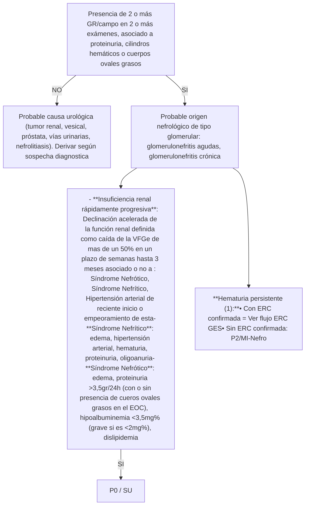

# PROT-NEFROLOGIA-ADULTO-V.1-2023-1

--- Página 1 ---

# PROTOCOLO CLÍNICO DE DERIVACION Y PRIORIZACION DE LA ATENCION DE SALUD

## ESPECIALIDAD NEFROLOGIA

## PROCESO DE REFERENCIA Y CONTRA REFERENCIA SERVICIO DE SALUD METROPOLITANO OCCIDENTE

| Versión:              | 1.0            |
| --------------------- | -------------- |
| Fecha de Emisión:     | Diciembre 2021 |
| Resolución exenta N°: | 2978           |

--- Página 2 ---

# Índice

| Contenido                                                                                            | Página |
| ---------------------------------------------------------------------------------------------------- | ------ |
| 1. Grupo de Trabajo                                                                                  | 3-4    |
| 2. Propósito                                                                                         | 5      |
| 3. Objetivos                                                                                         | 5      |
| 4. Alcance                                                                                           | 5      |
| 5. Población objetivo                                                                                | 5      |
| 6. Definiciones                                                                                      | 6      |
| 7. Criterios de referencia, prioridad de atención y especialidad de destino de derivación            | 7- 8   |
| 8. Flujogramas clinicos                                                                              |        |
| ▪ Flujograma Nº1: Insuficiencia Renal                                                                | 9      |
| ▪ Flujograma Nº2: Enfermedad Renal Cronica                                                           | 10     |
| ▪ Flujograma Nº3: Proteinuria                                                                        | 12     |
| ▪ Flujograma Nº4: Hematuria                                                                          | 13     |
| 9. Indicador                                                                                         | 14     |
| 10. Abreviaturas                                                                                     | 14     |
| 11. Referencias Bibliográficas                                                                       | 14     |
| 12. Anexos                                                                                           |        |
| ▪ Anexo Nº1: Consolidado patologias GES relacionadas a especialidad de Nefrologia. Población adulta. | 15-16  |

--- Página 3 ---

# 1. Grupo de Trabajo

**Documento elaborado por:**

| Nombre                            | Cargo                                                                                                          | Establecimiento                           |
| --------------------------------- | -------------------------------------------------------------------------------------------------------------- | ----------------------------------------- |
| Dra. Carolina Cordero             | Especialista Nefrologa.                                                                                        | Hospital San Juan de Dios                 |
| Dra. Raquel Rivera                | Especialista Medicina Interna                                                                                  | Hospital de Talagante                     |
| Dr. Galo Ortega Wheatley          | Medico contralor                                                                                               | CESFAM Andes                              |
| Dra. Johana Carballo Camero       | Medico contralor                                                                                               | CESFAM Lo Franco                          |
| Dra. Catalina Leiva               | Medico contralor subrogante                                                                                    | CESFAM Lo Franco                          |
| Dr. Marco Gamboa                  | Medico contralor                                                                                               | CESFAM Garin                              |
| Dr. Jesús Marín Pérez             | Medico contralor                                                                                               | CESFAM Steeger                            |
| Dra. Ondina Narváez Morales       | Medico contralor                                                                                               | CESFAM Albertz                            |
| Dra. Shannon Gallargo McLean      | Medico contralor                                                                                               | CESFAM Lo Amor                            |
| Dr. Abrahan Cupare Tovar          | Medico contralor subrogante                                                                                    | CESFAM Lo Amor                            |
| Dra. Laura Guedez Zittarer        | Medico contralor subrogante                                                                                    | CESFAM Cerro Navia                        |
| Dr. Álvaro Vergara                | Medico contralor                                                                                               | CESFAM Renca                              |
| Dra. María Gabriela Antúnez       | Medico contralor                                                                                               | CESFAM Bicentenario                       |
| Dr. Jesús Hernández Guzmán        | Medico contralor                                                                                               | CESFAM Hernan Urzua                       |
| Dr. Cristopher Tapia              | Medico contralor                                                                                               | CESFAM Santa Anita                        |
| Dra. Paz Manosalva Pérez          | Medico contralor                                                                                               | CESFAM Pablo Neruda                       |
| Dra. Estefani Cruz                | Medico contralor subrogante                                                                                    | CESFAM Pablo Neruda                       |
| Dra. Erika Burgos                 | Medico contralor                                                                                               | CESFAM Pudahuel Estrella                  |
| Dr. Reyad Khalil Abdelfattah      | Medico contralor                                                                                               | CESFAM Pudahuel Poniente                  |
| Dr. Gustavo Hernández             | Medico contralor                                                                                               | CESFAM C. Raul Silva Henriquez            |
| Dra. Dianelys Herrada de la Cruz- | Medico contralor                                                                                               | CESFAM Gustavo Molina                     |
| Dr. Fabián Espinoza Cabrera       | Medico contralor                                                                                               | CESFAM Violeta Parra                      |
| Dr. Ignacio Cabello               | Medico contralor subrogante                                                                                    | CESFAM Violeta Parra                      |
| Dra. Melissa Escobar              | Medico contralor comunal                                                                                       | Direccion comunal Pudahuel                |
| Dra. Francisca Meza Pérez         | Medico contralor                                                                                               | Hospital Curacavi                         |
| Dr. Ricardo Malta                 | Medico contralor                                                                                               | CESFAM A. Allende                         |
| Dra. Karla Yañez                  | Medico contralor subrogante                                                                                    | CESFAM A. Allende                         |
| Dra. Isabel Nuñez Villegas        | Medico contralor                                                                                               | CESFAM El Monte                           |
| Dra. Susy Yagual Hidalgo          | Medico contralor                                                                                               | CESFAM Isla de Maipo                      |
| Dr. Manuel Zambrano Carrillo      | Medico contralor subrogante                                                                                    | CESFAM Isla de Maipo                      |
| Dr. Carlos Azcárate Mendoza       | Medico contralor                                                                                               | CESFAM Islita                             |
| Dr. Juan Villalobos               | Medico contralor                                                                                               | CESFAM Peñaflor                           |
| Dr. Vicente Moreira Moreira       | Medico contralor                                                                                               | CESFAM Monckeberg                         |
| Dra. Sigrid Pou Salvi             | Medico contralor                                                                                               | CESFAM Juan Pablo II                      |
| Dra. Diliana Ballestas            | Medico contralor                                                                                               | CESFAM Adriana Madrid de Costabal         |
| Dr. Daniel Hernandez              | Medico contralor                                                                                               | CESFAM Villa Alhué                        |
| Dr. Gastón Pérez                  | Medico contralor                                                                                               | CESFAM Villa Alhué                        |
| Dr. Abel Gonzalez Rojas           | Medico contralor                                                                                               | CESFAM San Pedro                          |
| Dra. Eliana Amunátegui            | Medico contralor                                                                                               | CESFAM E. Elgueta                         |
| Dr. Jaime Opazo                   | Medico contralor                                                                                               | CESFAM Fco. Boris Soler                   |
| Dr. Carlos Cordero López          | Medico contralor                                                                                               | CESFAM San Manuel                         |
| Dr. Alejandro Carreño             | Medico contralor                                                                                               | CESFAM Posta Bollenar                     |
| Dra. María José Maureira          | Medico Internista Medico Asesor DECOR Medico referente del Proceso de Referencia-Contra referencia | Servicio de Salud Metropolitano Occidente |

--- Página 4 ---

**Documento revisado por:**

| Nombre                           | Cargo                                                                                     | Establecimiento                           |
| -------------------------------- | ----------------------------------------------------------------------------------------- | ----------------------------------------- |
| Dr. Rodrigo Riffo Rubio          | Subdirector de Gestión Asistencial                                                        | Servicio de Salud Metropolitano Occidente |
| Dr Carlos Gallardo Cofré         | Jefe Departamento de Coordinación de la Red                                               | Servicio de Salud Metropolitano Occidente |
| QF. Roxana Arias de Pol          | Jefa Departamento de Estadísticas y Gestión de la Información.                            | Servicio de Salud Metropolitano Occidente |
| T.O. María Paz Iturriaga Lisbona | Directora Subdirección de Atención Primaria                                               | Servicio de Salud Metropolitano Occidente |
| Dra. Mirza Retamal Moraga        | Jefa Unidad de Planificación y Control de Gestión de la Subdirección de Atención Primaria | Servicio de Salud Metropolitano Occidente |
| Dr. José Romero Lama             | Medico encargado GES Departamento de Coordinación de la Red                           | Servicio de Salud Metropolitano Occidente |
| Lya Reyes Carreño                | Jefa CR Ambulatorio                                                                       | Hospital San Juan de Dios                 |
| Dra. Lorena Arrué                | Jefa CR Ambulatorio                                                                       | Hospital Félix Bulnes                     |
| EU. Cecilia Elgueta              | Sub jefe CAE                                                                              | Hospital San José de Melipilla            |
| Odont. Claudio Miranda G.        | Referente Modelo de Referencia y Contra referencia                                        | Hospital de Talagante                     |
| Dra. Alicia Canales              | Subdirección Medica                                                                       | CRS Salvador Allende Gossens              |

**Documento autorizado por:**

| Nombre                         | Cargo                                              | Establecimiento                           |
| ------------------------------ | -------------------------------------------------- | ----------------------------------------- |
| Dr. Francisco Miranda Guerrero | Director                                           | Servicio de Salud Metropolitano Occidente |
| Dr. Rodrigo Riffo Rubio        | Director de la Subdirección de Gestión Asistencial | Servicio de Salud Metropolitano Occidente |

**Coordinadores y Encargados responsable:**

| Nombre                      | Cargo                                                                                                                                            | Establecimiento                           |
| --------------------------- | ------------------------------------------------------------------------------------------------------------------------------------------------ | ----------------------------------------- |
| Dra. Maria Jose Maureira M. | Médico Internista Médico Asesor Departamento de Coordinación de la Red Referente Modelo de Referencia y Contra referencia                | Servicio de Salud Metropolitano Occidente |
| Dra. Mirza Retamal Moraga   | Jefa Unidad de Planificación y Control de Gestión de la Subdirección de Atención Primaria Referente Modelo de Referencia y Contra referencia | Servicio de Salud Metropolitano Occidente |

Este documento es producto de la colaboración de profesionales de todos los Niveles de Atención de Salud de la Red Metropolitana Occidente, contribuyendo de este modo al Modelo de Redes Integradas de Servicios de Salud basadas en la Atención Primaria.

--- Página 5 ---

## 2. Propósito:

Entregar información suficiente y de calidad para los profesionales de la salud, que permita facilitar la toma de decisiones respecto al abordaje inicial del paciente (no reemplaza el criterio clinico del médico tratante), entregando recomendaciones que permitan realizar un diagnóstico precoz, una derivación oportuna y pertinente hacia un nivel de mayor complejidad de la Red Asistencial Metropolitana Occidente.

## 3. Objetivos

**a. General:**

Asegurar a los usuarios una atención y cuidado continuo, integrado, y coordinado dentro de la Red Asistencial Occidente, mediante un proceso de referencia y contra-referencia ágil, flexible y eficaz, permitiendo la comunicación y disponibilidad de información estandarizada entre los diferentes niveles de atención, con el fin de gestionar en red las diferentes prestaciones en salud.

**b. Objetivos Específicos:**

* Definir las características y la oportunidad en que un determinado paciente con una patología debe ser evaluado y manejado por el médico no especialista, disminuyendo la variabilidad de la atención, proporcionando un marco común de actuación.
* Establecer un flujograma desde la evaluación clínica, con apoyo de exámenes complementarios y resolución de los pacientes.
* Homologar los códigos CIE-10 a las patologías que por diagnóstico son pertinentes de derivar, aumentando la precisión diagnóstica y con ello su seguimiento y respectiva priorización.
* Entregar criterios estandarizados de referencia y priorización a los equipos de salud de la Red del SSMOCC con el fin de mejorar la pertinencia y oportunidad de atención en el nivel secundario.
* Determinar el conjunto mínimo de datos y exámenes que se deben registrar en la interconsulta y que respaldan el motivo de la derivación al nivel secundario de atención permitiendo con ello mejorar la eficiencia de la primera consulta por el especialista.
* Promover la coordinación entre los niveles administrativos y clínicos de los establecimientos que conforman una red de atención para que intervengan en el proceso de referencia y contra- referencia.

**4. Alcance:** Profesionales del área de la salud pertenecientes a la Red Asistencial Metropolitana Occidente

**5. Población Objetivo:** Población adulta pertenenciente a la Red Asistencial Metropolitana Occidente

--- Página 6 ---

# 6. Definiciones:

* **Código CIE-10:** “Clasificación Estadística Internacional de Enfermedades y Problemas Relacionados con la Salud”. En este documento se unifican los códigos CIE-10 de los diagnósticos pertinentes de derivar hacia el nivel secundario. Los que se detallan por cada patología en ella contenida.
* **Referencia:** Es la solicitud de evaluación diagnóstica y/o tratamiento de un paciente derivado de un Establecimiento de salud de menor capacidad resolutiva a otro de mayor capacidad, con la finalidad de asegurar la continuidad de la prestación del servicio.
* **Definición de Pertinencia:** Se entiende por consulta pertinente aquellas derivaciones nuevas originadas en la atención primaria que cumple con los documentos de referencia que resguardan el nivel de atención bajo el cual el paciente debe resolver su problema de salud, siendo el motivo de derivación factible de solucionar en el nivel de atención al que se deriva.
* **Definición de No pertinencia:** Corresponde a la identificación de una interconsulta que no cumple con los protocolos clínicos de derivación validados y que resguardan el nivel de atención bajo el cual el paciente debe ser resuelto, siendo el motivo de derivación factible de solucionar en la Atención Primaria de Salud donde el paciente debe ser reevaluado.
* **Definición de Prioridad:** nivel de preferencia con el cual debe ser resuelto un problema de salud en el establecimiento al cual fue referido. Se establecen categorías de priorización con tiempos de resolución sugeridos:
    - Prioridad 0 (P0): Son aquellas interconsultas por patologías que deben ser derivadas directamente al Servicio de Urgencia con eventual hospitalización de acuerdo con evaluación
    - Prioridad 1 (P1): Alta prioridad cuya patología reviste urgencia relativa, es decir, no puede esperar oferta de cupos, pero a su vez no presenta riesgo vital inmediato que amerite una derivación al Servicio de Urgencia. Esta derivación requiere una coordinación directa entre el nivel primario y el establecimiento de destino. Se sugiere que el tiempo de atención por el especialista sea antes de 30 días.
    - Prioridad 2 (P2): Prioridad normal. Interconsulta ingresa al sistema informático respectivo, a la espera que se le asigne un cupo de atención de acuerdo a la oferta disponible. Se sugiere que el tiempo de atención por el especialista sea antes de 6 meses.

* **Exámenes Mínimos Básicos de Derivación:** Conjunto de exámenes que deben ir registrados en la Solicitud de Interconsulta (SIC) y que tienen como propósito respaldar el motivo de la derivación y/o contribuir a que la primera consulta por el especialista sea más eficiente, aportando información relevante para la toma de decisiones. Los exámenes descritos en los flujogramas como **“según disponibilidad”** quedan sujetos a la disponibilidad existente en cada centro de salud y/o posibilidad de ser realizado por el paciente. Cuando no se dispone del recurso se sugiere derivar directamente.

--- Página 7 ---

# 7. Criterios de referencia, prioridad de atención y especialidad de destino de derivación.

| N° | Diagnóstico de Derivación(Código CIE-10)                                                                                                              | Criterios derivación y EMBD                                                                                                                                                                                                                                                                                                                                                                                                                                          | EspDestino (A)                              | Prioridad                          |
| -- | ----------------------------------------------------------------------------------------------------------------------------------------------------- | -------------------------------------------------------------------------------------------------------------------------------------------------------------------------------------------------------------------------------------------------------------------------------------------------------------------------------------------------------------------------------------------------------------------------------------------------------------------- | ------------------------------------------- | ---------------------------------- |
| 1  | Insuficiencia Renal no especificada (N19X, Insuficiencia Renal no especificada)                                                                       | VFG < 15mL/min/1,73m2 (o creatinina >3mg%) asociado a uno o más de los siguientes: • Edema pulmonar o anasarca • Encefalopatía o pericarditis urémica • Potasio >= 6,0 mEq/L • Nitrógeno ureico >100 mg/dL • Natremia menor 120 mEq/L con VEC expandido                                                                                                                                                                                          | SU                                          | P0                                 |
| 2  | Insuficiencia Renal Aguda ( N179, Insuficiencia renal aguda, no especificada)                                                                         | VFG <60mL/min/1.73m2 (sin antecedentes previos de disfunción renal) asociado: ▪ Aumento de creatinina >=0,3mg/dl o ▪ Disminución de VFG >=10% de la VFG En un plazo de 2 semanas Registrar EMBD (C) + ecografía renal (según disponibilidad)                                                                                                                                                                                                         | SU (B)  Nefrología/ Med Interna | P0  P1 (ideal antes 2 sem) |
| 3  | Síndrome Nefrítico (N009, Síndrome nefrítico agudo con glomerulonefritis no especificada)                                                             | Sospecha clínica: edema, hipertensión arterial, oligoanuria, hematuria, proteinuria y aumento creatinina >0,5mg del basal                                                                                                                                                                                                                                                                                                                                            | SU (B)  Nefrología/ Med Interna | P0  P1                     |
| 4  | Hematuria de origen glomerular (N029, hematuria recurrente y persistente con glomerulonefritis no especificada). Causa: glomerulonefritis crónica | Sospecha clínica: presencia de 2 o más GR/campo en 2 o más exámenes asociado a proteinuria, cilindros hemáticos o cuerpos ovales grasos **(descartando una insuficiencia renal aguda, síndrome nefrítico o síndrome nefrótico)** Registrar EMBD + ecografía renal (según disponibilidad) \\\*No derivar a nefrologia hematurias de causa urologica (micro o macrohematuria sin proteinuria o cilindros hematicos asociado).En estos casos derivar a urologia | Med Interna/ Nefrología                 | P2                                 |

(A) Considerar Mapa de Derivación vigente

(B) En el caso de que usuario no quede hospitalizado y/o no se le designe hora por el establecimiento de urgencia, derivar como P1 indicando en SIC fecha de derivación a Servicio de Urgencia

(C) Exámenes mínimos básicos de derivación (EMBD): registro de PA, creatinina plasmática (ultimas 2 mediciones indicando fecha de realización), orina completa, RAC, electrolitos plasmáticos, si es diabético ultima hemoglobina glicosilada y resultado de ultimo fondo de ojo)

--- Página 8 ---

| N° | Diagnóstico de Derivación(Código CIE-10)                                                                                                                            | Criterios derivación y EMBD                                                                                                                                                                                                                                                                                                                                                                                       | Espe Destino (A)            | Prioridad |
| -- | ------------------------------------------------------------------------------------------------------------------------------------------------------------------- | ----------------------------------------------------------------------------------------------------------------------------------------------------------------------------------------------------------------------------------------------------------------------------------------------------------------------------------------------------------------------------------------------------------------- | --------------------------- | --------- |
| 5  | Síndrome Nefrótico (N049, Síndrome Nefrótico con glomerulonefritis no especificada)                                                                                 | Sospecha clínica: proteinuria >3,5gr/24h o RAC >2000mg/gr (con o sin presencia de cuerpos ovales grasos en el EOC), hipoalbuminemia <3,5mg% (grave si es <2mg%), dislipidemia  Registrando EMBD (B) + albúmina (según disponibilidad) + LDL + ecografía renal (según disponibilidad)                                                                                                                      | Nefrología/ Med Interna | P1        |
| 6  | Proteinuria persistente (N391, Proteinuria persistente no especificada)                                                                                             | Proteinuria >1 gr/24h y menor a 3,5gr /24h, repetida en dos RAC separado por 2 semanas con creatinina normal y **en pacientes NO diabéticos**  Registrando EMBD (B) + albumina (según disponibilidad) + LDL + ecografía renal (según disponibilidad)                                                                                                                                                      | Med Interna/ Nefrología | P1        |
| 7  | Enfermedad Renal Crónica etapa 1,2,3 (N181, enfermedad renal cronica estadio 1/ N182, enfermedad renal cronica estadio 2/ N183, enfermedad renal cronica estadio 3) | 2 examenes (VFG y/o RAC) alterados con al menos 3 meses de diferencia: \* Usuario <65 años con VFG <60 mL/min/1.73m2 (etapa 1,2, 3 A) \* VFG <45 mL/min/1.73m2 (etapa 3B) \* Disminución de VFG >5ml/min/1.73 mt2 en un año o >10 ml/min/1.73 mt2 en 5 años \* RAC >=300mg/g o RPC >200 mg/g persistente a pesar de tratamiento optimo tolerado EMBD + ecografia renal (según disponibilidad) | GES                         | GES       |
| 8  | Enfermedad Renal Crónica estadio 4 o 5 ( N184, enfermedad renal crónica estadio 4 / N185, enfermedad renal crónica, estadio 5)                                      | 2 examenes (VFG) alterados con al menos 3 meses de diferencia: Independiente de edad con VFG < 30 mL/min/1.73m2  Registrar en EMBD (B) + ecografía renal (según disponibilidad)   Evaluar criterios para derivar a servicio de urgencia                                                                                                                                                   | Nefrología/ Med Interna | P1        |
| 9  | Enfermedad poliquistica (Q613, riñón poliquistico, tipo no especificado)                                                                                            | Sospecha clínica: múltiples quistes a la ecografía renal asociado a antecedentes familiares, HTA y disfunción renal \\\*No derivar a nefrologia quistes renales. Derivar a urologia                                                                                                                                                                                                                           | Nefrología                  | P2        |

(A) Considerar Mapa de Derivación vigente

(B) Exámenes mínimos básicos de derivación (EMBD): registro de PA, creatinina plasmática (ultimas 2 mediciones indicando fecha de realización, idealmente con separacion de 3 meses), orina completa, relacion albumina/creatinuria (RAC), electrolitos plasmáticos, nitrogeno ureico, acido urico, hemograma, si es diabético última hemoglobina glicosilada y resultado de último fondo de ojo)

--- Página 9 ---

# 8. Flujogramas
## Flujograma Nº1:

# INSUFICIENCIA RENAL

* **Sospecha clínica y/o usuario con FRCV**

 SI

* **VFGe <60mL/min/1.73m2 y /o RAC >30mg/g**

 SI

* **Revisión de registros previos de 3 meses de antigüedad. Se mantiene alteración**
        - SI → Flujo de ERC

 NO o ausencia de registros previos

* **Sospecha clínica de:**
    * síndrome nefrítico (1) o
    * emergencia HTA o
    * oligoanuria (diuresis <500cc/24h, descartar obstrucción urinaria baja con sondeo) o
    * VFG < 15mL/min/1,73m2 (o creatinina >3mg%) asociado a uno o más de los siguientes:
        * Edema pulmonar o anasarca
        * Encefalopatia urémica
        * Pericarditis urémica
        * Potasio mayor o igual a 6,0 mEq/L
        * Nitrogeno ureico >100 mg/dL
        * Acidosis metabólica grave con volumen extracelular (VEC) expandido
        * Natremia menor 120 mEq/L con VEC expandido
        - SI → Derivar a SU

 NO

* **Descartar nefrotoxicos e hipovolemia y Repetir VFG en 2 semanas**

* **Creatinina aumenta >=0,3mg/dl o disminución de VFG >=10% de la VFG previa o Síndrome nefrótico (2) Hipertensión arterial de reciente inicio o empeoramiento de esta**
        - SI → Derivar a Nefro/- MI/ P0-P1 (atención medica ideal antes de 2 semanas)

 NO

* **Repetir VFG, EOC y RAC en 3 meses**

* **Persiste VFG <60mL/min/1.73m2 y /o RAC >30mg/g**
        - SI → Flujo de ERC

 NO

* **Insuficiencia Renal Aguda recuperada**

(1): Síndrome Nefrítico: edema, hipertensión arterial, hematuria, proteinuria, oligoanuria

(3): Síndrome Nefrótico: proteinuria >3,5gr/24h (con o sin presencia de cueros ovales grasos en el EOC), hipoalbuminemia <3,5mg% (grave si es <2mg%), dislipidemia

--- Página 10 ---

# Flujograma Nº2

## ENFERMEDAD RENAL CRONICA

* **VFG <60** mL/min/1.73m2 **y/o**
    1. Alteración en sedimento urinario: Hematuria o proteinuria (glomerular o tubulointerticial)
    2. Trastornos electrolítico por alteración tubular (acidosis tubulares, Fanconi, DI nefrogenica )
    3. Imágenes
        * Alteración de la diferenciación corticosinusal o corticomedular, disminución de tamaño renal
        * Monorreno, asimetría renal >1,5 cm
    4. Histología
    5. Antecedente de Trasplante renal
* **POR 3 MESES** ( el daño renal se debe objetivar en al menos 2 ocasiones con 3 meses de diferencia, esto con el objeto de diferenciar la injuria renal aguda)

 SI

* VFG < 15mL/min/1,73m2 (o creatinina >3mg%) asociado a uno o más de los siguientes:
    * Edema pulmonar o anasarca
    * Encefalopatia urémica
    * Pericarditis urémica
    * Potasio mayor o igual a 6,0 mEq/L
    * Nitrogeno ureico >100 mg/dL
    * Acidosis metabólica grave con volumen extracelular (VEC) expandido
    * Natremia menor 120 mEq/L con VEC expandido
**SI** → **Servicio de Urgencia**

 NO

Síndrome nefrótico, proteinuria persistente >1gr/24h (en usuarios no diabéticos) o ERC estadio 4 o 5 ( en el caso de causar HTA = derivar como GES de HTA)
**SI** → **Derivar a Nefro-MI/ P1**

 NO

* Usuario <65 años con VGF <60
* VFG <45 mL/min/1.73m2 (ERC etapa 3B)
* Disminución de VFG >5ml/min/1.73 mt2 en un año o
* Disminución de >10 ml/min/1.73 mt2 en 5 años o
* RAC >=300mg/g o RPC >200 mg/g a pesar de tratamiento optimo tolerable
**SI** → **Derivar según GES**

 NO

Control en APS cada 3-6 meses. Iniciar o ajustar tratamiento antiproteinurico según metas individualizadas (1) (considerando fragilidad de usuario) y según corresponda

**Causas de Enfermedad Renal Crónica:**
Nefropatia Diabética > Nefroesclerosis por HTA > Glomerulonefritis crónica > otras causas > causa desconocida

**Factores de Riesgo de Progresión:** HTA, hiperglicemia, hiperuricemia, exposición a fármacos nefrotoxicos , dislipidemia, acidosis

--- Página 11 ---

# Etapas de ERC

| Grado | VFG mL/min/1,73m2                                                            |
| ----- | ---------------------------------------------------------------------------- |
| 1     | >=90                                                                         |
| 2     | 60-89                                                                        |
| 3a    | 45-59                                                                        |
| 3b    | 30-44                                                                        |
| 4     | 15-29                                                                        |
| 5     | <15                                                                          |
| IRCT  | Síndrome urémico + VFG ≤ 15 ml/min + compromiso comprobado por Ecografía |

## Formulas para estimación de VFG por creatinina plasmática

* MDRD
* CKD-EPI
* **NO utilizar Cockcroft**

| Grado | Albuminuria/creatinuria | Proteinuria |
| ----- | ----------------------- | ----------- |
| A1    | <30mg/gr                | <150mg      |
| A2    | 30-300mg/gr             | 150-500 mg  |
| A3    | >300mg/gr               | >500 mg     |

## (1) Indicaciones Generales para un paciente con Enfermedad Renal Crónica

| 1 | Evitar uso crónico de antinflamatorios no esteroidales                                                                                                                                                                                                                                                                                                                                                                                                                                                                                                                                                                                                                                         |
| - | ---------------------------------------------------------------------------------------------------------------------------------------------------------------------------------------------------------------------------------------------------------------------------------------------------------------------------------------------------------------------------------------------------------------------------------------------------------------------------------------------------------------------------------------------------------------------------------------------------------------------------------------------------------------------------------------------- |
| 2 | Evitar dosis supraterapeuticas de paracetamol. Máximo 4 gr/ dia                                                                                                                                                                                                                                                                                                                                                                                                                                                                                                                                                                                                                                |
| 3 | Disminuir o evitar consumo de sodio y potasio                                                                                                                                                                                                                                                                                                                                                                                                                                                                                                                                                                                                                                                  |
| 4 | Control de Presión Arterial \* Adulto mayor frágil: Meta de PA <150/90 mmHg **PERO MAYOR** a 120/60 mmHg ᴬ \* Adultoᴮ: \* Sin albuminuria o con albuminuria leve: Lograr PA <140/90 mmHg \* Con albuminuria moderada a severa (> a 30mg/gr): Lograr PA <=130/80 mmHg para lograr una reducción de la RAC inicial entre 30-50%. En el caso de albuminuria severa iniciar IECA o ARA II independiente de la PA ( descartar contra indicaciones)  Preferir uso de IECA o ARA II ( NO indicarlos juntos), evaluar previamente contraindicaciones absolutas de IECA-ARAII ( VFG<30, hiperkalemia >5,5, embarazo, estenosis renal). Ajustar dosis de acuerdo a tolerabilidad |
| 5 | Control de glicemia en pacientes diabéticos según nivel de fragilidad del usuario                                                                                                                                                                                                                                                                                                                                                                                                                                                                                                                                                                                                              |
| 6 | Control de LDLᴮ. Lograr al menos un colesterol LDL <100mg/dl e idealmente <70mg/dl                                                                                                                                                                                                                                                                                                                                                                                                                                                                                                                                                                                                         |
| 7 | Control de niveles de acido úrico para lograr una meta de <7mg/dl ᴮ                                                                                                                                                                                                                                                                                                                                                                                                                                                                                                                                                                                                                            |

\* (A) Enfoque de riesgo para la prevención de enfermedades cardiovasculares. (2014). Ministerio de Salud. Gobierno de Chile
\* (B) Prevención secundaria de la Enfermedad Renal Crónica. 2017. Guía de Practica Clínica GES. Dr. Sebastián Cabrera. Ministerio de Salud. Gobierno de Chile

--- Página 12 ---

# Flujograma Nº3

## PROTEINURIA

* Tira reactiva + (cuando albumina >300mg/dl) (1) o
* Proteínas totales en orina >150 mg/24h o RPC >200mg/g
* Albumina en orina >30mg/24h o
* RAC >30mg/gr

| Grado | RAC         | Proteinuria/24h | Tira reactiva |
| ----- | ----------- | --------------- | ------------- |
| A1    | <30mg/gr    | <150mg          | +             |
| A2    | 30-300mg/gr | 150-500mg       | ++            |
| A3    | >300mg/gr   | >500mg          | +++           |

**SI**

Repetir RAC o proteínas totales en orina con nueva orina de 1° hora de la mañana

Proteinuria persistente

Asociada a disminución de VFG o presencia en EOC de: microhematuria o cilindros hemáticos o GR dismorficos o cuerpos ovales grasos

**NO**

Probable causa urológica (Tumor vía urinaria, litiasis renal crónica, ITU).
Derivar según sospecha diagnostica

**SI**

Probable origen nefrológico:
* Glomerular: glomerulonefritis agudas, glomerulonefritis crónica
* Tubular: nefrotoxicos, infecciones crónicas, gamapatias monoclonales, etc

* **Insuficiencia renal rápidamente progresiva**: Declinación acelerada de la función renal definida como caída de la VFGe de mas de un 50% en un plazo de semanas hasta 3 meses asociado o no a : Síndrome Nefrótico, Síndrome Nefrítico, Hipertensión arterial de reciente inicio o empeoramiento de esta

* **Síndrome Nefrítico**: edema, hipertensión arterial, hematuria, proteinuria, oligoanuria

* **Síndrome Nefrótico**: edema, proteinuria >3,5gr/24h (con o sin presencia de cueros ovales grasos en el EOC), hipoalbuminemia <3,5mg% (grave si es <2mg%), dislipidemia

**SI**

P0 / SU

### Proteinuria >1gr/24 horas
* Con ERC confirmada = Ver flujo ERC GES
* Sin ERC confirmada (en pacientes NO diabéticos)= P1/MI-Nefro

### Proteinuria <1gr/24h
* Con ERC confirmada = Ver flujo ERC
* Sin ERC confirmada (en pacientes NO diabéticos)= P2 / MI

\* (1) Falsos positivos: orinas muy concentradas y pH alcalino, leucocituria, hematuria, contaminación con antisépticos, usos de contraste yodado. Falsos negativos: orinas muy diluidas, cadenas ligeras de inmunoglobulinas.

--- Página 13 ---

# Flujograma Nº4

## HEMATURIA

* Descartar causas no patológicas: Menstruación, ejercicio extenuante, actividad sexual, instrumentación urológica, etc y
* Repetir tira reactiva y sedimento para observar hematuria (en 15-30 días) habiendo descartado previamente una insuficiencia renal aguda, síndrome nefrítico o nefrótico

(1) Causas de Glomerulonefritis: glomerulonefritis primaria o secundarias ( Diabetes, lupus, AINES, infecciosa, gamapatia monoclonales, paraneoplasicas, etc)

--- Página 14 ---

# 9. Indicador:

Según protocolo de red “Protocolo de Referencia-Contra referencia”. Servicio de Salud Metropolitano Occidente

## 10. Abreviaturas

* DM: diabetes mellitus
* DI: diabetes insípida
* GR: glóbulos rojos
* EMBD: exámenes mínimos básicos de derivación
* EOC: examen de orina completa
* ERC: enfermedad renal crónica
* Esp: especialidad
* FRCV: factor riesgo cardiovascular
* IRCT: insuficiencia renal crónica terminal
* PA: presión arterial
* RAC: relación albuminuria/creatinuria
* SU: servicio de urgencia
* >= mayor o igual
* VFG: velocidad filtrado glomerular

## 11. Referencias Bibliograficas

* Enfoque de riesgo para la prevención de enfermedades cardiovasculares. (2014). Ministerio de Salud. Gobierno de Chile
* Prevención secundaria de la Enfermedad Renal Crónica. 2017. Guía de Practica Clínica GES. Dr. Sebastián Cabrera. Ministerio de Salud. Gobierno de Chile
* Protocolo de Referencia y Contra-referencia (2019). Resolución Exenta Nº1415. Servicio de Salud Metropolitano Occidente.
* Decreto N°22, Santiago 01 de julio de 2019, Aprueba Garantías Explícitas en Salud, del Régimen General de Garantías en Salud. Ministerio de Salud.

--- Página 15 ---

# 12. Anexos

## Anexo Nº1: Consolidado patologias GES relacionadas a especialidad de Nefrologia. Población adulta

| Nº de GES | Patología GES                                                          | Criterios de Inclusión (CI) y/o Criterios de Derivación (CD)                                                                                                                                                                                                                                                                                                                                                                                                                                                                                                                    | Estado desde el cual se inicia la Garantía                                                                             | Nivel de atención en que se inicia la GES | Profesional responsable de la notificación de confirmación | Sistema informatico en donde se ingresa IC emitida desde APS y plazo garantizado de atención, si aplicare | Especialidad destino                        | Exámenes Básicos de Derivación                                                                                                                                                                                                                                                                                                                                                  |
| --------- | ---------------------------------------------------------------------- | ------------------------------------------------------------------------------------------------------------------------------------------------------------------------------------------------------------------------------------------------------------------------------------------------------------------------------------------------------------------------------------------------------------------------------------------------------------------------------------------------------------------------------------------------------------------------------- | ---------------------------------------------------------------------------------------------------------------------- | ----------------------------------------- | ---------------------------------------------------------- | --------------------------------------------------------------------------------------------------------- | ------------------------------------------- | ------------------------------------------------------------------------------------------------------------------------------------------------------------------------------------------------------------------------------------------------------------------------------------------------------------------------------------------------------------------------------- |
| 21        | Hipertensión Arterial Primaria o esencial en personas de 15 años y más | a) Hipertensión arterial refractaria: No se logra la meta de presión arterial con el uso de 3 o más fármacos antihipertensivos en dosis máxima recomendada, de diferentes familias y acciones complementarias, uno de los cuales es un diurético, o el paciente logra la meta con 4 o más fármacos antihipertensivos. b) Sospecha de hipertensión secundaria. c) Enfermedad renal crónica: velocidad de filtración glomerular estimada (VFGe) menor 30 ml/min o proteinuria (albuminuria mayor a 300 mg/g creatinina urinaria). d) Hipertensión arterial y embarazo | Sospecha para confirmación y tratamiento en APS Confirmación para derivación al nivel secundario (con caso creado) | APS                                       | Médico APS                                                 | SIGGES (45 días)                                                                                          | Medicina interna / Cardiología / Nefrología | Creatinina, examen de orina completa, RAC, electrolitos / hemograma, perfil lipídico, TSH-T4L, calcio (según disponibilidad)/ ECG / Ecografía renal (según disponibilidad). Registro de Autocontrol de PA de 1 semana (previa de derivación), y habiendo descartado mala adherencia a tto y uso de medicamentos que eleven la PA. Con controles al dia con equipo cardiovascula |

--- Página 16 ---

| Nº de GES | Patología GES                         | Criterios de Inclusión (CI) y/o Criterios de Derivación (CD) | Estado desde el cual se inicia la Garantía | Nivel de atención en que se inicia la GES | Profesional responsable de la notificación de confirmación | Sistema informatico en donde se ingresa IC emitida desde APS y plazo garantizado de atención, si aplicare | Especialidad destino                     | Exámenes Básicos de Derivación                                                                                                                                                                                                                                                                                                   |
| --------- | ------------------------------------- | ------------------------------------------------------------ | ------------------------------------------ | ----------------------------------------- | ---------------------------------------------------------- | --------------------------------------------------------------------------------------------------------- | ---------------------------------------- | -------------------------------------------------------------------------------------------------------------------------------------------------------------------------------------------------------------------------------------------------------------------------------------------------------------------------------- |
| 64        | Prevención secundaria de ERC terminal | CI: Enfermedad renal crónica etapa 1,2,3                     | Confirmación                               | APS                                       | Médico APS                                                 | SIGGES (30 días)                                                                                      | Medicina interna / Nefrología / Urología | Ultimas dos creatinina (separadas por al menos 3 meses), nitrogeno ureico, electrolitos, RAC, examen de orina completa, hemograma, acido urico, ecografia renal (segun disponibilidad). Registro de Autocontrol de PA de 1 semana (si el paciente es HTA) y/o registro de autocontrol de glicemias (si el paciente es diabetico) |

