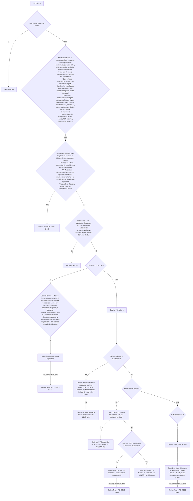
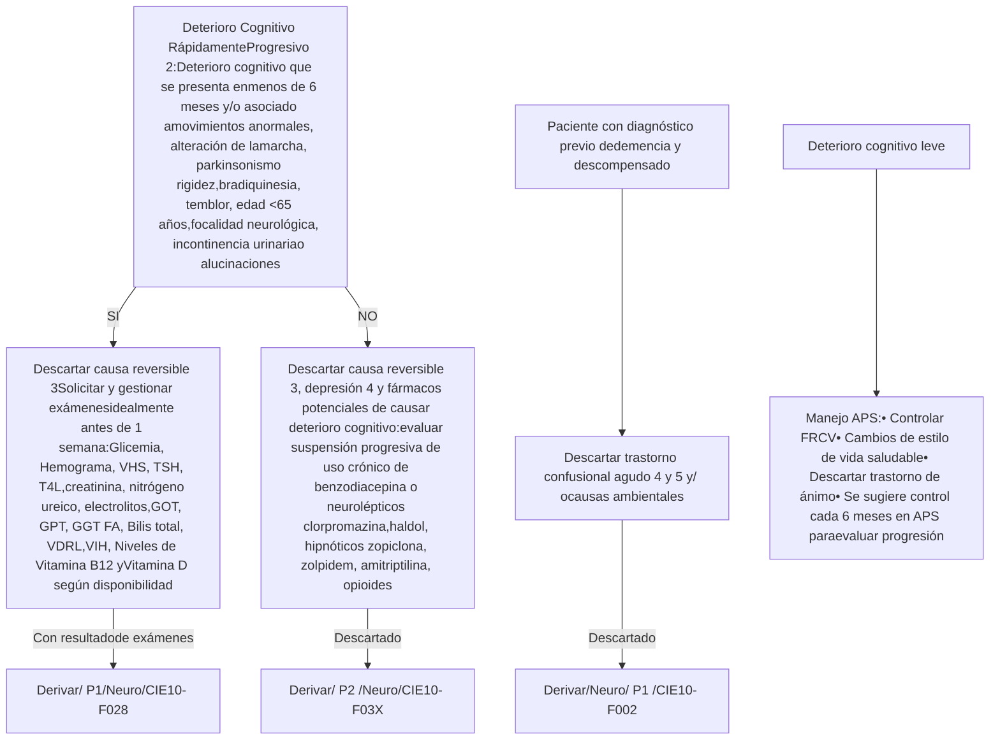
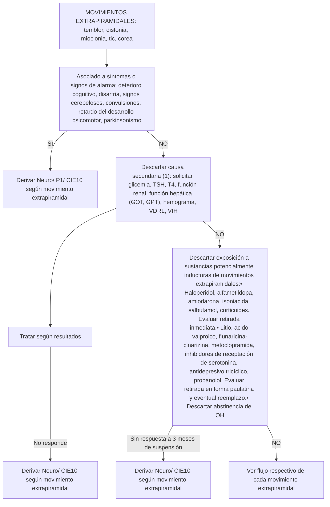

# PROT-NEUROLOGIA-ADULTO-V.1-2018-1

--- Página 1 ---


# PROTOCOLO CLÍNICOS DE DERIVACIÓN Y PRIORIZACIÓN AL NIVEL SECUNDARIO DE ATENCIÓN

## DE LA RED DEL SERVICIO DE SALUD METROPOLITANO OCCIDENTE

### POBLACION ADULTA

### ESPECIALIDAD: NEUROLOGIA

**Versión: 1.0**
**Fecha de Emisión: 27 de Noviembre 2018**
**Resolución exenta N°: 3239**

**Encargado Responsable:**
Dra. Maria Jose Maureira M.
Médico Internista. Universidad de Chile
Médico Asesor Departamento de Coordinación de la Red del Servicio Salud Metropolitano Occidente

--- Página 2 ---

**Objetivo General:**

Los flujogramas clínicos tienen como objetivo ser un manual de apoyo para el profesional médico en la misma consulta, orientado a facilitar la toma de decisiones respecto al abordaje inicial del paciente, entregando recomendaciones que permitan realizar un diagnóstico precoz y una derivación oportuna y pertinente hacia el nivel secundario de atención (no reemplaza el criterio clínico del médico tratante), mejorando con ello la continuidad asistencial de los usuarios pertenecientes a la red asistencial del Servicio de Salud Metropolitano Occidente.

**Objetivos Específicos:**

* Definir las características y la oportunidad en que un determinado paciente con una patología debe ser evaluado y manejado por el médico no especialista en el nivel primario de atención, disminuyendo la variabilidad de la atención, proporcionando un marco común de actuación.

* Establecer un flujograma desde la evaluación clínica, con apoyo de exámenes complementarios y resolución de los pacientes.

* Homologar los códigos CIE-10 a las patologías que por diagnóstico son pertinentes de derivar, aumentando la precisión diagnóstica y con ello su seguimiento y respectiva priorización.

* Entregar criterios estandarizados de referencia y priorización a los equipos de salud de la red del SSMOcc con el fin de mejorar la pertinencia y oportunidad de las derivaciones hacia el nivel secundario.

* Determinar el conjunto mínimo básico de datos y exámenes que se deben registrar en la interconsulta que se deriva al nivel secundario.

Este documento es producto de la colaboración de profesionales de todos los niveles de atención de salud de la red Metropolitana Occidente, contribuyendo de este modo al Modelo de Redes Integradas de Servicios de Salud basadas en la atención primaria.

**Alcance:**

* Médicos generales no especialistas
* Médicos en formación de especialidades básicas
* Profesionales Interconsultores de atención primaria.
* Médicos de Familia

--- Página 3 ---

*   **Código CIE-10:** “Clasificación Estadística Internacional de Enfermedades y Problemas Relacionados con la Salud”. En este documento se unifican los códigos CIE-10 de los diagnósticos pertinentes de derivar hacia el nivel secundario. Los que se detallan por cada patología en ella contenida.

*   **Definición de Pertinencia:** Se entiende por consulta pertinente aquellas derivaciones nuevas originadas en la atención primaria que cumple con los protocolos de referencia que resguardan el nivel de atención bajo el cual el paciente debe resolver su problema de salud, siendo el motivo de derivación factible de solucionar en el nivel de atención al que se deriva.

*   **Definición de No pertinencia:** Corresponde a la identificación de una interconsulta que no cumple con los protocolos clínicos de derivación validados y que resguardan el nivel de atención bajo el cual el paciente debe ser resuelto, siendo el motivo de derivación factible de solucionar en la atención primaria de salud donde el paciente debe ser reevaluado.

*   **Definición de Prioridad:** nivel de preferencia con el cual debe ser resuelto un problema de salud en el establecimiento al cual fue referido. Se establece categorías de priorización con tiempos de resolución sugeridos.

    *   Prioridad 0 (P0): son aquellas interconsultas por patologías que deben ser derivadas directamente al servicio de urgencia con eventual hospitalización de acuerdo a evaluación.

    *   Prioridad 1 (P1): alta prioridad cuya patología reviste urgencia relativa, es decir, no puede esperar oferta de cupos, pero a su vez no presenta riesgo vital inmediato que amerite una derivación al servicio de urgencia. Esta derivación requiere una coordinación pronta entre el nivel primario y el establecimiento de destino. Se sugiere que el tiempo de atención por el especialista sea antes de 30 días.

    *   Prioridad 2 (P2): prioridad normal. Interconsulta ingresa al sistema informático respectivo, a la espera que se le asigne un cupo de atención de acuerdo a la oferta disponible. Se sugiere que el tiempo de atención por el especialista sea antes de 6 meses.

*   Los exámenes descritos en los flujogramas como “según disponibilidad” quedan sujetos a la disponibilidad existente en cada centro de salud y/o posibilidad de ser realizado por el paciente . Cuando no se dispone del recurso se sugiere derivar directamente.

--- Página 4 ---

# GRUPO DE TRABAJO


| NOMBRE                      | CARGO                                                                                                       | ESTABLECIMIENTO                          |
| --------------------------- | ----------------------------------------------------------------------------------------------------------- | ---------------------------------------- |
| Doctor Felipe Azola         | Médico especialista Neurólogo                                                                               | Hospital Felix Bulnes                    |
| Doctor Oscar Loureiro       | Médico especialista Neurólogo                                                                               | Hospital San Juan de Dios                |
| Doctor Cesar Saavedra       | Médico especialista Neurólogo                                                                               | Hospital de Melipilla                    |
| Doctora Sandra Bueno        | Médico becada del Programa de formación de especialistas para la atención primaria. Especialidad neurología | CESFAM Violeta Parra. Comuna de Pudahuel |
| Doctora Maria Jose Maureira | Médico Internista                                                                                           | Servicio Salud Metropolitano Occidente   |
| Doctor Carlos Gallardo      | Jefe Departamento de coordinación de la red                                                                 | Servicio Salud Metropolitano Occidente   |
| Dra Daniella Greibe         | Subdirectora Médica                                                                                         | Hospital Félix Bulnes                    |
| Dra. Francisca Reyes        | Subdirectora Médica                                                                                         | Hospital San Juan de Dios                |
| Dr. Francisco Miranda       | Director                                                                                                    | Servicio Salud Metropolitano Occidente   |


**Encargado Responsable:**
Dra. Maria Jose Maureira M. Medico Internista Universidad de Chile
Médico Asesor Departamento de coordinación de la red del SSMOcc

--- Página 5 ---

* Objetivos

* Alcance

* Definiciones

* Grupo de Trabajo

* Examenes disponibles en los Centros de Salud Familiar del nivel Primario de Atencion

* Pertinencia Diagnostica, Priorizacion de derivacion y Especialidad de destino

* Flujogramas Clínicos :
    * Cefalea
    * Deterioro cognitivo cerebral
    * Movimientos extrapiramidales

* Documentos de referencia

* Abreviaturas

--- Página 6 ---

# EXAMENES DISPONIBLES EN LOS CENTROS DE SALUD FAMILIAR
# NIVEL PRIMARIO DE ATENCIÓN


| MUESTRA        | EXAMEN                                                   | DOCUMENTO RESPALDO                                                 |
| -------------- | -------------------------------------------------------- | ------------------------------------------------------------------ |
| SANGRE         | Hemograma                                                | Arsenal APS según decreto<br/>35, año 2016 Ministerio de<br/>Salud |
|                | Tiempo de Protrombina                                    |                                                                    |
|                | Velocidad de sedimentacion                               |                                                                    |
|                | Perfil lipidico                                          |                                                                    |
|                | Acido urico                                              |                                                                    |
|                | Electrolitos                                             |                                                                    |
|                | Creatinina                                               |                                                                    |
|                | Acido urico                                              |                                                                    |
|                | Urea                                                     |                                                                    |
|                | Glucosa                                                  |                                                                    |
|                | Glucosa pos carga                                        |                                                                    |
|                | Hemoglobina glicosilada                                  |                                                                    |
|                | Proteinas Totales                                        |                                                                    |
|                | Fosfatasa Alcalina                                       |                                                                    |
|                | Bilirrubina total y conjugada                            |                                                                    |
|                | GOT                                                      |                                                                    |
|                | GPT                                                      |                                                                    |
|                | TSH                                                      |                                                                    |
|                | T4 libre                                                 |                                                                    |
|                | VDRL                                                     |                                                                    |
|                | Factor reumatoide                                        |                                                                    |
|                | Deteccion de embarazo en orina                           |                                                                    |
| ORINA          | Orina completa                                           |                                                                    |
|                | Relacion albuminuria/creatinuria                         |                                                                    |
|                | Urocultivo                                               |                                                                    |
|                | Leucocitos fecales                                       |                                                                    |
| DEPOSICIONES   | Coproparasitologico seriado                              |                                                                    |
|                | Coprcultivo                                              |                                                                    |
|                | Examen directo al fresco c/S tincion parasitos           |                                                                    |
|                | Examen de Graham                                         |                                                                    |
|                | Examen de gusanos macroscopicos                          |                                                                    |
|                | Antibiograma corriente                                   |                                                                    |
| BACTERIOLOGICO | Baciloscopia Ziehl Nielsen                               |                                                                    |
|                | Examen directo al fresco                                 |                                                                    |
|                | Gonococo, muestra , siembra, derivacion                  |                                                                    |
|                | Tricomona vaginales                                      |                                                                    |
|                | Endoscopia Digestiva alta con test de ureasa y/o biopsia | Programa de Resolutividad                                          |
| PROCEDIMIENTOS | Espirometria                                             | Listado de prestaciones<br/>especificas canastas GES               |
|                | Electrocardiograma                                       |                                                                    |
|                | Test de caminata de 6 minutos                            |                                                                    |
|                | Radiografia de Torax                                     | Programa de Gestion de<br/>Imágenes 6                              |
| IMÁGENES       | Ecografia abdominal                                      |                                                                    |
|                | Mamografia                                               |                                                                    |
|                | Ecotomografia mamaria                                    |                                                                    |


--- Página 7 ---

# PERTINENCIA DIAGNÓSTICA, PRIORIZACIÓN DE DERIVACIÓN Y ESPECIALIDAD DE DESTINO


| Nº | Diagnóstico de Derivación(Código CIE-10)                                                                               | Criterios derivación                                                                                                                                                                                                                           | Especialidad Destino(considerar mapa dederivaciónrespectivo) | Prioridad |
| -- | ---------------------------------------------------------------------------------------------------------------------- | ---------------------------------------------------------------------------------------------------------------------------------------------------------------------------------------------------------------------------------------------- | ------------------------------------------------------------ | --------- |
| 1  | Cefalea con síntomas o signos de alarma<br/>(G448, otros síndromes de cefalea<br/>especificados)                       | Síntomas y signos de alarma                                                                                                                                                                                                                    | Neurología                                                   | P1        |
| 2  | Cefalea secundaria a fármacos ( G444,<br/>cefalea inducida por drogas, no<br/>clasificadas en otra parte)              | Refractaria a tratamiento en 1<br/>mes                                                                                                                                                                                                         | Neurología                                                   | P2        |
| 3  | Cefalea Trigémino autonómicas (G440,<br/>síndrome de cefalea en racimos)                                               | Sospecha clínica                                                                                                                                                                                                                               | Neurología                                                   | P1        |
| 4  | Migraña complicada ( G433, migraña<br/>complicada)                                                                     | Migraña con aura distinta a la<br/>visual                                                                                                                                                                                                      | Neurología                                                   | P1        |
| 5  | Migraña no complicada ( G439, migraña<br/>no especificada)                                                             | Migraña refractaria a<br/>tratamiento profiláctico en 3<br/>meses                                                                                                                                                                              | Neurología                                                   | P1        |
| 6  | Cefalea tensional (G442, cefalea debida a<br/>tensión)                                                                 | Sospecha fundada: Cefalea<br/>refractaria a tratamiento<br/>profiláctico en 6 meses                                                                                                                                                            | Neurología                                                   | P2        |
| 7  | Demencia rápidamente progresiva (F028,<br/>demencia en otras enfermedades<br/>especificadas clasificada en otra parte) | Deterioro cognitivo que se<br/>presenta en menos de 6 meses<br/>y/o asociado a movimientos<br/>anormales, alteración de la<br/>marcha, parkinsonismo, edad<br/><65 años, focalidad neurológica,<br/>incontinencia urinaria o<br/>alucinaciones | Neurología                                                   | P1        |
| 8  | Demencia de causa no precisada (F03X,<br/>demencia no especificada)                                                    | Sospecha fundada: habiendo<br/>descartado causas reversibles                                                                                                                                                                                   | Neurología                                                   | P2        |
| 9  | Demencia en la Enfermedad de Alzheimer<br/>(F002, demencia en la enfermedad de<br/>Alzheimer, atípica o de tipo mixto) | Descompensada (habiendo<br/>descartado delirium)                                                                                                                                                                                               | Neurología                                                   | P1        |


Prioridad 0: Derivacion al servicio de Urgencia

Prioridad 1: Evaluación por nivel secundario, se sugiere antes de 30 días. Coordinacion directa entre contralor APS y establecimiento de destino.

Prioridad 2: Evaluación por nivel secundario, se sugiere antes de 6 meses.

--- Página 8 ---

# PERTINENCIA DIAGNÓSTICA, PRIORIZACIÓN DE DERIVACIÓN Y ESPECIALIDAD DE DESTINO


| Nº | Diagnostico de Derivación(Código CIE-10)                                                                            | Criterios de Derivación                                                                                                                                                                                              | Especialidad Destino(considerar mapasde derivaciónrespectivo) | Prioridad                 |
| -- | ------------------------------------------------------------------------------------------------------------------- | -------------------------------------------------------------------------------------------------------------------------------------------------------------------------------------------------------------------- | ------------------------------------------------------------- | ------------------------- |
| 10 | Parkinsonismo (G219,<br/>parkinsonismo secundario, no<br/>especificado)                                             | Asociado a demencia, disartria, crisis<br/>oculogiras, distonia, mioclonias,<br/>signos cerebelosos, parálisis<br/>supranuclear de la mirada vertical<br/>descendente, incontinencia urinaria,<br/>caídas frecuentes | Neurología                                                    | P1                        |
| 11 | Sospecha de Parkinsonismo<br/>inducido por drogas (G211, otro<br/>parkinsonismo secundario<br/>inducido por drogas) | Sin respuesta a<br/>3 meses de suspensión                                                                                                                                                                            | Neurología                                                    | P2                        |
| 12 | Enfermedad de Parkinson<br/>descompensado ( G20X,<br/>enfermedad de Parkinson)                                      | • Presencia de discinesias<br/>• Refractario a tratamiento<br/>(correctamente usado)<br/>• Presencia de síntomas psiquiátricos<br/>• Aparición de síntomas atípicos                                                  | Neurología, según<br/>mapas GES                               | Según<br/>GES             |
| 13 | Temblor esencial ( G250,<br/>temblor esencial)                                                                      | Refractario a tratamiento al mes                                                                                                                                                                                     | Neurología                                                    | P2                        |
| 14 | Distonia (G249, distonía no<br/>especificada)                                                                       | Sospecha fundada: sospecha clínica<br/>habiendo descartada causas<br/>secundarias                                                                                                                                    | Neurología                                                    | P1-P2<br/>según<br/>flujo |
| 15 | Tics ( G256, Tics inducidos por<br/>drogas y otros tics de origen<br/>orgánico)                                     | Sospecha fundada: sospecha clínica<br/>habiendo descartada causas<br/>secundarias                                                                                                                                    | Neurología                                                    | P1-P2<br/>según<br/>flujo |
| 16 | Mioclonia (G253, mioclonia)                                                                                         | Sospecha fundada: sospecha clínica<br/>habiendo descartada causas<br/>secundarias                                                                                                                                    | Neurología                                                    | P1                        |
| 17 | Corea ( G255, otras coreas)                                                                                         | Sospecha fundada: sospecha clínica<br/>habiendo descartada causas<br/>secundarias                                                                                                                                    | Neurología                                                    | P1-P2<br/>según<br/>flujo |
| 18 | Síndrome piernas inquietas<br/>(G259 trastorno extrapiramidal y<br/>del movimiento, no especificado)                | Refractario a tratamiento al mes y<br/>habiendo descartado causas<br/>secundarias                                                                                                                                    | Neurología                                                    | P2                        |


Prioridad 0: Derivacion al servicio de Urgencia

Prioridad 1: Evaluación por nivel secundario, se sugiere antes de 30 días. Coordinacion directa entre contralor APS y establecimiento de destino.

Prioridad 2: Evaluación por nivel secundario, se sugiere antes de 6 meses.

--- Página 9 ---

# CEFALEA



--- Página 10 ---

# CEFALEA

## (1) Clasificación de Cefaleas Primarias


| Caracterist              | Migraña                                                                                                                                                                                                                                                                                                                                                          | Cefalea Tensional                                                                                                                                                                                                                                                                                                               | Cefalea trigemino-autonomicas                                                                                                                                                                                                                                                                                                                                                                                  |
| ------------------------ | ---------------------------------------------------------------------------------------------------------------------------------------------------------------------------------------------------------------------------------------------------------------------------------------------------------------------------------------------------------------- | ------------------------------------------------------------------------------------------------------------------------------------------------------------------------------------------------------------------------------------------------------------------------------------------------------------------------------- | -------------------------------------------------------------------------------------------------------------------------------------------------------------------------------------------------------------------------------------------------------------------------------------------------------------------------------------------------------------------------------------------------------------- |
| Numero de Ataques        | Al menos la presencia de 5 ataques                                                                                                                                                                                                                                                                                                                               | Al menos la presencia de 10 episodios                                                                                                                                                                                                                                                                                           | **Racimos:** hombre/ aparece diariamente durante periodos de 1 a 4 meses (de predominio nocturno) y posteriormente asintomático durante 1 a 2 años .<br/>**Hemicranea paroxística:** mujer / duración 2-30min, con una frecuencia de 5-30 episodios al día /buena respuesta a indometacina<br/>**Cefalea neuralgiforme unilateral de breve duración SUNCT:** crisis breves de dolor/ entre 3-200 crisis al día |
| Duración                 | Cefalea que duren de 4 a 72 horas                                                                                                                                                                                                                                                                                                                                | Cefalea que dura entre 30min hasta 7 días                                                                                                                                                                                                                                                                                       | Duración 15min a 3 horas                                                                                                                                                                                                                                                                                                                                                                                       |
| Clínica                  | 2 de 4 criterios:<br/>\\\* Intensidad Moderada a Severa<br/>\\\* Agravación al realizar actividades de rutina<br/>\\\* Tipo pulsátil (50% de los casos son no pulsátil)<br/>\\\* Unilateral (30-40% son bilaterales)<br/>+<br/>Asociado a nauseas o vómitos y fotofobia ( intolerancia a la luz) o fonofobia ( intolerancia a ruidos)<br/>+- aura (90% visuales) | \\\* Intensidad leve a moderada<br/>\\\* No se agrava con esfuerzos físicos<br/>\\\* Pesadez, tirantez o sensación e tener puesto un casco o banda alrededor de la cabeza<br/>\\\* Occipital, fronto-occipital u holocraneal, irradia a vertex o difusa<br/>\\\* Puede acompañarse de nauseas o vómitos o fotofobia o fonofobia | Ojo rojo, lagrimeo, congestión nasal, rinorrea, miosis, ptosis, sudoración de frente y cara                                                                                                                                                                                                                                                                                                                    |
| Tratamiento Profiláctico | Propanolol o Amitriptilina mínimo por 3 meses                                                                                                                                                                                                                                                                                                                    | Amitriptilina en caso de CI evaluar uso de ISRS mínimo por 6 meses                                                                                                                                                                                                                                                              |                                                                                                                                                                                                                                                                                                                                                                                                                |


## (2) Medidas NO Farmacológicas:

* Evitar factores gatillantes de las crisis
* Correcto manejo del estrés
* Respetar horarios de sueño y comidas
* Ejercicio físico regular
* Evaluar medicina alternativa como Acupuntura

## (3) Sugerencia de fármacos y esquema para tratamientos profiláctico (migraña, cefalea tensional)


|                          | Propanolol                                                                                            | Amitriptilina(idealmente para cefalea tensional, dosis nocturna)                                                                                                          |
| ------------------------ | ----------------------------------------------------------------------------------------------------- | ------------------------------------------------------------------------------------------------------------------------------------------------------------------------- |
| 1 semana                 | 20mg al día                                                                                           | 12,5 mg                                                                                                                                                                   |
| 2 semana                 | 20mg cada 12 horas                                                                                    | 25 mg                                                                                                                                                                     |
| 3- 4 semana              | 20mg cada 8 horas                                                                                     | 25 mg                                                                                                                                                                     |
| Dosis recomendada diaria | 60 mg                                                                                                 | 25 mg                                                                                                                                                                     |
| RAM / Contraindicaciones | CI: Asma mod-severa , diabetes Mellitus, BAV 2-3°<br/>RAM: hipotensión ortostatica, impotencia sexual | CI: Arritmias cardiacas (evaluar ECG previo inicio de tratamiento), patología prostática, glaucoma, infarto reciente<br/>RAM: estreñimiento, sequedad bucal , somnolencia |


\*Una vez cumplido el tiempo de tratamiento profiláctico se debe intentar la retirada del fármaco, preferiblemente de forma lenta en el transcurso de un mes

--- Página 11 ---

# CEFALEA

## (4) Manejo sugerido en cefaleas secundaria a fármacos (ergotaminicos, triptanes, AINES, opioides)

* Suspender el fármaco que esta provocando el abuso (de manera inmediata en caso que sea por ergotaminicos, triptanes , AINES y de manera paulatina en el caso de opioides)
* Iniciar tratamiento de inmediato con propanolol o amitriptilina (según comorbilidades y disponibilidad) asociado a manejo de rescate con paracetamol, AINES (máximo 10 comprimidos al mes)
* Control a los 2 semanas para evaluar efectos secundarios y al mes para evaluar respuesta al tto con calendario de cefalea

## (5) Fármacos para terapia de rescate


|                                                                                                      | Dosis máxima por crisis y por día                                                                      | Contraindicaciones                                                |
| ---------------------------------------------------------------------------------------------------- | ------------------------------------------------------------------------------------------------------ | ----------------------------------------------------------------- |
| Paracetamol                                                                                          | 1gr vo                                                                                                 | Daño hepático crónico                                             |
| Naproxeno                                                                                            | 550 mg-1100mg vo                                                                                       | HTA no compensada<br/>Ulcera péptica<br/>Enfermedad renal crónica |
| Ibuprofeno                                                                                           | 600-1200mg mg vo                                                                                       | HTA no compensada<br/>Ulcera péptica<br/>Enfermedad renal crónica |
| Diclofenaco                                                                                          | 75 mg im                                                                                               | HTA no compensada<br/>Ulcera péptica<br/>Enfermedad renal crónica |
| Metoclopramida                                                                                       | 10 mg vo                                                                                               | QT largo<br/>Síndrome diarreico<br/>Movimientos extrapiramidales  |
| Domperidona                                                                                          | 10 mg vo                                                                                               | QT largo<br/>Síndrome diarreico<br/>Movimientos extrapiramidales  |
| Triptanes : naratriptan, frovatriptan, eletriptan, sumatriptan (no sobrepasar los 4 comprimidos/mes) | Naratriptan: 2,5mg vo<br/>Rizatriptan: 10 mg vo<br/>Frovatriptan: 2,5mg vo<br/>Eletriptan 20 y 40mg vo | HTA severa<br/>Cardiópatas<br/>Embarazo<br/>Lactancia             |
| Clorpromazina                                                                                        | 25mg intramuscular. Dosis única                                                                        | Hipotensión<br/>Movimientos extrapiramidales                      |


\*Toda elección de un medicamento (de rescate o profiláctico) dependerá de cada paciente, de los efectos adversos de cada droga y de las patologías concomitantes.

--- Página 12 ---

# CALENDARIO DE CEFALEA

* **Nombre del paciente**: [__________________________________________________________________]
* **Fármaco y dosis de fármaco profiláctico indicado**: [___________________________________________]
* **Fecha de inicio de calendario**: [___________________________________________________________]
* **Número de días de cefalea al mes (previo inicio de tratamiento profiláctico)**: [______________________]
* **Escala de dolor de cefalea (EVA) (previo inicio de tratamiento profiláctico)**: [______________________]

> Marque con una X si tuvo o no dolor de cabeza el día indicado


| DIA | SIN CEFALEA | CON CEFALEA |
| --- | ----------- | ----------- |
| 1   |             |             |
| 2   |             |             |
| 3   |             |             |
| 4   |             |             |
| 5   |             |             |
| 6   |             |             |
| 7   |             |             |
| 8   |             |             |
| 9   |             |             |
| 10  |             |             |
| 11  |             |             |
| 12  |             |             |
| 13  |             |             |
| 14  |             |             |
| 15  |             |             |
| 16  |             |             |
| 17  |             |             |
| 18  |             |             |
| 19  |             |             |
| 20  |             |             |
| 21  |             |             |
| 22  |             |             |
| 23  |             |             |
| 24  |             |             |
| 25  |             |             |
| 26  |             |             |
| 27  |             |             |
| 28  |             |             |
| 29  |             |             |
| 30  |             |             |
| 31  |             |             |


--- Página 13 ---



**\(2) Causas de deterioro cognitivo rápidamente progresivo:** Enfermedad de Creutzfeldt-Jakob (demencia, paciente joven, mioclonias durante el sueño), hematoma subdural crónico, demencia por cuerpos de Lewy ( fluctuaciones de funciones cognitivas, alucinaciones, parkinsonismo, caídas repetidas, hipotensión ortostatica), enfermedad de Parkinson (temblor, rigidez, bradiquinesia), enfermedad de Huntington, paralisis supranuclear progresiva, hidrocefalia normotensiva (en >60años, trastorno de la marcha, incontinencia urinaria)

**\(3) Causas Reversibles de Deterioro Cognitivo:** Hipotiroidismo, insuficiencia renal, insuficiencia hepática, VIH, sífilis, deficiencia de Vitamina B12, deficiencia de vitamina D

**\(4) Causas de trastorno confusional agudo (delirium):** infección (urinaria, pulmonar), metabólicas ( alteración glicemia, electrolitos, anemia, alteración tiroides), alteraciones pulmonares o cardiacas (arritmias), retención urinaria, dolor, depresión, fármacos (amitriptilina, relajante muscular, BZP, neurolépticos, opioides).

--- Página 14 ---

# (1) MINIMENTAL TEST DE FOLSTEIN (MMSE)

**Nombre del paciente**:     
**Edad**:     
**Escolaridad**:     

Me gustaria hacerles algunas preguntas para saber como esta su memoria

## 1. Orientacion (0-10): “Seria tan amable de decirme”


| ¿Cuál es la fecha de hoy?         | (0) (1) |
| --------------------------------- | ------- |
| ¿En que dia de la semana estamos? | (0) (1) |
| ¿En que mes estamos?              | (0) (1) |
| ¿En que año estamos?              | (0) (1) |
| ¿En que estacion de año estamos?  | (0) (1) |
| ¿En que ligar estamos?            | (0) (1) |
| ¿En que comuna estamos?           | (0) (1) |
| ¿En que ciudad estamos?           | (0) (1) |
| ¿En que pais estamos?             | (0) (1) |


**2. Aprendisaje de 3 palabras (0-3)**: “Le voy a nombrar 3 palabras. Quiero que las repita despues de mi. Trate de memorizarlas, pues se las voy a preguntar en 1 minuto mas”. Si para algun objeto , la respuesta no es correcta, repita todos los objetos hasta que el entervistado se los aprenda (maximo 5 repeticiones). Regisre el numero de repeticiones que debio hacer

Las palabras son: ARBOL, MESA, AVION

Dar un punto por cada palabra correctamente repetida sin importar el orden. (0) (1) (2) (3)

Numero de repeticiones     

**3. Atencion y calculo (0-5)**: “Ahora al numero 100 restele 7 cinco veces” (dar 1 punto por cada respuesta correcta) o deletrear MUNDO al reves” (0) (1) (2) (3) (4) (5)

**4. Memoria (0-3)**: “Ahora repita las palabras que aprendio hace un rato”. Dar 1 punto por cada respuesta correcta, no importa el orden (0) (1) (2) (3)

## 5, Lenguaje (0-9)

* “ Ahora digame como se llama esto ( mostrar un reloj) y esto ( mostrar un lapiz).
Dar un punto por cada respuesta correcta (0) (1) (2)

* Repetir una frase: “ahora repita esta frase tal como la va a escuchar”. Repita: NI SI, NI NO, NI PERO .
Un punto si la frase es correctamente repetida (0) (1)

* Realizar una orden: “Por favor , tome este papel en su mano derecha, doblelo por la mitad y dejelo en el suelo”. La instrucción debe ser entregada en forma lenta, pausada y de una sola vez. Dar un punto por cada acto correctamente realizado (0) (1) (2) (3)

* Leer y obedecer: “Ahora le voy a mostrar una orden escrita para que cumpla lo que esta escrito. Mostrar hoja en donde esta escrito. Dar un punto por la orden correctamente realizado . CIERRE LOS OJOS (0) (1)

* Escribir una frase: “Ahora le pido que por favor escriba una frase (sujeto, verbo, predicado) (0) (1)

* Copiar pentagonos. Finalmente copie por favor esta figura . Mostrar pentagonos. La accion esta correcta si los pentagonos no se cruzan mas de la mitad. Contabilice un punto si el dibujo esta correcto (0) (1)


| Interpretación | Interpretación                    | Interpretación |
| -------------- | --------------------------------- | -------------- |
| 26-30:         | normal o deterioro cognitivo leve |                |
| 21-25:         | demencia leve                     |                |
| 11-20:         | demencia moderada                 |                |
| 0-10:          | demencia severa                   | 14             |


--- Página 15 ---

# (4) ESCALA DE DEPRESION GERIATRICA-TEST DE YESAVAGE

**Población diana:** Población general mayor de 65 años.


| N°PREG           | PREGUNTA                                                                       | RESPUESTA | RESPUESTA | PUNTAJE |
| ---------------- | ------------------------------------------------------------------------------ | --------- | --------- | ------- |
| 1\*              | ¿Se considera satisfecho de su vida?                                           | SI        | NO        |         |
| 2                | ¿Ha ido abandonando muchas de sus actividades e intereses?                     | SI        | NO        |         |
| 3                | ¿Se aburre a menudo?                                                           | SI        | NO        |         |
| 4                | ¿Siente que su vida esta vacía?                                                | SI        | NO        |         |
| 5\*              | ¿Esta de buen animo la mayor parte del tiempo?                                 | SI        | NO        |         |
| 6                | ¿Tiene miedo que le pueda ocurrir algo malo?                                   | SI        | NO        |         |
| 7\*              | ¿Esta contento la mayor parte del tiempo?                                      | SI        | NO        |         |
| 8                | ¿Se siente a menudo desamparado/a, desprotegido/a?                             | SI        | NO        |         |
| 9                | ¿Prefiere quedarse en casa en vez de hacer otras cosas?                        | SI        | NO        |         |
| 10               | ¿Siente que tiene más problemas con su memoria que la mayoría de las personas? | SI        | NO        |         |
| 11\*             | ¿Piensa que es maravilloso estar vivo?                                         | SI        | NO        |         |
| 12               | ¿Actualmente se siente inútil?                                                 | SI        | NO        |         |
| 13\*             | ¿Se siente lleno/a de energía?                                                 | SI        | NO        |         |
|                  | ¿Se siente sin esperanza en este momento?                                      | SI        | NO        |         |
| 14               | ¿Piensa que la mayoría de la gente está en mejor situación que usted?          | SI        | NO        |         |
| PUNTUACION TOTAL |                                                                                |           |           |         |


**Instrucciones:** Marque un punto cuando responde “NO” a las preguntas marcadas con asterisco.
Un punto cuando corresponda “**SI**” al resto de las preguntas

> ## Interpretación
> **Normal:** 0 a 5
> **Depresión leve:** 6 a 9
> **Depresión establecida:** mayor a 10

--- Página 16 ---

# (5) ESCALA DE ESTADO CONFUSIONAL AGUDO (DELIRIUM)

Escala CAM (Confussion Assessment Method)


|   |                                                                                                                                                                                                                                                                                                                                                                                                                                                                                                                                                           | SI | NO |
| - | --------------------------------------------------------------------------------------------------------------------------------------------------------------------------------------------------------------------------------------------------------------------------------------------------------------------------------------------------------------------------------------------------------------------------------------------------------------------------------------------------------------------------------------------------------- | -- | -- |
| 1 | **Inicio agudo y curso fluctuante**<br/>¿Existe evidencia de algún cambio agudo en el estado mental con respecto al basal del paciente?<br/>¿La conducta anormal fluctúa durante el día, alternando periodos normales con estados de confusión de severidad variable?                                                                                                                                                                                                                                                                                     |    |    |
| 2 | **Desatención**<br/>¿Presenta el paciente dificultades para fijar la atención? (p.ej. Se distrae fácilmente, siendo difícil mantener una conversación; las preguntas deben repetirse, contesta una por otra o tiene dificultad para saber de que estaba hablando)                                                                                                                                                                                                                                                                                         |    |    |
| 3 | **Pensamiento desorganizado**<br/>¿Hay evidencia de pensamiento desorganizado o incoherente evidenciado por respuestas incorrectas a 2 o mas de la 4 preguntas?. Preguntas Si o No (alternar grupo A y grupo B<br/><br/>Grupo A: ¿Puede flotar una piedra en el agua? / ¿Hay peces en el mar? / Pesa un kilo mas que dos kilos? / ¿ Se puede usar un martillo para clavar un clavo?<br/><br/>Grupo B: ¿Puede flotar una hoja en el agua? / ¿Hay elefantes en el mar? / ¿Pesan dos kilos mas que un kilo? / ¿Se puede usar un martillo para cortar madera? |    |    |
| 4 | **Alteración del nivel de conciencia** ¿Qué nivel de conciencia presenta el paciente?<br/>\* Vigilante (hiperalerta, muy sensible a estímulos ambientales)<br/>\* Letárgico (inhibido, somnoliento)<br/>\* Estuporoso (es difícil de despertar)                                                                                                                                                                                                                                                                                                           |    |    |


Para el diagnostico de delirium son necesarios los dos primeros criterios y por lo menos uno de los dos últimos (1+2 y 3 o 4)

--- Página 17 ---

# DETERIORO COGNITIVO/ DEMENCIA

## Tabla comparativa Deterioro Cognitivo


| Síndrome confusional agudo                                                                                                                                                  | Demencia                                                                       | Depresión                                                                               |
| --------------------------------------------------------------------------------------------------------------------------------------------------------------------------- | ------------------------------------------------------------------------------ | --------------------------------------------------------------------------------------- |
| Inicio agudo (días)                                                                                                                                                         | Inicio lento (meses-años)                                                      | Inicio subagudo (semanas-meses)                                                         |
| Curso fluctuante con exacerbaciones nocturnas                                                                                                                               | Curso progresivo                                                               |                                                                                         |
| Nivel de atención alterado                                                                                                                                                  | Nivel de atención casi normal                                                  | Nivel de atención normal                                                                |
| Nivel de conciencia disminuido                                                                                                                                              | Nivel de conciencia normal                                                     | Nivel de conciencia normal                                                              |
| Desorientación precoz<br/>Alucinaciones visuales frecuentes<br/>Psicomotricidad alterada<br/>Movimientos involuntarios (asterixis, temblor)<br/>Secundaria a causa orgánica | Sin Alucinaciones<br/>Psicomotricidad normal<br/>Sin movimientos involuntarios | Quejas de memoria<br/>Respuesta medicación antidepresiva<br/>Antecedentes psiquiátricos |


## Medidas No Farmacológicas Deterioro Cognitivo

* Ayudar al paciente a darse cuenta de que le rodea un entorno de apoyo y afecto
* Reorientar al paciente en donde se encuentra y que esta haciendo
* Recordar al paciente lo que sucederá en el futuro inmediato y lo que deberá hacer en cada circunstancia
* Distraer la atención del paciente de una circunstancia enfurecedora y frustrante a otra de contenido emocional más benigno
* Tranquilizarlo verbalmente en forma repetida
* Actividades de estimulación cognitiva
* Programa de orientación a la realidad
* Ajustar el horario de las intervenciones en el paciente respetando el sueño
* Higiene del sueño
* Corregir déficit visuales y/o auditivos

--- Página 18 ---

# DETERIORO COGNITIVO/ DEMENCIA

**Tratamiento Farmacológico sugerido para Demencia**

**1. Antipsicóticos:**
* Indicación: psicosis, agresión, agitación
* Desaconsejado utilizar neurolépticos típicos como el haloperidol por RAM de síntomas extrapiramidales, síndrome neuroléptico maligno (1) y efecto sedante
* Risperidona 1mg (dosis máxima 3mg): Eficacia en el manejo de los síntomas afectivos y en la calidad del sueño. RAM a dosis altas: hipotensión postural y síntomas extrapiramidales. Uso tiempo limitado por 6 semanas.
* Quetiapina (dosis máxima sugerida 150mg): RAM a dosis altas: hipotensión postural y síntomas extrapiramidales

**2. Antidepresivos.**
* Indicación: síntomas depresivos, estados de agitación, agresividad, conductas reiterativas
* Sertralina 50-200mg/dia
* Citalopram 10-60mg/dia
* Escitalopram 10-30mg/dia
* Venlafaxina: síntomas de ansiedad
* Trazodona: 100-300mg en la noche para el insomnio

**3. Inhibidores de acetilcolinesterasa (para síntomas cognitivos):**
* Donepezilo: 5mg/dia RAM: nauseas, vómitos, diarrea e insomnio
* Rivastigmina: 3-6-9-12 mg al dia
* Galantamina c12h 8-16-24mg al dia
* Antagonista receptores NMDA
* Memantina: 10mg/dia.

**4. Ansiolíticos: Benzodiacepinas**
* Indicación: síntomas de ansiedad, inquietud, agitación. Evitar su uso
* De ser necesario preferir BZP de vida media corta como lorazepam y solo como fármaco de rescate por un periodo máximo de 4 a 6 sem y suspensión gradual


**Tratamiento Farmacológico sugerido para Delirium**


| Droga             | Dosis inicio | Dosis media | Dosis máxima | Efectos secundarios                                                                               |
| ----------------- | ------------ | ----------- | ------------ | ------------------------------------------------------------------------------------------------- |
| Quetiapina        | 12,5 al día  | 25mg-50mg   | 150mg        | Hipotensión postural y síntomas extrapiramidales                                                  |
| Risperidona (1mg) | 0,25-0,5 mg  | 0,5-1,5 mg  | 2-3 mg       | Mareo, nauseas, vision borrosa, cefalea, hipotensión postural, síntomas extrapiramidales          |
| Haloperidol (1mg) | 0,5-1,0      | 1,5,2,0     | 5-7 mg       | Síndrome neuroléptico maligno (1)<br/>Hipotensión, mareos, sedacion, Movimientos extrapiramidales |
| Trazodona (100mg) | 25-50mg      | 50-100mg    | 250-300mg    | Mareo, cefalea, < hipotensión postural, arritmia                                                  |


\*Toda elección de un medicamento dependerá de cada paciente, de los efectos adversos de cada droga y de las patologías concomitantes.

**(1) Síndrome neuroléptico maligno:** Síntomas cardinales: Fiebre, rigidez muscular / Disautonomia: taquipnea, taquicardia, diaforesis, hipo e hipertensión arterial, incontinencia de esfínteres / Alteración de conciencia

--- Página 19 ---

# ÍNDICE KATZ


| ACTIVIDAD       |               | DESCRIPCIÓN                                                                                                              | PTAJE |
| --------------- | ------------- | ------------------------------------------------------------------------------------------------------------------------ | ----- |
| 1. BAÑO         | Independiente | Se baña enteramente sólo o necesita ayuda solo para la lavar una zona (como la espalda o una extremidad como minusvalia) |       |
|                 | Dependiente   | Necesita ayuda para lavar mas de una zona del cuerpo, ayuda para salir o entrar en la bañera o no se baña solo           |       |
| 2. VESTIDO      | Independiente | Coge la ropa de cajones y armarios, se la pone y puede abrocharse. Se excluye el acto de atarse los zapatos              |       |
|                 | Dependiente   | No se viste por si mismo o permance parcialmente desvestido                                                              |       |
| 3. USO DE WC    | Independiente | Va al W\.C solo, se arregla la ropa y se asea los organos excretores                                                     |       |
|                 | Dependiente   | Precisa ayuda para ir al W\.C                                                                                            |       |
| 4. MOVILIDAD    | Independiente | Se levanta y acuesta en la cama por si mismo y puede sentarse y levantarse de una silla por si mismo                     |       |
|                 | Dependiente   | Necesita ayuda para levantarse y acostarse en la cama y/o silla. No realiza uno o mas desplazamientos                    |       |
| 5. CONTINENCIA  | Independiente | Control completo de micción y defecación                                                                                 |       |
|                 | Dependiente   | Incontinencia parcial o total de la micción o defecación                                                                 |       |
| 6. ALIMENTACIÓN | Independiente | Lleva el alimento a la boca desde el plato o equivalente. Se excluye cortar la carne                                     |       |
|                 | Dependiente   | Necesita ayuda para comer, no come en absoluto o requiere alimentación parenteral                                        |       |


**Instrucción:** 0 puntos cuando la actividad es realizada de forma independiente y 1 punto si la actividad se realiza con ayuda o no se realiza.

**Interpretación:**
0-1: Ausencia de incapacidad o incapacidad leve
2-3: Incapacidad moderada
4-6: Incapacidad severa

--- Página 20 ---

# MOVIMIENTOS EXTRAPIRAMIDALES: temblor, distonia, mioclonia, tic, corea



--- Página 21 ---

# MOVIMIENTOS EXTRAPIRAMIDALES

**Parkinsonismo:**
Bradiquinesia (1) y al menos uno de los siguientes:
- Temblor de reposo
- Rigidez muscular (2)
- Inestabilidad postural no explicada por falla visual primaria, vestibular, cerebelosa o propioceptiva (3)

> Asociado a demencia, disartria, crisis oculogiras, distonia, mioclonias, signos cerebelosos, paralisis supranuclear de la mirada vertical descendente, incontinencia urinaria, caídas frecuentes

**SI** → Derivar P1/Neuro /CIE10- G219

**NO** ↓

> Descartar causas secundarias reversibles (4) : glicemia, TSH, T4, GOT, GPT, VIH, VDRL, función renal, hemograma

**Normales** ↓

> Descartar uso de Fármacos potenciales de provocar parkinsonismo:
> * Haloperidol, alfametildopa, amiodarona, isoniacida, salbutamol, corticoides. Evaluar retirada inmediata.
> * Litio, acido valproico, flunaricina-cinarizina, metoclopramida, inhibidores de recaptura de serotonina. Evaluar retirada en forma paulatina y eventual reemplazo, evaluar uso de BZP
>
> El parkinsonismo suele comenzar a los 10-30 días del uso de estos fármacos

**Sin respuesta a 3 meses de suspensión** → Derivar P2 /Neuro/ CIE10- G211

**Descartado** ↓

**Sospecha Enfermedad de Parkinson:**
* Temblor de reposo que disminuye con la postura o al realizar un movimiento o durante el sueño. Primero unilateral, y de compromiso distal de la extremidades. Posteriormente bilateral y puede comprometer cara, labios y mandíbula .
* Es infrecuente que se inicie solo con el temblor como síntoma único. La ausencia de temblor no descarta la EP
* Asociado a rigidez, inestabilidad postural y bradiquinesia

**SI** → Derivar P1/Neuro CIE10- G20X

**Enfermedad de Parkinson confirmada descompensada**

**SI** →

**Presencia de :**
* Discinesias (movimientos anormales involuntarios: corea, movimientos distonicos, mioclonias) particularmente en cara y cuello.
* Alteraciones psiquiátricas: alucinaciones, trastornos confusionales (descartar causa infecciosa), trastorno del control de los impulsos, hipersexualidad o parasomnias
* No hay respuesta al tratamiento (evaluando al paciente bajo el efecto de levodopa, a lo menos 1 hora de haberse tomado el fármaco): presencia de congelamiento, periodos off (presencia de temblores y rigidez), alteración de reflejos posturales (3), caídas
* Aparición de síntomas atípicos: diplopía, apraxia palpebral, disartria, aumento de base de sustentación, inicio o rápida progresión a la simetría en menos de 2 años desde el diagnostico.

**SI** → Derivar GES /Neuro/ CIE10- G20X

**NO** ↓

**Enfermedad de Parkinson compensada: control en APS**
* Educación a paciente y familiares
* Se recomienda evitar el uso concomitante de: fenitoina, IMAO, antidepresivo tricíclicos y BZP
* Control nivel secundario anual o cada 6 meses

\*(1) **Bradiquinesia** (enlentecimiento de la velocidad del movimiento): falta expresión facial, diminución del braceo al caminar, pequeños pasos de la marcha, dificultad para botonarse, micrografía , dificultad para levantarse, episodios de congelamiento en la marcha
\*(2) **Rigidez** ( resistencia que se opone un segmento corporal a la movilización pasiva): Se presenta en forma de rueda dentada, en que hay breves episodios de oposición alternados con episodios de relajación o por una resistencia mas constante que se denomina el tubo de plomo, donde la intensidad de la resistencia se mantiene constante en todo el rango del movimiento, tanto en flexión como en extensión y no cambia al variar la velocidad a diferencia de la espasticidad
\*(3) **Alteración de los reflejos posturales:** ligera desestabilización ante la prueba del empujón (camina mas de 3 pasos al empujar al paciente) . La perdida de los reflejos hace que el cuerpo se desplace hacia adelante o hacia atrás y aparecen alteraciones en la postura corporal . Predispone a caídas
\*(4) **Causas de Parkinsonismo:** hipotiroidismo, enf de Wilson, neurolues, sida, enf difusa por cuerpos de Lewy, hidrocefalia normotensiva, parálisis supranuclear progresiva, degeneración corticobasal , atrofia multisistemica

--- Página 22 ---

# MOVIMIENTOS EXTRAPIRAMIDALES

```mermaid
graph TD
    Start(( )) --> Temblor
    Start --> Distonias
    Start --> TICS
    Start --> Mioclonias
    Start --> Corea
    Start --> SPI[Síndrome piernas inquietas]

    Temblor --> Reposo[Temblor de Reposo]
    Reposo -- SI --> Parkinson[Parkinsonismo / Enfermedad de Parkinson] --> VerFlujo[Ver flujo respectivo]
    Reposo -- NO --> Postural[Postural]
    Postural -- SI --> Esencial[**Esencial:**• Temblor postural con o sin temblor de acción durante el movimiento.• Afecta generalmente a las extremidades superiores (simétrico) y en ocasiones también la cabeza, lengua, mandíbula• Se exacerba con el estrés, ansiedad y fatiga.• Mejora con el alcohol• **Tto:** educacion, psicoterapia, evaluar uso de propranolol 20mg c12h, en caso de CI al fármaco evaluar uso de primidona 12,5mg al dia (según disponibilidad) o clonazepam]
    Esencial -- Sin respuesta a tto al mes --> DerivarG250[Derivar Neuro / P2CIE10-G250]

    Distonias --> DistoniasDesc[Movimientos involuntarios sostenidos que producen desviación o torsión de un área corporal. Generalmente cesan durante el sueño.**Ejemplo:** torticolis, bucolingual. Secundario a fcos como levodopaTto: evaluar uso de BZP de acuerdo a sintomatología acompañante]
    DistoniasDesc --> DerivarG249[Derivar Neuro / P1 (invalidante o 2° a levodopa o neuroléptico o síntomas o signos de alarma), resto P2 / CIE10-G249]

    TICS --> TICSDesc[Movimientos bruscos que se repiten irregularmente, que pueden ser controlados voluntariamente y aumentan con el estrés.La mayoría suelen ser transitorios]
    TICSDesc --> APS[APS: educación, manejo de stress, psicoterapia, evaluar uso de BZP SOS]
    APS --> DerivarG256[Derivar Neuro / P1 (invalidante y/o sospecha de Sd de Tourett), resto P2 / CIE10-G256]

    Mioclonias --> MiocloniasDesc[Movimientos involuntarios, súbitos y de escasa duración, causados por contracción muscular activa.]
    MiocloniasDesc -- "Descartada causas 2° (1)" --> DerivarG253[Derivar Neuro / P1CIE10-G253]

    Corea --> CoreaDesc[Movimientos arrítmicos, rápidos, irregulares, incoordinados e incesantes que pueden afectar a cualquier parte del cuerpo.**Enfermedad de Huntington:** Hereditaria, 40-50 años/ Clínica: trastornos del movimiento, deterioro cognitivo (memoria) y clínica psiquiátrica (depresión, esquizofrenia)]
    CoreaDesc --> DerivarG255[Derivar SU- P0 (sospecha de AVE), resto P1- Neuro / CIE10-G255]

    SPI --> SPIDesc[Disestesias de predominio en miembros inferiores, que aparecen preferentemente en reposo y que se alivian con el movimiento.Puede asociarse con movimientos periódicos durante el sueño.]
    SPIDesc --> DescartarSPI[Descartar causa secundaria y evaluar uso de BZP max por 30 días]
    DescartarSPI -- Sin respuesta a tto al mes --> DerivarG259[Derivar Neuro / P2 / CIE10-G259]
```

--- Página 23 ---

# FLUJOGRAMAS CLINICOS

**Documentos de Referencia:**
* Cefalea. Protocolo Resolutivo en red de Neurología.2016. Dra Marcela Figueroa y colab. Servicio de Neurología Hospital Clínico Félix Bulnes
* Guía clínica Enfermedad de Parkinson (2010). Ministerio de salud. Gobierno de Chile
* Manual de Aplicación del Examen de Medicina Preventiva del Adulto Mayor. Programa de Salud del Adulto Mayor. División de Prevención y Control de Enfermedades. Subsecretaria de Salud Pública
* Tratado de Geriatría para residentes (2006). Sociedad española de geriatría y gerontología
* Manual Medicina Interna basada en la evidencia (2015-2016). Profesor Rodolfo Armas Merino y colab

**Abreviaturas :**
* **AINES:** antinflamatorios no esferoidales
* **APS:** Atención primaria de salud
* **AVE:** Accidente vascular encefálico
* **BZP:** Benzodiacepinas
* **CI:** contraindicación
* **EP:** Enfermedad de Parkinson
* **Fcos:** fármacos
* **HTA:** hipertensión arterial
* **IMAO:** inhibidores de la monoamino oxidasa
* **ISRS:** Inhibidores selectivos de la recaptación de serotonina
* **OH:** Alcohol
* **RAM:** reacción adversa a medicamento
* **Resp:** Respuesta
* **Sem:** semana
* **SU:** servicio de urgencia
* **TEC:** Traumatismo encefalocraneano
* **TTO:** tratamiento
* **X:** por
* **+-:** con o sin


--- Página 24 ---


<u>**Departamento de Asesoría Jurídica**</u>
DR.FMG/TTN/VVS
Nº1103/18

**EXENTA Nº** 3239

SANTIAGO, 2 7 NOV. 2018

**VISTOS:** El Memorándum DECOR Nº152 de fecha 08 de octubre del año 2018 del Departamento de Coordinación de Red Asistencial, en el que solicita al Departamento de Asesoría Jurídica la elaboración de acto administrativo que apruebe el flujograma Clínicos de Derivación y Priorización al nivel Secundario de Atención en la población adulta de la Especialidad de Neurología; En uso de las atribuciones que me confieren el DFL. Nº1/2005 en virtud del cual se fija el texto refundido, coordinado y sistematizado del D.L. Nº2.763/79 y de las leyes Nos 18.933 y 18.469; lo contemplado en el Decreto Nº140/04, Reglamento Orgánico de los Servicios de Salud, el Decreto Afecto Nº56 de fecha 12 de julio de 2018 del cual emana mi personería de Director, ambos del Ministerio de Salud, y lo dispuesto por la Resolución Nº1600/2008 de la Contraloría General de la República, y

**CONSIDERANDO:**

**1.-** Que, existe la necesidad del Servicio de Salud Metropolitano Occidente de estandarizar y formalizar todos los procedimientos internos, mediante la dictación del respectivo acto administrativo que lo apruebe;

**2.-** Que, es indispensable para el Servicio de Salud Metropolitano Occidente de potenciar diversas herramientas de apoyo de los manuales, sobre los Flujogramas clínicos, a fin de mejorar la continuidad Asistencial de los Usuarios pertenecientes a la Red del Servicio de Salud Metropolitano Occidente

**3.-** Que, frente a lo anterior, mediante Memorándum Nº152 del año 2018, el Departamento de Coordinación de Red Asistencial de esta Dirección de Servicio, solicitan al Departamento de Asesoría Jurídica instrumento que formalice el Flujograma Clínico de Derivación al Nivel Secundario de Atención de la especialidad de Neurología;

**4.-** Que, mediante este acto administrativo se sanciona el citado Flujograma señalado en el numeral anterior;

**5.-** Que, contando además con la conformidad del suscrito, dicto la siguiente:

**RESOLUCIÓN**

**1.- APRUÉBESE** los Flujogramas Clínicos de Derivación y Priorización al nivel Secundario de Atención en especialidad de Neurología del Servicio de Salud Metropolitano Occidente, cuyo texto íntegro es el siguiente:

--- Página 25 ---

# FLUJOGRAMAS CLÍNICOS DE DERIVACIÓN Y PRIORIZACIÓN AL NIVEL SECUNDARIO DE ATENCIÓN

## DE LA RED DEL SERVICIO DE SALUD METROPOLITANO OCCIDENTE

POBLACION ADULTA

**ESPECIALIDAD:** NEUROLOGIA

**Versión :** 1.0

> **Encargado Responsable:**
> Dra. Maria Jose Maureira M. Médico Internista. Universidad de Chile
> Médico Asesor Departamento de coordinación de la red del Servicio Salud Metropolitano Occidente

