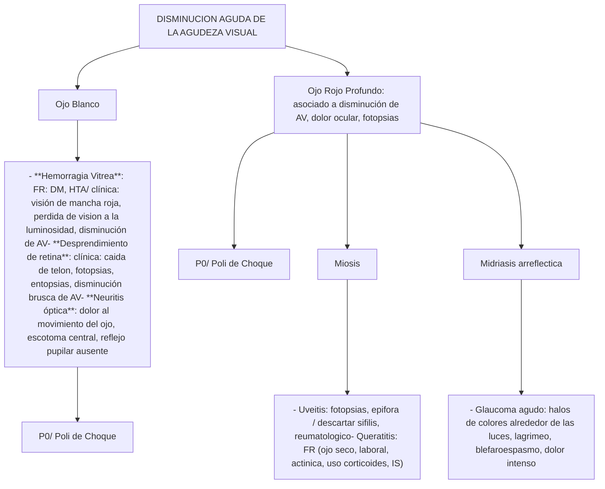
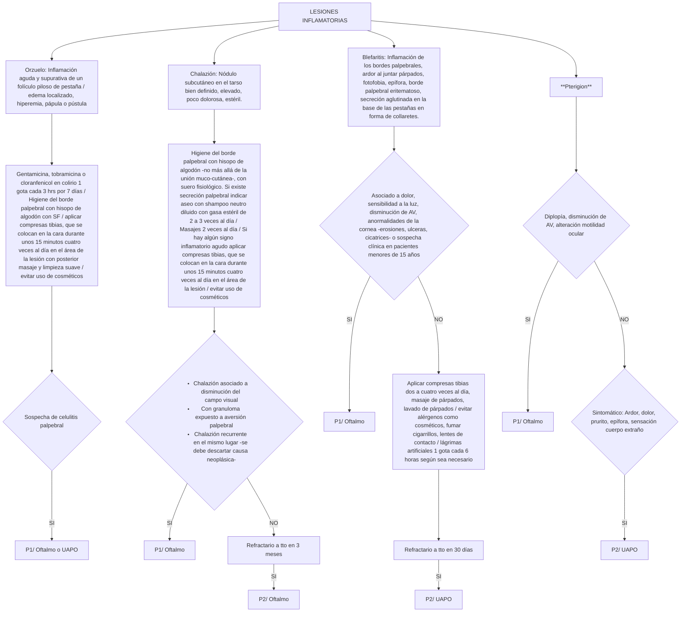

# PROT-OFTALMOLOGIA-V.1-2019-2

--- Página 1 ---


# PROTOCOLO CLÍNICO DE DERIVACIÓN Y PRIORIZACIÓN

## DE LA RED DEL SERVICIO DE SALUD METROPOLITANO OCCIDENTE

### ESPECIALIDAD: OFTALMOLOGIA


| Versión:              | 1.0            |
| --------------------- | -------------- |
| Resolución exenta N°: | 2570           |
| Fecha de Resolución:  | Noviembre 2019 |


--- Página 2 ---

## Objetivo General:

Los flujogramas clínicos tienen como objetivo ser una fuente de información para los profesionales de la salud, orientado a facilitar la toma de decisiones respecto al abordaje inicial del paciente, entregando recomendaciones que permitan realizar un diagnóstico precoz, una derivación pertinente y oportuna hacia el nivel secundario de atención (no reemplaza el criterio clínico del médico tratante), mejorando con ello la continuidad asistencial de los usuarios pertenecientes a la red asistencial del Servicio de Salud Metropolitano Occidente.

## Objetivos Específicos:

- Definir las características y la oportunidad en que un determinado paciente con una patología debe ser evaluado y manejado por el médico no especialista, disminuyendo la variabilidad de la atención, proporcionando un marco común de actuación.
- Establecer un flujograma desde la evaluación clínica, con apoyo de exámenes complementarios y resolución de los pacientes.
- Homologar los códigos CIE-10 a las patologías que por diagnóstico son pertinentes de derivar, aumentando la precisión diagnóstica y con ello su seguimiento y respectiva priorización.
- Entregar criterios estandarizados de referencia y priorización a los equipos de salud de la red del SSMOcc con el fin de mejorar la pertinencia y oportunidad de atención en el nivel secundario de la red asistencial.
- Determinar el conjunto mínimo de datos y exámenes que se deben registrar en la interconsulta y que respaldan el motivo de la derivación al nivel secundario de atención.

Este documento es producto de la colaboración de profesionales de todos los Niveles de Atención de Salud de la Red Metropolitana Occidente, contribuyendo de este modo al Modelo de Redes Integradas de Servicios de Salud basadas en la Atención Primaria.

**Alcance:** Profesionales del área de la salud pertenecientes a la Red Asistencial Metropolitano Occidente

--- Página 3 ---

## DEFINICIONES

**Código CIE-10:** “Clasificación Estadística Internacional de Enfermedades y Problemas Relacionados con la Salud”. En este documento se unifican los códigos CIE-10 de los diagnósticos pertinentes de derivar hacia el nivel secundario. Los que se detallan por cada patología en ella contenida.

**Definición de Pertinencia** : Se entiende por consulta pertinente aquellas derivaciones nuevas originadas en la atención primaria que cumple con los documentos de referencia que resguardan el nivel de atención bajo el cual el paciente debe resolver su problema de salud, siendo el motivo de derivación factible de solucionar en el nivel de atención al que se deriva.

**Definición de No pertinencia** : Corresponde a la identificación de una interconsulta que no cumple con los protocolos clínicos de derivación validados y que resguardan el nivel de atención bajo el cual el paciente debe ser resuelto, siendo el motivo de derivación factible de solucionar en la Atención Primaria de Salud donde el paciente debe ser reevaluado.

**Definición de Prioridad:** nivel de preferencia con el cual debe ser resuelto un problema de salud en el establecimiento al cual fue referido. Se establece categorías de priorización con tiempos de resolución sugeridos.

- Prioridad 0 (P0): son aquellas interconsultas por patologías que deben ser derivadas directamente al servicio de urgencia con eventual hospitalización de acuerdo a evaluación
- Prioridad 1 (P1): alta prioridad cuya patología reviste urgencia relativa, es decir, no puede esperar oferta de cupos, pero a su vez no presenta riesgo vital inmediato que amerite una derivación al servicio de urgencia. Esta derivación requiere una coordinación directa entre el nivel primario y el establecimiento de destino. Se sugiere que el tiempo de atención por el especialista sea antes de 30 días.
- Prioridad 2 (P2): prioridad normal. Interconsulta ingresa al sistema informático respectivo, a la espera que se le asigne un cupo de atención de acuerdo a la oferta disponible. Se sugiere que el tiempo de atención por el especialista sea antes de 6 meses.

Los exámenes descritos en los flujogramas como “según disponibilidad” quedan sujetos a la disponibilidad existente en cada centro de salud y/o posibilidad de ser realizado por el paciente. Cuando no se dispone del recurso se sugiere derivar directamente.

--- Página 4 ---

**ELABORADO POR:**


| NOMBRE                    | CARGO                                                          | ESTABLECIMIENTO                                      |
| ------------------------- | -------------------------------------------------------------- | ---------------------------------------------------- |
| Dr. Edgardo Sánchez       | Especialista Oftalmólogo.<br/>Jefe de Servicio de Oftalmología | Hospital San Juan de Dios                            |
| Dr. Jose Luis Liebbe      | Especialista Oftalmólogo                                       | Hospital San Juan de Dios                            |
| Lya Reyes                 | Subdirector Atención ambulatoria                               | Hospital San Juan de Dios                            |
| Dr. Arturo Hillerns Eltit | Especialista Oftalmólogo                                       | Jefe Oftalmología Hospital Félix<br/>Bulnes Cerda    |
| Evelyn Morales            | Jefe Departamento GES                                          | Hospital Félix Bulnes Cerda                          |
| Elizabeth Contreras       | Departamento GES                                               | Hospital Félix Bulnes Cerda                          |
| Dra. Claudia Coll         | Especialista Oftalmólogo                                       | Hospital de Melipilla                                |
| Dr. Fernando Zavala       | Especialista Oftalmólogo                                       | Unidad Atención Primaria<br/>Oftalmológica Melipilla |
| Carolina Gómez            | Encargada UAPO Melipilla                                       | UAPO Melipilla                                       |
| TM. Nicole Pérez Yáñez    | Tecnólogo Médico                                               | UAPO Melipilla                                       |
| Dr. Javier Deneken        | Médico Gestor                                                  | CRS SAG                                              |
| TM. Víctor Riffo          | Tecnólogo Medico                                               | CRS SAG                                              |


--- Página 5 ---

| NOMBRE                             | CARGO            | ESTABLECIMIENTO          |
| ---------------------------------- | ---------------- | ------------------------ |
| TM. Werner Muñoz González          | Tecnólogo Médico | UAPO Violeta Parra       |
| Yennyffer Pino                     | Jefe SOME        | CESFAM Violeta Parra     |
| TM. Marcelo Manríquez Chacón       | Tecnólogo Médico | UAPO Pudahuel Estrella   |
| Dra. Erika Burgos                  | Médico Contralor | CESFAM Pudahuel Estrella |
| Fernanda Castillo                  | Encargada GES    | CESFAM Pudahuel Estrella |
| TM. Alfredo González Romero        | Tecnólogo Médico | UAPO Quinta Normal       |
| TM. Fernanda Marín Vallejos        | Tecnólogo Médico | UAPO Renca               |
| Dr. Álvaro Vergara                 | Médico Contralor | CESFAM Renca             |
| Juan Leiva                         | Jefe SOME        | CESFAM Renca             |
| TM. María Fernanda Cereceda García | Tecnólogo Médico | UAPO Lo Prado            |
| Dra. Sandra Ballesteros            | Médico Contralor | CESFAM Cerro Navia       |
| Vivian Silva                       | Jefe SOME        | CESFAM Cerro Navia       |
| TM. Michael Muñoz Padilla          | Tecnólogo Médico | UAPO Cerro Navia         |
| Dr. Abel González                  | Médico Contralor | CESFAM San Pedro         |
| Hernán Jiménez                     | Jefe Farmacia    | CESFAM San Pedro         |
| Edelmira Zúñiga                    | Jefe SOME        | CESFAM San Pedro         |
| Dr. Raúl Castro                    | Médico Contralor | CESFAM Boris Soler       |
| Dra. Eliana Amunategui             | Médico Contralor | CESFAM Elgueta           |
| Claudia Monsalve                   | Jefe SOME        | CESFAM Elgueta           |
| Dr. Alejandro Carreño              | Medico Contralor | CESFAM Elgueta           |
| Dra. Magdalena Vaca                | Médico Contralor | CESFAM Peñaflor          |


| NOMBRE                             | CARGO            | ESTABLECIMIENTO          |
| ---------------------------------- | ---------------- | ------------------------ |
| TM. Werner Muñoz González          | Tecnólogo Médico | UAPO Violeta Parra       |
| Yennyffer Pino                     | Jefe SOME        | CESFAM Violeta Parra     |
| TM. Marcelo Manríquez Chacón       | Tecnólogo Médico | UAPO Pudahuel Estrella   |
| Dra. Erika Burgos                  | Médico Contralor | CESFAM Pudahuel Estrella |
| Fernanda Castillo                  | Encargada GES    | CESFAM Pudahuel Estrella |
| TM. Alfredo González Romero        | Tecnólogo Médico | UAPO Quinta Normal       |
| TM. Fernanda Marín Vallejos        | Tecnólogo Médico | UAPO Renca               |
| Dr. Álvaro Vergara                 | Médico Contralor | CESFAM Renca             |
| Juan Leiva                         | Jefe SOME        | CESFAM Renca             |
| TM. María Fernanda Cereceda García | Tecnólogo Médico | UAPO Lo Prado            |
| Dra. Sandra Ballesteros            | Médico Contralor | CESFAM Cerro Navia       |
| Vivian Silva                       | Jefe SOME        | CESFAM Cerro Navia       |
| TM. Michael Muñoz Padilla          | Tecnólogo Médico | UAPO Cerro Navia         |
| Dr. Abel González                  | Médico Contralor | CESFAM San Pedro         |
| Hernán Jiménez                     | Jefe Farmacia    | CESFAM San Pedro         |
| Edelmira Zúñiga                    | Jefe SOME        | CESFAM San Pedro         |
| Dr. Raúl Castro                    | Médico Contralor | CESFAM Boris Soler       |
| Dra. Eliana Amunategui             | Médico Contralor | CESFAM Elgueta           |
| Claudia Monsalve                   | Jefe SOME        | CESFAM Elgueta           |
| Dr. Alejandro Carreño              | Medico Contralor | CESFAM Elgueta           |
| Dra. Magdalena Vaca                | Médico Contralor | CESFAM Peñaflor          |


--- Página 6 ---

**ELABORADO POR:**


| NOMBRE                      | CARGO                                                                                                          | ESTABLECIMIENTO                               |
| --------------------------- | -------------------------------------------------------------------------------------------------------------- | --------------------------------------------- |
| Dr. Juan Villalobos         | Médico Contralor                                                                                               | CESFAM Peñaflor                               |
| Dr. Carlos Cordero          | Médico Contralor                                                                                               | CESFAM San Manuel                             |
| Dra. Francisca Meza         | Médico Contralor                                                                                               | Hospital Curacaví                             |
| Dra. Diana García           | Médico Contralor                                                                                               | CESFAM Gustavo Molina                         |
| Dr. Cristian Balladares     | Médico Contralor                                                                                               | CESFAM Lo Franco                              |
| Dr. Marco Gamboa            | Médico Contralor                                                                                               | CESFAM Garin                                  |
| Dr. Alexis Sukin            | Médico Contralor                                                                                               | CESFAM Huamachuco                             |
| Dr. Andrés Garrido          | Médico Contralor                                                                                               | CESFAM Steegers                               |
| Dra. Lucia Larraín          | Médico Contralor                                                                                               | Consultorio Dr. Hernán Urzúa<br/>Merino       |
| Dra. Maria Gabriela Antúnez | Médico Contralor                                                                                               | CESFAM Bicentenario                           |
| Dr. Felipe Rice             | Médico Contralor                                                                                               | CESFAM El Monte                               |
| Dra. Susy Yagual Hidalgo    | Médico Contralor                                                                                               | CESFAM Isla de Maipo                          |
| Catalina Aguayo             | Subdirección técnica                                                                                           | CESFAM Alhué                                  |
| Ondina Narváez              | Médico Contralor                                                                                               | CESFAM Albertz                                |
| Rosa Mejias                 | Jefe SOME                                                                                                      | CESFAM Lo Amor                                |
| Getsenia Quezada            | Encargada SIGGES                                                                                               | CESFAM La Islita                              |
| Dr. Luis Velez              | Encargado Programa de Resolutividad                                                                            | Servicio de Salud Metropolitano<br/>Occidente |
| Dra. Mirza Retamal          | Asesor Subdirección de Atención<br/>Primaria. Referente Modelo de<br/>Referencia y Contra referencia           | Servicio de Salud Metropolitano<br/>Occidente |
| QF. Loreto González         | Asesor Subdirección de Atención<br/>Primaria. Referente Modelo de<br/>Referencia y Contra referencia           | Servicio de Salud Metropolitano<br/>Occidente |
| Dra Maria Jose Maureira     | Asesor Departamento de Coordinación<br/>de la Red.<br/>Referente Modelo de Referencia y<br/>Contra- referencia | Servicio de Salud Metropolitano<br/>Occidente |


--- Página 7 ---

**REVISADO POR:**


| NOMBRE                            | CARGO                                                                                         | ESTABLECIMIENTO                           |
| --------------------------------- | --------------------------------------------------------------------------------------------- | ----------------------------------------- |
| Dr Carlos Gallardo                | Jefe Departamento de Coordinación de la Red                                                   | Servicio de Salud Metropolitano Occidente |
| QF. Roxana Arias.                 | Jefe Departamento de Estadísticas y Gestión de la Información. SSMOCC                         | Servicio de Salud Metropolitano Occidente |
| T.O. María Paz Iturriaga Lisbona. | Directora Subdirección de Atención Primaria<br/>SSMOCC                                        | Servicio de Salud Metropolitano Occidente |
| Lya Reyes                         | Subdirectora Atención Ambulatoria.<br/>Referente Modelo de Referencia y Contra referencia     | Hospital San Juan de Dios                 |
| Dra. Lorena Arrue                 | Referente Modelo de Referencia y Contra referencia                                            | Hospital Felix Bulnes                     |
| EU. Daniela Andrade               | Enfermera Supervisora Atención Ambulatoria Referente Modelo de Referencia y Contra referencia | Hospital Felix Bulnes                     |
| Cecilia Elgueta                   | Sub jefe CAE<br/>Referente Modelo de Referencia y Contra referencia                           | Hospital San José de Melipilla            |
| Odont. Claudio Miranda            | Referente Modelo de Referencia y Contra referencia                                            | Hospital de Talagante                     |
| Dra Alicia Canales                | Subdirectora Médica                                                                           | CRS Dr. Salvador Allende                  |


**AUTORIZADO POR:**


| NOMBRE                | CARGO                                              | ESTABLECIMIENTO                           |
| --------------------- | -------------------------------------------------- | ----------------------------------------- |
| Dr. Rodrigo Riffo     | Director de la Subdirección de Gestión Asistencial | Servicio de Salud Metropolitano Occidente |
| Dr. Francisco Miranda | Director                                           | Servicio Salud Metropolitano Occidente    |


**COORDINADOR Y ENCARGADO RESPONSABLE:**


| NOMBRE                            | CARGO                                                                                                | ESTABLECIMIENTO                        |
| --------------------------------- | ---------------------------------------------------------------------------------------------------- | -------------------------------------- |
| Dra. Maria Jose Maureira Maureira | Asesor Departamento de Coordinación de la Red<br/>Referente Modelo de Referencia y Contra referencia | Servicio Salud Metropolitano Occidente |


**Validado en el Consejo Integrador de la Red Asistencial (CIRA) del SSMOcc realizado el 22 de Agosto 2019**

--- Página 8 ---

# UNIDAD DIAGNOSTICA

1. Ojo Rojo
    * Ojo Rojo Profundo
    * Ojo Rojo Superficial
    * Conjuntivitis Bacteriana
    * Conjuntivitis Viral
    * Conjuntivitis Alérgica
    * Ojo Seco

2. Disminución Aguda de la Agudeza Visual
    * Hemorragia Vítrea
    * Desprendimiento de retina
    * Uveítis
    * Glaucoma Agudo

3. Lesiones Inflamatorias
    * Orzuelo
    * Chalazión
    * Blefaritis
    * Pterigión

4. Diagnóstico Diferencial de Patologías Oftalmológicas

--- Página 9 ---

# TABLA CONSOLIDADA. ESPECIALIDAD OFTALMOLOGIA


| Nº | Diagnóstico de Derivación (Código CIE-10)                                                                          | Criterios Derivación                                                                                                                                                                                                                                                                                                                                                                        | Establecimiento Destino\* | Prioridad |
| -- | ------------------------------------------------------------------------------------------------------------------ | ------------------------------------------------------------------------------------------------------------------------------------------------------------------------------------------------------------------------------------------------------------------------------------------------------------------------------------------------------------------------------------------- | ------------------------- | --------- |
| 1  | Degeneración Macular (DMRE) relacionada con la edad (H353, degeneración de la macula y del polo posterior del ojo) | **Sospecha clínica:**<br/>DMRE Seca: > 50 años con FRCV, antecedentes familiares, disminución variable de la AV, mala adaptación nocturna                                                                                                                                                                                                                                                   | UAPO                      | P2        |
|    |                                                                                                                    | DMRE Húmeda: disminución brusca de la AV, metamorfopsias, entopsias, fotopsias, alteración del campo visual central                                                                                                                                                                                                                                                                         | Poli de Choque            | P0        |
| 2  | Catarata (H269, catarata no especificada)                                                                          | Sospecha clínica: paciente > de 60 años con disminución de la AV, indolora, gradual, uni o bilateral, acompañada de : visión borrosa para lejos y/o cerca, percepción alterada de colores, diplopía monocular, encandilamiento, miopía progresiva, cambios frecuentes en la fórmula de los lentes de corrección óptica, percepción de mejoramiento de visión cercana / rojo pupilar ausente | Según mapa GES vigente    | GES       |
| 3  | Glaucoma crónico (H409, glaucoma no especificado)                                                                  | Desde UAPO:<br/>Pacientes con glaucomas secundarios<br/>Pacientes con glaucomas refractario a tto tópico en dos controles consecutivos o en 6 meses<br/>Paciente con ojo único,<br/>Glaucoma ángulo estrecho y/o avanzado                                                                                                                                                                   | Oftalmología              | P1        |
| 4  | Vicio de Refracción (H527, trastorno de la refracción, no especificado)                                            | >=65 años                                                                                                                                                                                                                                                                                                                                                                                   | Según mapa GES vigente    | GES       |
|    |                                                                                                                    | 15-64 años                                                                                                                                                                                                                                                                                                                                                                                  | UAPO                      |           |
| 5  | Retinopatía Diabética (H360, retinopatía diabética)                                                                | Screening                                                                                                                                                                                                                                                                                                                                                                                   | Según mapa GES vigente    | GES       |
| 6  | Retinopatía del prematuro (H351, retinopatía de la prematuridad)                                                   | Sospecha                                                                                                                                                                                                                                                                                                                                                                                    | Según mapa GES vigente    | GES       |


\* Especialidad Destino (considerar Mapa de Derivación respetivo)

**Prioridad 0 (P0):** son aquellas interconsultas con patologías de urgencia que deben ser derivadas directamente al poli de choque del nivel secundario HSJD ( 8:00 am a 12:00 pm) o a la UAPO (según disponibilidad de dispositivo y oferta de cupos) para ser evaluados en un plazo de 24-48 horas. En el caso de glaucoma agudo o hipopion, la atención debe ser en un plazo máximo de 12 a 24 horas.

**Prioridad 1 (P1):** se sugiere que la atención del usuario sea en un plazo menor de 30 días.

**Prioridad 2 (P2):** se sugiere que la atención del usuario sea en un plazo menor a 6 meses.

--- Página 10 ---

# ESPECIALIDAD OFTALMOLOGIA


| Nº | Diagnóstico de Derivación(Código CIE-10)                                                                                                                                                                                                                       | Criterios derivación                                                                                                                                                                                                                                             | EstablecimientoDestino\*                                                                                                                              | Prioridad |
| -- | -------------------------------------------------------------------------------------------------------------------------------------------------------------------------------------------------------------------------------------------------------------- | ---------------------------------------------------------------------------------------------------------------------------------------------------------------------------------------------------------------------------------------------------------------- | ----------------------------------------------------------------------------------------------------------------------------------------------------- | --------- |
| 7  | Desprendimiento de Retina (H330, desprendimiento de la retina con ruptura)                                                                                                                                                                                     | Sospecha clínica: caída de telón, fotopsias, entopsias, disminución de agudeza visual                                                                                                                                                                            | Poli de Choque                                                                                                                                        | P0        |
| 8  | Hemorragia Vitrea (H431, hemorragia del vitreo)                                                                                                                                                                                                                | Sospecha clínica: FRCV, visión de mancha roja, perdida de visión a la luminosidad                                                                                                                                                                                | Poli de Choque                                                                                                                                        | P0        |
| 9  | Neuritis optica (H46X, neuritis optica)                                                                                                                                                                                                                        | Sospecha clínica: dolor al movimiento del ojo, escotoma central, reflejo pupilar ausente                                                                                                                                                                         | Poli de Choque                                                                                                                                        | P0        |
| 10 | **Ojo Rojo Profundo:**<br/>Glaucoma Agudo (H402, glaucoma primario de ángulo cerrado)<br/>Queratitis (H162, queratoconjuntivitis)<br/>Uveítis (H200, iridociclitis aguda y subaguda)<br/>Escleritis (H150, escleritis)<br/>Epiescleritis (H151, epiescleritis) | Sospecha clínica ojo rojo profundo: dolor ocular, fotofobia, disminución de AV, inyección ciliar periquerática, pupilas de tamaño y reactividad anormales (midriasis en el caso de glaucoma agudo), hipertonía digital del globo ocular, alteraciones corneales. | Poli de Choque                                                                                                                                        | P0        |
| 11 | Trauma Ocular                                                                                                                                                                                                                                                  | Sospecha clínica                                                                                                                                                                                                                                                 | Unidad traumatológica oftalmológica (UTO) Hospital del Salvador: Lunes a Viernes de 8°° a 20°° horas. Sábado, domingo y festivos de 9°° a 20°° horas. |           |


\*Especialidad Destino (considerar Mapa de Derivación respetivo)

**Prioridad 0 (P0):** son aquellas interconsultas con patologías de urgencia que deben ser derivadas directamente al poli de choque del nivel secundario HSJD ( 8:00 am a 12:00 pm) o a la UAPO (según disponibilidad de dispositivo y oferta de cupos) para ser evaluados en un plazo de 24-48 horas. En el caso de glaucoma agudo o hipopion, la atención debe ser en un plazo máximo de 12 a 24 horas.

**Prioridad 1 (P1):** se sugiere que la atención del usuario sea en un plazo menor de 30 días.

**Prioridad 2 (P2):** se sugiere que la atención del usuario sea en un plazo menor a 6 meses.

--- Página 11 ---

# ESPECIALIDAD OFTALMOLOGIA


| Nº | Diagnóstico de Derivación(Código CIE-10)                                                                 | Criterios Derivación                                                                                                                                                                           | EstablecimientoDestino\*                                                                                                                                     | Prioridad |
| -- | -------------------------------------------------------------------------------------------------------- | ---------------------------------------------------------------------------------------------------------------------------------------------------------------------------------------------- | ------------------------------------------------------------------------------------------------------------------------------------------------------------ | --------- |
| 12 | Conjuntivitis viral (H103,<br/>conjuntivitis aguda, no<br/>especificada)                                 | Presencia de pseudomembrana.                                                                                                                                                                   | UAPO                                                                                                                                                         | P1        |
|    |                                                                                                          | Falta de respuesta al 10 día de tratamiento<br/>bien llevado                                                                                                                                   |                                                                                                                                                              |           |
|    |                                                                                                          | Asociado a disminución de agudeza visual                                                                                                                                                       |                                                                                                                                                              |           |
| 13 | Conjuntivitis bacteriana<br/>(H100,<br/>conjuntivitis mucopurulenta)                                     | Falta de respuesta al 7 día de tratamiento<br/>bien llevado                                                                                                                                    | UAPO                                                                                                                                                         | P1        |
|    |                                                                                                          | Neonatos menor o igual de 1 mes de edad                                                                                                                                                        | Poli de choque                                                                                                                                               | P0        |
| 14 | Conjuntivitis Alérgica<br/>(H10.1,<br/>conjuntivitis atópica aguda)                                      | Usuario mayor o igual de 20 años con falta<br/>de respuesta a los 30 días de tratamiento<br/>bien llevado                                                                                      | UAPO                                                                                                                                                         | P2        |
|    |                                                                                                          | Usuario menor de 20 años con falta de<br/>respuesta a los 14 días de tratamiento bien<br/>llevado                                                                                              | UAPO                                                                                                                                                         | P1        |
| 15 | Ojo seco (M350, síndrome<br/>seco)                                                                       | Sospecha clínica y/o refractariedad a los 30<br/>días a tratamiento con lágrimas artificiales<br/>(evaluar según clínica y/o exámenes de<br/>laboratorio patología reumatológica<br/>asociada) | UAPO                                                                                                                                                         | P2        |
|    |                                                                                                          | Paciente con antecedentes previos<br/>reumatológicos                                                                                                                                           | UAPO                                                                                                                                                         | P1        |
| 16 | Estrabismo en usuario menor<br/>de 9 años (H509, estrabismo,<br/>no especificado)                        | Sospecha                                                                                                                                                                                       | Según mapa GES<br/>vigente                                                                                                                                   | GES       |
|    | Estrabismo NO GES (no<br/>agudo) H509, estrabismo, no<br/>especificado                                   | Sospecha                                                                                                                                                                                       | Oftalmología                                                                                                                                                 | P2        |
|    | Estrabismo agudo (diplopía<br/>de nueva aparición, H499,<br/>estrabismo paralitico, no<br/>especificado) | En paciente diabético lograr compensación<br/>metabólica paralelo a la derivación                                                                                                              | Oftalmología<br/>\\\* Ante la sospecha<br/>de Hipertensión<br/>endocraneana y/o<br/>sospecha de causa<br/>neurológica<br/>derivar a Servicio<br/>de Urgencia | P1        |


**Prioridad 0 (P0)**: son aquellas interconsultas con patologías de urgencia que deben ser derivadas directamente al poli de choque del nivel secundario HSJD (8:00 am a 12:00 pm) o a la UAPO (según disponibilidad de dispositivo y oferta de cupos) para ser evaluados en un plazo de 24-48 horas. En el caso de glaucoma agudo o hipopion, la atención debe ser en un plazo máximo de 12 a 24 horas.

**Prioridad 1 (P1)**: se sugiere que la atención del usuario sea en un plazo menor de 30 días.

**Prioridad 2 (P2)**: se sugiere que la atención del usuario sea en un plazo menor a 6 meses.

--- Página 12 ---

# ESPECIALIDAD OFTALMOLOGIA


| Nº | Diagnostico de Derivación (Código CIE-10)                           | Criterios derivación                                                                                                                                                       | Establecimiento Destino\*  | Prioridad      |
| -- | ------------------------------------------------------------------- | -------------------------------------------------------------------------------------------------------------------------------------------------------------------------- | -------------------------- | -------------- |
| 17 | Orzuelo (H000, orzuelo y otras inflamaciones profundas del parpado) | Sospecha de celulitis palpebral                                                                                                                                            | Oftalmología/UAPO          | P1             |
| 18 | Chalazión (H001, chalazión)                                         | Chalazión asociado a disminución del campo visual<br/>Con granuloma expuesto a aversión palpebral<br/>Chalazión recurrente en el mismo lugar (descartar causa neoplásica)  | Oftalmología               | P1             |
|    |                                                                     | Sin respuesta a medidas de nivel primario después de 3 meses                                                                                                               | Oftalmología               | P2             |
| 19 | Pterigión (H110, pterigión)                                         | Asociado a síntomas de invasión corneal (diplopía, disminución de AV, alteración motilidad ocular)                                                                         | Oftalmología               | P1             |
|    |                                                                     | **Desde APS a UAPO:**<br/>Pacientes sintomáticos y con signos inflamatorios (ojo rojo)<br/>**Desde UAPO a Oftalmología:** Paciente sintomático y refractario a tto médico  | UAPO<br/><br/>Oftalmología | P2<br/><br/>P2 |
| 20 | Blefaritis (H010, blefaritis)                                       | Asociado a dolor, sensibilidad a la luz, disminución de AV, anormalidades de la córnea (erosiones, ulceras, cicatrices) o sospecha clínica en pacientes menores de 15 años | Oftalmología               | P1             |
|    |                                                                     | Refractario a tratamiento bien llevado en 30 días                                                                                                                          | UAPO                       | P2             |


\*Especialidad Destino (considerar Mapa de Derivación vigente)

**Prioridad 0 (P0):** son aquellas interconsultas con patologías de urgencia que deben ser derivadas directamente al poli de choque del nivel secundario HSJD (8:00 am a 12:00 pm) o a la UAPO (según disponibilidad de dispositivo y oferta de cupos) para ser evaluados en un plazo de 24-48 horas. En el caso de glaucoma agudo o hipopion, la atención debe ser en un plazo máximo de 12 a 24 horas.

**Prioridad 1 (P1):** se sugiere que la atención del usuario sea en un plazo menor de 30 días.

**Prioridad 2 (P2):** se sugiere que la atención del usuario sea en un plazo menor a 6 meses.

--- Página 13 ---

# OJO ROJO

```mermaid
graph TD
    OR[OJO ROJO] --> ORP[Ojo Rojo Profundo:  Asociado a disminución de AV, dolor ocular, fotopsias]
    ORP --> ORP_D[Asociado a Miosis  * Uveitis: fotopsias, epifora / descartar sifilis, patología reumatológica  * Queratitis: FR (ojo seco, laboral, actinica, uso corticoides, IS)  Asociado a Midriasis Arreflectica:  * Glaucoma agudo: halos de colores alrededor de las luces, lagrimeo, blefaroespasmo, dolor intenso, hipertonía digital del globo ocular]
    ORP_D --> P0[P0/ Poli de choque]
    
    ORP -- NO --> ORS[Ojo Rojo Superficial]
    
    ORS --> CB[Conjuntivitis Bacteriana:  Clínica: secreción purulenta, aglutinamiento de pestañas, prurito  Tto: colirio cloranfenicol o gentamicina (ATB sin corticoides) 1 gota cada 3 horas por 7 días asociado a ungüento cloranfenicol o gentamicina en la noche / El tratamiento se debe realizar sólo en el ojo afectado / En el caso de menores de 5 años se optará por ungüento antibiótico cada 8 horas en el o los ojos afectados por 7 días/ Aseo ocular con gasa con agua hervida fría 2 veces al día]
    CB -- Refractario en 7 días --> P1_UAPO1[P1/UAPO]
    
    ORS --> CV[Conjuntivitis Viral  Clínica: ardor o sensación de arenilla, lagrimeo, secreción serosa, reaccion folicular  Tto: separar artículos de aseo personal (toalla de manos, cara, etc), lavado de ropa de cama diaria (principalmente funda de almohada), evitar contacto físico directo, evitar piscinas, saunas, o jacuzzi. / Frío local 10 minutos x 3 veces al día (lavar cada vez la fuente de frío), lágrimas artificiales 1 a 2 gotas cada 1 a 6 horas según sea necesario en ambos ojos por 5 - 10 días/ antihistamínicos -descongestivos 1 a 2 gotas cada 6 horas según sea necesario por 5-10 días. Contraindicado los corticoides]
    CV -- Refractario en 10 días o asociado a disminución de AV --> P1_UAPO2[P1/UAPO]
    
    ORS --> CA[Conjuntivitis Alérgica:  Clínica: prurito ocular, enrojecimiento bilateral, secreción acuosa rinorrea, estornudos  Tto: Evitar exposición a alergeno / Lágrimas artificiales 1 a 2 gotas cada 1 a 6 horas según sea necesario en ambos ojos en periodo sintomático/ antialérgicos tópicos (Ketotifeno, olopatadina o azelastina, según disponibilidad) 1 a 2 gotas cada 6 horas según sea necesario por no más de tres semanas.]
    CA -- Refractario a los 14 días (<20 años) o a los 30 días (>=20 años) --> P1_P2_UAPO1[P1-P2 según grupo etareo / UAPO]
    
    ORS --> OS[Ojo Seco:  Causas: Sjogren, diabetes, uso de lentes de contacto, edad, conjuntivitis alérgica, blefaritis, entre otros  Clínica: Sequedad, sensación arenosa, sensación de ardor, sensación de cuerpo extraño, sensibilidad a la luz, visión borrosa, inyección conjuntival, generalmente simétrica en ambos ojos  Tto: lagrimas artificiales 1 gota en cada ojo cada 6 horas según sea necesario por 30 dias / indicar parpadeo frecuente, minimizar la exposición al aire acondicionado o calefacción]
    OS -- Refractario a los 30 días o antecedentes previos reumatológicos --> P1_P2_UAPO2[P1-P2 según antecedente reumatologico/ UAPO]
    
    ORS --> LI[Lesiones Inflamatorias: pterigion, orzuelo, chalazion, blefaritis]
    LI --> VER[Ver esquema respectivo]
```


SERVICIO SALUD OCCIDENTE

<page_footer>
SERVICIO SALUD OCCIDENTE
</page_footer>

--- Página 14 ---

# DISMINUCION AGUDA DE LA AGUDEZA VISUAL



--- Página 15 ---

# LESIONES INFLAMATORIAS



SERVICIO SALUD OCCIDENTE

--- Página 16 ---

# Diagnóstico Diferencial de Patologías Oftalmológicas


|                                     | Secreción           | Dolor | Sensacióncuerpoextraño | Fotofobia | Disminuciónagudezavisual | Tonometríadigital                  | Alteracionespupilares           | Ojorojoperiquerá-tico | Opacidadcorneal |
| ----------------------------------- | ------------------- | ----- | ---------------------- | --------- | ------------------------ | ---------------------------------- | ------------------------------- | --------------------- | --------------- |
| Conjuntivitis<br/>viral             | seromucosa          | no    | ±                      | ±         | no                       | Aumentada<br/>o<br/>disminuida\\\* | no                              | no                    | no              |
| Conjuntivitis<br/>bacteriana        | Mucopuru-<br/>lenta | no    | ±                      | no        | no                       | Aumentada<br/>o<br/>disminuida\\\* | no                              | no                    | no              |
| Blefaritis                          | +                   | no    | no                     | no        | no                       | Normal                             | no                              | no                    | no              |
| Queratitis                          | no                  | ++    | +                      | ++        | +                        | Normal                             | no                              | si                    | si              |
| Epiescleritis                       | no                  | +     | no                     | no        | no                       | Normal                             | no                              | si                    | no              |
| Escleritis                          | no                  | ++    | no                     | no        | +/-                      | Normal                             | no                              | si                    | no              |
| Uveitis                             | no                  | ++    | no                     | ++        | ++                       | Disminuida                         | no                              | si                    | no              |
| Glaucoma<br/>agudo                  | no                  | +++   | no                     | +         | +++                      | Aumentada                          | si<br/>semimidria-<br/>sis fija | si                    | si              |
| Hemorragia<br/>subconjunti-<br/>val | no                  | no    | no                     | no        | no                       | Normal                             | no                              | no                    | no              |
| Ojo seco                            | + mucosa            | no    | +++                    | +/-       | no                       | Aumentada<br/>o<br/>disminuida\\\* | no                              | no                    | no              |


16

--- Página 17 ---

**Abreviaciones**

* AV: agudeza visual
* CI: contraindicación
* FR: factores de riesgo
* FRCV: factores de riesgo cardiovascular
* HSJD: Hospital San Juan de Dios
* UAPO: Unidad Atención Primaria Oftalmológica
* \>: mayor
* \>=: mayor o igual
* Tto: tratamiento

**Bibliografía:**

* Protocolo resolutivo de Glaucoma. 2018 . Dr Edgardo Sánchez y col. Servicio de Oftalmología HSJD
* Protocolo resolutivo de Chalazión. 2015. Dr. Edgardo Sánchez y col. Servicio de Oftalmología Hospital San Juan de Dios
* Protocolo resolutivo de Degeneración Macular. Dr. Edgardo Sánchez y col. Servicio de Oftalmología Hospital San Juan de Dios
* Protocolo resolutivo de Pterigión. 2015. Dr. Edgardo Sánchez y col. Servicio de Oftalmología Hospital San Juan de Dios
* Protocolo resolutivo de Visio de Refracción. 2015. Dr. Edgardo Sánchez y col. Servicio de Oftalmología Hospital San Juan de Dios
* Orientaciones técnicas administrativas. Programa de Resolutividad. 2019. DIVAP – MINSAL

--- Página 18 ---


**Departamento de Asesoría Jurídica**
DR.FMG/CGO/MJMM/TN/
N°847/19

**EXENTA N°** 2570

**SANTIAGO,** 27 NOV. 2019

**VISTOS:** El Memorándum DECOR N°132 de fecha 12 de Septiembre del año 2019 del Departamento de Coordinación de Red Asistencial en virtud del cual se solicita al Departamento de Asesoría Jurídica la elaboración de acto administrativo que apruebe los Flujogramas Clínicos de Derivación y Priorización al Nivel Secundario de Atención en la Especialidad de Oftalmología; y en uso de las atribuciones que me confieren el DFL. N°1/2005 en virtud del cual se fija el texto refundido, coordinado y sistematizado del D.L. N°2.763/79 y de las leyes Nos 18.933 y 18.469; lo contemplado en el Decreto N°140/04, Reglamento Orgánico de los Servicios de Salud, y en el Decreto Supremo N°56 de fecha 12 de julio de 2018 del cual emana mi personería de Director, ambos del Ministerio de Salud, y lo dispuesto en las Resoluciones N°7 y N°8 ambos del 2019 de la Contraloría General de la República, y:

**CONSIDERANDO:**

**1.-** Que, existe la necesidad del Servicio de Salud Metropolitano Occidente de estandarizar y formalizar todos los procedimientos internos, mediante la dictación del respectivo acto administrativo que lo apruebe;

**2.-** Que, es indispensable para el Servicio de Salud Metropolitano Occidente potenciar diversas herramientas de apoyo de los Manuales y Flujogramas Clínicos, a fin de mejorar la calidad, oportunidad y continuidad Asistencial en la atención de los Usuarios pertenecientes a la Red de Salud Metropolitana Occidente;

**3.-** Que, frente a lo anterior, mediante Memorándum N°132 del año 2019, el Departamento de Coordinación de Red Asistencial de esta Dirección de Servicio, solicita al Departamento de Asesoría Jurídica elaborar el instrumento jurídico que formaliza los Flujogramas Clínicos de Derivación y Priorización al Nivel Secundario de Atención;

**4.-** Que, mediante este acto administrativo se sanciona el citado flujograma señalado en el numeral anterior, por lo que en virtud de lo expuesto, dicto la siguiente:

**RESOLUCIÓN**

**1.- APRUÉBESE** los Flujogramas Clínicos de Derivación y Priorización de la Red del Servicio de Salud Metropolitano Occidente en la Especialidad Oftalmología, cuyo texto íntegro es el siguiente:

