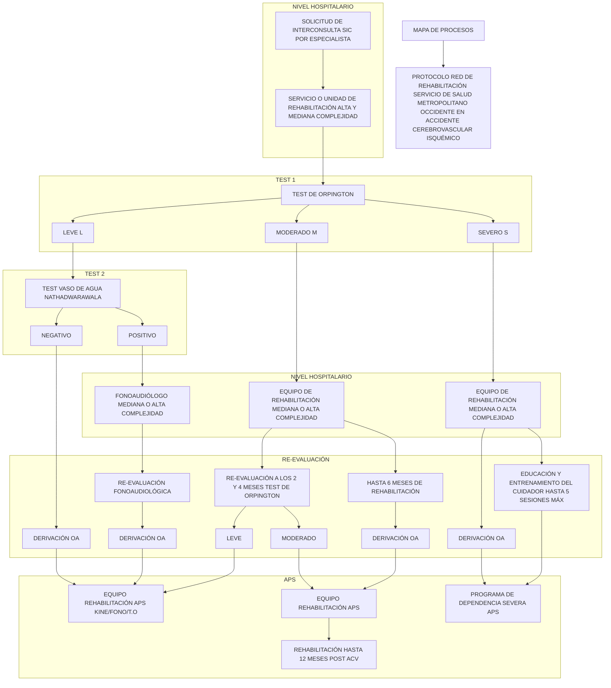

# PROT-REHABILITACION-AVE-2018

--- Página 1 ---

<u>**Departamento de Asesoría Jurídica**</u>

DR.FMG/CGS/CHR/
Nº72/2049

EXENTA Nº 0325

SANTIAGO, 04 MAR 2018

**VISTOS:** El Ordinario DECOR Nº 70 del 10 de enero del 2018, mediante el cual se informa la constitución de mesas de trabajo para desarrollar protocolos y flujogramas de derivación en ACV, y red de rehabilitación infantil; el Ordinario DECOR Nº 15 del 06 de febrero del 2019, por el cual el Departamento de Coordinación de Red Asistencial solicita al Departamento de Asesoría Jurídica gestionar la resolución de aprobación del Protocolo Red de Rehabilitación de Accidente Cerebrovascular Isquémico; en uso de las atribuciones que me confiere el DFL Nº 1/2005 en virtud del cual se fija el texto refundido, coordinado y sistematizado del DL Nº 2763/79 y otras normas, lo contemplado en el Decreto Nº 140/04 Reglamento Orgánico de los Servicios de Salud y en el Decreto Supremo Nº 56 del 12 de julio de 2018, que me nombra Director del Servicio de Salud Metropolitano Occidente, ambos del Ministerio de Salud; y lo dispuesto por la Resolución Nº 1600/2008 de la Contraloría General de la República, y:

**CONSIDERANDO:**

**I.** Que, en Chile el accidente cerebrovascular isquémico es uno de los principales problemas de salud pública;

**II.** Que, el "Protocolo Red de Rehabilitación de Accidente Cerebrovascular Isquémico", es un documento destinado a apoyar la optimización de la Red de Rehabilitación en el manejo de los pacientes con accidente cerebrovascular (ACV);

**III.** Que, mediante este acto administrativo se sanciona el citado Protocolo;

**IV.** Que, en virtud de lo expuesto, dicto la siguiente:

**RESOLUCIÓN**

**1º APRUÉBESE** el "Protocolo Red de Rehabilitación de Accidente Cerebrovascular Isquémico", el cual se encuentra debidamente elaborado, revisado y autorizado. Cuyo texto íntegro es del siguiente tenor:

--- Página 2 ---

# 1. INTRODUCCIÓN

Según la Organización Mundial de la Salud (OMS), las principales causas de mortalidad en el mundo son la cardiopatía isquémica y el accidente cerebrovascular, que ocasionaron 15 millones de muertes en el año 2015 y han sido las principales causas de mortalidad durante los últimos 15 años.

El Accidente cerebrovascular (ACV) es la enfermedad neurológica más frecuente, con una incidencia promedio mundial de 200 casos por cada 100 000 habitantes cada año, y una prevalencia de 600 casos por cada 100000 habitantes.

En Chile el Accidente Cerebrovascular Isquémico forma parte de los principales problemas de salud pública, constituyendo en el año 2013 la principal causa de muerte y la segunda causa de mortalidad en grupos de entre 30 y 69 años.

# 2. OBJETIVOS

## 2.1 Objetivo general

Optimizar la Red de Rehabilitación del Servicio de Salud Metropolitano Occidente (SSMOcc) para el manejo de los pacientes con Accidente Cerebrovascular Isquémico (ACV) de acuerdo a su pronóstico funcional.

## 2.2 Objetivos específicos

* Categorizar los pacientes con ACV isquémico de acuerdo a la severidad de los déficits.
* Potenciar la red de rehabilitación del SSMOcc según nivel de complejidad.
* Facilitar la planificación de objetivos de rehabilitación en el paciente con ACV isquémico en cada nivel de atención según su pronóstico funcional.
* Optimizar recursos y tiempos en el proceso de rehabilitación.

# 3. ALCANCE

El alcance de este documento está dirigido los profesionales de Rehabilitación que atienden a los pacientes en instituciones de alta y mediana complejidad del Servicio Metropolitano Occidente.

# 4. RESPONSABILIDADES

| Responsable                                                                                                                  | Actividad                                                                                                                                                                                                                                                                                                                                                                                                                                                                     |
| ---------------------------------------------------------------------------------------------------------------------------- | ----------------------------------------------------------------------------------------------------------------------------------------------------------------------------------------------------------------------------------------------------------------------------------------------------------------------------------------------------------------------------------------------------------------------------------------------------------------------------- |
| Profesional de rehabilitación en hospital de alta complejidad (Fisiatra, Kinesiólogo, Terapeuta Ocupacional o Fonoaudiólogo) | \* Según el flujograma de derivación (anexo1), realizar la orden de atención a Rehabilitación según corresponda según lo indica en ORD N°0208 /19. \* Realizar el test de Orpington (anexo 2) al momento de la evaluación inicial del paciente con Accidente Cerebrovascular Isquémico y según su puntaje categorizarlo en leve, moderado o severo. \* Reevaluar periódicamente cada 2 meses con el mismo instrumento la evolución del paciente para recategorizarlo. |

--- Página 3 ---

| Profesional de rehabilitación en APS (Kinesiólogo, Terapeuta Ocupacional o Fonoaudiólogo) | \* Realizar Test del vaso de agua de Nathadwarawala (anexo 3) para definir si requiere derivación para evaluación formal de fonoaudiología. \* Realizar la Neurorrehabilitación multidisciplinaria hasta un máximo de 6 meses en los pacientes con ACV isquémico desde la fecha del evento. \* Realizar entrenamiento al cuidador a los pacientes categorizados como severos según el test de Orpington, con un máximo de 5 sesiones.                                                                   |
| ----------------------------------------------------------------------------------------- | --------------------------------------------------------------------------------------------------------------------------------------------------------------------------------------------------------------------------------------------------------------------------------------------------------------------------------------------------------------------------------------------------------------------------------------------------------------------------------------------------------------- |
|                                                                                           | \* Realizar rehabilitación a los pacientes con ACV Isquémico con déficit leve (que se traduce en buen pronóstico funcional) independiente del tiempo de evolución de la patología, con la orden de atención derivada de Alta Complejidad. \* Realizar rehabilitación a los pacientes con ACV Isquémico con déficit moderado posterior a 6 meses desde la fecha del evento, con la orden de atención derivada de Alta Complejidad, y mantenerlos en tratamiento hasta 12 meses o a criterio del profesional. |
| Programa dependencia severa - APS                                                         | \* Incorporar a los pacientes con ACV Isquémico con déficit severo (que se traduce en muy mal pronóstico funcional) posterior a la educación y entrenamiento al cuidador, con la orden de atención derivada de Alta Complejidad.                                                                                                                                                                                                                                                                                |

## 5. DEFINICIONES:

**a) ACCIDENTE CEREBROVASCULAR (ACV):** Brusca interrupción del flujo sanguíneo a un área específica del cerebro, que puede ser por oclusión o ruptura de un vaso. Se considera ACV isquémico agudo o en evolución durante las primeras 24 horas, y en aquellos de territorio de circulación posterior hasta 48 horas después del inicio de los síntomas; posterior a esto y hasta llegar a fase secuelar (6 meses) se considera en fase subaguda. Los Accidentes vasculares encefálicos se dividen en dos tipos:

* **Isquémico:** También conocido como infarto cerebral. Se debe a la oclusión de alguna de las arterias que irrigan la masa encefálica, generalmente por arterioesclerosis o bien por un émbolo (embolia cerebral). En la isquemia, se interrumpe el suministro de oxígeno y glucosa al tejido cerebral, lo cual produce muerte celular con un núcleo de isquemia y una zona de penumbra que es susceptible de salvaguardar con tratamiento trombolítico.

* **Hemorrágico:** Se denomina hemorragia cerebral o apoplejía y se debe a la ruptura de un vaso sanguíneo encefálico debido a la hipertensión arterial, a un aneurisma cerebral, uso de drogas, etc. La hemorragia provoca el accidente vascular por dos mecanismos: por una parte, priva de riego al área cerebral dependiente de esa arteria. Por otra parte, la sangre extravasada ejerce compresión sobre las

--- Página 4 ---

estructuras cerebrales, incluidos otros vasos sanguíneos, lo que aumenta el área afectada.

**b) REHABILITACIÓN EN ACCIDENTE CEREBROVASCULAR ISQUÉMICO:** En la fase subaguda del ACV puede existir una mejoría a mediano y largo plazo, mediada por una reorganización cerebral conocida como fenómeno de plasticidad neuronal, que puede ser modulada por técnicas de neurorrehabilitación. La Rehabilitación en el ACV tiene tres objetivos principales:

1. Evaluar el déficit funcional y su evolución en el tiempo
2. Realizar una estimación del pronóstico
3. Establecer un plan terapéutico individualizado para cada paciente.

Para cumplirlos debemos evaluar inicial y periódicamente al paciente para valorar cada uno de los déficits y objetivar cambios, utilizando instrumentos que ayuden a traducir la valoración clínica y expresen los resultados de un modo objetivo y cuantificable. En ACV la escala pronóstica de Orpington clasifica la severidad del déficit y lo traduce en pronóstico funcional.

**c) Pronóstico del ACV isquémico:** La estimación precoz del pronóstico funcional a mediano y largo plazo en una persona con ACV isquémico resulta esencial para comunicarse con el paciente y sus familiares, diseñando objetivos realistas de rehabilitación y planificar la derivación del paciente a rehabilitación ambulatoria según su complejidad. Se han descrito más de 150 variables con presumible valor pronóstico, pero a fecha de hoy no existe un indicador que permita establecer la evolución de una manera certera, sino que sólo podemos formular una estimación más o menos correcta. La evolución típica del ACV sigue una curva ascendente de pendiente progresivamente menor. En un paciente con recuperación favorable de su déficit encontraremos habitualmente que la mejoría transcurre al inicio. Esta mejoría precoz se debe, en parte a la recuperación del tejido penumbra de la periferia del área isquémica y en parte a la resolución de la diasquisis (fallo transináptico de áreas lejanas relacionadas). En contraposición, la mejoría a largo plazo se adjudica a la plasticidad neuronal. Excepcionalmente la recuperación será igual al 100% y, aunque es imposible prever cuánta recuperación puede alcanzar el paciente, el estudio Copenhague muestra que el 95% de la recuperación se habrá logrado hacia el tercer mes, siendo en el primer mes y medio la recuperación más rápida (el 85%); entre el cuarto y sexto mes la pendiente de recuperación es leve, casi en meseta, y a partir del sexto mes apenas se objetiva una mejoría palpable, por lo que es éste el momento en que se suele dar por estabilizado el cuadro (ver Figura 1). Por ello, en un paciente en que no se objetive una mejoría en el primer mes el periodo de recuperación no se espera una evolución favorable. Si bien existen estudios que revelan mejoría de los déficits hasta 2 años posterior al ACV, estos cambios no se traducen significativamente en lo funcional.

--- Página 5 ---

| Period    | Recovery Status                   |
| --------- | --------------------------------- |
| 1'5 mes   | recuperación más rápida           |
| 3° mes    | recuperación completada en el 95% |
| 4°-6° mes | recuperación casi en meseta       |
| 6° mes    | difícil objetivar ganancias       |

Figura 1: Curva de recuperación ACV esperada

**d) ESCALA PRONÓSTICA DE ORPINGTON (OPS) (Anexo 2):** Instrumento diseñado específicamente para población con ACV isquémico que evalúa 4 ítems:

1) Déficit motor en extremidad superior.

2) Propiocepción.

3) Equilibrio.

4) Cognición.

Clasifica a los pacientes en 3 categorías según la severidad de sus déficits, mientras más alto el score más severo el déficit, el cual se refleja en el pronóstico funcional:

1. (L) Leve — moderado: < 3.2. Tendrán un buen retorno al hogar.

2. (M) Moderado: 3.2 — 5.2. Generalmente responden a la rehabilitación.

3. (S) Severo: > 5.2. Alto riesgo de dependencia o institucionalización.

No requiere entrenamiento para su ejecución, la cual dura aproximadamente 5 minutos. Esta herramienta está altamente recomendada por varias sociedades de profesionales para ser administrada en pacientes con ACV isquémico desde agudo (pero neurológicamente estable), subagudo y hasta etapa crónica mayor a 6 meses, incluso en pacientes que se encuentren en rehabilitación. Cuenta con excelente confiabilidad entre operadores, criterio de validez predictivo excelente con escalas NIHSS y Barthel, Sensibilidad de 96%, Especificidad de 42%, Valor predictivo positivo 100%. Esta escala esta validada al castellano, y su versión española cuenta igualmente con una adecuada validez como indicador pronóstico, su confiabilidad alcanzada mediante la utilización de los mencionados grupos pronósticos nos permite establecer hipótesis relativas al tipo de atención más eficiente para cada tipo de paciente:

1. El grupo de buen pronóstico se beneficiaría de realizar tratamiento funcional en un servicio de rehabilitación de forma externa, más conectadas con la comunidad y que permiten una integración más rápida en ella.

2. Los pacientes de moderado pronóstico en función de su dependencia, aunque potencialmente reversible para las actividades de la vida diaria, son probablemente los que más se benefician de ingreso en un Servicio o Unidad de Rehabilitación de alta

--- Página 6 ---

complejidad, en la que tras un período de rehabilitación consiguen una mayor independencia, elevando sus probabilidades de retornar a la comunidad.

3. Los pacientes incluidos en el grupo de mal pronóstico presentan mayor mortalidad, menor ganancia funcional y un alto índice de institucionalización al alta. Aunque se precisen valoraciones periódicas de los posibles cambios neurológicos y funcionales, es preciso buscar precozmente otras alternativas de cuidados a largo plazo, ya sean institucionales o domiciliarias.

e) **TEST DEL VASO DE AGUA DE NATHADWARAWALA (STW) (Anexo 3):** Prueba rápida, diseñada para pesquisar pacientes con disfagia de origen neurogénica. Consiste en la observación de ciertas características durante la ingesta rápida de un vaso de agua de 150 ml. El parámetro con mayor confiabilidad es la velocidad de deglución, cuyo valor normal es igual o mayor a 10 ml por segundo. Este valor, tiene un 96% de sensibilidad y un 69% de especificidad. Es necesario contar además el número de degluciones y registrar cualquier episodio de tos, o voz húmeda. Este test es inapropiado para pacientes con un grado de disfagia severo y moderado, por lo tanto, si se trata del primero, la prueba se desestima y si es el segundo caso se puede realizar con un volumen menor. Puede ser aplicada por cualquier profesional entrenado para efectuar esta prueba del vaso de agua. Si el valor de la velocidad de deglución es menor a 10 ml/seg, se debe derivar a Fonoaudiología para que realice una evaluación clínica funcional completa de esta área.

## 6. DESARROLLO

Los pacientes con ACV isquémico deben ser derivados por médico especialista (Neurólogo, Internista, Geriatra o Fisiatra) al momento del alta del paciente o dentro de la fase subaguda (hasta 6 meses posterior al evento) a los servicios o unidades de rehabilitación de mediana y alta complejidad de la Red del SSMOcc que incluyen a Hospital San Juan de Dios, Hospital Félix Bulnes, Hospital de Talagante y Hospital de Melipilla, según lo indicado en ORD N°0208/19.

En los servicios clínicos, cualquier profesional de rehabilitación puede aplicar el test de Orpington a los pacientes con ACV isquémico para categorizarlos según la severidad del déficit, esto, al momento del ingreso a Neurorrehabilitación. Si el score categoriza el paciente en leve (L), y teniendo en cuenta la importante brecha de profesionales fonoaudiólogos incluso en los servicios de alta complejidad, se aplicará el test del vaso con agua Nathadwarawala (STW)¹ para objetivar un trastorno deglutorio y determinar el requerimiento de evaluación y manejo por fonoaudiología; de ser negativo, será derivado con documento de orden de atención a su dispositivo de rehabilitación (de acuerdo a su territorio); si es positivo, debe ser evaluado por fonoaudiología en mediana o alta complejidad para tratamiento de la disfagia².

Si la severidad del déficit es Moderado (M) según Orpington, será ingresado al Servicio o Unidad de Rehabilitación en hospital de mediana o alta complejidad para iniciar su Neurorrehabilitación multidisciplinaria en la fase subaguda del ACV. A los 2 y 4 meses post

--- Página 7 ---

evento vascular, un profesional tratante (a definir en cada centro) aplicará nuevamente el test de Orpington para objetivar evolución de los déficits; si el resultado modifica el score y lo categoriza en (L), será derivado a su dispositivo de Rehabilitación en APS para dar continuidad si persiste en (M), continuará 2 meses más en mediana o alta complejidad hasta alcanzar un máximo de 6 meses posterior al ACV. Al cumplir este plazo, aunque el paciente se mantenga con un déficit moderado (M), será derivado con documento de orden de atención a APS para continuar su rehabilitación.

Se sugiere que la rehabilitación en dispositivos de APS se mantenga **hasta los 12 meses** post Accidente Cerebro Vascular, o a criterio del profesional según el requerimiento de rehabilitación.

Si el score categoriza al paciente en Severo (S), se ingresará a rehabilitación en instituciones de alta y mediana complejidad para recibir un entrenamiento y educación al familiar y/o cuidador del paciente con un **máximo de 5 sesiones**. Paralelamente se deriva con documento de orden de atención (anexo 4) a programa de dependencia severa de su dispositivo de APS para el respectivo manejo de sus patologías crónicas.

La planilla de recolección de datos (anexo5), se debe remitir mensualmente, a referente de Rehabilitación nivel secundario del SSmocc, mediante correo electrónico.

## 6. DISTRIBUCIÓN DOCUMENTO

* Dirección Servicio de Salud Metropolitano Occidente.
* Dirección de Hospitales
* Establecimientos APS
* Jefaturas de Servicio de Medicina Física y Rehabilitación, y Unidades de Rehabilitación.
* Sala RBC
* Programa de dependencia severa.

## 7. ANEXOS Y REGISTROS

1) Mapa de procesos.
2) Test de Orpington.
3) Test del vaso de agua de Nathadwarawala (STW).
4) Formulario de solicitud de atención (Orden de Atención).
5) Planilla de recolección de datos.

## 8. REFERENCIAS BIBLIOGRAFICAS:

* <mark>Shirley Ryan AbilityLab. (2018). 355 East Erie - Chicago, IL 60611. Recuperado de http://www.sralab.org/rehabilitation-measures/database.</mark>
* Rieck, M. The Orpington Pronostic Scale for patients with stroke: reliability an pilot predictive data for discharge distination and therapeutic services. Disability Rehabilitation 27: 1425-1433. 2005.
* San Cristobal, E. Validación de la Escala de Orpington como instrumento pronóstico de la Enfermedad Cerebrovascular Aguda.

--- Página 8 ---

* MINSAL. Ataque Cerebrovascular. 2016. p. <u>http://web.minsal.cl/ataque_cerebral/</u>.
* Lavados P, Sacks C, Prina L, Escobar A, Tossi C, Araya F et al. Incidence, 30 day case fatality rate, and prognosis of stroke in Iquique, Chile: a 2- years community-based prospective stydy (PISCIS proyect). Lancet 2005; 365: 2206-2.
* Arias, A. Rehabilitación del ACV: evaluación, pronóstico y tratamiento. Galicia Clínica 2009; 70 (3): 25-40.
* Feigin VL, Lawes CM, Bennett DA, Barker-Collo SL, Parag V.Worldwide stroke incidence and early case fatality reported 56 population-based studies: a systematic review. Lancet Neurol.2009;8(4):355-69.
* Enfermedad cerebrovascular, ¿es necesario un glosario? rev.fac.med. [online]. 2006, vol.54, n.2 [cited 2018-11-19], pp.73-75.
* Nathadwarawala K., Nicklin J., Wiles C., A timed test of swallowing capacity for neurological patients. Journalof Neurology, Neurosurgery, and Psychiatry; 55: 822-825. 1992.
* Nathadwarawala K., McGroary A.,Wiles Ch., Swallowing in Neurological Outpatients: Use of a Timed Test. Dysphagia; 9:120-129. 1994.

--- Página 9 ---

Anexo 1: Mapa de procesos

--- Página 10 ---

--- Página 11 ---

Anexo 2: Test de Orpingtonº.

# TEST DE ORPINGTON

| HALLAZGOS CLÍNICOS Déficit motor en brazo\\\*:                        | HALLAZGOS CLÍNICOS | PUNTOS |
| ------------------------------------------------------------------------- | ------------------ | ------ |
| Fuerza normal (5/5)                                                       |                    | 0      |
| Contrae frente a resistencia (4/5)                                        |                    | 0,4    |
| Eleva contra la gravedad (3/5)                                            |                    | 0,8    |
| No vence la gravedad (2/5). Contracción muscular sin desplazamiento (1/5) |                    | 1,2    |
| Sin movimiento (0/5)                                                      |                    | 1,6    |
| Propiocepción (ojos cerrados): localizar pulgar afectado:                 |                    |        |
| Correctamente                                                             |                    | 0      |
| Ligera dificultad                                                         |                    | 0,4    |
| Localiza siguiendo el brazo                                               |                    | 0,8    |
| Incapaz                                                                   |                    | 1,2    |
| Equilibrio:                                                               |                    |        |
| Anda 10 pasos sin ayuda                                                   |                    | 0      |
| Mantiene bipedestación                                                    |                    | 0,4    |
| Mantiene sedestación                                                      |                    | 0,8    |
| No equilibrio en sedestación                                              |                    | 1,2    |
| Puntuación test mental (SPMSQ de Pfeiffer):                               |                    |        |
| 10 aciertos                                                               |                    | 0      |
| 8-9 aciertos                                                              |                    | 0,4    |
| 5-7 aciertos                                                              |                    | 0,8    |
| 0-4 aciertos                                                              |                    | 1,2    |

# CUESTIONARIO DE PFEIFFER

Realice las preguntas 1 a 11 de la siguiente lista y señale con una X las respuestas incorrectas.

| ¿Qué día es hoy? (Mes, día, año)                                            |   |
| --------------------------------------------------------------------------- | - |
| ¿Qué día de la semana es hoy?                                               |   |
| ¿Cómo se llama este sitio?                                                  |   |
| ¿En qué mes estamos?                                                        |   |
| ¿Cuál es su número de teléfono? (Si no hay teléfono, dirección de la calle) |   |
| ¿Cuántos años tiene usted?                                                  |   |
| ¿Cuándo nació usted?                                                        |   |
| ¿Quién es el actual presidente (del País)?                                  |   |
| ¿Quién fue el presidente antes que él?                                      |   |
| Dígame el primer apellido de su madre                                       |   |
| Empezando en 20 vaya restando de 3 en 3 sucesivamente                       |   |
| TOTAL DE ERRORES                                                            |   |

| RESULTADOS          | RESULTADOS                                      |
| ------------------- | ----------------------------------------------- |
| Puntuación total: 1 | 6 + motor + propiocepción + equilibrio + mental |

| CLASIFICACION           |
| ----------------------- |
| Leve (L): < 3.2         |
| Moderado (M): 3.2 – 5.2 |
| Severo (S): > 5.2       |

--- Página 12 ---

# Anexo 3: Test del vaso de agua de Nathadwarawala (STW).

## <u>Prueba del Vaso de Agua de Nathadwarawala</u>

### Consideraciones:

* Sujeto debe estar sentado en posición vertical, preferentemente en silla con mesa.

* 150 ml de agua fría (de la llave) en un vaso de vidrio estándar.

* Pacientes que se predice que tendrán dificultad con este volumen, se les da un volumen menor.

* Prueba inapropiada para pacientes con mayor grado de disfagia, que obviamente aspiran.

### Procedimiento:

1. Se le indica al paciente tomar agua lo más rápido que pueda, pero con cuidado y que se detenga si surgen dificultades.

2. El vaso es **retenido** en los labios de paciente hasta el aviso de partida.

3. El **evaluador** debe sentarse al lado del sujeto a **observar** y contar sus degluciones, según movimiento laríngeo.

4. Se toma el tiempo desde que se indica el inicio hasta la última deglución reconocida (por reposicionamiento laríngeo).

5. Se registra cualquier episodio de tos o voz húmeda.

6. Volumen restante se mide cuando se abandona antes la prueba.

7. Medir:

    * Velocidad: ml/seg

    * Volumen medio: vol/Nº degluciones

Valor normal de velocidad igual o menor a 5 ml por segundo

### Glosario:

* **Movimiento laríngeo:** o excursión laríngea. **Corresponde** al recorrido anterosuperior que ejecuta la laringe al momento de deglutir a partir de la contracción de la musculatura suprahioídea e infrahiohídea. Esto permite el cierre de válvulas de protección de vía aérea y una mayor apertura de esófago y de esfínter esofágico superior.

Para **observar** el movimiento realizado por la laringe en la prueba del vaso de agua de **Nathadwarawala**, debe mirar primero la posición del **cartílago** tiroides en reposo para luego de dar la orden de "inicio" ver un ascenso y adelantamiento del mismo con la sucesiva reposición de la posición inicial del cartílago.

--- Página 13 ---

Si por el contrario, el paciente presenta dificultad y el cartílago presenta movimientos de descenso, estamos en presencia de "paradegluciones" o intentos de deglución no efectivas.

En la prueba se considera solo el número de degluciones efectivas. Se puede consignar que presenta además paradegluciones si las observa.

* **Reposicionamiento laríngeo:** Reposición de la laringe al finalizar una deglución observable al volver el cartílago tiroides a su posición de reposo.

* **Voz Húmeda:** Cambio en la voz audible como un "gorgoteo" producto de la acumulación de residuos en orofarínge o hipofarínge.

--- Página 14 ---

# Anexo 4: Formulario de solicitud de atención

MINISTERIO DE SALUD
S.S. Metropolitano Occidente
# SOLICITUD DE ORDEN DE ATENCIÓN Y/O DERIVACION

* **Fecha Solicitud**:
    - Día:     
    - Mes:     
    - Año:     
* **1.- Servicio de Salud**: S.S. Metropolitano Occidente
* **2.- Establecimiento**:     

**DATOS IDENTIFICACIÓN PACIENTE**

* **Apellido Paterno**:     
* **Apellido Materno**:     
* **Nombres**:     
* **RUT**:     
* **Sexo**:
    - (H) [ ]
    - (M) [ ]
* **Fecha Nac.**:      /      /     
* **EDAD**:     
* **Domicilio (calle, Número, Número Interior, Block, Villa, Localidad)**:     
* **Comuna de Residencia**:     
* **Teléfono**:     
* **Teléfono Contacto**:     
* **Correo Electrónico**:      @     

**DATOS CLINICOS**

* **Se deriva para atención en**:     

**ANTECEDENTES CLÍNICOS**

* **Diagnóstico**:     
* **(Exámenes Realizados/Tratamientos/Observaciones)**:     

**DATOS PROFESIONAL QUE DERIVA**

* **Apellido Paterno**:     
* **Apellido Materno**:     
* **Nombres**:     
* **RUN**:     
* **FIRMA**: [signature]
* **Teléfonos Contactos**:

--- Página 15 ---

Anexo 5: Planilla de recolección de datos.

**PROTOCOLO RED DE REHABILITACIÓN EN ACCIDENTE CEREBROVASCULAR ISQUÉMICO**
**ESTADÍSTICA DE INGRESO DE PACIENTES**

| NOMBRE | EDAD | GENERO | RUT | FECHA STROKE | TERRITORIO DE AFECTACIÓN | FECHA DE INGRESO A PROTOCOLOGO | CATEGORIZACIÓN | COMENTARIOS |
| ------ | ---- | ------ | --- | ------------ | ------------------------ | ------------------------------ | -------------- | ----------- |
|        |      |        |     |              |                          |                                |                |             |
|        |      |        |     |              |                          |                                |                |             |
|        |      |        |     |              |                          |                                |                |             |
|        |      |        |     |              |                          |                                |                |             |
|        |      |        |     |              |                          |                                |                |             |
|        |      |        |     |              |                          |                                |                |             |
|        |      |        |     |              |                          |                                |                |             |
|        |      |        |     |              |                          |                                |                |             |
|        |      |        |     |              |                          |                                |                |             |
|        |      |        |     |              |                          |                                |                |             |
|        |      |        |     |              |                          |                                |                |             |
|        |      |        |     |              |                          |                                |                |             |
|        |      |        |     |              |                          |                                |                |             |
|        |      |        |     |              |                          |                                |                |             |
|        |      |        |     |              |                          |                                |                |             |
|        |      |        |     |              |                          |                                |                |             |
|        |      |        |     |              |                          |                                |                |             |
|        |      |        |     |              |                          |                                |                |             |
|        |      |        |     |              |                          |                                |                |             |
|        |      |        |     |              |                          |                                |                |             |

2º PUBLÍQUESE en la página web del Servicio de Salud Metropolitano Occidente.

ANÓTESE, COMUNÍQUESE Y PUBLÍQUESE.

**DR. FRANCISCO MIRANDA GUERRERO**
**DIRECTOR**
**SERVICIO DE SALUD METROPOLITANO OCCIDENTE**

**Distribución:**

- Subdirección de Gestión Asistencial.

- Dirección de Hospitales.

- Establecimientos APS.

- Jefaturas de Servicio de Medicina Física y Rehabilitación, y Unidades de Rehabilitación.

- Sala RBC.

- Programa de Dependencia Severa

- Depto. Coordinación de Red Asistencial

- Depto. de Asesoría Jurídica SSMOCC.

- Of. de Partes.

[signature]
TRANSCRITO FIELMENTE
XIMENA VARAS CONTRERAS
MINISTRO DE FE

--- Página 16 ---

