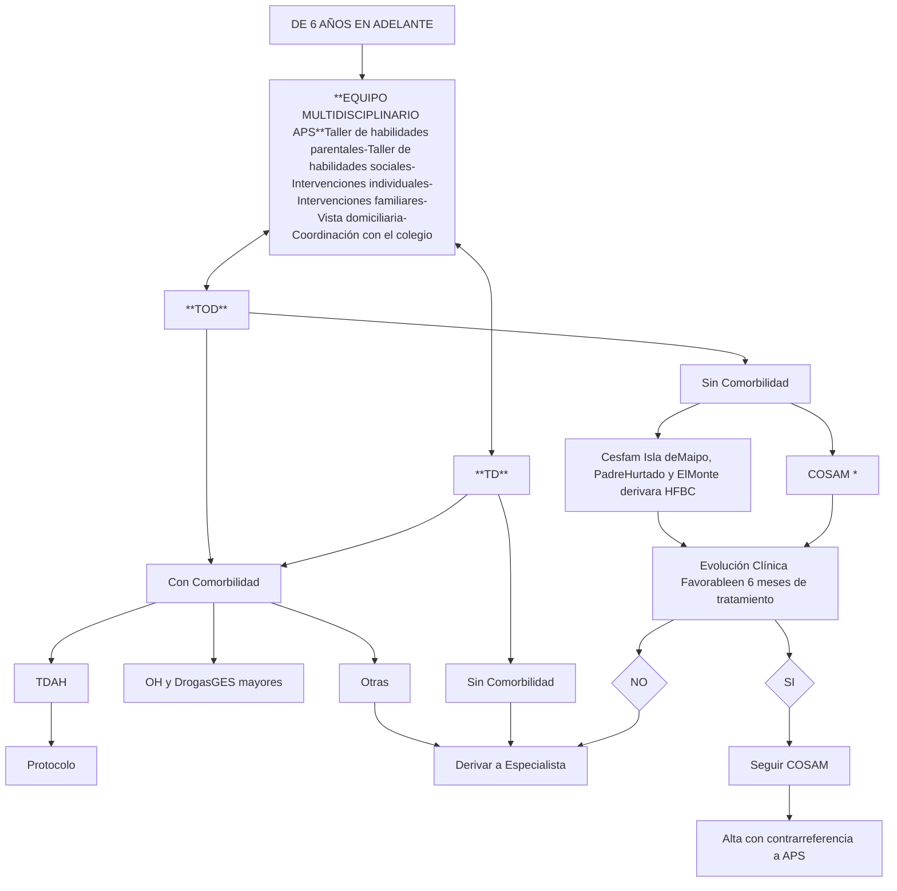

# PROT-TRASTORNO-DE-CONDUCTA-2017

--- Página 1 ---


# <u>Protocolo</u>
# <u>Resolutivo en red</u>
# <u>Trastorno de Conducta</u>

**Fecha de elaboración:** JUNIO 2017

**Fecha próxima revisión:** JUNIO 2019

--- Página 2 ---

<u>**AUTORES:**</u>


| Nombre                      | Cargo                                 | Establecimiento | Firma |
| --------------------------- | ------------------------------------- | --------------- | ----- |
| Dra. María C. Kattan V.     | Psiquiatra Infantil y del adolescente | HFBC            |       |
| Dra. Aracelis Calzadilla N. | Psiquiatra Infantil y del adolescente | HFBC            |       |
| Rommy Lindermann T.         | Asistente Social                      | HFBC            |       |
| Fernanda Rojas C.           | Psicóloga                             | HFBC            |       |


Se contó con la participación y supervisión de los integrantes de la Unidad de psiquiatría Infantil y del Adolescente del Hospital Félix Bulnes Cerda y miembros de los Equipos de Salud Mental de la Atención Primaria y de los COSAM.

<u>**COMISION REVISORA**</u>

**2.- Comisión revisora**

2.1, Lorena Arrue Jefa CAE HFBC

2.2- Comisión revisora: Equipo de trabajo COMGES 6 (por resolución)

**Se declara que no hay conflicto de interés en los profesionales que realizaron este protocolo.**

<u>**INTRODUCCION**</u>

Los primeros estudios psiquiátricos comunitarios fueron efectuados en adultos en los años 80. Al pedirles que recordaran sus primeros síntomas, los sujetos relataban edades de comienzo más tempranas de lo que se pensaba clínicamente. Cerca del 80% de los sujetos que sufría de T. depresivos, ansiosos o abuso de drogas, informó haber comenzado antes de los 20 años. Por otra parte, el riesgo para iniciar depresión mayor, manía, T obsesivo-compulsivo, fobias y T. de abuso de alcohol y drogas se observó en la niñez y adolescencia . Los estudios clínicos y epidemiológicos recientes muestran dos grupos de trastornos:

-Los que empiezan en la niñez (T Déficit atencional, autismo y otros T. penetrantes del desarrollo, angustia de separación, fobias específicas, T. oposicionista desafiante) y -un grupo diferente que

--- Página 3 ---

comienza en la adolescencia (fobia social, T. pánico, abuso de sustancias, depresión, anorexia nervosa, bulimia nervosa). La mayoría de los trastornos que comienzan en la niñez son más prevalentes en hombres que mujeres, mientras que los que comienzan en la adolescencia más en mujeres que hombres (

El proyecto Atlas, (O.M:S. 2005) registró los recursos de salud mental infanto juvenil en 66 países, y señaló que los trastornos psiquiátricos de comienzo en la niñez y adolescencia deberían ser un tema de interés para la salud pública (5).

La epidemiología psiquiátrica en niños y adolescentes cumple varios objetivos en salud pública: conocer la magnitud y la distribución de los trastornos psiquiátricos, calcular la carga de enfermedad, medir el uso de servicios y monitorear si aquellos niños que los necesitan los están recibiendo . Los estudios demuestran una alta prevalencia de trastornos psiquiátricos (1 de cada 5 niños; si se agrega criterio de discapacidad 1 de cada 10). Solo 16% de ellos recibía atención y muchos que eran atendidos no tenían trastornos psiquiátricos. Esta realidad contrasta con las evidencias que están disponibles de tratamientos efectivos para tratar a los niños y adolescentes.

Aún persiste la controversia acerca de si los síntomas de los trastornos mentales y sus agrupaciones en diagnósticos son universales a todas las culturas o son moldeados por estas. Se concluyó que este dilema debe resolverse mediante investigación empírica que establezca la validez diagnóstica en distintas culturas .

<page_number>3</page_number>

--- Página 4 ---

# MAPA DE RED

# 2 MAPA DE DERIVACIÓN DE CONSULTA DE ESPECIALIDAD DESDE APS Y HOSPITAL COMUNITARIO A HOSPITAL DE MAYOR COMPLEJIDAD. DICIEMBRE 2015


| ESPECIALIDAD      | Grupo Etario | HSOO: Hospital San Juan de Dios | HFBC: Hospital Félix Bulnes  | IT: Instituto Traumatológico | HOSM: Hospital Salvador Allende | CRS SAG: CRS San Alberto Hurtado  | HOSTAL: Hospital de Talagante     | HOSMEL: Hospital de Melipilla     | HOSPEÑA: Hospital de Peñaflor     | HOSTAL                          | HOSTAL                          | HOSTAL                         | HOSTAL                         | Filtro                          | Filtro                       |
| ----------------- | ------------ | ------------------------------- | ---------------------------- | ---------------------------- | ------------------------------- | --------------------------------- | --------------------------------- | --------------------------------- | --------------------------------- | ------------------------------- | ------------------------------- | ------------------------------ | ------------------------------ | ------------------------------- | ---------------------------- |
| Pediatría         | <15 años     | CRS SAG                         | CRS SAG                      | CRS SAG                      | HOSMEL                          | HOSMEL                            | HOSMEL                            | HOSMEL                            | HOSPEÑA                           | HOSPEÑA                         | HOSTAL                          | HOSTAL                         | CRS SAG                        | CRS SAG                         |                              |
|                   | >15 años     | HFBC                            | HFBC                         | HFBC                         | HSOO                            | HSOO                              | HSOO                              | HSOO                              | HSOO                              | HSOO                            | HSOO                            | HSOO                           | HSOO                           | HSOO                            |                              |
| Medicina Interna  | <15 años     | CRS SAG                         |                              |                              |                                 |                                   |                                   |                                   |                                   |                                 |                                 |                                |                                | CRS SAG                         |                              |
|                   | >15 años     | HFBC                            | HFBC                         | HFBC                         | HSOO                            | HSOO                              | HSOO                              | HSOO                              | HSOO                              | HSOO                            | HSOO                            | HSOO                           | HSOO                           | HSOO                            |                              |
| Ginecología       | <15 años     | HFBC                            | HFBC                         | HFBC                         | HFBC                            | Filtro Pediatría HOSMEL (con ECO) | Filtro Pediatría HOSMEL (con ECO) | Filtro Pediatría HOSMEL (con ECO) | Filtro Pediatría HOSMEL (con ECO) | Filtro Medicina HOSPEÑA         | Filtro Medicina HOSPEÑA         | Filtro Pediatría HOSTAL        | Filtro Pediatría HOSTAL        | Filtro Pediatría CRS SAG        | Filtro pediatría CRS         |
|                   | >15 años     | Filtro Medicina Interna HFBC    | Filtro Medicina Interna HFBC | HFBC                         | HFBC                            | Filtro Medicina Interna HOSMEL    | Filtro Medicina Interna HOSMEL    | Filtro Medicina Interna HOSMEL    | Filtro Medicina Interna HOSMEL    | Filtro Medicina Interna HOSPEÑA | Filtro Medicina Interna HOSPEÑA | Filtro Medicina Interna HOSTAL | Filtro Medicina Interna HOSTAL | Filtro Medicina Interna CRS SAG | Filtro Medicina Interna HSOO |
| Obstetricia       | <15 años     | HFBC                            | HFBC                         | HFBC                         | HFBC                            | Filtro Pediatría HOSMEL           | Filtro Pediatría HOSMEL           | Filtro Pediatría HOSMEL           | Filtro Pediatría HOSMEL           | Filtro Pediatría HOSPEÑA        | Filtro Pediatría HOSPEÑA        | Filtro Pediatría HOSTAL        | Filtro Pediatría HOSTAL        | Filtro Pediatría CRS SAG        | Filtro pediatría CRS         |
|                   | >15 años     | HFBC                            | HFBC                         | HFBC                         | HSOO                            | Filtro Medicina Interna HOSMEL    | Filtro Medicina Interna HOSMEL    | Filtro Medicina Interna HOSMEL    | Filtro Medicina Interna HOSMEL    | Filtro Medicina Interna HOSPEÑA | Filtro Medicina Interna HOSPEÑA | Filtro Medicina Interna HOSTAL | Filtro Medicina Interna HOSTAL | Filtro Medicina Interna CRS SAG | Filtro Medicina Interna HSOO |
| Traumatología     | <15 años     | HFBC                            | HFBC                         | HFBC                         | HSOO                            | Filtro Pediatría HOSMEL           | Filtro Pediatría HOSMEL           | Filtro Pediatría HOSMEL           | Filtro Pediatría HOSMEL           | Filtro Pediatría HOSPEÑA        | Filtro Pediatría HOSPEÑA        | Filtro Pediatría HOSTAL        | Filtro Pediatría HOSTAL        | Filtro Pediatría CRS SAG        | Filtro pediatría CRS         |
|                   | >15 años     | Filtro Medicina Interna HFBC    | HFBC                         | HFBC                         | HSOO                            | Filtro Medicina Interna HOSMEL    | Filtro Medicina Interna HOSMEL    | Filtro Medicina Interna HOSMEL    | Filtro Medicina Interna HOSMEL    | Filtro Medicina Interna HOSPEÑA | Filtro Medicina Interna HOSPEÑA | Filtro Medicina Interna HOSTAL | Filtro Medicina Interna HOSTAL | Filtro Medicina Interna CRS SAG | Filtro Medicina Interna HSOO |
| Gastroenterología | <15 años     | Filtro Pediatría CRS SAG        | HFBC                         | HFBC                         | HFBC                            | Filtro Pediatría HOSMEL           | Filtro Pediatría HOSMEL           | Filtro Pediatría HOSMEL           | Filtro Pediatría HOSMEL           | Filtro Pediatría HOSPEÑA        | Filtro Pediatría HOSPEÑA        | Filtro Pediatría HOSTAL        | Filtro Pediatría HOSTAL        | Filtro Pediatría CRS SAG        | Filtro pediatría CRS         |
|                   | >15 años     | Filtro Medicina Interna HFBC    | HFBC                         | HFBC                         | HSOO                            | Filtro Medicina Interna HOSMEL    | Filtro Medicina Interna HOSMEL    | Filtro Medicina Interna HOSMEL    | Filtro Medicina Interna HOSMEL    | Filtro Medicina Interna HOSPEÑA | Filtro Medicina Interna HOSPEÑA | Filtro Medicina Interna HOSTAL | Filtro Medicina Interna HOSTAL | Filtro Medicina Interna CRS SAG | Filtro Medicina Interna HSOO |
| Urología          | <15 años     | Filtro Pediatría CRS SAG        | Filtro Pediatría CRS SAG     | Filtro Pediatría CRS SAG     | Filtro Pediatría HOSMEL         | Filtro Pediatría HOSMEL           | Filtro Pediatría HOSMEL           | Filtro Pediatría HOSMEL           | Filtro Pediatría HOSPEÑA          | Filtro Pediatría HOSPEÑA        | Filtro Pediatría HOSTAL         | Filtro Pediatría HOSTAL        | Filtro Pediatría CRS SAG       | Filtro pediatría CRS            |                              |
|                   | >15 años     | Filtro Medicina Interna HFBC    | Filtro Medicina Interna HFBC | HFBC                         | HSOO                            | Filtro Medicina Interna HOSMEL    | Filtro Medicina Interna HOSMEL    | Filtro Medicina Interna HOSMEL    | Filtro Medicina Interna HOSMEL    | Filtro Medicina Interna HOSPEÑA | Filtro Medicina Interna HOSPEÑA | Filtro Medicina Interna HOSTAL | Filtro Medicina Interna HOSTAL | Filtro Medicina Interna CRS SAG | Filtro Medicina Interna HSOO |
| ESPECIALIDAD      | Grupo Etario |                                 |                              |                              |                                 |                                   |                                   |                                   |                                   |                                 |                                 |                                |                                |                                 |                              |
| Oftalmología      | <15 años     | Filtro Pediatría CRS SAG        | Filtro Pediatría CRS SAG     | Filtro Pediatría CRS SAG     | Filtro Pediatría HOSMEL         | Filtro Pediatría HOSMEL           | Filtro Pediatría HOSMEL           | Filtro Pediatría HOSMEL           | Filtro Pediatría HOSPEÑA          | Filtro Pediatría HOSPEÑA        | Filtro Pediatría HOSTAL         | Filtro Pediatría HOSTAL        | Filtro Pediatría CRS SAG       | Filtro pediatría CRS            |                              |
|                   | >15 años     | Filtro Medicina Interna HFBC    | Filtro Medicina Interna HFBC | HFBC                         | HSOO                            | Filtro Medicina Interna HOSMEL    | Filtro Medicina Interna HOSMEL    | Filtro Medicina Interna HOSMEL    | Filtro Medicina Interna HOSMEL    | Filtro Medicina Interna HOSPEÑA | Filtro Medicina Interna HOSPEÑA | Filtro Medicina Interna HOSTAL | Filtro Medicina Interna HOSTAL | Filtro Medicina Interna CRS SAG | Filtro Medicina Interna HSOO |


\* IS CRS SAG

\* Interna CRS SAG

\* Interna OIS SAG

--- Página 5 ---

| Especialidad                  | Edad           | HRC                         | HRC                                                                    | HRC                                                                    | HSJD                         | HSJD                                                                   | HSJD                                                                   | HOSMIL                         | HOSPENA                                                                | HOSMA                                                                  | CRS SAG                         |
| ----------------------------- | -------------- | --------------------------- | ---------------------------------------------------------------------- | ---------------------------------------------------------------------- | ---------------------------- | ---------------------------------------------------------------------- | ---------------------------------------------------------------------- | ------------------------------ | ---------------------------------------------------------------------- | ---------------------------------------------------------------------- | ------------------------------- |
| Dermatología                  | Sin distinción | HRC                         | HRC                                                                    | HRC                                                                    | HSJD                         | Teledermatología a HOSPENA                                             | Teledermatología a HOSPENA                                             | Teledermatología a HOSPENA     | Teledermatología a HOSPENA                                             | Teledermatología a HOSPENA                                             | CRS SAG                         |
|                               | < 15 años      | HRC                         | HRC                                                                    | HRC                                                                    | HSJD                         | HSJD                                                                   | HSJD                                                                   | HOSMIL                         | HOSPENA                                                                | HOSMA                                                                  | HSJD                            |
| Inf. Transmisión Sexual       |                | HRC                         | HRC                                                                    | HRC                                                                    | HSJD                         | HSJD                                                                   | HSJD                                                                   | HOSMIL                         | HOSPENA                                                                | HOSMA                                                                  | HSJD                            |
| Geriatría                     |                | Filtro Medicina Interna HRC | Filtro Medicina Interna HRC                                            | Filtro Medicina Interna HRC                                            | Filtro Medicina Interna HSJD | Filtro Medicina Interna HOSPENA                                        | Filtro Medicina Interna HOSPENA                                        | Filtro Medicina Interna HOSMIL | Filtro Medicina Interna HOSPENA                                        | Filtro Medicina Interna HOSMA                                          | Filtro Medicina Interna CRS SAG |
|                               | HRC            | HRC                         | HRC                                                                    | HSJD                                                                   | HSJD                         | HSJD                                                                   | HOSMIL                                                                 | HOSPENA                        | HOSMA                                                                  | HSJD                                                                   |                                 |
| Med. Paliat. y Desvinculación |                |                             |                                                                        |                                                                        |                              |                                                                        |                                                                        |                                |                                                                        |                                                                        |                                 |
| Neurología                    | < 15 años      | HRC                         | HRC                                                                    | HRC                                                                    | HSJD                         | HSJD                                                                   | HSJD                                                                   | HOSMIL                         | HOSMA                                                                  | HOSMA                                                                  | HSJD                            |
|                               | > 15 años      | HRC                         | HRC                                                                    | HRC                                                                    | HSJD                         | HSJD                                                                   | HSJD                                                                   | HOSMIL                         | HOSMA                                                                  | HOSMA                                                                  | CRS SAG                         |
| Oncología                     |                |                             |                                                                        |                                                                        |                              |                                                                        |                                                                        |                                |                                                                        |                                                                        |                                 |
| Psiquiatría                   |                | HRC                         | Derivación a COSAM de patologías definidas para resolución a ese nivel | Derivación a COSAM de patologías definidas para resolución a ese nivel | HRC                          | Derivación a COSAM de patologías definidas para resolución a ese nivel | Derivación a COSAM de patologías definidas para resolución a ese nivel | HRC                            | Derivación a COSAM de patologías definidas para resolución a ese nivel | Derivación a COSAM de patologías definidas para resolución a ese nivel | CRS SAG                         |


--- Página 6 ---

# 1. <u>OBJETIVO DEL PROTOCOLO</u>

Entregar indicaciones consensuadas a los equipos de salud de la red del SSMOccidente, con el objeto de lograr que los niños, niñas y adolescentes menores de 18 años usuarios de la red, con trastorno de conducta, tengan un diagnóstico y manejo estandarizado, de acuerdo a su nivel de complejidad.

## 2. <u>ÁMBITO DE APLICACIÓN</u>

Está dirigido a todos los equipos de Salud que conforman la red del SSM Occidente que se encuentre ejerciendo trato directo con niños, niñas y adolescentes menores de 18 años usuarios de la red.

### 2.1 <u>RESPONSABLES DE LA EJECUCIÓN</u>

- Médicos Generales de APS
- Médicos de Familia de APS
- Enfermeras de APS
- Equipos psicosociales de la APS: Psicólogos, Asistente sociales de APS
- Equipos Programa Chile Crece Contigo de la APS
- Equipos del Programa del Adolescente de la APS
- Equipos de los COSAM de la red de salud SSMOccidente.
- Médicos Psiquiatras del Hospital Félix Bulnes Cerda.

## 3. <u>POBLACIÓN OBJETIVO</u>

Niños, niñas y adolescentes menores de 18 años usuarios de la red de salud del SSM Occidente. Según mapa de atención incluye las comunas:


| Provincia | Comuna        |
| --------- | ------------- |
| Santiago  | Quinta Normal |
|           | Renca         |
| Melipilla | Alhué         |
|           | Curacaví      |
|           | María Pinto   |
|           | Melipilla     |
|           | San Pedro     |
| Talagante | Isla de Maipo |
|           | El Monte      |
|           | Padre Hurtado |
|           | Peñaflor      |
|           | Talagante     |


--- Página 7 ---

# 4. <u>DEFINICIONES</u>

**TRASTORNO DE CONDUCTA:** Patrón recurrente de conducta negativista, desafiante, desobediente y hostil dirigido a figuras de autoridad y comportamientos que violan los derechos de los demás; de al menos 6 meses de duración.

**PREVALENCIA:** Varia del 1 al 11 %, con una prevalencia media estimada de cerca del 3,3% y es más frecuente en hombres.

**PRONÓSTICO:** Los niños, niñas y adolescentes con este trastorno presentan un mayor riesgo de problemas de adaptación en su vida adulta, como conducta antisocial, problemas de control de los impulsos, abuso de sustancias, ansiedad y depresión.

A continuación se presentan los dos sistemas de clasificación usados en Salud Mental a nivel mundial: CIE 10 de la Organización Mundial de la Salud (OMS) y DSM V de la Asociación Americana de Psiquiatría (APA).

**<u>SEGÚN LA CIE 10 (OMS)</u>:** Están clasificados en el **capítulo Trastornos emocionales y del comportamiento que aparecen habitualmente en la niñez o en la adolescencia** e incluyen:
**F91 Trastornos disociales**

- F91.0 Trastorno disocial limitado al contexto familiar.
- F91.1 Trastorno disocial en niños no socializados.
- F91.2 Trastorno disocial en niños socializados.
- F91.3 Trastorno disocial desafiante y oposicionista.
- F91.8 Otros trastornos disociales.
- F91.9 Trastorno disocial sin especificación.

--- Página 8 ---

**Sus criterios diagnósticos son:**

**G1.** Patrón de conducta repetitivo y persistente que conlleva la violación de los derechos básicos de los demás o de las normas sociales básicas apropiadas a la edad del paciente. La duración debe ser de al menos 6 meses, durante los cuales algunos de los siguientes síntomas están presentes:

l. Rabietas excepcionalmente frecuentes y graves para la edad y el desarrollo del niño.

2. Frecuentes discusiones con los adultos.

3. Desafíos graves y frecuentes a los requerimientos y órdenes de los adultos.

4. A menudo hace cosas para molestar a otras personas de forma aparentemente deliberada.

5. Con frecuencia culpa a otros de sus faltas o de su mala conducta.

6. Es quisquilloso y se molesta fácilmente con los demás.

7. A menudo está enfadado o resentido.

8. A menudo es rencoroso y vengativo.

9. Miente con frecuencia y rompe promesas para obtener beneficios y favores o para eludir sus obligaciones.

10. Inicia con frecuencia peleas físicas (sin incluir peleas con sus hermanos).

**11.** Ha usado alguna vez un arma que puede causar serios daños físicos a otros (bates, ladrillos, botellas rotas, cuchillos, arma de fuego).

**12.** A menudo permanece fuera de casa por la noche a pesar de la prohibición paterna (desde antes de los trece años de edad).

**13.** Crueldad física con otras personas (ata, corta o quema a sus víctimas).

**14.** Crueldad física con los animales.

**15.** Destrucción deliberada de la propiedad ajena (diferente a la provocación de incendios).

**16.** Incendios deliberados con la intención de provocar serios daños.

**17.** Robos de objetos de un valor significativo sin enfrentarse a la víctima, bien en el hogar o fuera de él (en tiendas, casas ajenas, falsificaciones).

18. Ausencias reiteradas al colegio, que comienzan antes de los trece años;

19. Abandono del hogar al menos en dos ocasiones o en una ocasión durante más de una noche (a no ser que esté encaminado a evitar abusos físicos o sexuales).

**20.** Cualquier episodio de delito violento o que implique enfrentamiento con la víctima (tirones", atracos, extorsión).

**21.** Forzar a otra persona a tener relaciones sexuales.

--- Página 9 ---

22. Intimidaciones frecuentes a otras personas (infligir dolor o daño deliberados, incluyendo intimidación persistente, abusos deshonestos o torturas).

23. Allanamiento de morada o del vehículo de otros.

Nota: los síntomas 11, 13, 15, 16, 20, 21, y 23 necesitan que se produzcan sólo una vez para que se cumpla el criterio.

**G2.** El trastorno no cumple criterios para trastorno disocial de personalidad, esquizofrenia, episodio maníaco, episodio depresivo, trastorno generalizado del desarrollo o trastorno hipercinético.

Se recomienda especificar la edad de comienzo:

- De inicio en la infancia: Al menos un síntoma disocial comienza antes de los 10 años.

- De inicio en la adolescencia: No se presentan síntomas disociales antes de los 10 años.

**SEGÚN EL DSM V DE LA APA** están clasificados dentro del capítulo de los **Trastornos disruptivos, del control de los impulsos y de la conducta.**

- 313.81 (F91.3) Trastorno negativista desafiante

Especificar la gravedad actual: Leve, Moderado, Grave

- 312.81 (F91) Trastorno de la conducta

- Especificar si:

- 312.81 (F91.1) Tipo de inicio infantil

- 312.82 (F91.2) Tipo de inicio adolescente

- 312.89 (F91.9) Tipo de inicio no especificado

- Especificar si: Con emociones prosociales limitadas

- Especificar la gravedad actual: Leve, Moderado, Grave

TRASTORNO NEGATIVISTA DESAFIANTE

Criterios diagnósticos:

A. Un patrón de enfado/irritabilidad, discusiones/actitud desafiante o vengativa que dura por lo menos 6 meses, que se manifiesta por lo menos con 4 síntomas de cualquiera de las categorías siguientes y que se exhibe durante la interacción por lo menos con un individuo que no sea un hermano.

Enfado/irritabilidad

1. A menudo pierde la calma.

2. A menudo esta susceptible o se molesta con facilidad.

--- Página 10 ---

3. A menudo está enfadado y resentido.

**Discusiones/actitud desafiante**

4. Discute a menudo con la autoridad o con los adultos, en el caso de los niños y los adolescentes.
5. A menudo desafía activamente o rechaza satisfacer la petición por parte de figuras de autoridad o normas.
6. A menudo molesta a los demás deliberadamente.
7. A menudo culpa a los demás por sus errores o su mal comportamiento.

**Vengativo**

8. Ha sido rencoroso o vengativo por lo menos dos veces en los últimos seis meses.

**Nota:** Se debe considerar la persistencia y la frecuencia de estos comportamientos para distinguir los que se consideren dentro de los límites normales, de los sintomáticos. En los menores de 5 años el comportamiento debe aparecer casi todos los días durante un periodo de 6 meses por lo menos. Criterio A8). En los de 5 años o más, el comportamiento debe aparecer por lo menos una vez por semana durante al menos 6 meses. Si bien estos criterios de frecuencia se consideran el grado mínimo orientativo para definir los síntomas, también se deben tener en cuenta otros factores, por ejemplo, si la frecuencia y la intensidad de los comportamientos rebasan los límites de lo normal para el grado de desarrollo del individuo, su sexo y su cultura.

**B.** Este trastorno del comportamiento va asociado a un malestar en el individuo o en otras personas de su entorno social inmediato (es decir, familia, grupo de amigos, compañeros de trabajo), o tiene un impacto negativo en las áreas social, educativa, profesional u otras importantes.

**C.** Los comportamientos no aparecen exclusivamente en el transcurso de un trastorno psicótico, un trastorno por consumo de sustancias, un trastorno depresivo o uno bipolar. Además, no se cumplen los criterios de un trastorno de desregulación disruptiva del estado de ánimo.

**Especificar la gravedad actual:**

**Leve:** Los síntomas se limitan a un entorno (en casa, en la escuela, en el trabajo, con los compañeros).

**Moderado:** Algunos síntomas aparecen en dos entornos por lo menos.

**Grave:** Algunos síntomas aparecen en tres o más entornos.

--- Página 11 ---

# TRASTORNO DE CONDUCTA

## Criterios diagnósticos:

**A.** Un patrón repetitivo y persistente de comportamiento en el que no se respetan los derechos básicos de otros, las normas o reglas sociales propias de la edad, lo que se manifiesta por la presencia en los 12 últimos meses de por lo menos 3 de los 15 criterios siguientes en cualquier de las categorías siguientes, existiendo por lo menos uno en los últimos 6 meses:

### Agresión a personas y animales

1. A menudo acosa, amenaza o intimada a otros.

2. A menudo inicia peleas.

3. Ha usado un arma que puede provocar serios daños a terceros (un bastón, un ladrillo, una botella rota, un cuchillo, un arma).

4. Ha ejercido la crueldad física contra personas.

5. Ha ejercido la crueldad física contra animales.

6. Ha robado enfrentándose a una víctima (atraco, robo de un monedero, extorsión, atraco a mano armada).

7. Ha violado sexualmente a alguien

### Destrucción de la propiedad

8. Ha prendido fuego deliberadamente con la intención de provocar danos graves.

9. Ha destruido deliberadamente la propiedad de alguien (pero no por medio de fuego).

### Engaño o robo

10. Ha invadido la casa, edificio o automóvil de alguien.

11. A menudo miente para obtener objetos o favores, o para evitar obligaciones (engaña a otras personas).

12. Ha robado objetos de cierto valor sin enfrentarse a la víctima (hurto en una tienda si violencia ni invasión, falsificación).

### Incumplimiento grave de las normas

13. A menudo sale por la noche a pesar de la prohibición de sus padres, empezando antes de los 13 años.

14. Ha pasado una noche fuera de casa sin permiso mientras vivía con sus padres o en un hogar de acogida, por lo menos dos veces o una vez si estuvo ausente durante un tiempo prolongado.

--- Página 12 ---

15. A menudo falta en la escuela, empezando antes de los 13 años.

**B.** El trastorno del comportamiento provoca un malestar clínicamente significativo en las áreas de funcionamiento social, académico o laboral.

**C.** Si la edad del individuo es de 18 años o más, no se cumplen los criterios de trastorno de la personalidad antisocial.

Especificar si:

**312.81 (F91.1) Tipo de: inicio infantil:** muestran por lo menos un síntoma característico del trastorno de conducta antes de cumplir los 10 años.

**312.82 (F91.2) Tipo de inicio adolescente:** no muestran ningún síntoma característico del trastorno de conducta antes de cumplir los 10 años.

**312.89 (F91.9) Tipo de inicio no especificado:** Se cumplen los criterios del trastorno de conducta, pero no existe suficiente información disponible para determinar si la aparición del primer síntoma fue anterior a los 10 años de edad.

**Especificar si tiene estas emociones prosociales limitadas:** Ha de haber presentado por lo menos 2 de las siguientes características de forma persistente durante 12 meses por lo menos, en diversas relaciones y situaciones. Estas reflejan el patrón típico de relaciones interpersonales y emocionales del individuo durante ese periodo, no solamente episodios ocasionales en algunas situaciones:

- **Falta de remordimientos o culpabilidad:** No se siente mal ni culpable cuando hace algo malo (no cuentan los remordimientos que expresa solamente cuando le sorprenden o ante un castigo). Muestra una falta general de preocupación sobre las consecuencias negativas de sus acciones. Por ejemplo, no siente remordimientos después de hacer daño a alguien ni se preocupa por las consecuencias de transgredir las reglas.
- **Insensible, carente, de empatía:** No tiene en cuenta ni le preocupan los sentimientos de los demás. Se describe como frío e indiferente. Parece más preocupada por los efectos de sus actos sobre sí mismo que sobre los demás, incluso cuando provocan danos apreciables a terceros.
- **Despreocupado por su rendimiento:** No muestra preocupación respecto a un rendimiento deficitario o problemático en la escuela, en el trabajo o en otras actividades importantes. No realiza el esfuerzo necesario para alcanzar un buen rendimiento, incluso cuando las expectativas son claras, y suele culpar a los demás de su rendimiento deficitario.

--- Página 13 ---

- **Afecto superficial o deficiente:** No expresa sentimientos ni muestra emociones con los demás, salvo de una forma que parece poco sentida, poco sincera o superficial (con acciones que contradicen la emoción expresada, o puede “conectar” o “desconectar” las' emociones rápidamente) o cuando recurre a expresiones emocionales para obtener beneficios (expresa emociones para manipular o intimidar a otros).

**Especificar la gravedad actual:**

**Leve:** Existen pocos o ningún problema de conducta aparte de los necesarios para establecer el diagnóstico, y los problemas de conducta provocan un daño relativamente menor a los demás (mentiras, absentismo escolar, regresar tarde por la noche sin permiso, incumplir alguna otra regla).

**Moderado:** El número de problemas de conducta y el efecto sobre los demás son de gravedad intermedia entre los que se especifican en “leve” y en “grave" (robo sin enfrentamiento con la víctima, vandalismo).

**Grave:** Existen muchos problemas de conducta además de los necesarios para establecer el diagnóstico, o dichos problemas provocan un daño considerable a los demás (violación sexual, crueldad física, uso de armas, robo con enfrentamiento con la víctima, atraco e invasión)

## 5.1 EVALUACIÓN DEL PACIENTE:

La Atención Primaria es una de las puertas de entrada a la red de salud, recibiendo niños, niñas y adolescentes derivados desde la escuela o traídos por sus padres que consultan con respecto a las problemáticas abordadas en la definición.

**A. Una anamnesis completa y detallada** a los padres y/o cuidador constituye uno de los pilares del diagnóstico. Es fundamental que se tengan en cuenta la frecuencia, persistencia, intensidad, grado de generalización de las situaciones, el deterioro asociado a los comportamientos, según lo que sea normativo para cada niño, niña y adolescente según su edad, su nivel de desarrollo mental, género y la cultura.

Durante la evaluación el profesional en APS debe **explorar los distintos ámbitos donde funciona el niño, niña y adolescente** y al menos contemplar los siguientes aspectos:

**Explorar la dinámica familiar en relación a los problemas de conducta:**

- ¿Cuál es la actitud de los padres/cuidadores?

--- Página 14 ---

- Intentos de solución
- Explorar si existe alianza parental
- ¿Cuáles son los mecanismos de puesta de límites?
- ¿Existe el mismo problema con otros hijos?
- Valores y creencias asociados a estilo de crianza
- ¿Existe algún motivo particular para que sea especialmente difícil poner límites a este/a hijo/a?

**Explorar presencia de Factores ambientales/familiares:**

- Maltrato infantil, VIF, consumo de sustancias y alcohol en familiares, psicopatología en algún miembro de la familia bullyng.
- Factores estresores gatillantes de impacto actual (duelos, separaciones, cambios de casa, de colegio, de comuna, nacimiento de hermanos, patologías graves en algunos de los padres o familiar cercano, desempleo, catástrofe natural).

**B. Examen físico:**

- Observación de la conducta espontánea en la consulta y entrevista al niño, niña o adolescente.
- Examen físico general, descartando patología orgánica.
- Examen neurológico breve: dificultades de coordinación fina, sincinesias no esperadas para la edad, lateralidad mal definida u otros signos neurológicos.

**C. Diagnóstico Diferencial:**

- Trastorno por déficit atencional con hiperactividad
- Consumo de Drogas
- Trastorno del Ánimo
- Trastorno psicótico
- Otros trastornos psiquiátricos (autismo, alimentarios, adaptativos)
- Condiciones médicas (hipertiroidismo, epilepsia, psicosis, conducta suicida, depresión, trastorno ansioso, uso de fármacos u otro).

**4.2 MANEJO EN APS:** Luego de la acogida y evaluación integral, si se continúa con sospecha de Trastorno de la conducta el profesional procederá a realizar a las siguientes intervenciones de acuerdo a la etapa de desarrollo:

--- Página 15 ---

**1. En menores de 5 años**

- Evaluar desarrollo psicomotor: Tepsi, pauta autismo; pauta de vínculo de Massiel y Cambell.
- Evaluar e intervenir por Programa Chile Crece Contigo.
- Si la evolución es favorable dar alta
- Si no es favorable No dar alta y mantener atenciones en Programa Chile Crece Contigo
    - Derivación asistida a Psiquiatría Infantil con:
    - -Resumen de las evaluaciones y evolución del caso.
    - -Informes del jardín Infantil, colegio o escuela de lenguaje.

**2. De 6 años en adelante**

-Taller de habilidades parentales
- Taller de habilidades sociales
- Intervenciones individuales
-Intervenciones familiares
- Visita domiciliaria
- Coordinación con el colegio
-Si se pesquisa OH y Drogas en mayores de 11 años debe derivarse de inmediato a intervenciones GES en su propio Cesfam o al Cosam respectivo ya que el Hospital no es prestador GES para esa patología.

En el caso de que el paciente no presente una respuesta favorable a las intervenciones, o en el caso de que la derivación sea debido a que ya presenta un Trastorno de Conducta Disocial, el equipo de Atención Primaria debe realizar continuar realizando prestaciones de Salud Mental que incluyen mantener atenciones en Programa Chile Crece Contigo, asistente Social verificar adherencia y continuar psicoeducación, mantener el programa del adolescente: o sea **No dar alta de APS.**

**5.3 CRITERIOS DE DERIVACIÓN A NIVEL DE ESPECIALIDAD:**

- Sospecha de Trastorno de la Conducta Disocial
- Sospecha diagnóstica con comorbilidad
- No presenta respuesta favorable a intervenciones
- Necesidad de tratamiento farmacológico

**5.4 REFERENCIA:**

--- Página 16 ---

| Nombre                             | Cobertura                                                                                                                                                                                                         | Atención Psiquiatría infantil                                                                                                                                                                 |
| ---------------------------------- | ----------------------------------------------------------------------------------------------------------------------------------------------------------------------------------------------------------------- | --------------------------------------------------------------------------------------------------------------------------------------------------------------------------------------------- |
| COSAM<br/>MELIPILLA<br/>22-8321380 | Alhué<br/>Curacaví<br/>María Pinto<br/>San Pedro<br/>Melipilla                                                                                                                                                    | Cuentan con recurso de Psiquiatría<br/>infantil en cualquier de las comunas<br/>señaladas.                                                                                                    |
| COSAM<br/>TALAGANTE<br/>22-8743001 | Atiende solo comuna Talagante, es<br/>decir, personas inscritas en algún<br/>centro de salud de la comuna. La<br/>única excepción es en el programa de<br/>OH y Drogas que incluyen Isla de<br/>Maipo y El Monte. | Es posible la atención de niños, niñas y<br/>adolescentes solo con cobertura en el<br/>programa de hiperactividad. Otras<br/>patologías no se tienden ahí y son<br/>derivados a Félix Bulnes. |
| COSAM<br/>PEÑAFLOR<br/>22-8143005  | Solo Peñaflor si no es GES.<br/>Si es GES abarca todas las comunas<br/>rurales                                                                                                                                    | Cuentan con Psiquiatra infantil                                                                                                                                                               |


Comunas de ISLA DE MAIPO, PADRE HURTADO Y EL MONTE, solo pueden recibir atención en CESFAM y ser derivados a instancia de HOSPITAL FELIX BULNES.

**ISLA DE MAIPO: CESFAM**

*   CESFAM ISLA DE MAIPO
*   CONSULTORIO LA ISLA

**PADRE HURTADO: CESFAM**
*   CESFAM JUAN PABLO II
*   CESFAM JUAN PABLO II, Villa Chiloé

**EL MONTE: CONSULTORIO**
*   Consultorio El Monte

## 5.5 CONTRARREFERENCIA:

Una vez atendido el paciente, confirmado el diagnóstico, iniciado su tratamiento y encontrándose bajo control, el equipo especializado de salud mental realizará contrarreferencia del paciente estable.

Se harán indicaciones por escrito para seguimiento psicosocial en su centro de atención primaria y mantener solo controles con especialista para la supervisión farmacológica (según recomendaciones de la OMS los medicamentos para estos trastornos y su comorbilidad no deben ser recetados por personal sanitario no especializado, Solidez de la recomendación: FIRME.)

## TIEMPO DE PERMANENCIA EN LA ATENCION SECUNDARIA:

El tiempo de permanencia en la atención secundaria será el necesario para lograr diagnóstico, tratamiento y estabilización del paciente, con un máximo de dos años

--- Página 17 ---

**5.6 SEGUIMIENTO:**

El equipo de APS deberá realizar controles de salud habituales integrales.

## METODOLOGIA DE EVALUACIÓN

**14.- Metodología de evaluación**

Será responsable de la evaluación del Dpto. de Calidad y Seguridad del Paciente.

**La evaluación para el año 2017 será:**

-Auditoría de presencia de protocolos en la red

-Auditoría de ficha clínica a través de pauta de cotejo en la red

-Periodicidad

1 vez al año en 2017

1 vez al año en 2018

## PLAN DE DIFUSION

**Servicio de Salud:**

-Resolución de Dirección del Servicio con protocolos, a toda la red Occidente.

-Subir protocolo a página web de servicio

**Subdirección Médica Atención Ambulatoria:**

Dra. Francisca Reyes y Dra. Arrué: Supervisión de presencia de protocolos en atención secundaria.

**Subdirección APS:**

Dr. Luis Vélez: Supervisión de presencia de protocolos en atención primaria

--- Página 18 ---

# ANEXO1 FLUJOGRAMA PACIENTE CON TRASTORNO DE CONDUCTA

```mermaid
graph TD
    A[En APS Consulta por probable Trastorno de la Conducta] --> B[Acogida y Evaluación Integral Equipo de Salud MentalCriterios CIE 10]
    B --> C[Evaluar/Descartar:1. Condiciones médicas \(hipertiroidismo, epilepsia, psicosis, conducta suicida, depresión, trastorno ansioso, uso de fármacos u otro\).2. Factores ambientales/familiares:a- Maltrato infantil, VIF, consumo de sustancias y alcohol en familiares, bullying.b- Factores estresores gatillantes de impacto actual \(duelos, separaciones, cambios de casa, de colegio, de comuna, nacimiento de hermanos, patologías graves en algunos de los padres o familiar cercano, desempleo, catástrofe natural\).]
    
    C --> D[NO CONTINÚA CON SOSPECHAS DE TCSI HAY OTRAS PATOLOGÍAS]
    C --> E[SI CONTINÚA CON SOSPECHAS DE TC]
    
    D --> F[Seguir protocolos, guías y derivaciones ala red de atención según corresponda.]
    
    E --> G[Síntomas persisten más de 6 meses, intensidad y/ofrecuencia inapropiados y excesivo para el nivel de desarrolloevolutivo, no son sólo en respuesta de factores gatillantes.]
    
    G --> H[Evaluar de acuerdo a la etapa de desarrollo]
    
    H --> I[Menor de 5 años]
    H --> J[De 6 años en adelante]
    
    I --> K[A. Evaluar desarrollo psicomotor: Tepsi, pauta autismo;pauta de vínculo Massie y Campbell.B. Evaluar e intervenir por Programa Chile Crece Contigo.]
    
    J --> L[VER EN OTRA HOJA]
    
    K --> M{Evolución Clínica Favorable en 6 meses de tratamiento}
    
    M -- SI --> N[Seguir en APS]
    M -- NO --> O[No dar alta de APS: mantener atenciones en Programa Chile Crece Contigo,asistente Social verificar adherencia y continuar psicoeducación.Derivación asistida a Psiquiatría Infantil con:-Resumen de las evaluaciones y evolución del caso.]
```

--- Página 19 ---



\* Evolución Clínica Favorable en 6 meses de tratamiento

--- Página 20 ---

# <u>BIBLIOGRAFIA</u>

- Orientaciones técnicas: Atención de adolescentes con problemas de salud mental, 2009, Minsal, Chile.
- CIE 10 CIE 10 de la Organización Mundial de la Salud (OMS).
- DSM V de la Asociación Americana de Psiquiatría (APA).
- <u>http://www.who.int/mental_health/mhgap/evidence/child/q8/es/#.WSWn4xdOp44.email</u>
- Guía de Práctica Clínica de Detección y Diagnóstico Oportuno de los Trastornos del Espectro Autista (TEA) Santiago: MINSAL, 2011
- Escala Massie-Campbell de observación de indicadores de apego madre-bebé en situaciones de stress (o escala de apego durante stress (ADS)

