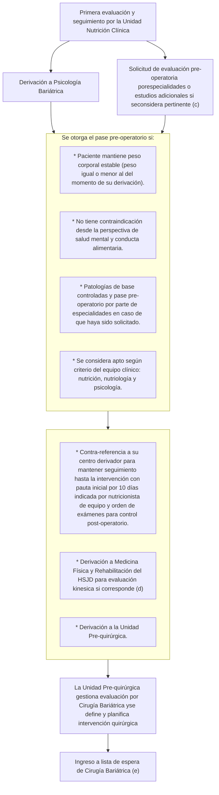
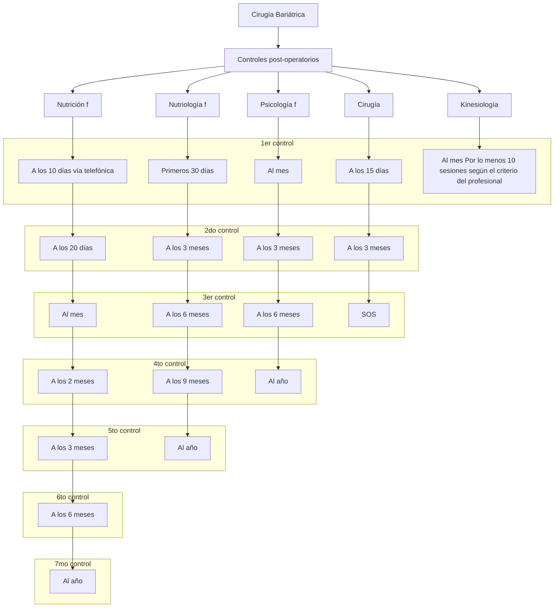

# PROTOCOLO-PACIENTE-CON-OBESIDAD-CANDIDATO-A-CIRUGIA-BARIATRICA-V.1-2024-1

--- Página 1 ---

|                                                                            | SERVICIO DE SALUD METROPOLITANO OCCIDENTE<br/>HOSPITAL SAN JUAN DE DIOS-CDT<br/>\*\*Atención Multidisciplinaria del Paciente con Obesidad, Candidato a Cirugía Bariatrica\*\* | Código: DOC – CIR 23     |
| ---------------------------------------------------------------------------------------------------------------------------------- | ----------------------------------------------------------------------------------------------------------------------------------------------------------------------------- | ------------------------ |
| Hospital San Juan de Dios - CDT<br/>Asistencial Docente<br/>"El Primero de Chile"<br/><br/>Servicio Cirugía<br/>Servicio Nutrición |                                                                                                                                                                               | Edición: 1               |
|                                                                                                                                    |                                                                                                                                                                               | Elaboración: Junio 2024  |
|                                                                                                                                    |                                                                                                                                                                               | Página 1 de 10           |
|                                                                                                                                    |                                                                                                                                                                               | Vigencia: Noviembre 2029 |

| Aprobado<br/>Noviembre 2024                                                                                    | Revisado<br/>Octubre 2024                                                                                                                                                                                                                                                                                                                                                                                  | Elaborado<br/>Junio 2024                                                                                                                                                                                                                                                                                             |
| -------------------------------------------------------------------------------------------------------------- | ---------------------------------------------------------------------------------------------------------------------------------------------------------------------------------------------------------------------------------------------------------------------------------------------------------------------------------------------------------------------------------------------------------- | -------------------------------------------------------------------------------------------------------------------------------------------------------------------------------------------------------------------------------------------------------------------------------------------------------------------- |
| \[signature: Dra. Midori Sawada T.]<br/>Dra. Midori Sawada T.<br/>Director Hospital<br/>San Juan de Dios - CDT | \[signature: Dr. José Antonio Salinas T.]<br/>Dr. José Antonio Salinas T.<br/>Subdirector Médico<br/><br/>\[signature: Lya Reyes C.]<br/>Lya Reyes C.<br/>Jefa CR Ambulatorio<br/><br/>\[signature: Dr. Juan Stambuk M.]<br/>Dr. Juan Stambuk M.<br/>Jefe Servicio Cirugía<br/><br/>\[signature: Miriam González B.]<br/>EU: Miriam González B.<br/>Unidad Calidad, Seguridad del Paciente y Control IAAS. | \[signature: Dr. Gustavo Czwiklitzer S.]<br/>Dr. Gustavo Czwiklitzer S.<br/>Jefe Equipo Cirugía Bariatrica.<br/><br/>\[signature: Dra. Mª Fabiola Moreno L.]<br/>Dra. Mª. Fabiola Moreno L.<br/>Nutriología Adulto<br/><br/>\[signature: Dra. Javiera Camacho C.]<br/>Dra. Javiera Camacho C.<br/>Nutriología Adulto |


# 1. Objetivo:

## 1.1 Objetivo general:

* Estandarizar los criterios de derivación de los pacientes con obesidad desde los establecimientos de salud de del Servicio de Salud Metropolitano Occidente (SSMOC) al Programa de Obesidad del Hospital San Juan de Dios (HSJD) y a su vez, establecer criterios de contra-referencia hacia los mismos.

## 1.2 Objetivo especifico:

* Optimizar la preparación del paciente en los establecimientos de menor complejidad del SSMOC previo a la evaluación en nivel terciario.
* Definir criterios de inclusión al programa de atención multidisciplinaria en HSJD.
* Establecer flujograma de derivación al Programa de Obesidad HSJD desde establecimientos de menor complejidad del SSMOC.
* Establecer criterios de alta de los pacientes del nivel terciario y contra-referencia al nivel secundario y primario.


--- Página 2 ---

| <br/>Servicio Cirugía<br/>Servicio Nutrición | SERVICIO DE SALUD METROPOLITANO OCCIDENTE<br/>HOSPITAL SAN JUAN DE DIOS-CDT<br/><br/>\*\*Atención Multidisciplinaria del Paciente con<br/>Obesidad, Candidato a Cirugía Bariatrica\*\* | Código: DOC – CIR 23<br/>Edición: 1<br/>Elaboración: Junio 2024<br/>Página 2 de 10<br/>Vigencia: Noviembre 2029 |
| ---------------------------------------------------------------------------------------------------------------------------------------------------- | -------------------------------------------------------------------------------------------------------------------------------------------------------------------------------------- | --------------------------------------------------------------------------------------------------------------- |

## 2. Alcance:

Dirigido a equipos de salud que componen la red de salud del SSMOC (APS, establecimientos de nivel secundario y terciario, policlínicos y servicios de hospitalización del HSJD).

## 3. Responsabilidades:


| Responsables          | Actividades                                                                                                                                                                                                                                               |
| --------------------- | --------------------------------------------------------------------------------------------------------------------------------------------------------------------------------------------------------------------------------------------------------- |
| Nutriología Adulto    | \* Evaluación clínica inicial en conjunto a nutricionista del equipo, medición de antropometría y composición corporal en caso de que sea necesario para la toma de decisiones.                                                                           |
|                       | \* Diagnosticar deficiencias nutricionales, suplementación pre y post operatoria, hacer el plan alimenticio (con posterior estructuración de pauta de alimentación por nutricionista), consejería/educación y prescripción de fármacos según sea el caso. |
|                       | \* Estimar nivel de compensación de comorbilidades, inicio o ajuste de tratamiento farmacológico y derivación a especialidades en caso de que corresponda.                                                                                                |
|                       | \* Evaluar tolerancia y adhesividad a la pauta de alimentación indicada por nutricionista.                                                                                                                                                                |
|                       | \* Solicitud y revisión de estudio pre-operatorio.                                                                                                                                                                                                        |
|                       | \* Determinar nivel de preparación de cada paciente candidato a cirugía bariátrica y otorgar el pase prequirúrgico, siendo éste descrito explícitamente en la ficha electrónica ambulatoria del HSJD (RCE).                                               |
|                       | \* Diseño y entrega de pauta alimentaria personalizada de acuerdo con estado nutricional, ciclo de vida, patologías de base y objetivos nutricionales.                                                                                                    |
| Nutricionista Adulto  | \* Diseño y entrega de pauta alimentaria personalizada de acuerdo con estado nutricional, ciclo de vida, patologías de base y objetivos nutricionales.                                                                                                    |
|                       | \* Cambio de pautas alimentarias en pacientes operados de cirugía bariátrica.                                                                                                                                                                             |
|                       | \* Antropometría y diagnóstico nutricional.                                                                                                                                                                                                               |
|                       | \* Educación alimentaria y nutricional.                                                                                                                                                                                                                   |
|                       | \* Preparación prequirúrgica de pacientes en proceso de cirugía bariátrica.                                                                                                                                                                               |
|                       | \* Revisión de perfil nutricional y ajuste de aportes en la dieta.                                                                                                                                                                                        |
|                       | \* Determinar nivel de preparación de cada candidato a cirugía bariátrica y otorgar el pase prequirúrgico, siendo éste descrito explícitamente en la ficha electrónica ambulatoria del HSJD (RCE).                                                        |
| Psicología Bariátrica | \* Realizar entrevistas de evaluación preoperatoria a pacientes candidatos a cirugía bariátrica.                                                                                                                                                          |
|                       | \* Seguimiento pre y post-operatorio de actitud alimentaria, motivación al                                                                                                                                                                                |


--- Página 3 ---

|                       | \* cambio y desarrollo de estrategias de regulación emocional.<br/>\* Contención post operatoria según sea requerido.<br/>\* Determinar nivel de preparación de cada candidato a cirugía bariátrica y otorgar el pase prequirúrgico, siendo éste descrito explícitamente en la ficha electrónica ambulatoria del HSJD (RCE). |
| --------------------- | ---------------------------------------------------------------------------------------------------------------------------------------------------------------------------------------------------------------------------------------------------------------------------------------------------------------------------- |
| Kinesiología          | \* Evaluación del sistema músculo-esquelético y estructuración pauta de ejercicios de fácil replicación en su domicilio y favorecer la aptitud física (fitness cardio-respiratorio, composición corporal, fuerza muscular, endurance muscular y flexibilidad), en el pre-operatorio y/o post-operatorio.                     |
| Unidad Pre-quirúrgica | \* Entrevistar a los pacientes que cuenten con los pases preoperatorios del equipo clínico y con los estudios pertinentes, previo a evaluación por cirugía bariátrica.<br/>\* Gestionar evaluación por cirugía bariátrica en caso de cumplir con los pre-requisitos para eventual ingreso a lista de espera.                 |
| Cirugía Bariátrica    | \* Evaluación del paciente post-entrevista por la Unidad pre-quirúrgica.<br/>\* Definir el procedimiento según evaluación y estudio- pre operatorio.<br/>\* Ingresar a lista de espera para planificar intervención quirúrgica.                                                                                              |


# 4. Definiciones:

<u>4.1 IMC:</u> es un marcador indirecto de la grasa, y existen mediciones adicionales, como el perímetro de la cintura, que pueden ayudar a diagnosticar la obesidad. Se calcula a través de la siguiente fórmula: Peso (kg)/Estatura² (m²).¹

<u>4.2 Sobrepeso:</u> IMC igual o superior a 25.¹

<u>4.3 Obesidad:</u> enfermedad crónica que se define por una acumulación excesiva de grasa que puede ser perjudicial para la salud. Corresponde a un IMC igual o superior a 30.¹

<u>4.4 Cirugía bariátrica:</u> cirugía destinada a corregir sobrepeso y obesidad, así como comorbilidades asociadas.

# 5. Desarrollo:

En las últimas décadas, la prevalencia de la obesidad ha aumentado a nivel mundial, alcanzando proporciones epidémicas. La etiología, la presentación clínica y las complicaciones de

--- Página 4 ---

la obesidad difieren significativamente de un paciente a otro, lo que dificulta la prevención y el tratamiento de esta enfermedad.

Este protocolo plantea como algoritmo de tratamiento de la obesidad la modificación del estilo de vida como requisito esencial en el plan terapéutico inicial desde APS, para luego avanzar hacia el uso de agentes farmacológicos y/o cirugía bariátrica en el HSJD, en función de la respuesta del paciente.

## 5.1 Criterios de inclusión:

Pacientes con edades comprendidas entre 16 (con consentimiento de tutor) y 70 años, que cuenten con red de apoyo efectiva y que se encuentren en alguno de los siguientes escenarios:

*   **IMC ≥ 40 sin comorbilidades** (ver anexo 2), o con alguna de ellas, pero sin descompensaciones de estas en los últimos 6 meses, después de 6 meses de manejo en su centro de salud correspondiente, centrado en cambios en estilo de vida (ver anexo 1).
*   **IMC ≥ 35 con al menos una comorbilidad** (ver anexo 2), sin descompensación de estas en los últimos 6 meses, después de 6 meses de manejo en su centro de salud correspondiente, centrado en cambios en estilo de vida (ver anexo 1).
*   **IMC ≥ 30 con Diabetes mellitus tipo 2**, después de 6 meses de manejo en su centro de salud correspondiente, centrado en cambios en estilo de vida, (ver anexo 1).
*   **IMC 30 - 34.9** con manejo durante 1 año en su centro de salud correspondiente, centrado en cambios en estilo de vida (ver anexo 1), sin lograr resultados sustanciales y mantenidos en el tiempo² (pérdida de peso del 5-15% y control de comorbilidades, por mínimo 3 meses).

## 5.2 Criterios de exclusión:

*   Embarazo actual.
*   Trastorno de la conducta alimentaria.
*   Consumo problemático de alcohol y/o abuso de sustancias ilícitas.
*   Patología psiquiátrica no controlada, sin seguimiento por especialista (en este punto se requiere de pase por psiquiatra tratante previo a derivación).
*   Coagulopatía severa.
*   Incapacidad para cumplir con los requisitos nutricionales, incluido el reemplazo de vitaminas de por vida.
*   Enfermedad cardiaca o pulmonar severa con riesgos anestésicos prohibitivos.
*   Cáncer en tratamiento.

En caso de presentar comorbilidades de difícil manejo, en estadios avanzados, deben ser evaluadas por subespecialidad, con exámenes pertinentes, previo a derivación

--- Página 5 ---

<u>5.3 Atención multidisciplinaria.</u>

a.- La referencia se realizará desde el centro de origen por la plataforma de derivación oficial definida por el SSMOC, donde existirá una lista de espera de atención común y con estos datos se realizará la agenda del policlínico de Nutrición Clínica Adulto.

b.- Se solicitarán los siguientes exámenes:


| Exámenes de Laboratorio                                                           | Exámenes de Laboratorio                         | Exámenes de Laboratorio                                                                   | Exámenes de Laboratorio                | Exámenes de Laboratorio       | Exámenes de Laboratorio          | Exámenes de Laboratorio | Exámenes de Laboratorio | Exámenes de Laboratorio | Exámenes de Laboratorio | Exámenes de Laboratorio | Exámenes de Laboratorio | Exámenes de Laboratorio | Exámenes de Laboratorio     | Exámenes de Laboratorio | Exámenes de Laboratorio | Exámenes de Laboratorio | Exámenes de Laboratorio          | Exámenes de Laboratorio           | Exámenes de Laboratorio | Exámenes de Laboratorio | Exámenes de Laboratorio | Exámenes de Laboratorio | Exámenes de Laboratorio | Exámenes de Laboratorio     | Exámenes de Laboratorio | Exámenes de Laboratorio | Exámenes de Laboratorio                | Exámenes de Laboratorio        | Exámenes de Laboratorio | Exámenes de Laboratorio                 | Exámenes de Laboratorio |
| --------------------------------------------------------------------------------- | ----------------------------------------------- | ----------------------------------------------------------------------------------------- | -------------------------------------- | ----------------------------- | -------------------------------- | ----------------------- | ----------------------- | ----------------------- | ----------------------- | ----------------------- | ----------------------- | ----------------------- | --------------------------- | ----------------------- | ----------------------- | ----------------------- | -------------------------------- | --------------------------------- | ----------------------- | ----------------------- | ----------------------- | ----------------------- | ----------------------- | --------------------------- | ----------------------- | ----------------------- | -------------------------------------- | ------------------------------ | ----------------------- | --------------------------------------- | ----------------------- |
| Hemograma                                                                         | creatinina y velocidad de filtración glomerular | glicemia basal                                                                            | HbA1c                                  | albúmina                      | proteínas totales y fraccionadas | calcio                  | fósforo                 | magnesio                | LDH                     | sodio                   | cloro                   | potasio                 | funcionalismo hepático (GOT | GPT                     | GGT                     | fosfatasas alcalinas    | bilirrubina directa e indirecta) | perfil lipídico (colesterol total | HDL                     | LDL                     | triglicéridos)          | perfil tiroideo (TSH    | T4L)                    | pruebas de coagulación (INR | TP                      | TTPa)                   | niveles de 25-hidroxi- Vit D y Vit B12 | perfil ferrocinético (ferremia | transferrina            | saturación de transferrina y ferritina) | uroanálisis.            |
| Imágenes y otros                                                                  |                                                 |                                                                                           |                                        |                               |                                  |                         |                         |                         |                         |                         |                         |                         |                             |                         |                         |                         |                                  |                                   |                         |                         |                         |                         |                         |                             |                         |                         |                                        |                                |                         |                                         |                         |
| Endoscopia digestiva alta con Test de Ureasa y toma de biopsias (según hallazgos) | ecografía abdominal                             | espirometría y test de esfuerzo.<br/><br/>En caso de peso corporal igual o mayor a 200 Kg | se solicitará ecocardiograma T-T y EKG | en lugar de test de esfuerzo. |                                  |                         |                         |                         |                         |                         |                         |                         |                             |                         |                         |                         |                                  |                                   |                         |                         |                         |                         |                         |                             |                         |                         |                                        |                                |                         |                                         |                         |


c.- Se solicitará evaluación pre-operatoria a las siguientes especialidades:

* **Cardiología:** en caso de antecedente de cardiopatía coronaria o insuficiencia cardíaca con FEVI reducida (≤ 40%) con estudio pertinente.
* **Broncopulmonar:** en caso de asma bronquial no controlada o parcialmente controlada³, espirometría con FEV1/FVC < 0.7 post-broncodilatación⁴, apnea obstructiva del sueño con polisomnografía y gases arteriales.
* **Diabetología:** en caso de no alcanzar metas glicémicas según edad y fragilidad⁵, con HbA1c menor a 3 meses.
* **Gastroenterología:** en caso de aminotransferasas alteradas en dos o más controles y con o sin esteatosis hepática en ecografía abdominal, cirrosis hepática según ecografía o riesgo intermedio o alto de fibrosis avanzada por métodos serológicos no invasivos (FIB-4 o APRI).⁶

d.- Pacientes con IMC ≥ 50 que requieran evaluación por broncopulmonar deberán ser derivados al servicio de Medicina Física y Rehabilitación del HSJD para recibir 5-10 sesiones de kinesioterapia cardiorespiratoria como parte de su preparación pre-quirúrgica.

e.- Durante la espera de cirugía, el paciente continuará su seguimiento por nutricionista y psicólogo en su centro de referencia.

f.- El paciente debe gestionar hora de primer control post-operatorio con nutrición, nutriología y psicología después de su cirugía bariátrica presentando su epicrisis al alta post-operatoria en SOME.


--- Página 6 ---

|  | SERVICIO DE SALUD METROPOLITANO OCCIDENTE<br/>HOSPITAL SAN JUAN DE DIOS-CDT<br/><br/>\*\*Atención Multidisciplinaria del Paciente con<br/>Obesidad, Candidato a Cirugía Bariatrica\*\* | Código: DOC – CIR 23     |
| -------------------------------------------------------------------------------------------------------- | -------------------------------------------------------------------------------------------------------------------------------------------------------------------------------------- | ------------------------ |
| Servicio Cirugía<br/>Servicio Nutrición                                                                  |                                                                                                                                                                                        | Edición: 1               |
|                                                                                                          |                                                                                                                                                                                        | Elaboración: Junio 2024  |
|                                                                                                          |                                                                                                                                                                                        | Página 6 de 10           |
|                                                                                                          |                                                                                                                                                                                        | Vigencia: Noviembre 2029 |

Se sugerirá al paciente dar aviso al número de contacto directo de la Unidad de Nutrición Adulto del HSJD, idealmente una vez que tenga fecha de pabellón planificada, para poder garantizar el cumplimiento de los plazos de atención post-quirúrgica.

g.- Es fundamental que el paciente continue con sus controles de enfermedades crónicas en su centro de salud correspondiente, independientemente que presente remisión de sus patologías de base.

h.- Todo paciente con buena adherencia a sus controles con el equipo multidisciplinario y con resultado exitoso (a criterio de nutriología o cirugía bariátrica), podrá ser derivado al servicio de cirugía plástica y reconstructiva del HSJD al año post-cirugía.

# 6. Flujograma:

6.1 Flujo de derivación de pacientes desde centros de salud de SSMOC al Programa de Obesidad del HSJD.

```mermaid
graph TD
    A[Tratamiento médico en su centro de salud correspondientepor 6 meses a un año] --> B[Derivación a Nutriología con diagnóstico CIE-10 de Obesidad con especificación del criteriode derivación. (a)]
```

--- Página 7 ---

6.2 Flujo de derivación de pacientes desde la Unidad de Nutrición Clínica Adulto a otras dependencias del HSJD



--- Página 8 ---

## 6.3 Flujo posterior a la cirugía bariátrica



Alta del programa de obesidad y contra-referencia al centro de salud correspondiente (g) (h)

--- Página 9 ---

| <br/>Servicio Cirugía<br/>Servicio Nutrición | SERVICIO DE SALUD METROPOLITANO OCCIDENTE<br/>HOSPITAL SAN JUAN DE DIOS-CDT<br/>\*\*Atención Multidisciplinaria del Paciente con Obesidad, Candidato a Cirugía Bariatrica\*\* | Código: DOC – CIR 23     |
| ---------------------------------------------------------------------------------------------------------------------------------------------------- | ----------------------------------------------------------------------------------------------------------------------------------------------------------------------------- | ------------------------ |
|                                                                                                                                                      |                                                                                                                                                                               | Edición: 1               |
|                                                                                                                                                      |                                                                                                                                                                               | Elaboración: Junio 2024  |
|                                                                                                                                                      |                                                                                                                                                                               | Página 9 de 10           |
|                                                                                                                                                      |                                                                                                                                                                               | Vigencia: Noviembre 2029 |

## 7. Indicador y método de evaluación: N/A

## 8. Distribución del documento:

8.1 Dirección
8.2 Subdirección Médica
8.3 Subdirección de Apoyo Clínico
8.4 CR. Ambulatorio
8.5 Unidad de Nutrición
8.6 Servicio Cirugía
8.7 Medicina Física y Rehabilitación
8.8 Unidad Pre Quirúrgica
8.5 Unidad de Calidad, Seguridad del paciente y Control de IAAS.

## 9. Referencias bibliográficas:

9.1 Apartado de Obesidad y sobrepeso, World Health Organizarion (WHO) Obesidad y sobrepeso, 2024.
9.2 Dan Eisenberg et al., American Society for Metabolic and Bariatric Surgery (ASMBS) and International Federation for the Surgery of Obesity and Metabolic Disorders (IFSO): Indications for Metabolic and Bariatric Surgery, 2022.
9.3 Global initiative for asthma, 2019 report.
9.4 Global strategy for the diagnosis, management, and prevention of chronic obstructive pulmonary disease, 2023 report.
9.5 Consenso de la Sociedad Chilena de Diabetología para el enfrentamiento integral del paciente con Diabetes Mellitus tipo 2.
9.6 Resumen ejecutivo: Enfermedad por hígado graso no alcohólico en sujetos con diabetes mellitus tipo 2: Postura conjunta de la Asociación Chilena de Hepatología (ACHHEP) y la Sociedad Chilena de Diabetología (SOCHIDIAB), 2021.
9.7 Recomendaciones de la Organización mundial de la Salud (OMS) respecto a la actividad física en adultos de 18 a 64 años y de 65 en adelante, 2022.

## 10. Anexos:

10.1 Cambios estilo de vida
10.2 Comorbilidades asociadas a la obesidad con indicación de cirugía bariátrica.

--- Página 10 ---

# Anexo 1: Cambios estilo de vida

El manejo de la obesidad debe orientarse hacia el cambio del estilo de vida, corrigiendo conductas no saludables desde 6 pilares:

1. Alimentación saludable (evaluación y seguimiento por nutrición y nutriología).
2. Actividad física (supervisada por kinesiología en sala de rehabilitación comunitaria, siguiendo las recomendaciones mínimas de la Organización Mundial de la Salud)⁷.
3. Mejorar hábitos del sueño.
4. Manejo del estrés.
5. Evitar el consumo de sustancias tóxicas.
6. Fomentar y mantener relaciones interpersonales de calidad y proporcionar apoyo emocional (evaluación y seguimiento por el programa de salud mental y psicología bariátrica).

Se recomienda al equipo fomentar la motivación del paciente desde una mirada empática y trabajar en base a metas que sean: específicas, medibles, realizables, relevantes y realistas, que se puedan medir en el tiempo

# Anexo 2: Comorbilidades asociadas a la obesidad con indicación de cirugía bariátrica

* Trastornos del metabolismo de los carbohidratos.
* Hipertensión arterial esencial e insuficiencia cardíaca.
* Dislipidemia.
* Asma bronquial.
* Apnea obstructiva del sueño.
* Enfermedad hepática metabólica.
* Enfermedad por reflujo gastroesofágico.
* Enfermedad de estasia venosa.
* Incontinencia urinaria severa.
* Trastornos del sistema musculo-esquelético severos.
* Descalificación de otras cirugías debido a la obesidad (hernias ventrales, cirugía ortopédica, trasplante de órganos, etc.).

# 11. Gestión documental y control de cambios:


| Edición | Modificación | Aprobada por | Fecha |
| ------- | ------------ | ------------ | ----- |
|         |              |              |       |


